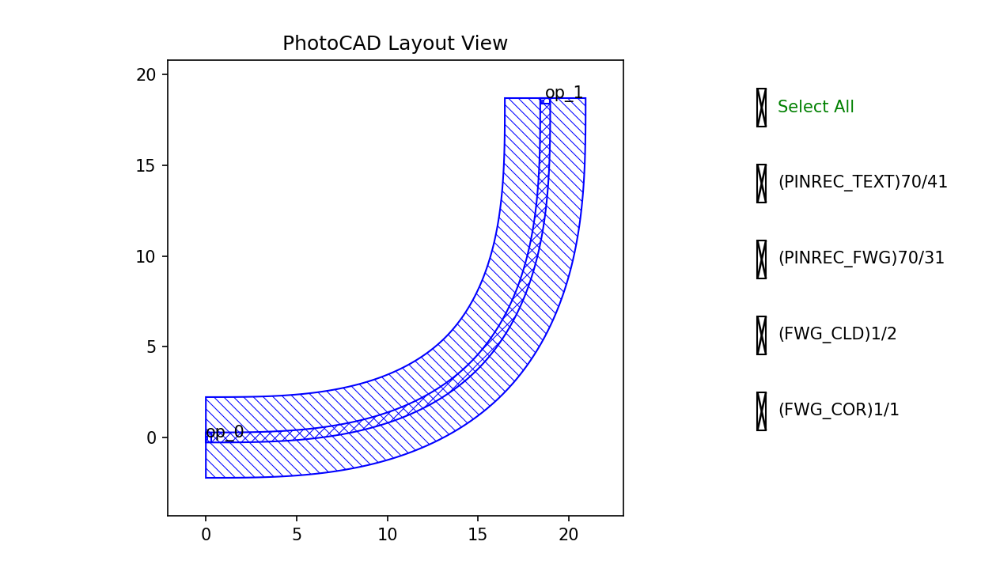
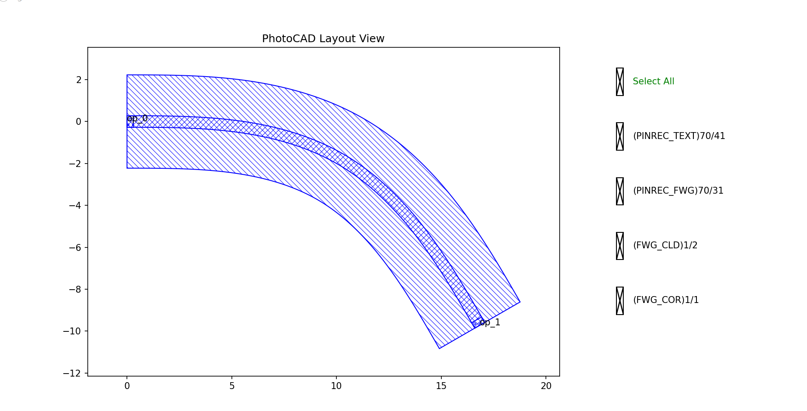
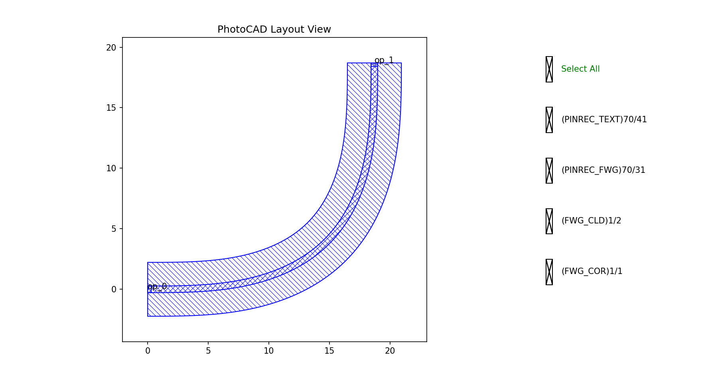
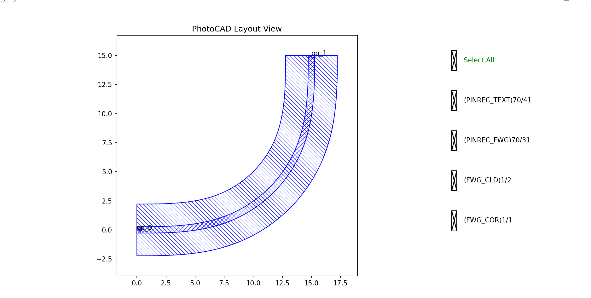
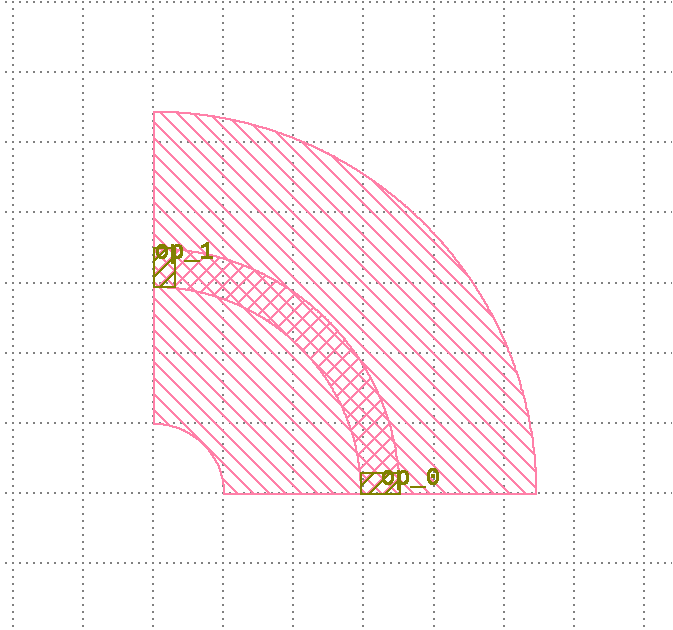
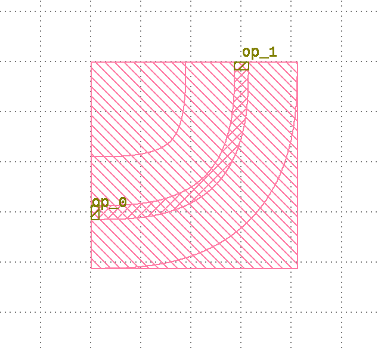
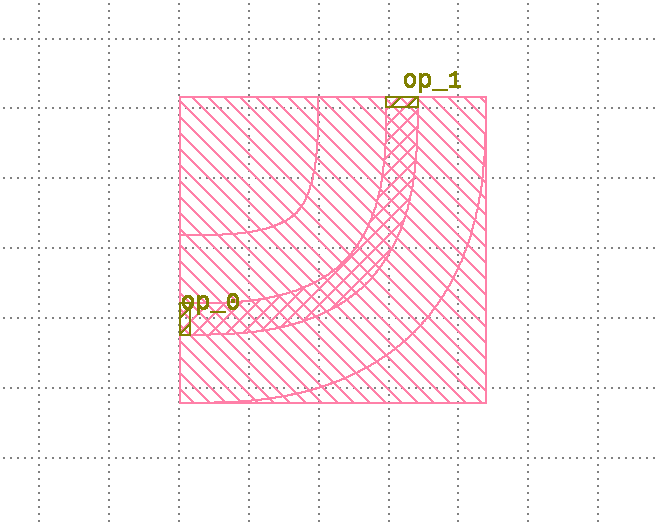

.. _com_bend_euler :

BendEuler
=======================

The Euler bend waveguide is a commonly used curved waveguide building block in photonic integrated circuits. It provides a smooth transition between straight sections and is useful for reducing bend loss. The full script can be found in ``gpdk`` > ``components`` > ``bend`` > ``bend_euler.py``.

Basic Usage
------------------

The simplest way to create an Euler bend is to instantiate the ``BendEuler`` class with desired parameters and output the layout for visualization.

.. code-block:: python

    from gpdk.technology import get_technology
    import fnpcell.all as fp
    from gpdk import all as pdk

    TECH = get_technology()

    # Create a 90-degree Euler bend using default waveguide settings
    bend = pdk.BendEuler(radius_min=10, degrees=90, waveguide_type=TECH.WG.FWG.C.WIRE)

    # Option 1: Plot the layout directly
    fp.plot(bend)

    # Option 2: Export to GDS file for external viewers
    # library = fp.Library()
    # library += bend
    # fp.export_gds(library, file=TECH.OUTPUT.local_output_file(__file__))

This produces an Euler bend waveguide segment with optical ports at both ends.

Full Script
------------------

Import libraries:

.. code-block:: python

    import math
    from functools import cached_property

    from typing_extensions import Any, Mapping, Optional, Tuple

    import fnpcell.all as fp
    from gpdk.simulation.sim_models.bend import BendModel
    from gpdk.technology import get_technology
    from gpdk.technology.wg.types import CoreCladdingWaveguideType

The complete definition of the ``BendEuler`` class:

.. code-block:: python

    class BendEuler(fp.IWaveguideLike, fp.PCell[fp.IOwnedPort]):

        degrees: float = fp.DegreeParam(default=90, min=-180, max=180)
        radius_eff: Optional[float] = fp.PositiveFloatParam(default=fp.USE_DEFAULT_FACTORY)
        radius_min: Optional[float] = fp.PositiveFloatParam(default=None)
        p: Optional[float] = fp.NonNegFloatParam(default=None, max=1)
        l_max: Optional[float] = fp.PositiveFloatParam(default=None)
        degrees_max: Optional[float] = fp.DegreeParam(default=None, min=0)
        waveguide_type: fp.IWaveguideType = fp.WaveguideTypeParam(default=fp.USE_DEFAULT_FACTORY)
        port_names: fp.IPortOptions = fp.PortOptionsParam(count=2, default=["op_0", "op_1"])

        def _default_radius_eff(self):
            if self.radius_min is None:
                return 10
            return None

        def _default_waveguide_type(self):
            return get_technology().WG.FWG.C.WIRE

        def __post_pcell_init__(self):
            assert self.radius_eff is not None or self.radius_min is not None, "either `radius_eff` or `radius_min` must be provided"
            assert not (self.p is not None and self.l_max is not None and self.degrees_max is not None), "`p`, `l_max` and `angle_max` cannot be set simultaneously"

        @cached_property
        def raw_curve(self):
            radius_min = self.radius_min
            if radius_min is None:
                radius_min = self.radius_eff
            assert radius_min is not None

            curve = fp.g.EulerBend(radius_min=radius_min, degrees=self.degrees, p=self.p, l_max=self.l_max, degrees_max=self.degrees_max)

            if self.radius_min is None:
                radius_eff = self.radius_eff
                assert radius_eff is not None
                if not fp.is_close(curve.radius_eff, radius_eff):
                    curve = curve.scaled(radius_eff / curve.radius_eff)
            return curve

        @property
        def curve_radius_eff(self) -> float:
            radius_eff = self.radius_eff
            if radius_eff is not None:
                return radius_eff
            return self.raw_curve.radius_eff

        def build(self) -> Tuple[fp.InstanceSet, fp.ElementSet, fp.PortSet]:
            insts, elems, ports = super().build()
            wg = self.waveguide_type(curve=self.raw_curve)
            insts += wg
            ports += [port.with_name(self.port_names[i]) for i, port in enumerate(wg.ports)]
            return insts, elems, ports

Section Script Description
-------------------------------

**Parameters:**

.. list-table::
   :widths: 20 20 35
   :header-rows: 1

   * - Parameter
     - Default
     - Description
   * - ``degrees``
     - ``90``
     - The central angle of the Euler bend in degrees. The valid range is from ``-180`` to ``180``.
   * - ``radius_eff``
     - ``10``
     - The effective radius of the bend. If ``radius_min`` is not provided, this value is used to scale the generated curve.
   * - ``radius_min``
     - ``None``
     - The minimum radius of the Euler bend. Either ``radius_eff`` or ``radius_min`` must be provided.
   * - ``p``
     - ``None``
     - The ratio of the Euler spiral in the whole bend. The value must satisfy ``0 <= p <= 1``. When ``p = 1``, there is no circular part in the bend.
   * - ``l_max``
     - ``None``
     - The maximum length of the Euler spiral in half of the bend.
   * - ``degrees_max``
     - ``None``
     - The maximum angle quota in degrees of the Euler spiral in half of the bend.
   * - ``waveguide_type``
     - ``FWG.C.WIRE``
     - The waveguide definition (core/cladding layers, width, etc.). Defaults to the technology's standard wire waveguide.
   * - ``port_names``
     - ``["op_0", "op_1"]``
     - A sequence containing custom names assigned to the component's ports.

**Parameter Constraint:**

.. code-block:: python

    def __post_pcell_init__(self):
        assert self.radius_eff is not None or self.radius_min is not None, "either `radius_eff` or `radius_min` must be provided"
        assert not (self.p is not None and self.l_max is not None and self.degrees_max is not None), "`p`, `l_max` and `angle_max` cannot be set simultaneously"

It checks that either ``radius_eff`` or ``radius_min`` is available. It also prevents ``p``, ``l_max``, and ``degrees_max`` from being set simultaneously.

**raw_curve:**

.. code-block:: python

    @cached_property
    def raw_curve(self):
        radius_min = self.radius_min
        if radius_min is None:
            radius_min = self.radius_eff
        assert radius_min is not None

        curve = fp.g.EulerBend(radius_min=radius_min, degrees=self.degrees, p=self.p, l_max=self.l_max, degrees_max=self.degrees_max)

        if self.radius_min is None:
            radius_eff = self.radius_eff
            assert radius_eff is not None
            if not fp.is_close(curve.radius_eff, radius_eff):
                curve = curve.scaled(radius_eff / curve.radius_eff)
        return curve

It calls a predefined Euler bend curve (``fp.g.EulerBend``) and passes the PCell's ``radius_min``, ``degrees``, ``p``, ``l_max``, and ``degrees_max`` parameters to it. If ``radius_min`` is not provided, the generated curve is scaled to match ``radius_eff``.

**curve_radius_eff:**

.. code-block:: python

    @property
    def curve_radius_eff(self) -> float:
        radius_eff = self.radius_eff
        if radius_eff is not None:
            return radius_eff
        return self.raw_curve.radius_eff

It returns the effective radius of the curve. If ``radius_eff`` is set directly, that value is returned. Otherwise, it is taken from ``raw_curve``.

**build Method:**

.. code-block:: python

    def build(self) -> Tuple[fp.InstanceSet, fp.ElementSet, fp.PortSet]:
        insts, elems, ports = super().build()
        wg = self.waveguide_type(curve=self.raw_curve)
        insts += wg
        ports += [port.with_name(self.port_names[i]) for i, port in enumerate(wg.ports)]
        return insts, elems, ports

The ``build`` method creates a waveguide instance using the defined ``waveguide_type`` and ``raw_curve``, adds it to the layout, and renames its ports according to ``port_names``.

Run and view the layout
------------------------

Modifying the parameters changes the generated structure. Observe the differences when varying bend angles, radius settings, and Euler spiral controls:

**Variation A:** Negative 60-degree bend using ``radius_min``.

.. code-block:: python

    bend_var_a = pdk.BendEuler(radius_min=10, degrees=60, waveguide_type=TECH.WG.FWG.C.WIRE)

**Variation B:** 90-degree pure Euler bend controlled by ``p=1.0``.

.. code-block:: python

    bend_var_b = pdk.BendEuler(radius_min=10, degrees=90, p=1.0, waveguide_type=TECH.WG.FWG.C.WIRE)

**Variation C:** 90-degree bend using ``radius_eff`` and ``degrees_max``.   

.. code-block:: python

    bend_var_c = pdk.BendEuler(radius_min=10, degrees=90, degrees_max=15, waveguide_type=TECH.WG.FWG.C.WIRE)

BendEuler90
---------------------------------

The class ``BendEuler90`` is a specialized version of ``BendEuler`` with the bend angle locked to 90 degrees.

It also provides the ``slab_square`` option, which can add a square cladding area around the 90-degree bend.

**Class:**

.. code-block:: python

    class BendEuler90(BendEuler):

        degrees: float = fp.DegreeParam(default=90, min=90, max=90, locked=True, doc="Bend angle in degrees")
        waveguide_type: CoreCladdingWaveguideType = fp.WaveguideTypeParam(
            type=CoreCladdingWaveguideType, default=fp.USE_DEFAULT_FACTORY, doc="Waveguide parameters"
        )
        slab_square: bool = fp.BooleanParam(default=False, doc="whether draw a square clad")

        def build(self) -> Tuple[fp.InstanceSet, fp.ElementSet, fp.PortSet]:
            insts, elems, ports = super().build()
            waveguide_type = self.waveguide_type

            if self.slab_square:
                r = self.raw_curve.radius_eff
                w = r + waveguide_type.cladding_width / 2
                x = w / 2
                y = (r - waveguide_type.cladding_width / 2) / 2
                elems += fp.el.Rect(width=w, height=w, center=(x, y), layer=waveguide_type.cladding_layer)

            return insts, elems, ports

**Parameters:**

.. list-table::
   :widths: 20 20 35
   :header-rows: 1

   * - Parameter
     - Default
     - Description
   * - ``degrees``
     - ``90``
     - The bend angle in degrees. This parameter is locked to ``90``.
   * - ``waveguide_type``
     - ``FWG.C.WIRE``
     - The core-cladding waveguide definition used to generate the bend.
   * - ``slab_square``
     - ``False``
     - Whether to draw a square cladding area around the bend.

**Example usage:**

.. code-block:: python

    bend_90 = pdk.BendEuler90(radius_min=10, p=0.5, slab_square=True, waveguide_type=TECH.WG.FWG.C.WIRE)

Pre-configured BendEuler90 Cells
---------------------------------

While ``BendEuler90`` allows for full parameter customization, the PDK also provides **pre-configured, locked standard cells** for the most commonly used waveguide types. 

**BendEuler90_FWG_C_WIRE:**

.. code-block:: python

    class BendEuler90_FWG_C_WIRE(BendEuler90, locked=True):
        l_max: Optional[float] = fp.PositiveFloatParam(default=5, doc="Bend Lmax")
        radius_min: float = fp.PositiveFloatParam(default=3.225, doc="Bend radius_min")
        waveguide_type: CoreCladdingWaveguideType = fp.WaveguideTypeParam(
            type=CoreCladdingWaveguideType, default=fp.USE_DEFAULT_FACTORY, doc="Waveguide parameters"
        )
        slab_square: bool = fp.BooleanParam(default=True, doc="whether draw a square clad")

        def _default_waveguide_type(self):
            return get_technology().WG.FWG.C.WIRE

**Parameters:**

.. list-table::
   :widths: 20 20 35
   :header-rows: 1

   * - Parameter
     - Default
     - Description
   * - ``l_max``
     - ``5``
     - The maximum length of the Euler spiral in half of the bend.
   * - ``radius_min``
     - ``3.225``
     - The minimum radius of the Euler bend.
   * - ``waveguide_type``
     - ``FWG.C.WIRE``
     - The standard wire waveguide definition.
   * - ``slab_square``
     - ``True``
     - Draws the square cladding area by default.

**Example usage:**

.. code-block:: python

    bend_wire = pdk.BendEuler90_FWG_C_WIRE()

**BendEuler90_FWG_C_EXPANDED:**

.. code-block:: python

    class BendEuler90_FWG_C_EXPANDED(BendEuler90, locked=True):
        l_max: Optional[float] = fp.PositiveFloatParam(default=10, doc="Bend Lmax")
        radius_min: float = fp.PositiveFloatParam(default=3.4, doc="Bend radius_min")
        waveguide_type: CoreCladdingWaveguideType = fp.WaveguideTypeParam(
            type=CoreCladdingWaveguideType, default=fp.USE_DEFAULT_FACTORY, doc="Waveguide parameters"
        )
        slab_square: bool = fp.BooleanParam(default=True, doc="whether draw a square clad")

        def _default_waveguide_type(self):
            return get_technology().WG.FWG.C.EXPANDED

**Parameters:**

.. list-table::
   :widths: 20 20 35
   :header-rows: 1

   * - Parameter
     - Default
     - Description
   * - ``l_max``
     - ``10``
     - The maximum length of the Euler spiral in half of the bend.
   * - ``radius_min``
     - ``3.4``
     - The minimum radius of the Euler bend.
   * - ``waveguide_type``
     - ``FWG.C.EXPANDED``
     - The expanded waveguide definition.
   * - ``slab_square``
     - ``True``
     - Draws the square cladding area by default.

**Example usage:**

.. code-block:: python

    bend_expanded = pdk.BendEuler90_FWG_C_EXPANDED()

