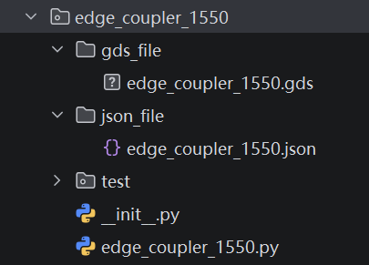
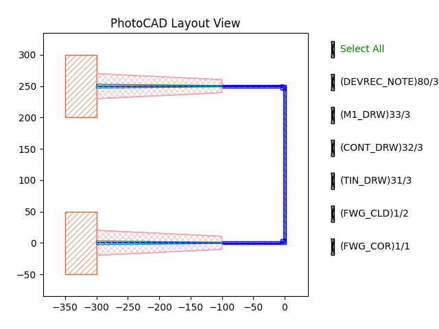

.. _com_ec :

EdgeCoupler1550
=======================

The edge coupler is a key component for coupling light between an optical fiber and a photonic integrated circuit. It primarily couples light from the optical fiber into the silicon waveguide through an inverse taper structure, enabling efficient optical transmission between the fiber and the on-chip waveguide. The full script can be found in ``gpdk`` > ``components`` > ``edge_coupler_1550`` > ``edge_coupler_1550.py``.

Import GDS file
------------------

When we want to import a PDK cell through a GDS file, such as ``Edge_Coupler_1550``. First you need to prepare the GDS file,and then write the corresponding json file indicating the layers and the ports information of the cell. Finally, write a .py file to package it as a device that can be directly used in PhotoCAD.

We recommend to follow the folder structure as follows:



* ``edge_coupler_1550.gds``: Put the GDS file of ``Edge_Coupler_1550`` in this folder

* ``edge_coupler_1550.json``:  Indicates the layers and the ports information of ``Edge_Coupler_1550``.

     * cell name: The cell name indicated in the GDS file.

     * layers: First point out all the layers in the GDS file, and assign them to the layers in your PDK. User are allowed to link the layers to PDK layers e.g., ``TECH.LAYER.FWG_COR``, ignore the layer in the GDS file e.g., "_IGNORE_", or directly use the layer ID in the PDK e.g., "80/30". If the layers in the imported GDS already match the current PDK layer definitions, you can directly use the statement ``"*": "<AUTO>"`` to map layer numbers automatically.

     * ports:

       * names: The name of the port

       * hidden: Whether the port is hidden

       * position: The coordinate of the ports in the GDS file. It should be the center of the port.

       * orientation: The orientation of the port is pointing out.

       * waveguide type: The port has to match one of the waveguide type in your PDK. However, the parameters e.g, core_width can be modified.

        .. code-block:: python

            {
                "cell_name": "edge_coupler_1550",
                "layers": {
                    "*": "<ERROR>",
                    "1/0": "TECH.LAYER.FWG_COR",
                    "1/10": "TECH.LAYER.FWG_CLD",
                    "7/0": "TECH.LAYER.TIN_DRW",
                    "60/0": "TECH.LAYER.CONT_DRW",
                    "63/0": "TECH.LAYER.M1_DRW",
                    "66/0": "<IGNORE>",
                    "68/0": "80/30"
                },
                "ports": [
                    {
                        "name": "op_0",
                        "position": [
                            200,
                            0
                        ],
                        "orientation": {
                            "degrees": 0
                        },
                        "waveguide_type": {
                            "override": "TECH.WG.FWG.C.WIRE",
                            "values": {
                                "core_width": 0.5,
                                "cladding_width": 4.45
                            }
                        }
                    },
                    {
                        "name": "op_1",
                        "hidden": true,
                        "position": [
                            0,
                            0
                        ],
                        "orientation": {
                            "degrees": 180
                        },
                        "waveguide_type": {
                            "override": "TECH.WG.FWG.C.WIRE",
                            "values": {
                                "core_width": 40
                            }
                        }
                    }
                ]
            }

       .. image:: image/edge_coupler_1550_2.png
       * If the imported cell has metal pins, instead of a line, a rectangle could be the case which a pin is. In this situation, use ``shape`` to form a rectangular or a polygon.

          * shape: The shape of the port. It defines the geometric boundary of the electrical port/pin, using a list of coordinate points.

            .. code-block:: python

                        {
                            "name": "ep_0",
                            "hidden": true,
                            "position": [
                                -49.4,
                                0
                            ],
                            "orientation": {
                                "degrees": 90
                            },
                            "shape": [
                                [10, 30],
                                [0, 30],
                                [0, 20],
                                [10, 20]
                            ],
                            "metal_line_type": {
                                "override": "TECH.METAL.M2.W10",
                                "values": {
                                    "line_width": 10
                                }
                            }
                        },

* ``edge_coupler_1550.py``:  Wraps the GDS-based device as a PhotoCAD device that can be instantiated and used in a photonic circuit.

     .. code-block:: python

            import fnpcell.all as fp
            from gpdk.technology import get_technology

            class Edge_Coupler_1550(fp.JsonCell[fp.IOwnedPort], locked=True, black_box=True):  # type: ignore
                """
                Examples:
                ```python
                ec = Edge_Coupler_1550()
                fp.plot(ec)
                ```
                """
                json_path: fp.StrPath = "./json_file/edge_coupler_1550.json"
                library_path: fp.StrPath = "./gds_file/edge_coupler_1550.gds"

            if __name__ == "__main__":
                TECH = get_technology()
                output_file = TECH.OUTPUT.local_output_file(__file__)
                library = fp.Library()
                # =============================================================

                library += Edge_Coupler_1550()
                # =============================================================
                fp.export_gds(library, file=output_file)
                # fp.plot(library)


     * ``json_path``: Specifies the path to the JSON file that defines the layers and ports information.

     * ``library_path``: Specifies the path to the GDS file containing the layout of the imported cell.

     * ``black_box=True``: This prevents suffixes such as _x1, _x2, and _x3 from being added when placing BlackBox Cells with mirrored, rotated, translated and other operations via FAB PDK. It satisfies the FAB's requirement for fixed BlackBox Cell names and simplifying the GDS export process.

     .. image:: image/edge_coupler_1550_bb.png

Instantiate and connect the imported cells
-------------------------------------------------------

Once the device has been packaged, it can be instantiated and called just like other PDK cells. Since the optical port op_0 was defined in the JSON file, it can be accessed directly from the instantiated device. The two edge couplers can be connected using PhotoCAD's LinkBetween function:

.. code-block:: python

    from fnpcell import all as fp
    from gpdk.technology import get_technology
    from gpdk.components.edge_coupler_1550.edge_coupler_1550 import Edge_Coupler_1550

    class Edge_Coupler_link(fp.PCell):
        def build(self):
            insts, elems, ports = super().build()
            TECH = get_technology()

            ec = Edge_Coupler_1550()

            ec_1 = ec.translated(-300, 0)
            insts += ec_1
            ec_2 = ec.translated(-300, 250)
            insts += ec_2

            link_ec = fp.LinkBetween(ec_1["op_0"], ec_2["op_0"],
                                     start_factory = 100)
            insts += link_ec

            return insts, elems, ports


    if __name__ == "__main__":
        TECH = get_technology()
        output_file = TECH.OUTPUT.local_output_file(__file__)
        library = fp.Library()
        # =============================================================

        library += Edge_Coupler_link()
        # =============================================================
        fp.export_gds(library, file=output_file)
        fp.plot(library)




Common Issues and Considerations
---------------------------------------------

* **JSON Configuration**: Make sure that cell_name, port types, port orientations, and port dimensions are correctly configured. Pay particular attention to the operating wavelength band.

* **Python File Validation**: Ensure that every .py file under the components directory can run successfully without errors.
