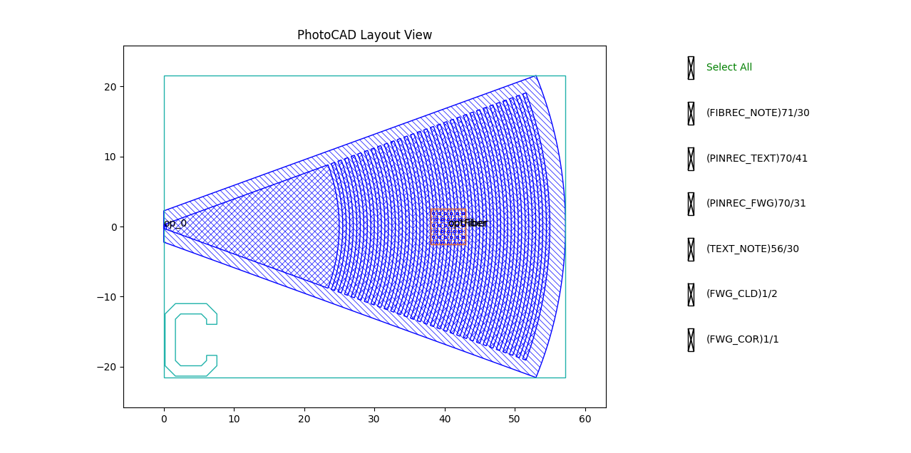
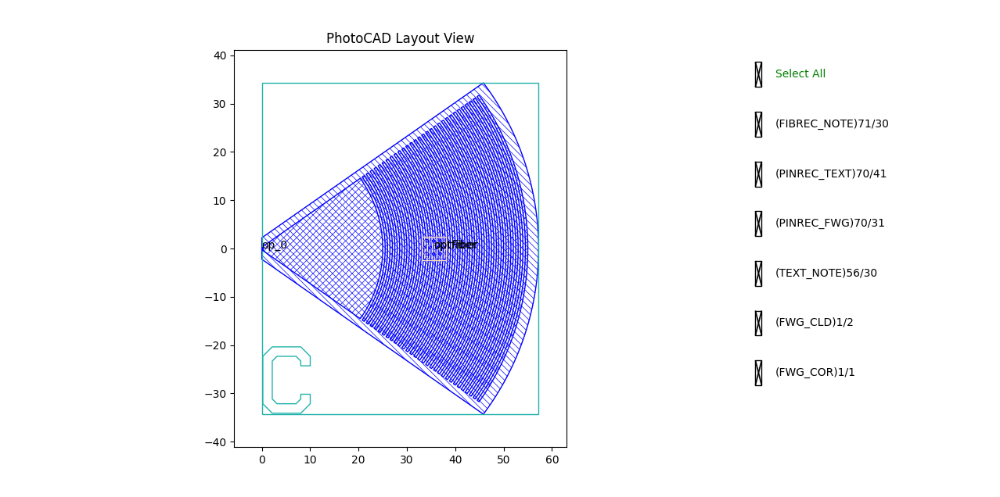
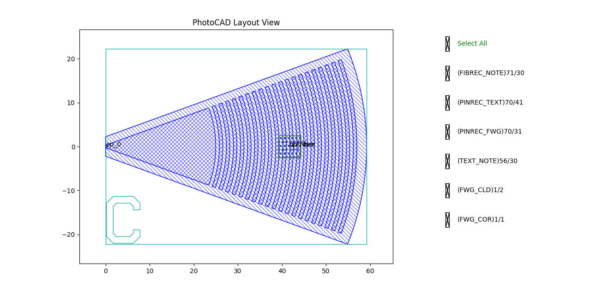
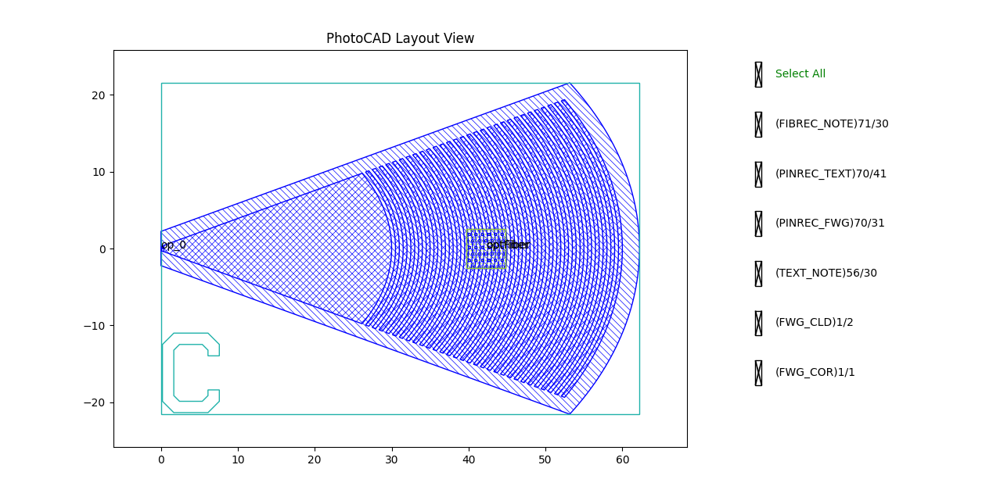

.. _com_gc :

GratingCoupler
=======================

The grating coupler couples light between an optical fiber and an on-chip waveguide using a periodic grating structure. It consists of a fan-shaped elliptical grating region with alternating teeth and etch gaps, a waveguide port, and a fiber alignment port. The full script can be found in ``gpdk`` > ``components`` > ``grating_coupler`` > ``grating_coupler.py``.

Basic Usage
------------------

The simplest way to create a grating coupler is to instantiate the ``GratingCoupler`` class with desired parameters and output the layout for visualization.

.. code-block:: python

    from gpdk.technology import get_technology
    import fnpcell.all as fp
    from gpdk import all as pdk

    TECH = get_technology()

    # Create a grating coupler using default settings
    gc = pdk.GratingCoupler(waveguide_type=TECH.WG.FWG.C.WIRE)

    # Option 1: Plot the layout directly
    fp.plot(gc)

    # Option 2: Export to GDS file for external viewers
    # library = fp.Library()
    # library += gc
    # fp.export_gds(library, file=TECH.OUTPUT.local_output_file(__file__))

This produces a grating coupler with a waveguide port and a fiber alignment port. The grating teeth are generated radially and clipped by a fan-shaped coupling region.

Full Script
------------------

Import libraries:

.. code-block:: python

    import math
    from typing_extensions import List, Tuple, cast

    import fnpcell.all as fp
    from gpdk.technology import get_technology
    from gpdk.technology.wg.types import CoreCladdingWaveguideType

The complete definition of the ``GratingCoupler`` class:

.. code-block:: python

    @fp.schematic(symbol=fp.plogic.Symbol.GratingCoupler)
    class GratingCoupler(fp.PCell[fp.IOwnedPort], band="C"):

        length: float = fp.PositiveFloatParam(default=25.0)
        half_degrees: float = fp.DegreeParam(default=20)
        ellipse_ratio: float = fp.PositiveFloatParam(default=1.0, min=1.0, doc="Ellipse(Major/Minor)")
        tooth_width: float = fp.PositiveFloatParam(default=0.5)
        etch_width: float = fp.PositiveFloatParam(default=0.5)
        teeth: int = fp.IntParam(default=30, min=0, doc="Number of tooth")
        waveguide_type: CoreCladdingWaveguideType = fp.WaveguideTypeParam(type=CoreCladdingWaveguideType, default=fp.USE_DEFAULT_FACTORY)
        port_names: fp.IPortOptions = fp.PortOptionsParam(count=2, default=("op_0", "optfiber"))

        def _default_waveguide_type(self):
            return get_technology().WG.FWG.C.WIRE

        def build(self) -> Tuple[fp.InstanceSet, fp.ElementSet, fp.PortSet]:
            insts, elems, ports = super().build()
            TECH = get_technology()

            length = self.length
            half_degrees = self.half_degrees
            ellipse_ratio = self.ellipse_ratio
            tooth_width = self.tooth_width
            etch_width = self.etch_width
            teeth = self.teeth
            waveguide_type = self.waveguide_type
            port_names = self.port_names

            overlap = 1.0
            fiber_pin_width = 5
            half_angle = math.radians(half_degrees)

            waveguide_width = waveguide_type.core_width
            waveguide_cladding = waveguide_type.cladding_width
            waveguide_layer = waveguide_type.core_layer
            cladding_layer = waveguide_type.cladding_layer

            si_etch1_layer = TECH.WG.MWG.C.WIRE.core_layer
            fbrtgt = TECH.LAYER.FIBREC_NOTE

            content: List[fp.IPolygon] = [
                fp.el.EllipticalRing(
                    outer_radius=(length, length / ellipse_ratio),
                    layer=waveguide_layer,
                    transform=fp.h_mirror(),
                )
            ]

            final_tooth_radius = length
            for _ in range(teeth):
                final_tooth_radius = final_tooth_radius + etch_width
                inner_radius_x = final_tooth_radius
                inner_radius_y = inner_radius_x / ellipse_ratio

                final_tooth_radius = final_tooth_radius + tooth_width
                outer_radius_x = final_tooth_radius
                outer_radius_y = outer_radius_x / ellipse_ratio

                content.append(
                    fp.el.EllipticalRing(
                        outer_radius=(outer_radius_x, outer_radius_y),
                        inner_radius=(inner_radius_x, inner_radius_y),
                        layer=waveguide_layer,
                        transform=fp.h_mirror(),
                    )
                )

            delta_radius = (waveguide_width / 2.0) / math.tan(half_angle)
            wedge_y = math.tan(half_angle) * (delta_radius + final_tooth_radius)
            trapezoid = fp.el.Line(
                length=final_tooth_radius,
                stroke_width=waveguide_width,
                final_stroke_width=wedge_y * 2,
                layer=waveguide_layer,
            )
            content = list(fp.el.PolygonSet(content, layer=waveguide_layer) & trapezoid)
            content.sort(key=lambda p: fp.get_bounding_box(p)[0])

            fiber_pin_tooth = 1 + int(teeth / 2)
            fiber_pin_x = min(content[fiber_pin_tooth].polygon_points, key=lambda p: p[0])[0]

            overlap_x = final_tooth_radius + overlap
            overlap_y = overlap_x / ellipse_ratio
            overlap_polygon = fp.el.EllipticalRing(
                outer_radius=(overlap_x, overlap_y),
                layer=si_etch1_layer,
                transform=fp.rotate(radians=math.pi),
            )

            inner_angle = math.pi / 2 - half_angle
            perpendicular_overlap = overlap / math.sin(inner_angle)
            overlap_delta = (perpendicular_overlap + (waveguide_width / 2)) / math.tan(half_angle)
            overlap_wedge_y = math.tan(half_angle) * (overlap_delta + final_tooth_radius + overlap)

            trapezoid = fp.el.Line(
                length=overlap_x,
                stroke_width=waveguide_width + perpendicular_overlap * 2,
                final_stroke_width=overlap_wedge_y * 2,
                layer=si_etch1_layer,
            )
            overlap_polygon &= trapezoid

            # content.append(overlap_polygon)  # temporary commented for Circuit 01

            cladding_x = final_tooth_radius + waveguide_cladding / 2
            cladding_y = cladding_x / ellipse_ratio
            cladding_polygon = fp.el.EllipticalRing(
                outer_radius=(cladding_x, cladding_y),
                layer=cladding_layer,
                transform=fp.rotate(radians=math.pi),
            )

            trapezoid = fp.el.Line(
                length=cladding_x,
                stroke_width=waveguide_cladding,
                final_stroke_width=math.tan(half_angle) * cladding_x * 2 + waveguide_cladding,
                layer=cladding_layer,
            )
            cladding_polygon &= trapezoid
            content.extend(cladding_polygon)

            elements = cast(List[fp.IElement], content)
            elements.extend(
                [
                    fp.el.Line(
                        length=fiber_pin_width,
                        stroke_width=fiber_pin_width,
                        layer=fbrtgt,
                        transform=fp.translate(fiber_pin_x, 0),
                    ),
                    fp.el.Text(
                        content="optFiber",
                        anchor=fp.Alignment.MIDDLE_CENTER,
                        layer=fbrtgt,
                        at=(fiber_pin_x + fiber_pin_width / 2, 0),
                    ),
                ]
            )

            ports += fp.Port(
                name=port_names[0],
                position=(0, 0),
                orientation=math.pi,
                waveguide_type=waveguide_type,
            )
            ports += fp.Port(
                name=port_names[1],
                position=(fiber_pin_x + fiber_pin_width / 2, 0),
                orientation=0,
                shape=fp.g.Rect(
                    width=fiber_pin_width,
                    height=fiber_pin_width,
                    center=(fiber_pin_x + fiber_pin_width / 2, 0),
                ),
                waveguide_type=waveguide_type,
            )

            elems += elements
            return insts, elems, ports

Section Script Description
-------------------------------

**Parameters:**

.. list-table::
   :widths: 20 20 35
   :header-rows: 1

   * - Parameter
     - Default
     - Description
   * - ``length``
     - ``25.0``
     - The starting radial length of the grating coupler. It defines the inner radius of the first grating region.
   * - ``half_degrees``
     - ``20``
     - Half of the grating coupling angle in degrees. The total angular aperture is ``2 * half_degrees``.
   * - ``ellipse_ratio``
     - ``1.0``
     - The ellipse ratio, defined as major axis divided by minor axis. A value larger than 1 makes the grating more elliptical.
   * - ``tooth_width``
     - ``0.5``
     - The radial width of each grating tooth.
   * - ``etch_width``
     - ``0.5``
     - The radial width of the etched gap between adjacent grating teeth.
   * - ``teeth``
     - ``30``
     - The number of grating teeth.
   * - ``waveguide_type``
     - ``FWG.C.WIRE``
     - The waveguide definition used for the waveguide port, core layer, and cladding layer.
   * - ``port_names``
     - ``("op_0", "optfiber")``
     - A sequence containing the names assigned to the waveguide port and the fiber port.

**build Method:**

1. Initialize the PCell and read parameters

.. code-block:: python

    def build(self) -> Tuple[fp.InstanceSet, fp.ElementSet, fp.PortSet]:
        insts, elems, ports = super().build()
        TECH = get_technology()

        length = self.length
        half_degrees = self.half_degrees
        ellipse_ratio = self.ellipse_ratio
        tooth_width = self.tooth_width
        etch_width = self.etch_width
        teeth = self.teeth
        waveguide_type = self.waveguide_type
        port_names = self.port_names

The method first calls ``super().build()`` to initialize the PCell and then reads the parameters required to generate the grating coupler. These parameters define the grating size, angular aperture, tooth geometry, elliptical shape, waveguide type, and port names.

2. Prepare geometry constants and layers

.. code-block:: python

    overlap = 1.0
    fiber_pin_width = 5
    half_angle = math.radians(half_degrees)

    waveguide_width = waveguide_type.core_width
    waveguide_cladding = waveguide_type.cladding_width
    waveguide_layer = waveguide_type.core_layer
    cladding_layer = waveguide_type.cladding_layer

    si_etch1_layer = TECH.WG.MWG.C.WIRE.core_layer
    fbrtgt = TECH.LAYER.FIBREC_NOTE

The method converts ``half_degrees`` from degrees to radians and extracts the core width, cladding width, core layer, and cladding layer from the selected ``waveguide_type``. Additional layers are used for the optional overlap region and the fiber alignment marker.

3. Generate the elliptical grating teeth

.. code-block:: python

    content: List[fp.IPolygon] = [
        fp.el.EllipticalRing(
            outer_radius=(length, length / ellipse_ratio),
            layer=waveguide_layer,
            transform=fp.h_mirror(),
        )
    ]

    final_tooth_radius = length
    for _ in range(teeth):
        final_tooth_radius = final_tooth_radius + etch_width
        inner_radius_x = final_tooth_radius
        inner_radius_y = inner_radius_x / ellipse_ratio

        final_tooth_radius = final_tooth_radius + tooth_width
        outer_radius_x = final_tooth_radius
        outer_radius_y = outer_radius_x / ellipse_ratio

        content.append(
            fp.el.EllipticalRing(
                outer_radius=(outer_radius_x, outer_radius_y),
                inner_radius=(inner_radius_x, inner_radius_y),
                layer=waveguide_layer,
                transform=fp.h_mirror(),
            )
        )

The grating teeth are generated as a sequence of elliptical rings. The first ring starts at the radius defined by ``length``. Each tooth cycle first advances the radius by ``etch_width`` to create a gap, and then advances it again by ``tooth_width`` to create the tooth. The parameter ``ellipse_ratio`` controls the vertical compression of the elliptical grating.

4. Clip the grating into a fan-shaped region

.. code-block:: python

    delta_radius = (waveguide_width / 2.0) / math.tan(half_angle)
    wedge_y = math.tan(half_angle) * (delta_radius + final_tooth_radius)
    trapezoid = fp.el.Line(
        length=final_tooth_radius,
        stroke_width=waveguide_width,
        final_stroke_width=wedge_y * 2,
        layer=waveguide_layer,
    )
    content = list(fp.el.PolygonSet(content, layer=waveguide_layer) & trapezoid)
    content.sort(key=lambda p: fp.get_bounding_box(p)[0])

The full set of elliptical rings is intersected with a fan-shaped wedge. The wedge angle is determined by ``half_degrees``. This step keeps only the grating region that lies inside the desired coupling angle.

5. Locate the fiber alignment position

.. code-block:: python

    fiber_pin_tooth = 1 + int(teeth / 2)
    fiber_pin_x = min(content[fiber_pin_tooth].polygon_points, key=lambda p: p[0])[0]

The fiber alignment marker is placed near the middle tooth of the grating. The exact x-coordinate is obtained from the polygon points of the selected tooth.

6. Generate cladding and optional overlap regions

.. code-block:: python

    overlap_x = final_tooth_radius + overlap
    overlap_y = overlap_x / ellipse_ratio
    overlap_polygon = fp.el.EllipticalRing(
        outer_radius=(overlap_x, overlap_y),
        layer=si_etch1_layer,
        transform=fp.rotate(radians=math.pi),
    )

    inner_angle = math.pi / 2 - half_angle
    perpendicular_overlap = overlap / math.sin(inner_angle)
    overlap_delta = (perpendicular_overlap + (waveguide_width / 2)) / math.tan(half_angle)
    overlap_wedge_y = math.tan(half_angle) * (overlap_delta + final_tooth_radius + overlap)

    trapezoid = fp.el.Line(
        length=overlap_x,
        stroke_width=waveguide_width + perpendicular_overlap * 2,
        final_stroke_width=overlap_wedge_y * 2,
        layer=si_etch1_layer,
    )
    overlap_polygon &= trapezoid

    # content.append(overlap_polygon)  # temporary commented for Circuit 01

    cladding_x = final_tooth_radius + waveguide_cladding / 2
    cladding_y = cladding_x / ellipse_ratio
    cladding_polygon = fp.el.EllipticalRing(
        outer_radius=(cladding_x, cladding_y),
        layer=cladding_layer,
        transform=fp.rotate(radians=math.pi),
    )

    trapezoid = fp.el.Line(
        length=cladding_x,
        stroke_width=waveguide_cladding,
        final_stroke_width=math.tan(half_angle) * cladding_x * 2 + waveguide_cladding,
        layer=cladding_layer,
    )
    cladding_polygon &= trapezoid
    content.extend(cladding_polygon)

The method also calculates an optional overlap region. In the current script, this overlap polygon is not added to the final content because the corresponding line is commented out.

The cladding region is generated by expanding the final grating radius by half of the cladding width and intersecting it with the same fan-shaped region. This ensures that the cladding follows the same angular aperture as the grating.

7. Add the fiber marker and create ports

.. code-block:: python

    elements = cast(List[fp.IElement], content)
    elements.extend(
        [
            fp.el.Line(
                length=fiber_pin_width,
                stroke_width=fiber_pin_width,
                layer=fbrtgt,
                transform=fp.translate(fiber_pin_x, 0),
            ),
            fp.el.Text(
                content="optFiber",
                anchor=fp.Alignment.MIDDLE_CENTER,
                layer=fbrtgt,
                at=(fiber_pin_x + fiber_pin_width / 2, 0),
            ),
        ]
    )

    ports += fp.Port(
        name=port_names[0],
        position=(0, 0),
        orientation=math.pi,
        waveguide_type=waveguide_type,
    )
    ports += fp.Port(
        name=port_names[1],
        position=(fiber_pin_x + fiber_pin_width / 2, 0),
        orientation=0,
        shape=fp.g.Rect(
            width=fiber_pin_width,
            height=fiber_pin_width,
            center=(fiber_pin_x + fiber_pin_width / 2, 0),
        ),
        waveguide_type=waveguide_type,
    )

    elems += elements
    return insts, elems, ports

The layout elements include the grating polygons, cladding polygon, fiber alignment line, and fiber label text.

Two ports are created:

- ``op_0``: the optical waveguide port at the origin.
- ``optfiber``: the fiber port located at the fiber alignment position.

Finally, the method returns the assembled instances, elements, and ports.

Run and view the layout
------------------------

Modifying the parameters changes the generated structure. Observe the differences when varying the coupling angle, tooth geometry, and elliptical shape:

**Variation A:** A grating coupler with a larger coupling angle.

.. code-block:: python

    gc_var_a = pdk.GratingCoupler(
        half_degrees=35
    )

**Variation B:** A grating coupler with fewer, wider teeth and wider etch gaps.

.. code-block:: python

    gc_var_b = pdk.GratingCoupler(
        teeth=20,
        tooth_width=0.8,
        etch_width=0.8
    )

**Variation C:** A larger grating coupler with a more elliptical shape.

.. code-block:: python

    gc_var_c = pdk.GratingCoupler(
        length=30,
        ellipse_ratio=1.5
    )

