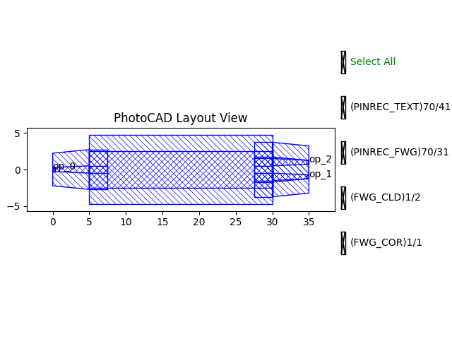
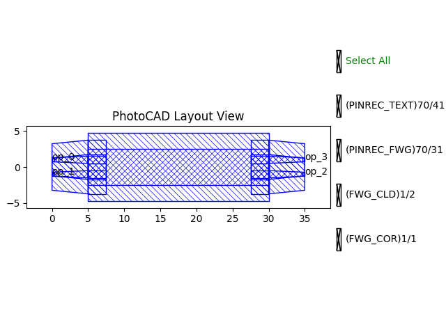
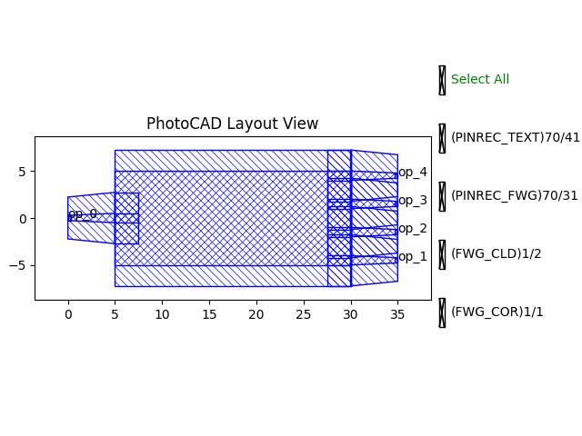

.. _com_mmi :

Mmi
=======================

The Multimode Interferometer (MMI) is a crucial building block in photonic integrated circuits. The full script can be found in ``gpdk`` > ``components`` > ``mmi`` > ``mmi.py``.

Basic Usage
------------------

The simplest way to create an MMI is to instantiate the ``Mmi`` class with desired parameters and output the layout for visualization. By default, it generates a 1x2 splitter.

.. code-block:: python

    from gpdk.technology import get_technology
    import fnpcell.all as fp
    from gpdk import all as pdk

    TECH = get_technology()

    # Create an MMI using default settings (1x2 splitter)
    mmi = pdk.Mmi(waveguide_type=TECH.WG.FWG.C.WIRE)

    # Option 1: Plot the layout directly
    fp.plot(mmi)

    # Option 2: Export to GDS file for external viewers
    # library = fp.Library()
    # library += mmi
    # fp.export_gds(library, file=TECH.OUTPUT.local_output_file(__file__))

This produces an MMI waveguide segment with one input port and two output ports, featuring tapers for smooth transitions.

Full Script
------------------

Import libraries:

.. code-block:: python

    import matplotlib.pyplot as plt
    import numpy as np
    from typing_extensions import Any, Tuple

    import fnpcell.all as fp
    from gpdk.components.straight.straight import Straight
    from gpdk.components.taper.taper_linear import TaperLinear
    from gpdk.simulation.sim_models.mmi.mmi1x2 import MMI1x2Model
    from gpdk.technology import get_technology
    from gpdk.technology.wg.types import CoreCladdingWaveguideType

The complete definition of the ``Mmi`` class:

.. code-block:: python

    class Mmi(fp.PCell[fp.IOwnedPort]):

        mid_wav_core_width: float = fp.PositiveFloatParam(default=5)
        wav_core_width: float = fp.PositiveFloatParam(default=1)
        n_inputs: int = fp.PositiveIntParam(default=1)
        n_outputs: int = fp.PositiveIntParam(default=2)
        length: float = fp.PositiveFloatParam(default=25)
        transition_length: float = fp.PositiveFloatParam(default=5)
        trace_spacing: float = fp.PositiveFloatParam(default=2)
        waveguide_type: CoreCladdingWaveguideType = fp.WaveguideTypeParam(type=CoreCladdingWaveguideType, default=fp.USE_DEFAULT_FACTORY)

        def _default_waveguide_type(self):
            return get_technology().WG.FWG.C.WIRE

        def build(self) -> Tuple[fp.InstanceSet, fp.ElementSet, fp.PortSet]:
            insts, elems, ports = super().build()
            mid_wav_core_width = self.mid_wav_core_width
            wav_core_width = self.wav_core_width
            n_inputs = self.n_inputs
            n_outputs = self.n_outputs
            length = self.length
            transition_length = self.transition_length
            trace_spacing = self.trace_spacing
            waveguide_type = self.waveguide_type

            center_force_cladding_width = mid_wav_core_width + waveguide_type.cladding_width
            center_type = waveguide_type.updated(core_width=mid_wav_core_width, cladding_width=center_force_cladding_width)
            center = Straight(
                length=length,
                waveguide_type=center_type,
                anchor=fp.Anchor.START,
                port_names=[fp.Hidden("op_0"), fp.Hidden("op_1")],
            )
            insts += center.translated(transition_length, 0)

            wide_type = waveguide_type.updated(core_width=wav_core_width, cladding_width=waveguide_type.cladding_width + wav_core_width)
            narrow_type = waveguide_type
            taper_left = TaperLinear(
                length=transition_length,
                left_type=narrow_type,
                right_type=wide_type,
                anchor=fp.Anchor.START,
                port_names=["op_0", fp.Hidden("op_1")],
            )
            taper_right = taper_left.h_mirrored()
            extension = Straight(length=max(length / 10, 0.002), waveguide_type=wide_type, port_names=[fp.Hidden("op_0"), fp.Hidden("op_1")])

            base_in_y = -(n_inputs - 1) * trace_spacing / 2.0
            for cnt in range(n_inputs):
                y_offset = base_in_y + cnt * trace_spacing
                taper_left_inst = taper_left.translated(0, y_offset)
                extension_left_inst = fp.place(extension, "op_0", at=taper_left_inst["op_1"])
                insts += taper_left_inst
                insts += extension_left_inst
                ports += taper_left_inst["op_0"].with_name(f"op_{n_inputs - cnt - 1}")

            base_out_y = -(n_outputs - 1) * trace_spacing / 2.0
            for cnt in range(n_outputs):
                y_offset = base_out_y + cnt * trace_spacing
                taper_right_inst = taper_right.translated(transition_length * 2 + length, y_offset)
                extension_right_inst = fp.place(extension, "op_0", at=taper_right_inst["op_1"])
                insts += taper_right_inst
                insts += extension_right_inst
                ports += taper_right_inst["op_0"].with_name(f"op_{cnt + n_inputs}")

            return insts, elems, ports

Section Script Description
-------------------------------

**Parameters:**

.. list-table::
   :widths: 20 20 35
   :header-rows: 1

   * - Parameter
     - Default
     - Description
   * - ``mid_wav_core_width``
     - ``5``
     - The core width of the central multimode waveguide section.
   * - ``wav_core_width``
     - ``1``
     - The expanded core width of the tapers connecting to the central section.
   * - ``n_inputs``
     - ``1``
     - The number of input ports on the left side of the MMI.
   * - ``n_outputs``
     - ``2``
     - The number of output ports on the right side of the MMI.
   * - ``length``
     - ``25``
     - The physical length of the central multimode waveguide section.
   * - ``transition_length``
     - ``5``
     - The length of the input and output linear tapers.
   * - ``trace_spacing``
     - ``2``
     - The vertical spacing (pitch) between adjacent input or output ports.
   * - ``waveguide_type``
     - ``FWG.C.WIRE``
     - The base waveguide definition used to construct the MMI sections.

**build Method:**

1. Initialize the PCell and read parameters

.. code-block:: python

    def build(self) -> Tuple[fp.InstanceSet, fp.ElementSet, fp.PortSet]:
        insts, elems, ports = super().build()

        mid_wav_core_width = self.mid_wav_core_width
        wav_core_width = self.wav_core_width
        n_inputs = self.n_inputs
        n_outputs = self.n_outputs
        length = self.length
        transition_length = self.transition_length
        trace_spacing = self.trace_spacing
        waveguide_type = self.waveguide_type

The method first calls ``super().build()`` to initialize the PCell and then reads all user-configurable parameters. These parameters control the width of the multimode region, the width of the access tapers, the number of input and output ports, the MMI length, the taper length, and the vertical spacing between adjacent ports.

2. Build the central multimode waveguide section

.. code-block:: python

        center_force_cladding_width = mid_wav_core_width + waveguide_type.cladding_width
        center_type = waveguide_type.updated(
            core_width=mid_wav_core_width,
            cladding_width=center_force_cladding_width,
        )

        center = Straight(
            length=length,
            waveguide_type=center_type,
            anchor=fp.Anchor.START,
            port_names=[fp.Hidden("op_0"), fp.Hidden("op_1")],
        )
        insts += center.translated(transition_length, 0)

The central section is a wide straight waveguide whose core width is defined by ``mid_wav_core_width``. This is the multimode interference region. Its ports are hidden because they are internal connection points and should not be exposed as component ports. The section is translated by ``transition_length`` along the x-axis so that the left-side tapers and extension straights can occupy the region before the multimode section.

3. Define the tapers and extension straight waveguides

.. code-block:: python

        wide_type = waveguide_type.updated(
            core_width=wav_core_width,
            cladding_width=waveguide_type.cladding_width + wav_core_width,
        )
        narrow_type = waveguide_type

        taper_left = TaperLinear(
            length=transition_length,
            left_type=narrow_type,
            right_type=wide_type,
            anchor=fp.Anchor.START,
            port_names=["op_0", fp.Hidden("op_1")],
        )
        taper_right = taper_left.h_mirrored()

        extension = Straight(
            length=max(length / 10, 0.002),
            waveguide_type=wide_type,
            port_names=[fp.Hidden("op_0"), fp.Hidden("op_1")],
        )

Here, ``narrow_type`` is the original access waveguide type, while ``wide_type`` is a widened waveguide type used to connect the access waveguide to the multimode region. The ``taper_left`` taper transitions from the narrow external waveguide to the wider internal waveguide. Its external port ``op_0`` is exposed, while its internal wide-end port ``op_1`` is hidden.

The ``taper_right`` is generated by horizontally mirroring ``taper_left``, so it can be used on the output side of the MMI. The ``extension`` is a short wide straight waveguide used to connect the taper to the central multimode section. Its length is chosen as ``max(length / 10, 0.002)`` to avoid a zero-length section. Both ports of the extension are hidden because the extension is purely internal.

4. Place the input-side tapers and extensions

.. code-block:: python

        base_in_y = -(n_inputs - 1) * trace_spacing / 2.0
        for cnt in range(n_inputs):
            y_offset = base_in_y + cnt * trace_spacing

            taper_left_inst = taper_left.translated(0, y_offset)
            extension_left_inst = fp.place(extension, "op_0", at=taper_left_inst["op_1"])

            insts += taper_left_inst
            insts += extension_left_inst

            ports += taper_left_inst["op_0"].with_name(f"op_{n_inputs - cnt - 1}")

This loop places all input-side tapers and extensions. The variable ``base_in_y`` centers the input port array vertically around ``y = 0``. For each input channel, a ``taper_left`` instance is translated to the calculated ``y_offset``.

The extension straight is then connected to the hidden wide end of the taper using:

.. code-block:: python

    fp.place(extension, "op_0", at=taper_left_inst["op_1"])

This aligns the extension's ``op_0`` port with the taper's hidden ``op_1`` port, so the extension continues from the taper into the central multimode region without requiring manual coordinate calculation.

Finally, the narrow external port of the taper is exposed and named. The naming expression:

.. code-block:: python

    f"op_{n_inputs - cnt - 1}"

assigns the input port names in reverse order of placement, so the input ports are numbered as ``op_0``, ``op_1``, and so on.

5. Place the output-side tapers and extensions

.. code-block:: python

        base_out_y = -(n_outputs - 1) * trace_spacing / 2.0
        for cnt in range(n_outputs):
            y_offset = base_out_y + cnt * trace_spacing

            taper_right_inst = taper_right.translated(transition_length * 2 + length, y_offset)
            extension_right_inst = fp.place(extension, "op_0", at=taper_right_inst["op_1"])

            insts += taper_right_inst
            insts += extension_right_inst

            ports += taper_right_inst["op_0"].with_name(f"op_{cnt + n_inputs}")

        return insts, elems, ports

The output-side placement follows the same idea as the input side. The variable ``base_out_y`` centers the output port array vertically around ``y = 0``. Each mirrored output taper is placed at:

.. code-block:: python

    transition_length * 2 + length

This x-coordinate accounts for the left transition region, the central multimode region, and the right transition region.

The output extension straight is connected to the hidden wide end of the output taper using port-based placement. This ensures that the extension correctly connects the taper to the central multimode section.

The exposed output ports are named after all input ports. For example, in a 1x2 MMI, the input port is ``op_0``, and the two output ports are ``op_1`` and ``op_2``.

The method finally returns the assembled instances, elements, and ports.

Run and view the layout
------------------------

Modifying the parameters changes the generated structure. Observe the differences when varying port counts and waveguide properties:

**Variation A:** A 2x2 MMI configuration.

.. code-block:: python

    mmi_var_a = pdk.Mmi(n_inputs=2, n_outputs=2, waveguide_type=TECH.WG.FWG.C.WIRE)

**Variation B:** A custom 1x4 MMI with a wider multimode section and increased trace spacing.

.. code-block:: python

    mmi_var_b = pdk.Mmi(
        n_inputs=1, 
        n_outputs=4, 
        mid_wav_core_width=10.0, 
        trace_spacing=3.0, 
        waveguide_type=TECH.WG.FWG.C.WIRE
    )

Mmi1x2
---------------------------------

The class ``Mmi1x2`` is a specialized version of ``Mmi`` with the number of input and output ports strictly locked to a 1x2 configuration.

**Class:**

.. code-block:: python

    class Mmi1x2(Mmi, locked=True):
        n_inputs: int = fp.PositiveIntParam(default=1)
        n_outputs: int = fp.PositiveIntParam(default=2)

        def sim_model(self, loss_db: float = 0.3, imbalance_db: float = 0, reflection_db: float = 40):
            op_0, op_1, op_2 = self[fp.IOwnedPort, "op_0", "op_1", "op_2"]
            return MMI1x2Model(op_1=op_0, op_2=op_1, op_3=op_2, loss_db=loss_db, imbalance_db=imbalance_db, reflection_db=reflection_db)

**Example usage:**

.. code-block:: python

    mmi_1x2 = pdk.Mmi1x2()

.. image:: image/mmi_1x2.png

