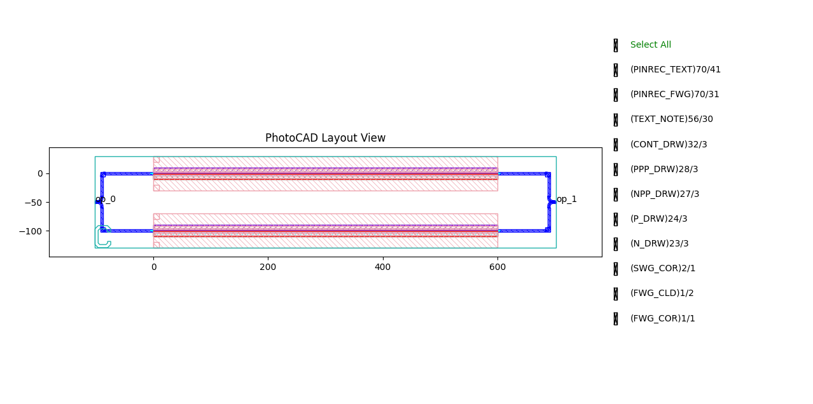
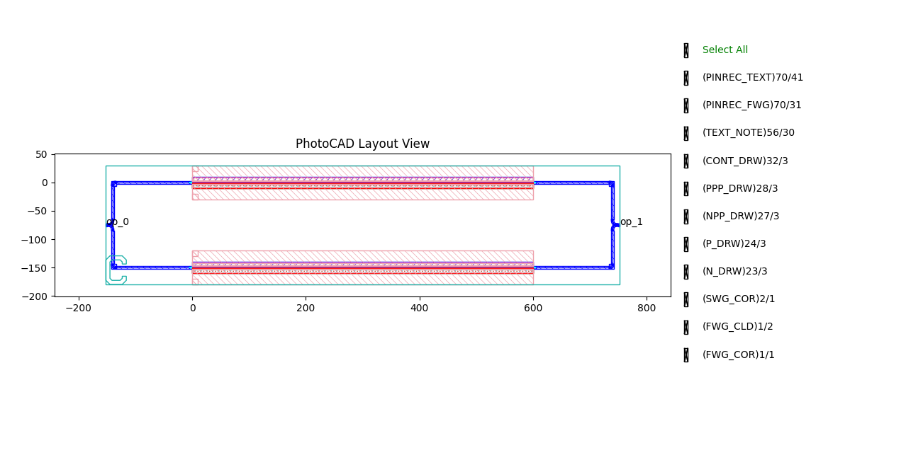
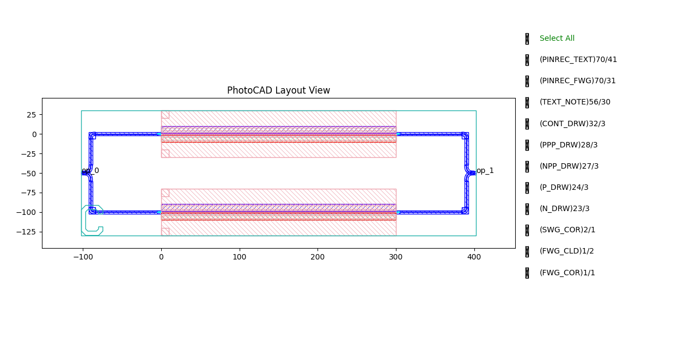
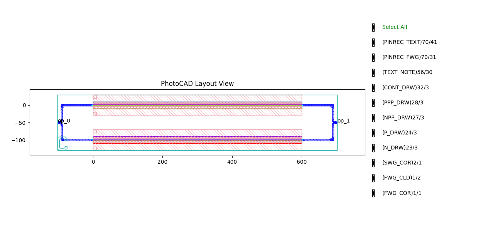

.. _com_mzm :

Mzm
=======================

The Mach-Zehnder Modulator (MZM) consists of a Y-splitter, two phase-shifting arms, and a Y-combiner. It modulates optical intensity by electrically controlling the relative phase between the two arms and recombining them through interference. The full script can be found in ``gpdk`` > ``components`` > ``mzm`` > ``mzm.py``.

Basic Usage
------------------

The simplest way to create an MZM is to instantiate the ``Mzm`` class with desired parameters and output the layout for visualization. 

.. code-block:: python

    from gpdk.technology import get_technology
    import fnpcell.all as fp
    from gpdk import all as pdk

    TECH = get_technology()

    # Create an MZM using default settings
    mzm = pdk.Mzm(wg_length=600, waveguide_type=TECH.WG.FWG.C.WIRE)

    # Option 1: Plot the layout directly
    fp.plot(mzm)

    # Option 2: Export to GDS file for external viewers
    # library = fp.Library()
    # library += mzm
    # fp.export_gds(library, file=TECH.OUTPUT.local_output_file(__file__))

This produces a complete MZM structure including a Y-splitter, two parallel PN phase shifters in the arms, and a Y-combiner, routed together automatically.

Full Script
------------------

Import libraries:

.. code-block:: python

    from gpdk.components.combiner.y_combiner import YCombiner
    from gpdk.components.splitter.y_splitter import YSplitter
    from gpdk.technology.wg import WG
    from gpdk.technology.wg.types import CoreCladdingWaveguideType
    from typing_extensions import Tuple

    import fnpcell.all as fp
    from gpdk.components.pn_phase_shifter.pn_phase_shifter import PnPhaseShifter
    from gpdk.technology import get_technology

The complete definition of the ``Mzm`` class:

.. code-block:: python

    class Mzm(fp.PCell[fp.IOwnedPort], band="C"):

        p_width: float = fp.PositiveFloatParam(default=1)
        n_width: float = fp.PositiveFloatParam(default=1)
        np_offset: float = fp.FloatParam(default=0)
        wg_length: float = fp.PositiveFloatParam(default=25)
        phase_shifter_spacing: float = fp.PositiveFloatParam(default=100)
        splitter_wg_length: float = fp.PositiveFloatParam(default=100)
        waveguide_type: CoreCladdingWaveguideType = fp.WaveguideTypeParam(type=WG.FWG.C, default=fp.USE_DEFAULT_FACTORY)
        pn_phase_shifter_0: fp.IDevice = fp.DeviceParam(type=PnPhaseShifter, port_count=2, pin_count=2, default=fp.USE_DEFAULT_FACTORY)
        pn_phase_shifter_1: fp.IDevice = fp.DeviceParam(type=PnPhaseShifter, port_count=2, pin_count=2, default=fp.USE_DEFAULT_FACTORY)
        y_splitter: fp.IDevice = fp.DeviceParam(type=YSplitter, port_count=3, default=fp.USE_DEFAULT_FACTORY)
        y_combiner: fp.IDevice = fp.DeviceParam(type=YCombiner, port_count=3, default=fp.USE_DEFAULT_FACTORY)
        port_names: fp.IPortOptions = fp.PortOptionsParam(count=2, default=["op_0", "op_1"])

        def _default_waveguide_type(self):
            return get_technology().WG.FWG.C.WIRE

        def _default_pn_phase_shifter_0(self):
            return PnPhaseShifter(
                name="p1", p_width=self.p_width, n_width=self.n_width, np_offset=self.np_offset, wg_length=self.wg_length, waveguide_type=self.waveguide_type
            )

        def _default_pn_phase_shifter_1(self):
            return PnPhaseShifter(
                name="p2",
                p_width=self.p_width,
                n_width=self.n_width,
                np_offset=self.np_offset,
                wg_length=self.wg_length,
                waveguide_type=self.waveguide_type,
                transform=fp.translate(0, -self.phase_shifter_spacing),
            )

        def _default_y_splitter(self):
            return YSplitter(
                name="s", bend_radius=10, waveguide_type=self.waveguide_type, transform=fp.translate(-self.splitter_wg_length, -self.phase_shifter_spacing / 2)
            )

        def _default_y_combiner(self):
            return YCombiner(
                name="d",
                bend_radius=10,
                waveguide_type=self.waveguide_type,
                transform=fp.translate(self.wg_length + self.splitter_wg_length, -self.phase_shifter_spacing / 2),
            )

        def build(self) -> Tuple[fp.InstanceSet, fp.ElementSet, fp.PortSet]:
            insts, elems, ports = super().build()

            waveguide_type = self.waveguide_type
            pn_phase_shifter_0 = self.pn_phase_shifter_0
            pn_phase_shifter_1 = self.pn_phase_shifter_1
            ysplitter = self.y_splitter
            ycombiner = self.y_combiner
            port_names = self.port_names

            phase_shifter_top = pn_phase_shifter_0
            phase_shifter_bottom = pn_phase_shifter_1
            splitter = ysplitter
            ports += splitter["op_0"].with_name(port_names[0])
            ycombiner = ycombiner
            ports += ycombiner["op_2"].with_name(port_names[1])

            insts += fp.Linked(
                waveguide_linker=fp.partial(
                    fp.WaveguideBetween,
                    straight_type=waveguide_type,
                ),
                links=[
                    splitter["op_2"] >> phase_shifter_top["op_0"],
                    splitter["op_1"] >> phase_shifter_bottom["op_0"],
                    phase_shifter_top["op_1"] >> ycombiner["op_0"],
                    phase_shifter_bottom["op_1"] >> ycombiner["op_1"],
                ],
                ports=[],
            )
            return insts, elems, ports

Section Script Description
-------------------------------

**Parameters:**

.. list-table::
   :widths: 20 20 35
   :header-rows: 1

   * - Parameter
     - Default
     - Description
   * - ``p_width``
     - ``1``
     - The width of the p-doped region in the PN phase shifter.
   * - ``n_width``
     - ``1``
     - The width of the n-doped region in the PN phase shifter.
   * - ``np_offset``
     - ``0``
     - The offset of the PN junction relative to the waveguide center.
   * - ``wg_length``
     - ``25``
     - The length of the straight active waveguide region in the phase shifters.
   * - ``phase_shifter_spacing``
     - ``100``
     - The vertical distance (pitch) separating the top and bottom phase shifter arms.
   * - ``splitter_wg_length``
     - ``100``
     - The physical horizontal offset distance from the phase shifters to place the splitters/combiners.
   * - ``waveguide_type``
     - ``FWG.C.WIRE``
     - The fundamental waveguide definition used for the routing.
   * - ``pn_phase_shifter_0``
     - ``PnPhaseShifter(...)``
     - The upper phase shifter component instance. Generates a default if not provided.
   * - ``pn_phase_shifter_1``
     - ``PnPhaseShifter(...)``
     - The lower phase shifter component instance. Generates a default if not provided.
   * - ``y_splitter``
     - ``YSplitter(...)``
     - The Y-splitter instance splitting input light into two arms.
   * - ``y_combiner``
     - ``YCombiner(...)``
     - The Y-combiner instance recombining light from the two arms.

**build Method:**

1. Initialize the PCell and read parameters

.. code-block:: python

    def build(self) -> Tuple[fp.InstanceSet, fp.ElementSet, fp.PortSet]:
        insts, elems, ports = super().build()

        waveguide_type = self.waveguide_type
        pn_phase_shifter_0 = self.pn_phase_shifter_0
        pn_phase_shifter_1 = self.pn_phase_shifter_1
        ysplitter = self.y_splitter
        ycombiner = self.y_combiner
        port_names = self.port_names

The method first calls ``super().build()`` to initialize the PCell and then reads the parameters required to assemble the MZM. These parameters include the routing waveguide type, the two PN phase shifters, the Y-splitter, the Y-combiner, and the external port names.

If the user does not explicitly provide ``pn_phase_shifter_0``, ``pn_phase_shifter_1``, ``y_splitter``, or ``y_combiner``, the corresponding default factories generate them from parameters such as ``p_width``, ``n_width``, ``np_offset``, ``wg_length``, ``phase_shifter_spacing``, ``splitter_wg_length``, and ``waveguide_type``.

2. Expose the MZM input and output ports

.. code-block:: python

    phase_shifter_top = pn_phase_shifter_0
    phase_shifter_bottom = pn_phase_shifter_1
    splitter = ysplitter
    ports += splitter["op_0"].with_name(port_names[0])
    ports += ycombiner["op_2"].with_name(port_names[1])

The MZM exposes two optical ports. The input port is taken from the input port of the Y-splitter, ``op_0``, and mapped to ``port_names[0]``. The output port is taken from the output port of the Y-combiner, ``op_2``, and mapped to ``port_names[1]``.

3. Automatically route the two interferometer arms

.. code-block:: python

    insts += fp.Linked(
        waveguide_linker=fp.partial(
            fp.WaveguideBetween,
            straight_type=waveguide_type,
        ),
        links=[
            splitter["op_2"] >> phase_shifter_top["op_0"],
            splitter["op_1"] >> phase_shifter_bottom["op_0"],
            phase_shifter_top["op_1"] >> ycombiner["op_0"],
            phase_shifter_bottom["op_1"] >> ycombiner["op_1"],
        ],
        ports=[],
    )

The routing is generated using ``fp.Linked``. The ``waveguide_linker`` uses ``fp.WaveguideBetween`` with ``straight_type=waveguide_type``, so the routing waveguides follow the selected ``waveguide_type``.

The four links define the optical path of the MZM:

.. list-table::
   :widths: 45 55
   :header-rows: 1

   * - Link
     - Description
   * - ``splitter["op_2"] >> phase_shifter_top["op_0"]``
     - Connects one output of the Y-splitter to the upper phase shifter.
   * - ``splitter["op_1"] >> phase_shifter_bottom["op_0"]``
     - Connects the other output of the Y-splitter to the lower phase shifter.
   * - ``phase_shifter_top["op_1"] >> ycombiner["op_0"]``
     - Connects the output of the upper phase shifter to one input of the Y-combiner.
   * - ``phase_shifter_bottom["op_1"] >> ycombiner["op_1"]``
     - Connects the output of the lower phase shifter to the other input of the Y-combiner.

4. Return the assembled component

.. code-block:: python

    return insts, elems, ports

Finally, the method returns the assembled instances, elements, and ports. In this component, most of the geometry is produced by the subcomponents and the automatic routing generated by ``fp.Linked``.

Run and view the layout
------------------------

Modifying the parameters changes the generated structure. Observe the differences when varying arm lengths and spacings:

**Variation A:** An MZM with wider arm spacing and a larger horizontal distance between the phase shifters and the splitter/combiner.

.. code-block:: python

    mzm_var_a = pdk.Mzm(
        wg_length=600,
        phase_shifter_spacing=150,
        splitter_wg_length=150
    )

**Variation B:** An MZM with shorter phase-shifter arms.

.. code-block:: python

    mzm_var_b = pdk.Mzm(
        wg_length=300
    )

**Variation C:** An MZM with wider PN doping regions in the phase shifters.

.. code-block:: python

    mzm_var_c = pdk.Mzm(
        wg_length=600,
        p_width=2,
        n_width=2
    )

