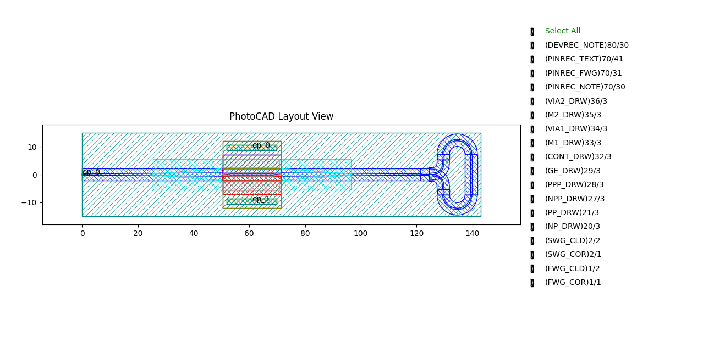
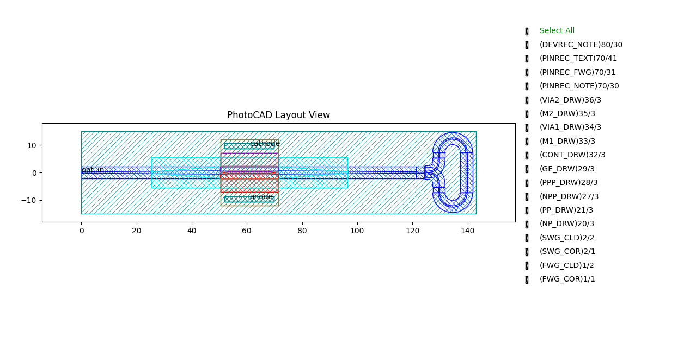

.. _com_pd :

FixedPhotoDetector
=======================

The fixed photodetector is a fixed-layout cell that converts optical power into an electrical signal using an input taper, a wide detection region, doping/contact regions, and two electrical pins. The full script can be found in ``gpdk`` > ``components`` > ``fixed_photo_detector`` > ``fixed_photo_detector.py``.

Basic Usage
------------------

The simplest way to create a fixed photodetector is to instantiate the ``Fixed_Photo_Detector`` class and output the layout for visualization.

.. code-block:: python

    from gpdk.technology import get_technology
    import fnpcell.all as fp
    from gpdk import all as pdk

    TECH = get_technology()

    # Create a fixed photodetector using default settings
    pd = pdk.Fixed_Photo_Detector()

    # Option 1: Plot the layout directly
    fp.plot(pd)

    # Option 2: Export to GDS file for external viewers
    # library = fp.Library()
    # library += pd
    # fp.export_gds(library, file=TECH.OUTPUT.local_output_file(__file__))

This produces a fixed photodetector layout with one optical port and two electrical pins.

Full Script
------------------

Import libraries:

.. code-block:: python

    import math

    from typing_extensions import Tuple

    import fnpcell.all as fp

    from gpdk.components.bend.bend_circular import BendCircular
    from gpdk.components.splitter.y_splitter import YSplitter
    from gpdk.components.straight.straight import Straight
    from gpdk.components.taper.taper_linear import TaperLinear
    from gpdk.technology import get_technology

The complete definition of the ``Fixed_Photo_Detector`` class:

.. code-block:: python

    @fp.schematic(symbol=fp.plogic.Symbol.PhotoDetector)
    class Fixed_Photo_Detector(fp.PCell):

        port_names: fp.IPortOptions = fp.PortOptionsParam(count=3, default=["op_0", "ep_0", "ep_1"])

        def build(self) -> Tuple[fp.InstanceSet, fp.ElementSet, fp.PortSet]:
            insts, elems, ports = super().build()
            TECH = get_technology()
            port_names = self.port_names

            left_type = TECH.WG.FWG.C.WIRE.updated(core_width=0.5)
            right_type = TECH.WG.FWG.C.WIRE.updated(core_width=1.25)

            left_taper = TaperLinear(
                length=50.4,
                left_type=left_type,
                right_type=right_type,
                anchor=fp.Anchor.START,
            )
            insts += left_taper, "left_taper"

            right_taper = TaperLinear(
                length=50,
                left_type=right_type,
                right_type=left_type,
                anchor=fp.Anchor.START,
                transform=fp.translate(71.4, 0),
            )
            insts += right_taper, "right_taper"

            mid_wg = Straight(
                length=21,
                waveguide_type=right_type,
                transform=fp.translate(50.4, 0),
            )
            insts += mid_wg, "mid_wg"

            splitter = YSplitter(
                bend_radius=5,
                center_waveguide_length=3.1,
                waveguide_type=left_type,
                transform=fp.translate(124.6, 0),
            )
            insts += splitter, "splitter"

            right_top_wg = Straight(
                length=2.1,
                waveguide_type=left_type,
                anchor=fp.Anchor.CENTER,
                transform=fp.rotate(degrees=90).translate(129.6, 6.3),
            )
            insts += right_top_wg, "right_top_wg"

            right_bottom_wg = Straight(
                length=2.1,
                waveguide_type=left_type,
                anchor=fp.Anchor.CENTER,
                transform=fp.rotate(degrees=90).translate(129.6, -6.3),
            )
            insts += right_bottom_wg, "right_bottom_wg"

            right_wg = Straight(
                length=14.7,
                waveguide_type=left_type,
                anchor=fp.Anchor.CENTER,
                transform=fp.rotate(degrees=90).translate(139.6, 0),
            )
            insts += right_wg, "right_wg"

            top_arc = fp.place(
                BendCircular(
                    radius=5,
                    degrees=180,
                    waveguide_type=left_type,
                ),
                at=(134.6, 7.35),
            )
            insts += top_arc, "top_arc"

            bottom_arc = fp.place(
                BendCircular(
                    radius=5,
                    degrees=180,
                    waveguide_type=left_type,
                ),
                at=fp.Waypoint(134.6, -7.35, 180),
            )
            insts += bottom_arc, "bottom_arc"

            elems += fp.el.Rect(width=21, height=5, center=(60.9, 4.625), layer=TECH.LAYER.FWG_COR)
            elems += fp.el.Rect(width=21, height=5, center=(60.9, -4.625), layer=TECH.LAYER.FWG_COR)

            ports += left_taper["op_0"].with_name(port_names[0])

            # SWG
            s_left_type = TECH.WG.SWG.C.WIRE.updated(core_width=0.5)
            s_right_type = TECH.WG.SWG.C.WIRE.updated(core_width=4.25)

            s_left_taper = TaperLinear(
                length=25,
                left_type=s_left_type,
                right_type=s_right_type,
                anchor=fp.Anchor.START,
                transform=fp.translate(25.4, 0),
            )
            insts += s_left_taper, "s_left_taper"

            s_right_taper = TaperLinear(
                length=25,
                left_type=s_right_type,
                right_type=s_left_type,
                anchor=fp.Anchor.START,
                transform=fp.translate(71.4, 0),
            )
            insts += s_right_taper, "s_right_taper"

            s_mid_wg = Straight(
                length=21,
                waveguide_type=s_right_type,
                transform=fp.translate(50.4, 0),
            )
            insts += s_mid_wg, "s_mid_wg"

            # NP
            elems += fp.el.Polygon(
                [
                    (50.4, 0),
                    (50.4, 2.125),
                    (71.4, 2.125),
                    (71.4, 0),
                    (70.4, 0),
                    (68.4, 0.275),
                    (53.4, 0.275),
                    (51.4, 0),
                ],
                layer=TECH.LAYER.NP_DRW,
            )
            elems += fp.el.Rect(width=21, height=1.5, center=(60.9, 1.375), layer=TECH.LAYER.NP_DRW)

            # PP
            elems += fp.el.Polygon(
                [
                    (50.4, 0),
                    (50.4, -2.125),
                    (71.4, -2.125),
                    (71.4, 0),
                    (70.4, 0),
                    (68.4, -0.275),
                    (53.4, -0.275),
                    (51.4, 0),
                ],
                layer=TECH.LAYER.PP_DRW,
            )
            elems += fp.el.Rect(width=21, height=1.5, center=(60.9, -1.375), layer=TECH.LAYER.PP_DRW)

            # NPP
            elems += fp.el.Rect(width=21, height=5, center=(60.9, 4.625), layer=TECH.LAYER.NPP_DRW)

            # PPP
            elems += fp.el.Rect(width=21, height=5, center=(60.9, -4.625), layer=TECH.LAYER.PPP_DRW)

            # GE
            elems += fp.el.Polygon(
                [
                    (53.4, -0.625),
                    (50.4, -0.1),
                    (50.4, 0.1),
                    (53.4, 0.625),
                    (68.4, 0.625),
                    (71.4, 0.1),
                    (71.4, -0.1),
                    (68.4, -0.625),
                ],
                layer=TECH.LAYER.GE_DRW,
            )

            # CONT
            elems += fp.el.Rect(width=20, height=3, center=(60.9, 4.125), layer=TECH.LAYER.CONT_DRW)
            elems += fp.el.Rect(width=20, height=3, center=(60.9, -4.125), layer=TECH.LAYER.CONT_DRW)

            # M1 Layer
            elems += fp.el.Rect(width=21, height=10, center=(60.9, 7.125), layer=TECH.LAYER.M1_DRW)
            elems += fp.el.Rect(width=21, height=10, center=(60.9, -7.125), layer=TECH.LAYER.M1_DRW)

            # VIA1 Layer
            elems += fp.el.Rect(width=18, height=2, center=(60.9, 9.635), layer=TECH.LAYER.VIA1_DRW)
            elems += fp.el.Rect(width=18, height=2, center=(60.9, -9.635), layer=TECH.LAYER.VIA1_DRW)

            # M2 Layer
            elems += fp.el.Rect(width=21, height=10, center=(60.9, 7.125), layer=TECH.LAYER.M2_DRW)
            elems += fp.el.Rect(width=21, height=10, center=(60.9, -7.125), layer=TECH.LAYER.M2_DRW)

            # VIA2 Layer
            elems += fp.el.Rect(width=18, height=2, center=(60.9, 9.635), layer=TECH.LAYER.VIA2_DRW)
            elems += fp.el.Rect(width=18, height=2, center=(60.9, -9.635), layer=TECH.LAYER.VIA2_DRW)

            # DEVICE
            elems += fp.el.Rect(width=143, height=30, center=(71.5, 0), layer=TECH.LAYER.DEVREC_NOTE)

            ports += fp.Pin(
                name=port_names[1],
                position=(60.9, 9.625),
                orientation=math.pi / 2,
                shape=fp.g.Rect(width=18, height=2, center=(0, 0)).translated(60.9, 9.625),
                metal_line_type=TECH.METAL.M1.W20,
            )

            ports += fp.Pin(
                name=port_names[2],
                position=(60.9, -9.625),
                orientation=-math.pi / 2,
                shape=fp.g.Rect(width=18, height=2, center=(0, 0)).translated(60.9, -9.625),
                metal_line_type=TECH.METAL.M1.W20,
            )

            return insts, elems, ports

Section Script Description
-------------------------------

**Parameters:**

.. list-table::
   :widths: 20 20 35
   :header-rows: 1

   * - Parameter
     - Default
     - Description
   * - ``port_names``
     - ``["op_0", "ep_0", "ep_1"]``
     - A sequence containing the names assigned to the optical port and the two electrical pins.

This component is a fixed-layout photodetector. Its geometry is defined directly inside ``build`` and is not exposed as user parameters.

**build Method:**

1. Initialize the PCell and read parameters

.. code-block:: python

    def build(self) -> Tuple[fp.InstanceSet, fp.ElementSet, fp.PortSet]:
        insts, elems, ports = super().build()
        TECH = get_technology()
        port_names = self.port_names

The method first calls ``super().build()`` to initialize the PCell and then reads the port names. Since this component does not expose geometric parameters, the port names are the only user-configurable parameter.

2. Define waveguide types used by the photodetector

.. code-block:: python

    left_type = TECH.WG.FWG.C.WIRE.updated(core_width=0.5)
    right_type = TECH.WG.FWG.C.WIRE.updated(core_width=1.25)

Two waveguide types are derived from the default ``FWG.C.WIRE`` waveguide. The narrower waveguide has a core width of ``0.5``, and the wider waveguide has a core width of ``1.25``. These are used to form the tapered optical path of the photodetector.

3. Build the input taper, wide detection waveguide, and output taper

.. code-block:: python

    left_taper = TaperLinear(
        length=50.4,
        left_type=left_type,
        right_type=right_type,
        anchor=fp.Anchor.START,
    )
    insts += left_taper, "left_taper"

    right_taper = TaperLinear(
        length=50,
        left_type=right_type,
        right_type=left_type,
        anchor=fp.Anchor.START,
        transform=fp.translate(71.4, 0),
    )
    insts += right_taper, "right_taper"

    mid_wg = Straight(
        length=21,
        waveguide_type=right_type,
        transform=fp.translate(50.4, 0),
    )
    insts += mid_wg, "mid_wg"

The optical path begins with a taper from the narrow input waveguide to the wider detection waveguide. A straight wide waveguide section is placed in the photodetection region, followed by a second taper back to the narrow waveguide width.

4. Build fixed splitter and routing waveguides

.. code-block:: python

    splitter = YSplitter(
        bend_radius=5,
        center_waveguide_length=3.1,
        waveguide_type=left_type,
        transform=fp.translate(124.6, 0),
    )
    insts += splitter, "splitter"

    right_top_wg = Straight(
        length=2.1,
        waveguide_type=left_type,
        anchor=fp.Anchor.CENTER,
        transform=fp.rotate(degrees=90).translate(129.6, 6.3),
    )
    insts += right_top_wg, "right_top_wg"

    right_bottom_wg = Straight(
        length=2.1,
        waveguide_type=left_type,
        anchor=fp.Anchor.CENTER,
        transform=fp.rotate(degrees=90).translate(129.6, -6.3),
    )
    insts += right_bottom_wg, "right_bottom_wg"

    right_wg = Straight(
        length=14.7,
        waveguide_type=left_type,
        anchor=fp.Anchor.CENTER,
        transform=fp.rotate(degrees=90).translate(139.6, 0),
    )
    insts += right_wg, "right_wg"

    top_arc = fp.place(
        BendCircular(
            radius=5,
            degrees=180,
            waveguide_type=left_type,
        ),
        at=(134.6, 7.35),
    )
    insts += top_arc, "top_arc"

    bottom_arc = fp.place(
        BendCircular(
            radius=5,
            degrees=180,
            waveguide_type=left_type,
        ),
        at=fp.Waypoint(134.6, -7.35, 180),
    )
    insts += bottom_arc, "bottom_arc"

The fixed layout also includes a Y-splitter and several straight and curved waveguide sections. These instances are part of the fixed photodetector layout and are not exposed as ports by this component.

5. Add fixed core rectangles and expose the optical port

.. code-block:: python

    elems += fp.el.Rect(width=21, height=5, center=(60.9, 4.625), layer=TECH.LAYER.FWG_COR)
    elems += fp.el.Rect(width=21, height=5, center=(60.9, -4.625), layer=TECH.LAYER.FWG_COR)

    ports += left_taper["op_0"].with_name(port_names[0])

Two fixed rectangles are added to the ``FWG_COR`` layer in the detector region. The component exposes one optical port taken from the input side of ``left_taper``.

6. Build SWG taper and waveguide structures

.. code-block:: python

    s_left_type = TECH.WG.SWG.C.WIRE.updated(core_width=0.5)
    s_right_type = TECH.WG.SWG.C.WIRE.updated(core_width=4.25)

    s_left_taper = TaperLinear(
        length=25,
        left_type=s_left_type,
        right_type=s_right_type,
        anchor=fp.Anchor.START,
        transform=fp.translate(25.4, 0),
    )
    insts += s_left_taper, "s_left_taper"

    s_right_taper = TaperLinear(
        length=25,
        left_type=s_right_type,
        right_type=s_left_type,
        anchor=fp.Anchor.START,
        transform=fp.translate(71.4, 0),
    )
    insts += s_right_taper, "s_right_taper"

    s_mid_wg = Straight(
        length=21,
        waveguide_type=s_right_type,
        transform=fp.translate(50.4, 0),
    )
    insts += s_mid_wg, "s_mid_wg"

Additional SWG-based taper and waveguide structures are placed along the same detector region. These structures are part of the fixed photodetector layout.

7. Add doping regions

.. code-block:: python

    # NP
    elems += fp.el.Polygon(
        [
            (50.4, 0),
            (50.4, 2.125),
            (71.4, 2.125),
            (71.4, 0),
            (70.4, 0),
            (68.4, 0.275),
            (53.4, 0.275),
            (51.4, 0),
        ],
        layer=TECH.LAYER.NP_DRW,
    )
    elems += fp.el.Rect(width=21, height=1.5, center=(60.9, 1.375), layer=TECH.LAYER.NP_DRW)

    # PP
    elems += fp.el.Polygon(
        [
            (50.4, 0),
            (50.4, -2.125),
            (71.4, -2.125),
            (71.4, 0),
            (70.4, 0),
            (68.4, -0.275),
            (53.4, -0.275),
            (51.4, 0),
        ],
        layer=TECH.LAYER.PP_DRW,
    )
    elems += fp.el.Rect(width=21, height=1.5, center=(60.9, -1.375), layer=TECH.LAYER.PP_DRW)

    # NPP
    elems += fp.el.Rect(width=21, height=5, center=(60.9, 4.625), layer=TECH.LAYER.NPP_DRW)

    # PPP
    elems += fp.el.Rect(width=21, height=5, center=(60.9, -4.625), layer=TECH.LAYER.PPP_DRW)

The photodetector includes fixed doping regions. The ``NP`` and ``PP`` layers define the junction regions near the detector waveguide, while the ``NPP`` and ``PPP`` layers define heavily doped contact regions.

8. Add Ge, contact, metal, via, and device layers

.. code-block:: python

    # GE
    elems += fp.el.Polygon(
        [
            (53.4, -0.625),
            (50.4, -0.1),
            (50.4, 0.1),
            (53.4, 0.625),
            (68.4, 0.625),
            (71.4, 0.1),
            (71.4, -0.1),
            (68.4, -0.625),
        ],
        layer=TECH.LAYER.GE_DRW,
    )

    # CONT
    elems += fp.el.Rect(width=20, height=3, center=(60.9, 4.125), layer=TECH.LAYER.CONT_DRW)
    elems += fp.el.Rect(width=20, height=3, center=(60.9, -4.125), layer=TECH.LAYER.CONT_DRW)

    # M1 Layer
    elems += fp.el.Rect(width=21, height=10, center=(60.9, 7.125), layer=TECH.LAYER.M1_DRW)
    elems += fp.el.Rect(width=21, height=10, center=(60.9, -7.125), layer=TECH.LAYER.M1_DRW)

    # VIA1 Layer
    elems += fp.el.Rect(width=18, height=2, center=(60.9, 9.635), layer=TECH.LAYER.VIA1_DRW)
    elems += fp.el.Rect(width=18, height=2, center=(60.9, -9.635), layer=TECH.LAYER.VIA1_DRW)

    # M2 Layer
    elems += fp.el.Rect(width=21, height=10, center=(60.9, 7.125), layer=TECH.LAYER.M2_DRW)
    elems += fp.el.Rect(width=21, height=10, center=(60.9, -7.125), layer=TECH.LAYER.M2_DRW)

    # VIA2 Layer
    elems += fp.el.Rect(width=18, height=2, center=(60.9, 9.635), layer=TECH.LAYER.VIA2_DRW)
    elems += fp.el.Rect(width=18, height=2, center=(60.9, -9.635), layer=TECH.LAYER.VIA2_DRW)

    # DEVICE
    elems += fp.el.Rect(width=143, height=30, center=(71.5, 0), layer=TECH.LAYER.DEVREC_NOTE)

The fixed layout also includes the Ge absorption region, contact regions, metal layers, via layers, and a device recognition rectangle. These shapes define the electrical and physical structure of the photodetector.

9. Create the electrical pins

.. code-block:: python

    ports += fp.Pin(
        name=port_names[1],
        position=(60.9, 9.625),
        orientation=math.pi / 2,
        shape=fp.g.Rect(width=18, height=2, center=(0, 0)).translated(60.9, 9.625),
        metal_line_type=TECH.METAL.M1.W20,
    )

    ports += fp.Pin(
        name=port_names[2],
        position=(60.9, -9.625),
        orientation=-math.pi / 2,
        shape=fp.g.Rect(width=18, height=2, center=(0, 0)).translated(60.9, -9.625),
        metal_line_type=TECH.METAL.M1.W20,
    )

    return insts, elems, ports

Two electrical pins are created. The upper pin is named ``ep_0`` by default, and the lower pin is named ``ep_1`` by default. The method finally returns the assembled instances, elements, and ports.

Run and view the layout
------------------------

``Fixed_Photo_Detector`` is a fixed-layout cell. All geometric dimensions, doping regions, and metal layers are hardcoded internally, so no geometric variations are available. 

The only configurable parameter is ``port_names``, which allows renaming the optical and electrical ports without altering the physical layout:

.. code-block:: python

    pd_custom_names = pdk.Fixed_Photo_Detector(
        port_names=["opt_in", "cathode", "anode"]
    )
    
