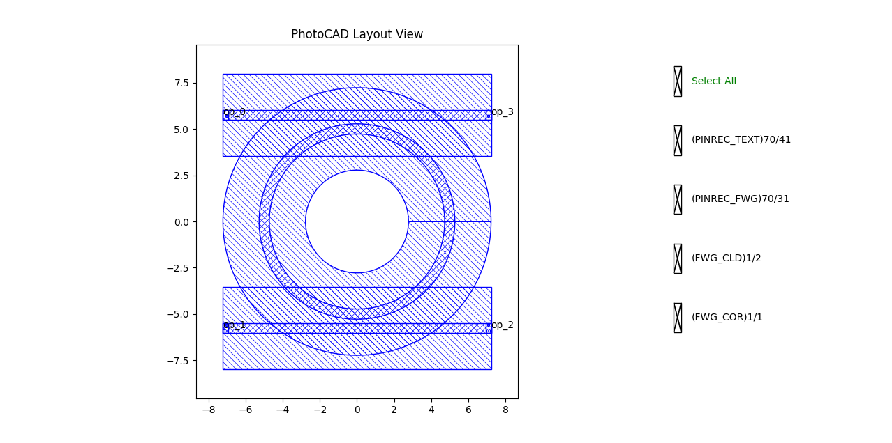
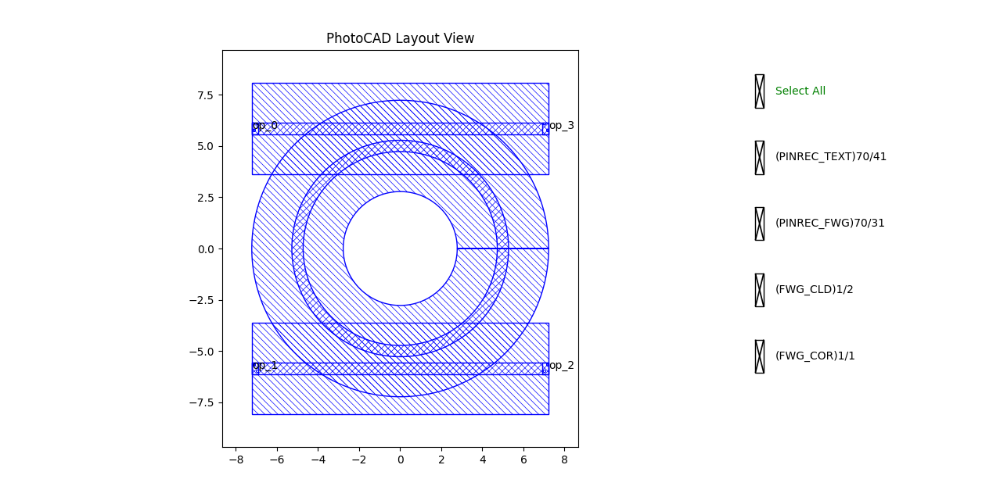
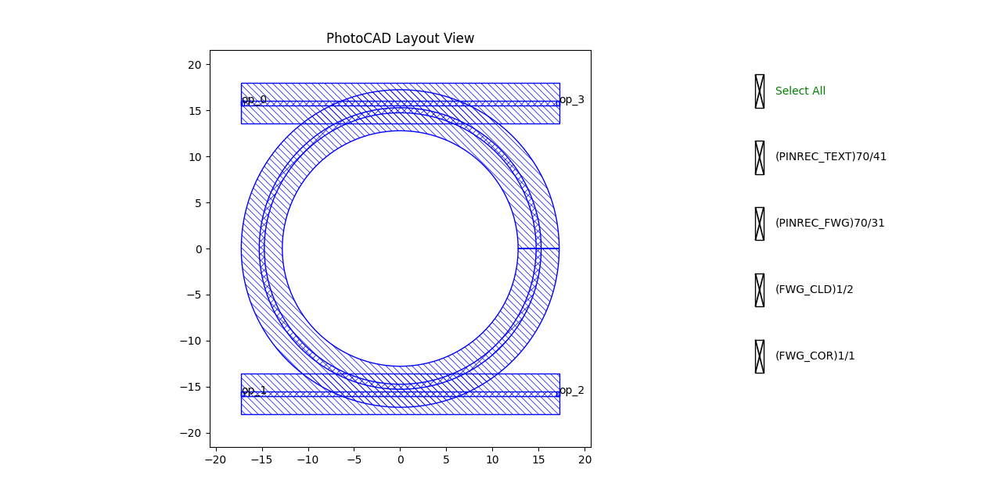

.. _com_ring :

RingResonator
=======================

The ring resonator is a fundamental component in photonic integrated circuits. It consists of a circular closed-loop waveguide coupled to one or two straight bus waveguides. The full script can be found in ``gpdk`` > ``components`` > ``ring_resonator`` > ``ring_resonator.py``.

Basic Usage
------------------

The simplest way to create a ring resonator is to instantiate the ``RingResonator`` class with desired parameters and output the layout for visualization.

.. code-block:: python

    from gpdk.technology import get_technology
    import fnpcell.all as fp
    from gpdk import all as pdk

    TECH = get_technology()

    # Create a ring resonator using default settings (radius=5, FWG.C.WIRE)
    ring = pdk.RingResonator(ring_type=TECH.WG.FWG.C.WIRE)

    # Option 1: Plot the layout directly
    fp.plot(ring)

    # Option 2: Export to GDS file for external viewers
    # library = fp.Library()
    # library += ring
    # fp.export_gds(library, file=TECH.OUTPUT.local_output_file(__file__))

This produces a ring resonator segment with an add-drop configuration, providing four optical ports across the two bus waveguides.

Full Script
------------------

Import libraries:

.. code-block:: python

    from gpdk.technology.wg.types import CoreCladdingWaveguideType
    from typing_extensions import Optional, Tuple, cast, Any
    import matplotlib.pyplot as plt
    import numpy as np
    from gpdk.simulation.sim_models.ring.ring import RingAddDropModel

    import fnpcell.all as fp
    from gpdk.components.straight.straight import Straight
    from gpdk.technology import get_technology

The complete definition of the ``RingResonator`` class:

.. code-block:: python

    class RingResonator(fp.PCell[fp.IOwnedPort]):

        ring_radius: float = fp.PositiveFloatParam(default=5, doc="Radius of the ring")
        top_spacing: float = fp.PositiveFloatParam(default=0.2, doc="Spacing between top and ring waveguides")
        bottom_spacing: float = fp.PositiveFloatParam(default=0.2, doc="Spacing between ring and bottom waveguides")
        ring_type: CoreCladdingWaveguideType = fp.WaveguideTypeParam(type=CoreCladdingWaveguideType, default=fp.USE_DEFAULT_FACTORY)
        top_type: Optional[CoreCladdingWaveguideType] = fp.WaveguideTypeParam(type=CoreCladdingWaveguideType, default=fp.USE_DEFAULT_FACTORY)
        bottom_type: Optional[CoreCladdingWaveguideType] = fp.WaveguideTypeParam(type=CoreCladdingWaveguideType, default=fp.USE_DEFAULT_FACTORY)
        port_names: fp.IPortOptions = fp.PortOptionsParam(count=4, default=["op_0", "op_1", "op_2", "op_3"])

        def _default_ring_type(self):
            return get_technology().WG.FWG.C.WIRE

        def _default_top_type(self):
            return get_technology().WG.FWG.C.WIRE

        def _default_bottom_type(self):
            return get_technology().WG.FWG.C.WIRE

        def build(self) -> Tuple[fp.InstanceSet, fp.ElementSet, fp.PortSet]:
            insts, elems, ports = super().build()
            ring_radius = self.ring_radius
            top_spacing = self.top_spacing
            bottom_spacing = self.bottom_spacing
            ring_type = self.ring_type
            top_type = self.top_type
            bottom_type = self.bottom_type
            port_names = self.port_names

            if top_type is None:
                top_type = ring_type
            if bottom_type is None:
                bottom_type = ring_type

            min_radius_of_type = cast(float, ring_type.BEND_CIRCULAR.radius_eff)

            assert ring_radius >= min_radius_of_type

            ring = ring_type(fp.g.EllipticalArc(radius=ring_radius)).with_name("ring")
            insts += ring
            ring_core_width = ring_type.core_width
            ring_cladding_width = ring_type.cladding_width

            line_length = ring_radius * 2 + ring_cladding_width

            top_core_width = top_type.core_width
            top = Straight(
                name="top",
                length=line_length,
                waveguide_type=top_type,
                transform=fp.translate(-line_length / 2, ring_radius + top_spacing + top_core_width / 2 + ring_core_width / 2),
            )
            insts += top
            ports += top["op_0"].with_name(port_names[0])
            ports += top["op_1"].with_name(port_names[3])
            
            bottom_core_width = bottom_type.core_width
            bottom = Straight(
                name="bottom",
                length=line_length,
                waveguide_type=bottom_type,
                transform=fp.translate(-line_length / 2, -(ring_radius + bottom_spacing + bottom_core_width / 2 + ring_core_width / 2)),
            )
            insts += bottom
            ports += bottom["op_0"].with_name(port_names[1])
            ports += bottom["op_1"].with_name(port_names[2])
            
            return insts, elems, ports

Section Script Description
-------------------------------

**Parameters:**

.. list-table::
   :widths: 20 20 35
   :header-rows: 1

   * - Parameter
     - Default
     - Description
   * - ``ring_radius``
     - ``5``
     - The radius of the central ring waveguide in micrometers.
   * - ``top_spacing``
     - ``0.2``
     - The gap spacing between the top bus waveguide and the ring waveguide.
   * - ``bottom_spacing``
     - ``0.2``
     - The gap spacing between the bottom bus waveguide and the ring waveguide.
   * - ``ring_type``
     - ``FWG.C.WIRE``
     - The waveguide definition (core/cladding materials, width, etc.) for the ring.
   * - ``top_type``
     - ``FWG.C.WIRE``
     - The waveguide definition for the top bus. Inherits ``ring_type`` if not explicitly provided.
   * - ``bottom_type``
     - ``FWG.C.WIRE``
     - The waveguide definition for the bottom bus. Inherits ``ring_type`` if not explicitly provided.
   * - ``port_names``
     - ``["op_0", "op_1", "op_2", "op_3"]``
     - A sequence containing custom names assigned to the component's ports.

**build Method:**

1. Initialize the PCell and read parameters

.. code-block:: python

    def build(self) -> Tuple[fp.InstanceSet, fp.ElementSet, fp.PortSet]:
        insts, elems, ports = super().build()

        ring_radius = self.ring_radius
        top_spacing = self.top_spacing
        bottom_spacing = self.bottom_spacing
        ring_type = self.ring_type
        top_type = self.top_type
        bottom_type = self.bottom_type
        port_names = self.port_names

The method first calls ``super().build()`` to initialize the PCell and then reads the parameters required to build the ring resonator. These parameters include the ring radius, the spacing between the ring and the top/bottom bus waveguides, the waveguide types used for the ring and the two buses, and the port names that will be exposed by the component.

2. Check the minimum bend radius constraint

.. code-block:: python

    min_radius_of_type = cast(float, ring_type.BEND_CIRCULAR.radius_eff)
    assert ring_radius >= min_radius_of_type

Before generating the ring geometry, the method checks whether the requested ``ring_radius`` satisfies the minimum effective bend radius of the selected ``ring_type``. This prevents generating a ring waveguide that violates the design rules or physical constraints of the waveguide type.

3. Build the ring waveguide

.. code-block:: python

    ring = ring_type(fp.g.EllipticalArc(radius=ring_radius)).with_name("ring")
    insts += ring

The ring itself is created by applying the ``ring_type`` waveguide definition to an elliptical arc geometry. When only a single radius is provided, this arc represents the circular ring path. The generated ring instance is named ``"ring"`` and added to the instance set.

4. Calculate the bus waveguide length

.. code-block:: python

    ring_core_width = ring_type.core_width
    ring_cladding_width = ring_type.cladding_width
    line_length = ring_radius * 2 + ring_cladding_width

The straight top and bottom bus waveguides need a length that spans across the ring region. The length is calculated from the ring diameter, ``ring_radius * 2``, plus an additional margin based on the ring cladding width. This helps ensure that the bus waveguides extend sufficiently beyond the ring area.

5. Build and position the top bus waveguide

.. code-block:: python

    top_core_width = top_type.core_width
    top = Straight(
        name="top",
        length=line_length,
        waveguide_type=top_type,
        transform=fp.translate(
            -line_length / 2,
            ring_radius + top_spacing + top_core_width / 2 + ring_core_width / 2,
        ),
    )
    insts += top

    ports += top["op_0"].with_name(port_names[0])
    ports += top["op_1"].with_name(port_names[3])

The top bus is created as a straight waveguide using ``top_type``. Its x-position is centered by translating it by ``-line_length / 2``, so the straight waveguide extends symmetrically around the ring center.

The y-position is calculated as:

.. code-block:: python

    ring_radius + top_spacing + top_core_width / 2 + ring_core_width / 2

This offset places the top bus above the ring with the required ``top_spacing``. The term ``ring_core_width / 2`` accounts for half of the ring core width, and ``top_core_width / 2`` accounts for half of the top bus core width, so the spacing is measured correctly between the waveguide cores.

After the top bus is placed, its two ports are exposed. The left port, ``op_0``, is mapped to ``port_names[0]``, and the right port, ``op_1``, is mapped to ``port_names[3]``.

6. Build and position the bottom bus waveguide

.. code-block:: python

    bottom_core_width = bottom_type.core_width
    bottom = Straight(
        name="bottom",
        length=line_length,
        waveguide_type=bottom_type,
        transform=fp.translate(
            -line_length / 2,
            -(ring_radius + bottom_spacing + bottom_core_width / 2 + ring_core_width / 2),
        ),
    )
    insts += bottom

    ports += bottom["op_0"].with_name(port_names[1])
    ports += bottom["op_1"].with_name(port_names[2])

    return insts, elems, ports

The bottom bus is built in the same way as the top bus, but it is placed below the ring. Its y-offset is negative:

.. code-block:: python

    -(ring_radius + bottom_spacing + bottom_core_width / 2 + ring_core_width / 2)

This places the bottom bus symmetrically below the ring center with the required ``bottom_spacing``.

The bottom bus ports are then exposed and renamed. The left port, ``op_0``, is mapped to ``port_names[1]``, and the right port, ``op_1``, is mapped to ``port_names[2]``.

Finally, the method returns the assembled instances, elements, and ports. The ``elems`` set is not modified directly because the component is constructed from existing waveguide instances rather than raw geometric elements.

Run and view the layout
------------------------

Modifying the parameters changes the generated structure. Observe the differences when varying radii, spacing, and waveguide types:

**Variation A:** A resonator with a wider coupling gaps.

.. code-block:: python

    ring_var_a = pdk.RingResonator(
        top_spacing=0.3, 
        bottom_spacing=0.3, 
    )

**Variation B:** A larger ring resonator with a 15 μm radius.

.. code-block:: python

    ring_var_b = pdk.RingResonator(
        ring_radius=15,
    )

