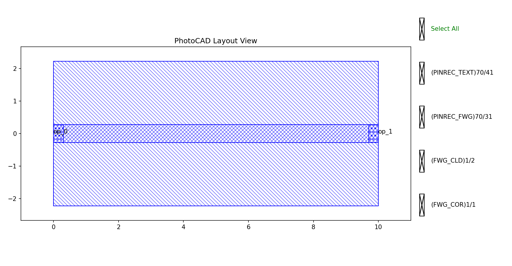
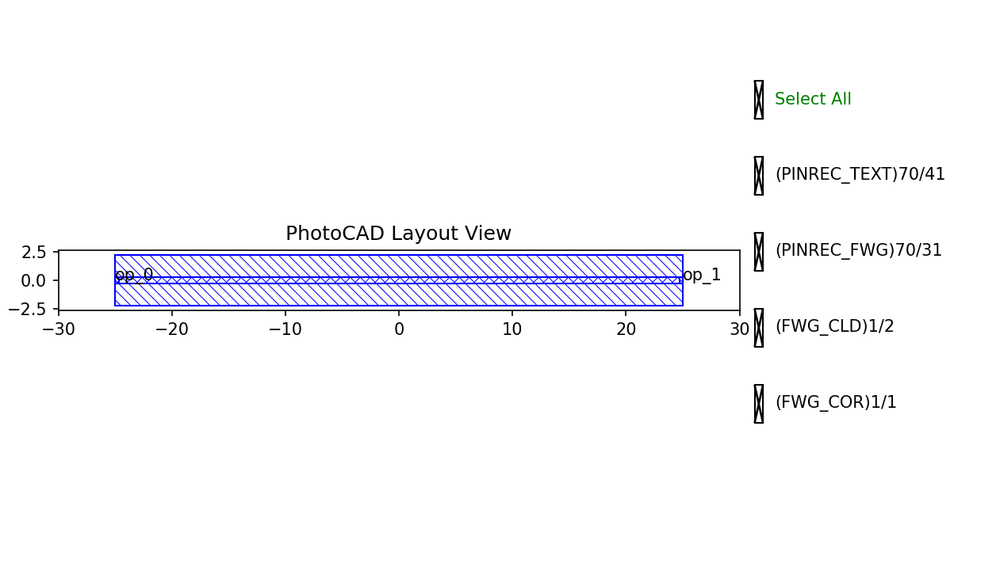
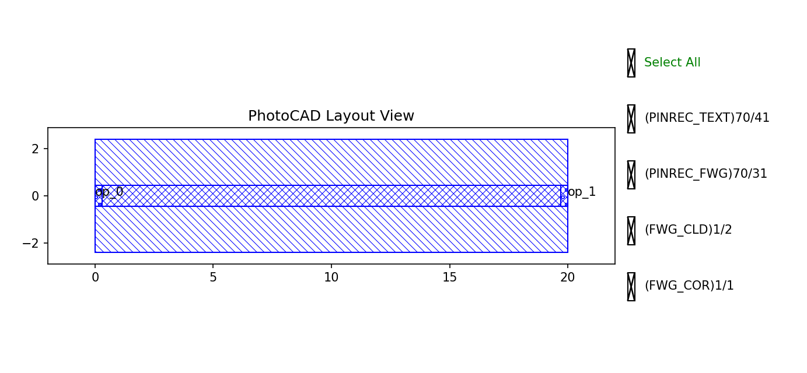
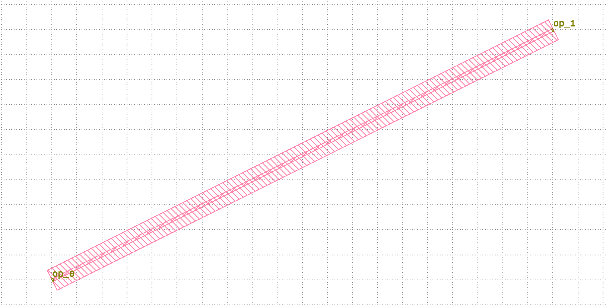

.. _com_straight :

Straight
=======================

The straight waveguide is one of the most fundamental building blocks in photonic integrated circuits.

Basic Usage
------------------

The simplest way to create a straight waveguide is to instantiate the ``Straight`` class with desired parameters and output the layout for visualization.

.. code-block:: python

    from gpdk.technology import get_technology
    import fnpcell.all as fp
    from gpdk import all as pdk

    TECH = get_technology()

    # Create a 10μm straight waveguide using default settings
    straight = pdk.Straight(length=10, waveguide_type=TECH.WG.FWG.C.WIRE)

    # Option 1: Plot the layout directly
    fp.plot(straight)

    # Option 2: Export to GDS file for external viewers
    # library = fp.Library()
    # library += straight
    # fp.export_gds(library, file=TECH.OUTPUT.local_output_file(__file__))

This produces a straight waveguide segment with optical ports at both ends.

Full Script
------------------

Import library:

.. code-block:: python

    from functools import cached_property
    from typing import Tuple

    from fnpcell import all as fp
    from fnpcell.interfaces import angle_between, distance_between
    from gpdk.technology import get_technology, PCell

The complete definition of the ``Straight`` class: 

.. code-block:: python

    class Straight(fp.IWaveguideLike, fp.PCell[fp.IOwnedPort]):

        length: float = fp.NonNegFloatParam(default=10)
        waveguide_type: fp.IWaveguideType = fp.WaveguideTypeParam(default=fp.USE_DEFAULT_FACTORY)
        anchor: fp.Anchor = fp.AnchorParam(default=fp.Anchor.START)
        port_names: fp.IPortOptions = fp.PortOptionsParam(count=2, default=("op_0", "op_1"))

        def _default_waveguide_type(self):
            return get_technology().WG.FWG.C.WIRE

        @cached_property
        def raw_curve(self):
            return fp.g.Line(
                length=self.length,
                anchor=self.anchor,
            )

        def build(self) -> Tuple[fp.InstanceSet, fp.ElementSet, fp.PortSet]:
            insts, elems, ports = super().build()
            wg = self.waveguide_type(curve=self.raw_curve)
            insts += wg
            ports += [port.with_name(self.port_names[i]) for i, port in enumerate(wg.ports)]
            return insts, elems, ports

Script & Parameter Description
-------------------------------

1. Parameters
^^^^^^^^^^^^^^

.. list-table:: 
   :widths: 20 20 35
   :header-rows: 1

   * - Parameter
     - Default
     - Description
   * - ``length``
     - ``10``
     - The physical length of the waveguide in micrometers. Must be non-negative.
   * - ``waveguide_type``
     - ``FWG.C.WIRE``
     - The waveguide definition (core/cladding materials, width, etc.). Defaults to the technology's standard wire waveguide.
   * - ``anchor``
     - ``Anchor.START``
     - Controls where the origin of the cell is placed. Options: ``START``, ``CENTER``, ``END``.
   * - ``port_names``
     - ``("op_0", "op_1")``
     - A sequence containing custom names assigned to the input and output ports.

2. The raw_curve Property
^^^^^^^^^^^^^^^^^^^^^^^^^

The ``raw_curve`` method efficiently calculates and caches a 1D geometric line (``fp.g.Line``) based on the component's defined ``length`` and ``anchor`` parameters.

3. The build Method
^^^^^^^^^^^^^^^^^^^

The ``build()`` method generates the actual physical layout using a three-step assembly process:

- **Extrusion**: It applies the physical profile (width and layer definitions from ``waveguide_type``) along the mathematical centerline (``raw_curve``) to create a concrete waveguide instance.

- **Integration**: It registers this new waveguide instance into the cell's instance set for GDS exporting.

- **Port Mapping**: It maps and renames the default waveguide ports to the user-specified ``port_names`` for future connection referencing.

4. Parameter Variations
^^^^^^^^^^^^^^^^^^^^^^^^

Modifying the parameters changes the generated structure. Observe the differences when varying lengths and waveguide types:

**Variation A:** 50μm length with center anchor.

.. code-block:: python

    straight_var_a = pdk.Straight(length=50, anchor=fp.Anchor.CENTER)

**Variation B:** 20μm length utilizing expanded waveguide type.

.. code-block:: python

    straight_var_b = pdk.Straight(length=20, waveguide_type=TECH.WG.FWG.C.EXPANDED)

StraightBetween
---------------------------------

The function ``StraightBetween`` can generate a straight waveguide that bridges two coordinates.

It operates as a wrapper function that calculates the required distance and angle between two points, internally instantiates the base ``Straight`` class, and applies the necessary rotation and translation to establish the connection.

**Function:**

.. code-block:: python

    def StraightBetween(
        *,
        start: fp.Point2D = (0, 0),
        end: fp.Point2D,
        waveguide_type: fp.IWaveguideType,
        port_names: fp.IPortOptions = ("op_0", "op_1"),
    ):

**Parameters:** 

.. list-table:: 
   :widths: 20 20 35
   :header-rows: 1

   * - Parameter
     - Default
     - Description
   * - ``start``
     - ``(0, 0)``
     - The starting coordinate (``fp.Point2D``) of the waveguide.
   * - ``end``
     - *Required*
     - The ending coordinate (``fp.Point2D``) of the waveguide.
   * - ``waveguide_type``
     - *Required*
     - The waveguide definition (core/cladding materials, width, etc.) to apply.
   * - ``port_names``
     - ``("op_0", "op_1")``
     - Custom names assigned to the input and output ports.

**Example usage:**

.. code-block:: python

    s = StraightBetween(
        start=(0, 0),
        end=(100, 50),
        waveguide_type=TECH.WG.FWG.C.WIRE
    )

