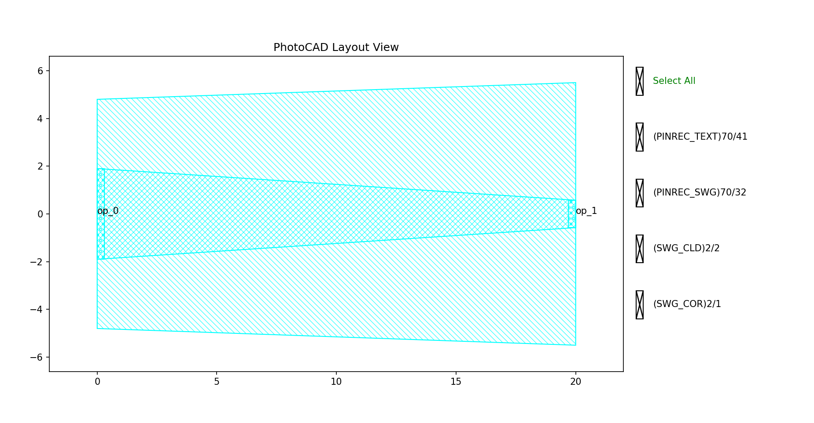
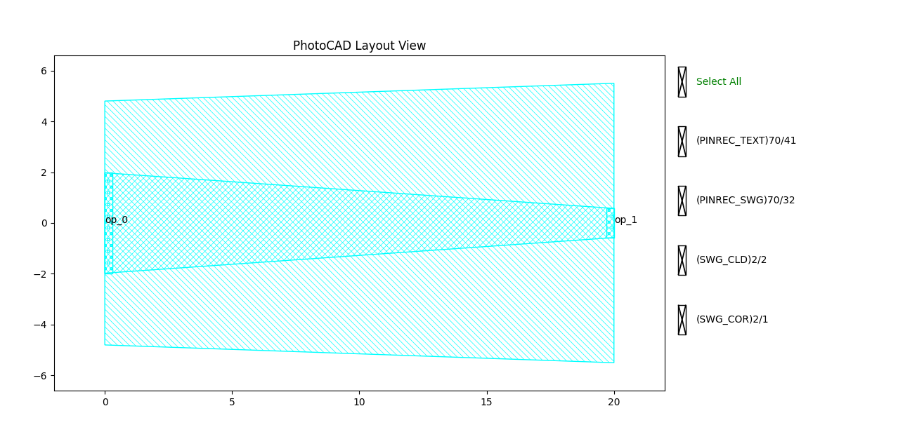
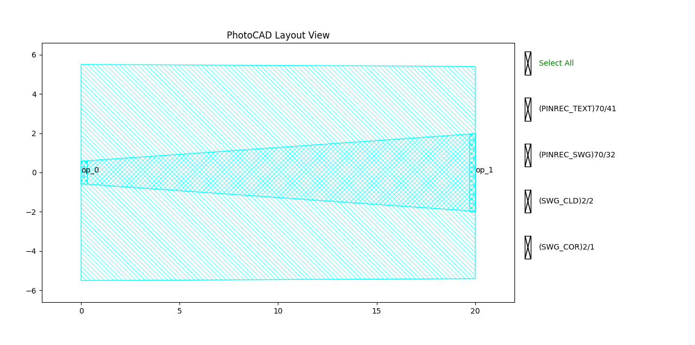

.. _com_taper_linear :

TaperLinear
=======================

The linear taper waveguide is a commonly used building block in photonic integrated circuits to transition between different waveguide widths or types. It provides a smooth linear transition and is useful for mode matching and reducing reflection or radiation loss. The full script can be found in ``gpdk`` > ``components`` > ``taper`` > ``taper_linear.py``.

Basic Usage
------------------

The simplest way to create a linear taper is to instantiate the ``TaperLinear`` class with desired parameters and output the layout for visualization.

.. code-block:: python

    from gpdk.technology import get_technology
    import fnpcell.all as fp
    from gpdk import all as pdk

    TECH = get_technology()

    # Create a 20μm linear taper waveguide transitioning between two waveguide types
    swg = TECH.WG.SWG.C.WIRE.updated(core_width=3.8, cladding_width=9.6)
    taper = pdk.TaperLinear(length=20, left_type=swg, right_type=TECH.WG.SWG.C.WIRE)

    # Option 1: Plot the layout directly
    fp.plot(taper)

    # Option 2: Export to GDS file for external viewers
    # library = fp.Library()
    # library += taper
    # fp.export_gds(library, file=TECH.OUTPUT.local_output_file(__file__))

This produces a linear taper waveguide segment with optical ports at both ends.

Full Script
------------------

Import libraries:

.. code-block:: python

    from functools import cached_property
    from pathlib import Path

    from typing_extensions import Any, Mapping, Sequence, Tuple

    import fnpcell.all as fp
    from fnpcell.base.sim_model import ISimModel
    from gpdk.technology import get_technology
    from gpdk.technology.wg.types import CoreCladdingWaveguideType

The complete definition of the ``TaperLinear`` class:

.. code-block:: python

    class TaperLinear(fp.IWaveguideLike, fp.PCell[fp.IOwnedPort]):

        length: float = fp.PositiveFloatParam(default=10)
        left_type: CoreCladdingWaveguideType = fp.WaveguideTypeParam(type=CoreCladdingWaveguideType, default=fp.USE_DEFAULT_FACTORY)
        right_type: CoreCladdingWaveguideType = fp.WaveguideTypeParam(type=CoreCladdingWaveguideType, default=fp.USE_DEFAULT_FACTORY)
        anchor: fp.Anchor = fp.AnchorParam(default=fp.Anchor.START)
        port_names: fp.IPortOptions = fp.PortOptionsParam(count=2, default=["op_0", "op_1"])

        def _default_left_type(self):
            return get_technology().WG.FWG.C.WIRE

        def _default_right_type(self):
            return get_technology().WG.FWG.C.EXPANDED

        @cached_property
        def raw_curve(self):
            return fp.g.Line(
                length=self.length,
                anchor=self.anchor,
            )

        def build(self) -> Tuple[fp.InstanceSet, fp.ElementSet, fp.PortSet]:
            insts, elems, ports = super().build()
            assert self.left_type.is_isomorphic_to(self.right_type), "left_type must be isomorphic to right_type"

            wgt = self.left_type.tapered(taper_function=fp.TaperFunction.LINEAR, final_type=self.right_type)
            wg = wgt(curve=self.raw_curve)
            insts += wg
            ports += [port.with_name(self.port_names[i]) for i, port in enumerate(wg.ports)]
            return insts, elems, ports

Section Script Description
-------------------------------

**Parameters:**

.. list-table:: 
   :widths: 20 20 35
   :header-rows: 1

   * - Parameter
     - Default
     - Description
   * - ``length``
     - ``10``
     - The physical length of the taper in micrometers. Must be a positive float.
   * - ``left_type``
     - ``FWG.C.WIRE``
     - The starting waveguide definition (core/cladding layers, width, etc.). Defaults to the standard wire waveguide.
   * - ``right_type``
     - ``FWG.C.EXPANDED``
     - The ending waveguide definition. Defaults to the expanded waveguide.
   * - ``anchor``
     - ``Anchor.START``
     - Controls where the origin of the cell is placed. Options: ``START``, ``CENTER``, ``END``.
   * - ``port_names``
     - ``["op_0", "op_1"]``
     - A sequence containing custom names assigned to the component's ports.

**raw_curve:**

.. code-block:: python

    @cached_property
    def raw_curve(self):
        return fp.g.Line(
            length=self.length,
            anchor=self.anchor,
        )

It calls a predefined line (``fp.g.Line``) and passes the PCell's ``length`` and ``anchor`` parameters to it.

**build Method:**

.. code-block:: python

    def build(self) -> Tuple[fp.InstanceSet, fp.ElementSet, fp.PortSet]:
        insts, elems, ports = super().build()
        assert self.left_type.is_isomorphic_to(self.right_type), "left_type must be isomorphic to right_type"

        wgt = self.left_type.tapered(taper_function=fp.TaperFunction.LINEAR, final_type=self.right_type)
        wg = wgt(curve=self.raw_curve)
        insts += wg
        ports += [port.with_name(self.port_names[i]) for i, port in enumerate(wg.ports)]
        return insts, elems, ports

The ``build`` method first verifies that the ``left_type`` and ``right_type`` waveguides are isomorphic. It then creates a tapered waveguide instance transitioning from the left type to the right type using a linear taper function (``fp.TaperFunction.LINEAR``). Finally, it adds the waveguide to the layout and renames its ports according to ``port_names``.

Run and view the layout
------------------------

Modifying the parameters changes the generated structure. Observe the differences when varying lengths and waveguide types:

**Variation A:** 20μm taper using a customized left waveguide type.

.. code-block:: python

    swg_left = TECH.WG.SWG.C.WIRE.updated(core_width=TECH.WG.SWG.core_bias.apply(3.8), cladding_width=TECH.WG.SWG.cladding_bias.apply(9.6))
    taper_var_a = pdk.TaperLinear(length=20, left_type=swg_left, right_type=TECH.WG.SWG.C.WIRE)

**Variation B:** 20μm taper using a customized right waveguide type.

.. code-block:: python

    swg_right = TECH.WG.SWG.C.WIRE.updated(core_width=TECH.WG.SWG.core_bias.apply(3.8), cladding_width=TECH.WG.SWG.cladding_bias.apply(10.8))
    taper_var_b = pdk.TaperLinear(length=20, left_type=TECH.WG.SWG.C.WIRE, right_type=swg_right)

