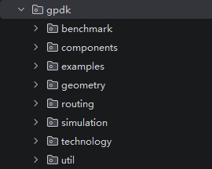

gpdk (generic PDK)
^^^^^^^^^^^^^^^^^^^^^^^^^^^^^^^^

**gpdk** is a package for creating parametric device layout units based on Python scripts in the PhotoCAD platform.

After creating a new project, you can find the complete contents of the gpdk package in the ``venv_xxx`` > ``Lib`` > ``site-packages`` > ``gpdk`` of your current project, which contains eight subfolders: ``benchmark``, ``components``, ``examples``, ``geometry``, ``routing``, ``simulation``, ``technology``, and ``util``.

.. toctree::

 technology
