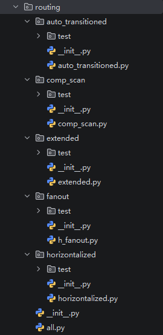
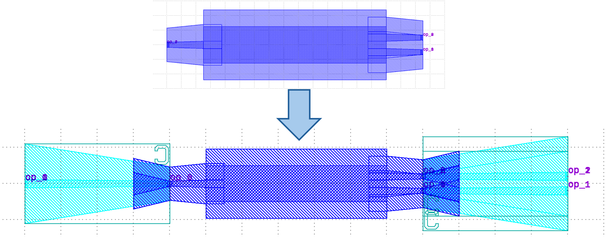
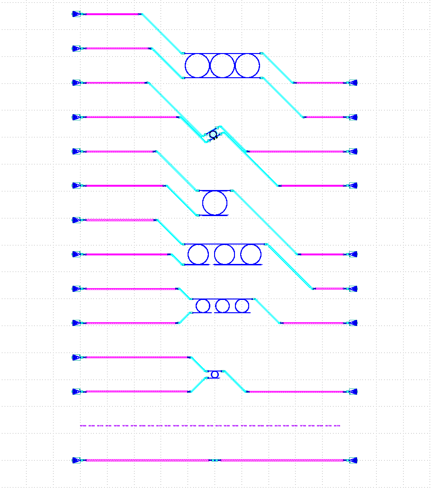
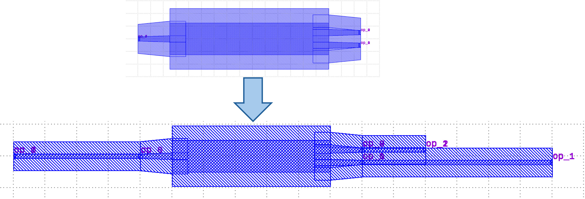
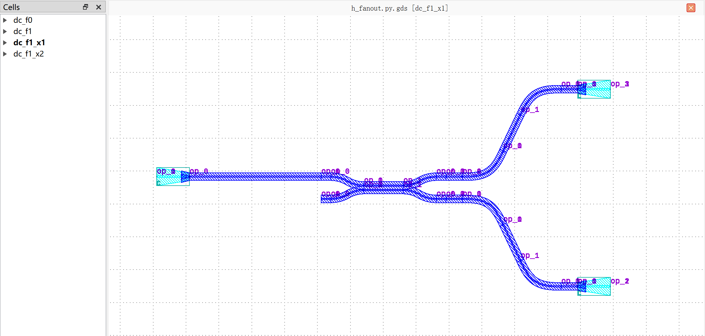
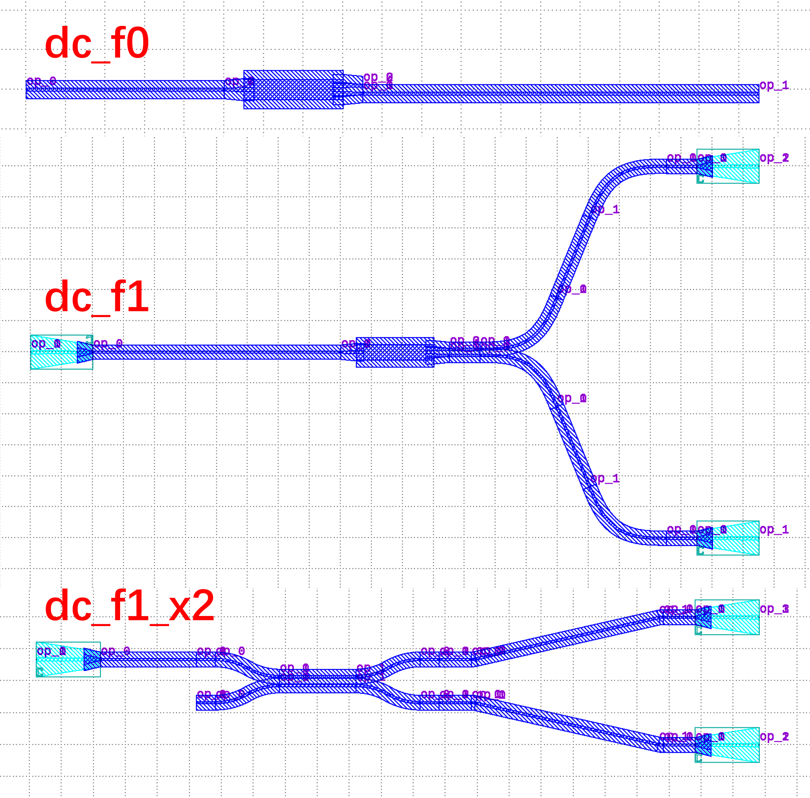
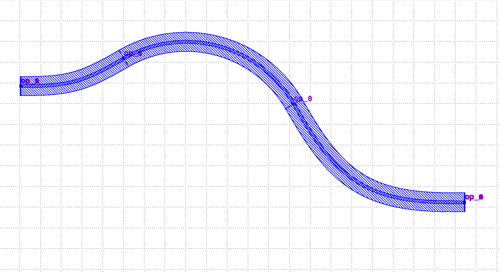

**Routing**: gpdk built-in routing method
============================================================

Default process
------------------------------------------

The ``routing`` subfolder in ``gpdk`` contains powerful circuit level design templates with the following features:

* ``auto_transitioned.py``: Automatic waveguide type transition function (:ref:`routing-at`)

* ``comp_scan.py``: Implement modular layout and routing features by batch processing function (:ref:`routing-cs`)

* ``extended.py``: Automatic port type recognition and extended port length function (:ref:`routing-extended`)
   
* ``h_fanout.py``: Extend layout space capabilities for downstream components function (:ref:`routing-hf`)
   
* ``horizontalized.py``: Port leveling function (:ref:`routing-hd`)

Users can run the python source code in the corresponding function’s folder and go to its local folder to see its results.



.. _routing-at:

AutoTransitioned
---------------------------------------------------

In the case that the device ports need to connect to different types of waveguides, ``AutoTransitioned`` can be used to  insert waveguide transitions between a device and its specified target waveguide types automatically.

The automatic port conversion is defined as follows:

.. code-block:: python

    class AutoTransitioned(fp.PCell):
        """
        Attributes:
            device: device whose ports need to be auto-transitioned
            waveguide_type: dict with port name as key, waveguide type as value, "*" means every other port

        Examples:
        ```python
        TECH = get_technology()
            device = AutoTransitioned(device=Mmi(waveguide_type=TECH.WG.FWG.C.WIRE), waveguide_types={"*": WG.SWG.C.WIRE})
        fp.plot(device)
        ```
        
        """

        device: fp.IDevice = fp.DeviceParam()
        waveguide_types: Mapping[str, fp.IWaveguideType] = fp.DictParam(K=str, V=fp.IWaveguideType)

        def build(self) -> Tuple[fp.InstanceSet, fp.ElementSet, fp.PortSet]:
            insts, elems, ports = super().build()
            TECH = get_technology()
            waveguide_types = self.waveguide_types
            joints: List[Tuple[fp.IOwnedTerminal, fp.IOwnedTerminal]] = []
            transition_ports: List[fp.IOwnedTerminal] = []
            for port in self.device.ports:
                if isinstance(port, fp.IOwnedPort) and not port.disabled:
                    start_type = port.waveguide_type
                    end_type = waveguide_types.get(port.name) or waveguide_types.get("*")
                    if end_type is not None and start_type != end_type:
                        transition, (port_in, port_out) = TECH.AUTO_TRANSITION.DEFAULT[start_type >> end_type]
                        joints.append(port <= transition[port_in])
                        port_name = port.name
                        transition_ports.append(transition[port_out].with_name(fp.Hidden(port_name) if port.hidden and port_name else port_name))

            used_port_names = set(port.name for port in transition_ports)
            unused_ports = [port for port in self.device.ports if not port.disabled and port.name not in used_port_names]
            device = fp.Connected(
                joints=joints,
                ports=transition_ports + unused_ports,
            )
            insts += device
            ports += device.ports

            return insts, elems, ports

In most cases, you only need to master its usage:

.. code-block:: python

    TECH = get_technology()
    library += AutoTransitioned(device=Mmi(waveguide_type=TECH.WG.FWG.C.WIRE), waveguide_types={"*": TECH.WG.SWG.C.WIRE})
    fp.export_gds(library, file=output_file)

Here, the parameter ``device`` is used to receive the components whose ports need to be automatically converted; ``waveguide_types`` receives the waveguide_types of the converted ports, where ``*: TECH.WG.SWG.C.WIRE`` is a key-value pair and ``*`` refers to all undefined ports.

The layouts of an MMI structure and its counterpart after automatic port conversion are shown below. For instructions on creating the MMI structure, refer to （:ref:`MMI <com_mmi>`）:



.. _routing-cs:

CompScan
-----------------------------------------------------

``comp_scan.py`` is used to automatically generate a component scanning and testing layout. It arranges multiple devices in parallel test lines and automatically connects the device ports to fiber couplers through straight waveguides, bends, and S-bends. It can also support repeated devices, alignment marks, titles, blank rows, different waveguide types, and customized bend factories.

The main structure of CompScan consists of the following components:

* :ref:`Block <Block>`: defines a device block to be placed in the scan layout. It supports position offset, repeated placement, and customized bend factories.

* :ref:`Alignment <Alignment>`: creates an alignment block with two ports having opposite orientations.

* :ref:`Title <Title>`: adds a text label to the layout.

* :ref:`Blank <Blank>`: inserts empty spacing between scan lines.

* :ref:`CompScan <CompScan>`: generates the complete scanning layout and performs automatic connections.

* :ref:`CompScanBuilder <CompScanBuilder>`: provides a convenient interface for constructing the list of blocks and generating a ``CompScan`` instance.

The typical ``Block`` module can be constructed as follows:

.. code-block:: python

    blocks = [
        Alignment(
            waveguide_type=TECH.WG.FWG.C.WIRE,
        ),
        Title(
            "TEST TITLE",
            layer=TECH.LAYER.LABEL_DRW,
        ),
        Block(get_ring_resonator_with_terminator(25)),
        Blank(left=0, right=1),
        Block(
            get_ring_resonator_with_terminator(50),
            repeat=3,
        ),
        Block(
            get_ring_resonator_with_terminator(75),
            repeat=3,
        ),
        Block(get_ring_resonator_with_terminator(90), bend_factories=bend_factories),
        Blank(left=0, right=1),
        Block(
            RingFilter(
                ring_radius=25,
                waveguide_type=TECH.WG.FWG.C.WIRE,
            ).rotated(degrees=30)
        ),
        Block(
            RingResonator(ring_radius=90, ring_type=TECH.WG.FWG.C.WIRE),
            repeat=3,
        ),
    ]

The functions called in the component section are defined as follows:

Define device adaptation, fiber coupling and several other classes
~~~~~~~~~~~~~~~~~~~~~~~~~~~~~~~~~~~~~~~~~~~~~~~~~~~~~~~~~~~~~~~~~~~~~~~~

.. code-block:: python

    class DeviceAdapter(Protocol):
        def __call__(self, device: fp.IDevice) -> fp.IDevice:
            ...

    class FiberCouplerFactory(Protocol):
        def __call__(self, at: fp.IRay, device: fp.IDevice) -> Tuple[fp.IDevice, str]:
            ...

    class BendWaveguideFactoryMapper(Protocol):
        def __call__(self, waveguide_type: fp.IWaveguideType) -> fp.IBendWaveguideFactory:
            ...

    class ConstFiberCouplerFactory(FiberCouplerFactory):
        def __init__(self, coupler: fp.IDevice, port: Optional[str]) -> None:
            self.coupler = coupler
            self.port = port

        def __call__(self, at: fp.IRay, device: fp.IDevice) -> Tuple[fp.IDevice, str]:
            coupler = self.coupler
            port = self.port or "op_0"
            return (coupler, port)

.. _Block:

Define Block
~~~~~~~~~~~~~~~~~~~~~~~~~~~~~~~~~~

.. code-block:: python

    class Block(fp.Model):
        content: fp.ICellRef
        offset: Tuple[float, float] = (0, 0)
        repeat: int = 1
        bend_factory: Optional[fp.IBendWaveguideFactory] = None
        bend_factories: Optional[BendWaveguideFactoryMapper] = None

        def __init__(
            self,
            content: fp.ICellRef,
            *,
            offset: Tuple[float, float] = (0, 0),
            repeat: int = 1,
            bend_factory: Optional[fp.IBendWaveguideFactory] = None,
            bend_factories: Optional[BendWaveguideFactoryMapper] = None,
        ) -> None:
            self.__model_init__(content=content, offset=offset, repeat=repeat, bend_factory=bend_factory, bend_factories=bend_factories)

.. _Alignment:

Define Alignment
~~~~~~~~~~~~~~~~~~~~~~~~~~~~~~~~~~

.. code-block:: python

    class Alignment(Block):
        def __init__(
            self,
            *,
            offset: Tuple[float, float] = (0, 0),
            waveguide_type: fp.IWaveguideType,
        ) -> None:
            self.__model_init__(
                content=fp.Device(
                    name="Alignment",
                    content=[],
                    ports=[
                        fp.Port(name="op_0", position=(0, 0), orientation=0, waveguide_type=waveguide_type),
                        fp.Port(name="op_1", position=(0, 0), orientation=math.pi, waveguide_type=waveguide_type),
                    ],
                ),
                offset=offset,
            )

.. _Title:

Define Title
~~~~~~~~~~~~~~~~~~~~~~~~~~~~~~~~~~

.. code-block:: python

    class Title(Block):
        gap: float = 20

        def __init__(
            self,
            content: str,
            *,
            gap: float = 20,
            font_size: float = 5,
            layer: fp.ILayer,
        ) -> None:
            self.__model_init__(
                content=fp.Device(
                    name="Title",
                    content=[
                        fp.el.Label(
                            content,
                            font_size=font_size,
                            layer=layer,
                        ),
                    ],
                    ports=[],
                ),
                gap=gap,
            )

.. _Blank:

Define Blank
~~~~~~~~~~~~~~~~~~~~~~~~~~~~~~~~~~

.. code-block:: python

    class Blank(Block):
        left: int = 1
        right: int = 1

        def __init__(
            self,
            *,
            left: int = 1,
            right: int = 1,
        ) -> None:
            self.__model_init__(
                content=fp.Device(name="Blank", content=[], ports=[]),
                left=left,
                right=right,
            )

Define method to get the port center
~~~~~~~~~~~~~~~~~~~~~~~~~~~~~~~~~~~~~~~~~~~~~~~~

.. code-block:: python

    def _get_ports_center_y(ports: Iterable[fp.IPort]):
        ys = tuple(p.position[1] for p in ports)
        return (min(ys) + max(ys)) / 2

Define methods for obtaining module content
~~~~~~~~~~~~~~~~~~~~~~~~~~~~~~~~~~~~~~~~~~~~~~~~

.. code-block:: python

    def _get_block_content(block: Block, left_y: float, right_y: float, spacing: float, device_adapter: DeviceAdapter):
        SHORT_STRAIGHT = 1
        ox, oy = block.offset

        device = block.content
        left_ports = util.ports.get_left_ports(device, reverse=True)
        right_ports = util.ports.get_right_ports(device, reverse=True)
        center_y = _get_ports_center_y(left_ports + right_ports)
        left_y2 = left_y + (len(left_ports) - 1) * spacing
        right_y2 = right_y + (len(right_ports) - 1) * spacing

        y = (min(left_y, right_y) + max(left_y2, right_y2)) / 2 - center_y

        if block.repeat > 1:
            prev = device
            joints: List[Tuple[fp.IOwnedTerminal, fp.IOwnedTerminal]] = []
            for _ in range(1, block.repeat):
                curr = prev.h_mirrored()  # device.h_mirrored() if i % 2 else device.translated(0, 0)
                right_ports = util.ports.get_right_ports(prev, reverse=True)
                left_ports = util.ports.get_left_ports(curr, reverse=True)
                for a, b in zip(right_ports, left_ports):
                    s = Straight(length=SHORT_STRAIGHT, waveguide_type=a.waveguide_type)
                    joints.append(a <= s["op_0"])
                    joints.append(s["op_1"] <= b)
                prev = curr

            left_ports = util.ports.get_left_ports(device, reverse=True)
            right_ports = list(util.ports.get_right_ports(prev, reverse=False))
            ports = [port.with_name(f"op_{i}") for i, port in enumerate(left_ports + right_ports)]
            distance = fp.distance_between(left_ports[0].position, right_ports[0].position)
            block_content = fp.Connected(joints=joints, ports=ports)
            tx, ty = -distance / 2 + ox, y + oy
        else:
            block_content = device
            tx, ty = 0 + ox, y + oy

        return device_adapter(device=block_content).translated(tx, ty)

.. _CompScan:

Define CompScan
~~~~~~~~~~~~~~~~~~~~~~~~~~~~~~~~~~

.. code-block:: python

    class CompScan(fp.PCell):
        """
        Attributes:
            max_lines: Optional, max lines, raise error if exceeded
            blocks: blocks of devices
            width: defaults to 2000, total width between grating couplers
            spacing: defaults to 127, spacing between lines
            bend_degrees: defaults to 45, central angle of generated bend
            bend_factory: Optional, will be used to generate all bends if provided
            bend_factories: Optional, providing `IBendWaveguideFactory` for each waveguide type
            waveguide_type: Optional, type of generated waveguide
            connection_type: Optional, type of generated connection straight
            device_connection_length: defaults to 20, minimum distance between device and sbend
            min_io_connection_length: defaults to 20, minimum distance between grating coupler and sbend
        Examples:
        ```python
        TECH = get_technology()
            # ...
        device = CompScan(spacing=255, width=2000, blocks=blocks)
        fp.plot(device)
        ```
        
        """

.. dropdown:: Show Complete Code

    .. code-block:: python

        class CompScan(fp.PCell):
            """
            Attributes:
                max_lines: Optional, max lines, raise error if exceeded
                blocks: blocks of devices
                width: defaults to 2000, total width between grating couplers
                spacing: defaults to 127, spacing between lines
                bend_degrees: defaults to 45, central angle of generated bend
                bend_factory: Optional, will be used to generate all bends if provided
                bend_factories: Optional, providing `IBendWaveguideFactory` for each waveguide type
                waveguide_type: Optional, type of generated waveguide
                connection_type: Optional, type of generated connection straight
                device_connection_length: defaults to 20, minimum distance between device and sbend
                min_io_connection_length: defaults to 20, minimum distance between grating coupler and sbend
            Examples:
            ```python
            TECH = get_technology()
                # ...
            device = CompScan(spacing=255, width=2000, blocks=blocks)
            fp.plot(device)
            ```
            
            """
            fiber_coupler_factory: FiberCouplerFactory = fp.Param(default=fp.USE_DEFAULT_FACTORY)
            fiber_coupler_adapter: Optional[fp.IDevice] = fp.DeviceParam(default=None)
            fiber_coupler_adapter_port: Optional[str] = fp.TextParam(default=None)
            fiber_coupler_v_mirrored: Sequence[bool] = fp.Param(default=(False, False))
            max_lines: Optional[int] = fp.PositiveIntParam(default=None)
            blocks: Sequence[Block] = fp.ListParam(element_type=Block)
            width: float = fp.PositiveFloatParam(default=2000)
            spacing: float = fp.PositiveFloatParam(default=127)
            bend_degrees: float = fp.DegreeParam(default=45)
            bend_factory: Optional[fp.IBendWaveguideFactory] = fp.Param(default=None)
            bend_factories: Optional[BendWaveguideFactoryMapper] = fp.Param(default=None)
            waveguide_type: Optional[fp.IWaveguideType] = fp.WaveguideTypeParam(default=None)
            connection_type: Optional[fp.IWaveguideType] = fp.WaveguideTypeParam(default=None)
            device_connection_length: float = fp.PositiveFloatParam(default=20)
            min_io_connection_length: float = fp.PositiveFloatParam(default=20)

            def _default_fiber_coupler_factory(self):
                if self.fiber_coupler_adapter is not None:
                    return ConstFiberCouplerFactory(self.fiber_coupler_adapter, self.fiber_coupler_adapter_port or "op_0")

                return None

            def __post_pcell_init__(self):
                assert len(self.fiber_coupler_v_mirrored) == 2, "`fiber_coupler_v_mirrored` must have its length equals to 2"

            def build(self) -> Tuple[fp.InstanceSet, fp.ElementSet, fp.PortSet]:
                insts, elems, ports = super().build()
                TECH = get_technology()
                fiber_coupler_factory = self.fiber_coupler_factory
                left_v_mirrored, right_v_mirrored = self.fiber_coupler_v_mirrored
                max_lines = self.max_lines
                blocks = self.blocks
                width = self.width
                spacing = self.spacing
                bend_degrees = self.bend_degrees
                default_bend_factory = self.bend_factory
                default_bend_factories = self.bend_factories
                waveguide_type = self.waveguide_type
                connection_type = self.connection_type
                device_connection_length = self.device_connection_length
                min_io_connection_length = self.min_io_connection_length

                SHORT_STRAIGHT = 0.1
                content: List[fp.ICellRef] = []
                left_x = -width / 2
                right_x = width / 2
                left_y: float = 0
                right_y: float = 0
                links: List[
                    Tuple[
                        Tuple[fp.IOwnedPort, fp.IOwnedPort], str, Optional[fp.IBendWaveguideFactory], Optional[BendWaveguideFactoryMapper]
                    ]
                ] = []
                total_lines = 0

                if connection_type is None:
                    connection_type = waveguide_type
                for block in blocks:
                    assert isinstance(block, Block)
                    y = max(left_y, right_y)
                    if isinstance(block, Title):
                        label: Any = block.content.cell.content[0]
                        distance, _ = label.size
                        count = int(width / (distance + block.gap))
                        labels: List[fp.IElement] = []
                        for i in range(count):
                            labels.append(label.translated(-width / 2 + i * (distance + block.gap), y))
                        content.append(fp.Device(name="Title", content=labels, ports=[]))
                        left_y = y + spacing
                        right_y = y + spacing
                        continue
                    if isinstance(block, Blank):
                        left_y += block.left * spacing
                        right_y += block.right * spacing
                        continue
                    block_bend_factory = block.bend_factory
                    block_bend_factories = block.bend_factories
                    bend_factory = block_bend_factory or default_bend_factory
                    bend_factories = block_bend_factories or default_bend_factories

                    device_adapter = cast(DeviceAdapter, partial(Extended, waveguide_type=waveguide_type, lengths={"*": device_connection_length}))
                    instance = _get_block_content(block, left_y, right_y, spacing, device_adapter)
                    content.append(instance)
                    left_ports = util.ports.get_left_ports(instance, reverse=True)
                    right_ports = util.ports.get_right_ports(instance, reverse=True)
                    for left_port in left_ports:
                        left_gc_at = fp.Waypoint(left_x, left_y, 180)
                        left_gc, left_gc_port = fiber_coupler_factory(at=left_gc_at, device=instance)
                        if left_v_mirrored:
                            left_gc = left_gc.v_mirrored()
                        left_gc_instance = left_gc if waveguide_type is None else AutoTransitioned(device=left_gc, waveguide_types={"*": waveguide_type})
                        left_gc_transition_length = fp.distance_between(left_gc[left_gc_port].position, left_gc_instance[left_gc_port].position)
                        left_gc_instance = fp.place(left_gc_instance, left_gc_port, at=left_gc_at.advanced(-left_gc_transition_length))
                        content.append(left_gc_instance)
                        left_y += spacing
                        turning_angle = fp.normalize_turning(math.pi - left_port.orientation)
                        if fp.is_nonzero(turning_angle):
                            left_port = util.links.bend(
                                TECH,
                                content,
                                start=left_port,
                                radians=turning_angle,
                                bend_factory=bend_factory or (bend_factories(left_port.waveguide_type) if bend_factories else None),
                            )
                            left_port = util.links.straight(TECH, content, start=left_port, length=SHORT_STRAIGHT)
                        links.append((left_port <= cast(fp.IOwnedPort, left_gc_instance[left_gc_port]), "left", bend_factory, bend_factories))

                    for right_port in right_ports:
                        right_gc_at = fp.Waypoint(right_x, right_y, 0)
                        right_gc, right_gc_port = fiber_coupler_factory(at=right_gc_at, device=instance)
                        if right_v_mirrored:
                            right_gc = right_gc.v_mirrored()
                        right_gc_instance = right_gc if waveguide_type is None else AutoTransitioned(device=right_gc, waveguide_types={"*": waveguide_type})
                        right_gc_transition_length = fp.distance_between(right_gc[right_gc_port].position, right_gc_instance[right_gc_port].position)
                        right_gc_instance = fp.place(right_gc_instance, right_gc_port, at=right_gc_at.advanced(-right_gc_transition_length))

                        content.append(right_gc_instance)
                        right_y += spacing
                        turning_angle = fp.normalize_turning(0 - right_port.orientation)
                        if fp.is_nonzero(turning_angle):
                            right_port = util.links.bend(
                                TECH,
                                content,
                                start=right_port,
                                radians=turning_angle,
                                bend_factory=bend_factory or (bend_factories(right_port.waveguide_type) if bend_factories else None),
                            )
                            right_port = util.links.straight(TECH, content, start=right_port, length=SHORT_STRAIGHT)
                        links.append((right_port <= cast(fp.IOwnedPort, right_gc_instance[right_gc_port]), "right", bend_factory, bend_factories))
                    total_lines += max(len(left_ports), len(right_ports))

                if max_lines is not None:
                    assert total_lines <= max_lines, f"exceed max lines: {max_lines}, got: {total_lines}"

                for (dev, gc), p, bend_factory, bend_factories in links:
                    if p == "left":
                        x0, y0 = gc.position
                        x1, y1 = dev.position
                    else:
                        x0, y0 = dev.position
                        x1, y1 = gc.position

                    length = x1 - x0
                    height = y1 - y0

                    end_type = waveguide_type
                    if fp.is_nonzero(height):
                        sbend_type = waveguide_type or dev.waveguide_type
                        sbend = SBend(
                            height=height,
                            bend_degrees=bend_degrees,
                            max_distance=length - min_io_connection_length,
                            waveguide_type=sbend_type,
                            bend_factory=bend_factory or (bend_factories(sbend_type) if bend_factories else None) or sbend_type.bend_factory,
                        )
                        sbend_distance = abs(sbend["op_1"].position[0] - sbend["op_0"].position[0])
                        sbend = fp.place(sbend, ("op_1" if p == "left" else "op_0"), at=dev.position)
                        content.append(sbend)
                        length -= sbend_distance
                        end_type = sbend_type

                    util.links.straight(TECH, content, start=gc, length=length, straight_type=connection_type, end_type=end_type)

                insts += content
                return insts, elems, ports

.. _CompScanBuilder:

Define CompScanBuilder
~~~~~~~~~~~~~~~~~~~~~~~~~~~~~~~~~~

.. code-block:: python

    class CompScanBuilder:
        blocks: List[Block]

        def __init__(
            ...

        def build(self, transform: fp.Affine2D = fp.Affine2D.identity()):
            ...

        def add_block(
            ...

        def add_alignment(self, *, offset: Tuple[float, float] = (0, 0), waveguide_type: Optional[fp.IWaveguideType] = None):
            ...

        def add_title(self, content: str, *, gap: float = 20, font_size: float = 5, layer: fp.ILayer):
            ...

        def add_blank(self, left: int = 1, right: int = 1):
            ...

.. dropdown:: Show Complete Code

    .. code-block:: python

        class CompScanBuilder:
            blocks: List[Block]

            def __init__(
                self,
                *,
                name: Optional[str] = None,
                fiber_coupler_factory: Optional[FiberCouplerFactory] = None,
                fiber_coupler_adapter: Optional[fp.IDevice] = None,
                fiber_coupler_v_mirrored: Sequence[bool] = (False, False),
                max_lines: Optional[int] = None,
                width: float = 2000,
                spacing: float = 127,
                waveguide_type: Optional[fp.IWaveguideType] = None,
                bend_degrees: Optional[float] = None,
                connection_type: Optional[fp.IWaveguideType] = None,
                device_connection_length: float = 20,
                min_io_connection_length: float = 20,
                bend_factory: Optional[fp.IBendWaveguideFactory] = None,
                bend_factories: Optional[BendWaveguideFactoryMapper] = None,
            ) -> None:
                self.name = name
                self.fiber_coupler_factory = fiber_coupler_factory
                self.fiber_coupler_adapter = fiber_coupler_adapter
                self.fiber_coupler_v_mirrored = fiber_coupler_v_mirrored
                self.max_lines = max_lines
                self.width = width
                self.spacing = spacing
                self.waveguide_type = waveguide_type
                self.bend_degrees = bend_degrees
                self.connection_type = connection_type
                self.device_connection_length = device_connection_length
                self.min_io_connection_length = min_io_connection_length
                self.bend_factory = bend_factory
                self.bend_factories = bend_factories
                self.blocks = []

            def build(self, transform: fp.Affine2D = fp.Affine2D.identity()):
                params = dict(
                    name=self.name or "",
                    fiber_coupler_factory=self.fiber_coupler_factory,
                    fiber_coupler_adapter=self.fiber_coupler_adapter,
                    fiber_coupler_v_mirrored=self.fiber_coupler_v_mirrored,
                    max_lines=self.max_lines,
                    blocks=self.blocks,
                    width=self.width,
                    spacing=self.spacing,
                    waveguide_type=self.waveguide_type,
                    connection_type=self.connection_type,
                    device_connection_length=self.device_connection_length,
                    min_io_connection_length=self.min_io_connection_length,
                    bend_factory=self.bend_factory,
                    bend_factories=self.bend_factories,
                    transform=transform,
                )
                for key, value in list(params.items()):
                    if value is None:
                        del params[key]
                return CompScan(**params)  # type: ignore

            def add_block(
                self,
                content: fp.IDevice,
                *,
                offset: Tuple[float, float] = (0, 0),
                repeat: int = 1,
                bend_factory: Optional[fp.IBendWaveguideFactory] = None,
                bend_factories: Optional[BendWaveguideFactoryMapper] = None,
            ):
                self.blocks.append(Block(content, offset=offset, repeat=repeat, bend_factory=bend_factory, bend_factories=bend_factories))

            def add_alignment(self, *, offset: Tuple[float, float] = (0, 0), waveguide_type: Optional[fp.IWaveguideType] = None):
                waveguide_type = waveguide_type or self.waveguide_type
                assert waveguide_type is not None, "waveguide_type must be supplied"
                self.blocks.append(Alignment(offset=offset, waveguide_type=waveguide_type))

            def add_title(self, content: str, *, gap: float = 20, font_size: float = 5, layer: fp.ILayer):
                self.blocks.append(Title(content, gap=gap, font_size=font_size, layer=layer))

            def add_blank(self, left: int = 1, right: int = 1):
                self.blocks.append(Blank(left=left, right=right))

Browse the script will find that in addition to the ``CompScan`` class also defines the ``CompScanBuilder`` class. ``CompScan`` defines the steps and parameters of graphics generation in detail , the code is intuitive and readable; ``CompScanBuilder`` defines the part of the graphics generation can be summarized and extracted, thus the code is more concise.

Create the component and export the layout
~~~~~~~~~~~~~~~~~~~~~~~~~~~~~~~~~~~~~~~~~~~~~~~~~~~~~~~~~~~~~~~~~~~~

Call the ``comp_scan`` method to perform automatic placement and routing:

.. code-block:: python

        library += CompScan(name="comp_scan", spacing=255, width=2000, blocks=blocks, fiber_coupler_factory=term_factory)
        library += CompScan(name="comp_scan", spacing=255, width=2000, blocks=blocks, fiber_coupler_adapter=Fixed_Terminator_TE_1550())
        library += CompScan(name="comp_scan", spacing=255, width=2000, blocks=blocks, bend_factories=bend_factories, fiber_coupler_factory=gc_factory)
        library += CompScan(
            name="comp_scan",
            spacing=255,
            width=2000,
            blocks=blocks,
            bend_factories=bend_factories,
            waveguide_type=TECH.WG.SWG.C.EXPANDED,
            bend_factory=TECH.WG.SWG.C.WIRE.bend_factory,
            connection_type=TECH.WG.MWG.C.WIRE,
            fiber_coupler_factory=gc_factory,
        )

.. dropdown:: Show Complete Code

    .. code-block:: python

        if __name__ == "__main__":
            TECH = get_technology()
            output_file = TECH.OUTPUT.local_output_file(__file__)
            library = fp.Library()
            # =============================================================
            from gpdk.components.fixed_terminator_te_1550.fixed_terminator_te_1550 import Fixed_Terminator_TE_1550
            from gpdk.components.ring_filter.ring_filter import RingFilter
            from gpdk.components.ring_resonator.ring_resonator import RingResonator
            from gpdk.routing.extended.extended import Extended
            from gpdk.technology.wg.factory import EulerBendFactory
            from gpdk.components.grating_coupler.grating_coupler import GratingCoupler

            def gc_factory(at: fp.IRay, device: fp.IDevice):
                gc = GratingCoupler()  # type: ignore
                return gc, "op_0"

            def bend_factories(waveguide_type: fp.IWaveguideType):
                if waveguide_type == TECH.WG.FWG.C.WIRE:
                    return EulerBendFactory(radius_min=35, l_max=35, waveguide_type=waveguide_type)
                elif waveguide_type == TECH.WG.SWG.C.EXPANDED:
                    return EulerBendFactory(radius_min=55, l_max=35, waveguide_type=waveguide_type)
                elif waveguide_type == TECH.WG.SWG.C.WIRE:
                    return EulerBendFactory(radius_min=45, l_max=35, waveguide_type=waveguide_type)
                return waveguide_type.bend_factory

            def get_ring_resonator_with_terminator(ring_radius: float):
                terminator = Fixed_Terminator_TE_1550(waveguide_type=TECH.WG.FWG.C.WIRE)
                ring_resonator = RingResonator(ring_radius=ring_radius, ring_type=TECH.WG.FWG.C.WIRE)
                return Extended(
                    device=fp.Connected(
                        joints=[ring_resonator["op_2"] <= terminator["op_0"]], ports=[ring_resonator["op_0"], ring_resonator["op_1"], ring_resonator["op_3"]]
                    ),
                    lengths={"*": 20},
                )

            blocks = [
                Alignment(
                    waveguide_type=TECH.WG.FWG.C.WIRE,
                ),
                Title(
                    "TEST TITLE",
                    layer=TECH.LAYER.LABEL_DRW,
                ),
                Block(get_ring_resonator_with_terminator(25)),
                Blank(left=0, right=1),
                Block(
                    get_ring_resonator_with_terminator(50),
                    repeat=3,
                ),
                Block(
                    get_ring_resonator_with_terminator(75),
                    repeat=3,
                ),
                Block(get_ring_resonator_with_terminator(90), bend_factories=bend_factories),
                Blank(left=0, right=1),
                Block(
                    RingFilter(
                        ring_radius=25,
                        waveguide_type=TECH.WG.FWG.C.WIRE,
                    ).rotated(degrees=30)
                ),
                Block(
                    RingResonator(ring_radius=90, ring_type=TECH.WG.FWG.C.WIRE),
                    repeat=3,
                ),
            ]

            def term_factory(at: fp.IRay, device: fp.IDevice):
                from gpdk.components.fixed_terminator_te_1550.fixed_terminator_te_1550 import Fixed_Terminator_TE_1550

                instance = Fixed_Terminator_TE_1550().h_mirrored()  # type: ignore
                return instance, "op_0"

            library += CompScan(name="comp_scan", spacing=255, width=2000, blocks=blocks, fiber_coupler_factory=term_factory)
            library += CompScan(name="comp_scan", spacing=255, width=2000, blocks=blocks, fiber_coupler_adapter=Fixed_Terminator_TE_1550())
            library += CompScan(name="comp_scan", spacing=255, width=2000, blocks=blocks, bend_factories=bend_factories, fiber_coupler_factory=gc_factory)
            library += CompScan(
                name="comp_scan",
                spacing=255,
                width=2000,
                blocks=blocks,
                bend_factories=bend_factories,
                waveguide_type=TECH.WG.SWG.C.EXPANDED,
                bend_factory=TECH.WG.SWG.C.WIRE.bend_factory,
                connection_type=TECH.WG.MWG.C.WIRE,
                fiber_coupler_factory=gc_factory,
            )

            # =============================================================
            fp.export_gds(library, file=output_file)
            # fp.plot(library)

The first function ``get_ring_resonator_with_terminator`` defines the ring resonator cavity to be placed in the middle.

Then 10 modules are called through ``blocks``, in the order of script definition:

#. waveguide connection
#. text label
#. 1 ring resonator cavity (radius 25)
#. right GC (blank in the right)
#. 3 ring resonator cavity (radius 50)
#. 3 ring resonator cavity (radius 75)
#. 1 ring resonator cavity (radius 90)
#. right GC (blank in the right)
#. 1 ring filter (radius 25)
#. 3 ring resonator cavity (radius 90)

The 10 modules will be placed in the layout from the bottom up. And the resulting GDS layout is shown in the figure below.



Open the generated ``comp_scan.py.gds`` file. You can see that there are several lines of ``GratingCoupler`` placed in the layout with equal spacing from bottom to top.

Line 2, ``Title``, is a text label without any ports for connection, so there is no GratingCoupler and waveguide for connection on the left and right sides.

Lines 4, 8, 13 and 14 are defined according to the script, and there is no ``GratingCoupler`` and waveguide on the right side.

The middle section contains the called modules arranged from bottom to top, and is connected to the left and right ``GratingCoupler`` by straight waveguides and bends.

.. _routing-extended:

Extended
-----------------------------------------------------

The ``Extended`` class is used to extend the ports of an existing device by adding straight waveguides. It allows different ports to be extended by different lengths, or allows the same extension length to be applied to all ports. When a ``waveguide_type`` is specified, ``Extended`` automatically inserts an ``AutoTransitioned`` structure between the original device and the extension waveguide.

The main parameters of ``Extended`` are:

    * ``device``: the device whose ports need to be extended.

    * ``lengths``: a mapping between port names and extension lengths. "*" can be used to specify a default length for all ports.

    * ``waveguide_type``: the waveguide type used for the generated extension waveguides.

    * ``AutoTransitioned``: automatically handles the transition between the device waveguide types and the specified extension waveguide type.

    * ``Straight``: generates the straight waveguide used to extend each port.

.. code-block:: python

    class Extended(fp.PCell):
        """
        Attributes:
            device: device whose ports need to be extended
            lengths: dict with port name as key, length as value, "*" means every other port
            waveguide_type: type of generated waveguide

        Examples:
        ```python
        TECH = get_technology()
            device = Extended(device=Mmi(waveguide_type=TECH.WG.FWG.C.WIRE), lengths={"*": 10, "op_0": 20, "op_1": 30})
        fp.plot(device)
        ```
        
        """

        device: fp.IDevice = fp.DeviceParam()
        lengths: Mapping[str, float] = fp.DictParam(K=str, V=Number)
        waveguide_type: Optional[fp.IWaveguideType] = fp.WaveguideTypeParam(default=None)

        def build(self) -> Tuple[fp.InstanceSet, fp.ElementSet, fp.PortSet]:
            insts, elems, ports = super().build()
            device = self.device
            lengths = self.lengths
            waveguide_type = self.waveguide_type
            instance = device if waveguide_type is None else AutoTransitioned(device=device, waveguide_types={key: waveguide_type for key in lengths})

            joints: List[Tuple[fp.IOwnedTerminal, fp.IOwnedTerminal]] = []
            straight_ports: List[fp.IOwnedTerminal] = []
            for port in instance.ports:
                if isinstance(port, fp.IOwnedPort) and not port.disabled:
                    length = lengths.get(port.name) or lengths.get("*")
                    if length is not None:
                        if waveguide_type is not None:
                            length -= fp.distance_between(device[port.name].position, instance[port.name].position)
                        assert length > 0 or fp.is_zero(length), f"extend length of {port.name} is too short"
                        if fp.is_positive(length):
                            s = Straight(length=length, waveguide_type=port.waveguide_type)
                            joints.append(port <= s["op_0"])
                            port_name = port.name
                            straight_ports.append(s["op_1"].with_name(fp.Hidden(port_name) if port.hidden else port_name))

            used_port_names = set(port.name for port in straight_ports)
            unused_ports = [port for port in instance.ports if port.name not in used_port_names]
            connected = fp.Connected(
                joints=joints,
                ports=straight_ports + unused_ports,
            )
            insts += connected
            ports += connected.ports
            return insts, elems, ports

When an automatic transition is present, its occupied distance is subtracted from the requested extension length. Therefore, if the remaining length is zero, no additional Straight is generated; if it is negative, the requested extension is considered too short and an error is raised.

This method requires you to define the device and the extension length for each port. You may also specify the type of waveguide to generate.

.. code-block:: python

    if __name__ == "__main__":
        TECH = get_technology()
        output_file = TECH.OUTPUT.local_output_file(__file__)
        library = fp.Library()
        # =============================================================
        from gpdk.components.mmi.mmi import Mmi
        from gpdk.components.ring_resonator.ring_resonator import RingResonator

        library += Extended(device=Mmi(waveguide_type=TECH.WG.FWG.C.WIRE), lengths={"*": 10, "op_0": 20, "op_1": 30})
        library += Extended(
            device=RingResonator(
                ring_radius=10, bottom_spacing=0.1, top_spacing=0.1, ring_type=TECH.WG.FWG.C.WIRE, bottom_type=TECH.WG.FWG.C.WIRE, top_type=TECH.WG.FWG.C.WIRE
            ),
            lengths={"op_0": 1, "op_1": 1, "op_2": 1, "op_3": 1},
        )
        # =============================================================
        fp.export_gds(library, file=output_file)
        # fp.plot(library)

The layouts of the MMI structure and its counterpart after port extension are presented below. Refer to (:ref:`MMI <com_mmi>`) for MMI structure creation.



.. _routing-hf:

HFanout
-----------------------------------------------------

In photonic circuit layout design, there are often scenarios where space needs to be expanded for downstream device placement and connection. For example, ``DirectionalCoupler`` is often used for optical signal distribution, where the optical signal is passed through the waveguide to the downstream devices.

``HFanout`` is a tool to expand the layout space for downstream devices, enabling the design of optical signals to be assigned to downstream device layouts via ``DirectionalCoupler``. It is mainly used when the port spacing of a device needs to be increased or when the device ports need to be converted to another waveguide type while being fanned out.

The main parameters of ``HFanout`` are:

    * ``device``: the device whose ports need to be fanned out.

    * ``left_spacing``/``right_spacing``: the spacing between the generated ports on the left and right sides.

    * ``left_distance``/``right_distance``: the routing distance from the device to the generated ports.

    * ``device_left_ports``/``device_right_ports``: specify which device ports are used for left and right fanout.

    * ``left_waveguide_type``/``right_waveguide_type``: specify the waveguide types of the left and right fanout structures.

    * ``bend_factories``: specifies the bend factory used to generate the S-bends.

    * ``bend_degrees``: the bending angle of the S-bend, with a default value of 30 degrees.

    * ``connect_length``: the length of the straight waveguide sections before and after the S-Bend, with a default value of 10.

The core part of the class definition is:

.. code-block:: python

    class HFanout(fp.PCell):

        device: fp.IDevice = fp.DeviceParam()
        left_spacing: float = fp.PositiveFloatParam()
        right_spacing: float = fp.PositiveFloatParam()
        bend_degrees: float = fp.DegreeParam(default=30, min=0, max=90, invalid=[0])
        bend_factories: Optional[BendWaveguideFactoryMapper] = fp.CallableParam(default=None)
        device_left_ports: Optional[Sequence[str]] = fp.NameListParam(default=None, doc="device left ports from top to bottom")
        device_right_ports: Optional[Sequence[str]] = fp.NameListParam(default=None, doc="device right ports from bottom to top")
        left_distance: Optional[float] = fp.NonNegFloatParam(min=0, default=None)
        right_distance: Optional[float] = fp.NonNegFloatParam(min=0, default=None)
        left_ports: Optional[fp.IPortOptions] = fp.PortOptionsParam(default=None)
        right_ports: Optional[fp.IPortOptions] = fp.PortOptionsParam(default=None)
        left_waveguide_type: Optional[fp.IWaveguideType] = fp.WaveguideTypeParam(default=None)
        right_waveguide_type: Optional[fp.IWaveguideType] = fp.WaveguideTypeParam(default=None)
        connect_length: float = fp.PositiveFloatParam(default=10)

For each pair of ports, ``HFanout`` creates two straight waveguide sections and an ``SBendPair``:

.. code-block:: python

                lconnect_top1 = Straight(
                    name="lctop1",
                    length=connect_length,
                    waveguide_type=ltop_port.waveguide_type,
                )
                lconnect_top2 = Straight(
                    name="lctop2",
                    length=connect_length,
                    waveguide_type=ltop_port.waveguide_type,
                )
                lconnect_bottom1 = Straight(
                    name="lcbottom1",
                    length=connect_length,
                    waveguide_type=lbottom_port.waveguide_type,
                )
                lconnect_bottom2 = Straight(
                    name="lcbottom2",
                    length=connect_length,
                    waveguide_type=lbottom_port.waveguide_type,
                )
                ltop_sbend, lbottom_sbend = SBendPair(
                    top_distance=ltop_distance,
                    bottom_distance=lbottom_distance,
                    left_spacing=left_spacing * (left_count - i * 2 - 1),
                    right_spacing=fp.distance_between(ltop_port.position, lbottom_port.position),
                    bend_degrees=bend_degrees,
                    top_type=ltop_port.waveguide_type,
                    bottom_type=lbottom_port.waveguide_type,
                    top_bend_factory=bend_factories(ltop_port.waveguide_type) if bend_factories else None,
                    bottom_bend_factory=bend_factories(lbottom_port.waveguide_type) if bend_factories else None,
                )

.. dropdown:: Show the complete ``HFanout`` definition

    .. code-block:: python

        class HFanout(fp.PCell):
            """
            Attributes:
                device: device whose ports need fanout
                left_spacing: spacing between left ports
                right_spacing: spacing between right ports
                bend_degrees: defaults to 30 degrees
                bend_factories: a callable which receives an `IWaveguideType` and returns an `IBendWaveguideFactory`
                device_left_ports: Optional, device left ports from top to bottom
                device_right_ports: Optional, device right ports from bottom to top
                left_distance: Optional
                right_distance: Optional
                left_ports: Optional, port options for left ports
                right_ports: Optional, port options for right ports
                left_waveguide_type: Optional, type of left waveguide
                right_waveguide_type: Optional, type of right waveguide
                connect_length: defaults to 10, distance between generated port and sbend

            Examples:
            ```python
            from gpdk.technology.bend_factory import EulerBendFactory

            def bend_factories(waveguide_type: fp.IWaveguideType):
                if waveguide_type == TECH.WG.FWG.C.WIRE:
                    return EulerBendFactory(radius_min=15, l_max=15, waveguide_type=waveguide_type)
                return waveguide_type.bend_factory

            device = HFanout(device=Mmi(waveguide_type=TECH.WG.FWG.C.WIRE), left_spacing=120, right_spacing=120, left_distance=100, right_distance=100,
                        bend_factories=bend_factories, left_waveguide_type=TECH.WG.SWG.C.WIRE, right_waveguide_type=TECH.WG.SWG.C.WIRE)
            fp.plot(device)
            ```
            
            """

            device: fp.IDevice = fp.DeviceParam()
            left_spacing: float = fp.PositiveFloatParam()
            right_spacing: float = fp.PositiveFloatParam()
            bend_degrees: float = fp.DegreeParam(default=30, min=0, max=90, invalid=[0])
            bend_factories: Optional[BendWaveguideFactoryMapper] = fp.CallableParam(default=None)
            device_left_ports: Optional[Sequence[str]] = fp.NameListParam(default=None, doc="device left ports from top to bottom")
            device_right_ports: Optional[Sequence[str]] = fp.NameListParam(default=None, doc="device right ports from bottom to top")
            left_distance: Optional[float] = fp.NonNegFloatParam(min=0, default=None)
            right_distance: Optional[float] = fp.NonNegFloatParam(min=0, default=None)
            left_ports: Optional[fp.IPortOptions] = fp.PortOptionsParam(default=None)
            right_ports: Optional[fp.IPortOptions] = fp.PortOptionsParam(default=None)
            left_waveguide_type: Optional[fp.IWaveguideType] = fp.WaveguideTypeParam(default=None)
            right_waveguide_type: Optional[fp.IWaveguideType] = fp.WaveguideTypeParam(default=None)
            connect_length: float = fp.PositiveFloatParam(default=10)

            def build(self) -> Tuple[fp.InstanceSet, fp.ElementSet, fp.PortSet]:
                insts, elems, ports = super().build()
                TECH = get_technology()

                device = self.device
                left_spacing = self.left_spacing
                right_spacing = self.right_spacing
                bend_degrees = self.bend_degrees
                bend_factories = self.bend_factories
                device_left_ports = self.device_left_ports
                device_right_ports = self.device_right_ports
                left_distance = self.left_distance
                right_distance = self.right_distance
                left_ports = self.left_ports
                right_ports = self.right_ports
                left_waveguide_type = self.left_waveguide_type
                right_waveguide_type = self.right_waveguide_type
                connect_length = self.connect_length
                if device_left_ports is None:
                    device_left_ports = [port.name for port in util.ports.get_left_ports(device)]
                device_left_ports = list(device_left_ports)
                if device_right_ports is None:
                    device_right_ports = [port.name for port in util.ports.get_right_ports(device, reverse=True)]
                device_right_ports = list(device_right_ports)
                left_ports = left_ports or device_left_ports
                right_ports = right_ports or device_right_ports

                result_left_ports: List[fp.IOwnedTerminal] = []
                left_joints: List[Tuple[fp.IOwnedTerminal, fp.IOwnedTerminal]] = []

                left_count = len(device_left_ports)
                if len(left_ports) != left_count:
                    raise AssertionError("len(left_ports) must be equal to len(device_left_ports)")

                for i in range(left_count // 2):
                    device_ltop_port = cast(fp.IOwnedPort, device[device_left_ports[i]])
                    ltop_port = device_ltop_port

                    device_lbottom_port = cast(fp.IOwnedPort, device[device_left_ports[left_count - i - 1]])
                    lbottom_port = device_lbottom_port

                    ltop_distance = left_distance
                    lbottom_distance = left_distance

                    if ltop_distance:
                        ltop_distance -= connect_length * 2
                    if lbottom_distance:
                        lbottom_distance -= connect_length * 2

                    ltop_transition = None
                    lbottom_transition = None
                    if left_waveguide_type:
                        if ltop_port.waveguide_type != left_waveguide_type:
                            if not ltop_distance:
                                raise AssertionError("left_distance is required for auto transition")
                            ltop_transition, (port_in, port_out) = TECH.AUTO_TRANSITION.DEFAULT[ltop_port.waveguide_type >> left_waveguide_type]
                            ltop_distance -= fp.distance_between(ltop_transition[port_in].position, ltop_transition[port_out].position)

                        if lbottom_port.waveguide_type != left_waveguide_type:
                            if not lbottom_distance:
                                raise AssertionError("left_distance is required for auto transition")
                            lbottom_transition, (port_in, port_out) = TECH.AUTO_TRANSITION.DEFAULT[lbottom_port.waveguide_type >> left_waveguide_type]
                            lbottom_distance -= fp.distance_between(lbottom_transition[port_in].position, lbottom_transition[port_out].position)
                    lconnect_top1 = Straight(
                        name="lctop1",
                        length=connect_length,
                        waveguide_type=ltop_port.waveguide_type,
                    )
                    lconnect_top2 = Straight(
                        name="lctop2",
                        length=connect_length,
                        waveguide_type=ltop_port.waveguide_type,
                    )
                    lconnect_bottom1 = Straight(
                        name="lcbottom1",
                        length=connect_length,
                        waveguide_type=lbottom_port.waveguide_type,
                    )
                    lconnect_bottom2 = Straight(
                        name="lcbottom2",
                        length=connect_length,
                        waveguide_type=lbottom_port.waveguide_type,
                    )
                    ltop_sbend, lbottom_sbend = SBendPair(
                        top_distance=ltop_distance,
                        bottom_distance=lbottom_distance,
                        left_spacing=left_spacing * (left_count - i * 2 - 1),
                        right_spacing=fp.distance_between(ltop_port.position, lbottom_port.position),
                        bend_degrees=bend_degrees,
                        top_type=ltop_port.waveguide_type,
                        bottom_type=lbottom_port.waveguide_type,
                        top_bend_factory=bend_factories(ltop_port.waveguide_type) if bend_factories else None,
                        bottom_bend_factory=bend_factories(lbottom_port.waveguide_type) if bend_factories else None,
                    )
                    left_joints.append(ltop_port <= lconnect_top1["op_1"])
                    left_joints.append(lconnect_top1["op_0"] <= ltop_sbend["op_1"])
                    left_joints.append(ltop_sbend["op_0"] <= lconnect_top2["op_1"])
                    ltop_port = lconnect_top2["op_0"]
                    left_joints.append(lbottom_port <= lconnect_bottom1["op_1"])
                    left_joints.append(lconnect_bottom1["op_0"] <= lbottom_sbend["op_1"])
                    left_joints.append(lbottom_sbend["op_0"] <= lconnect_bottom2["op_1"])
                    lbottom_port = lconnect_bottom2["op_0"]

                    if ltop_transition:
                        left_joints.append(ltop_port <= ltop_transition["op_0"])
                        ltop_port = ltop_transition["op_1"]
                    if lbottom_transition:
                        left_joints.append(lbottom_port <= lbottom_transition["op_0"])
                        lbottom_port = lbottom_transition["op_1"]

                    result_left_ports.insert(0, ltop_port)
                    result_left_ports.append(lbottom_port)

                    if not left_distance:
                        left_distance = abs(ltop_port.position[0] - device_ltop_port.position[0])

                if left_distance and left_count % 2:
                    lindex = left_count // 2
                    lmiddle_port = cast(fp.IOwnedPort, device[device_left_ports[lindex]])

                    lmiddle_distance = left_distance
                    lmiddle_transition = None
                    if left_waveguide_type and lmiddle_port.waveguide_type != left_waveguide_type:
                        if not lmiddle_distance:
                            raise AssertionError("middle_distance is required for auto transition")
                        lmiddle_transition, (port_in, port_out) = TECH.AUTO_TRANSITION.DEFAULT[lmiddle_port.waveguide_type >> left_waveguide_type]
                        lmiddle_distance -= fp.distance_between(lmiddle_transition[port_in].position, lmiddle_transition[port_out].position)

                    lstraight = Straight(
                        name="lmiddle",
                        length=lmiddle_distance,
                        waveguide_type=lmiddle_port.waveguide_type,
                    )
                    left_joints.append(lmiddle_port <= lstraight["op_1"])
                    lmiddle_port = lstraight["op_0"]

                    if lmiddle_transition:
                        left_joints.append(lmiddle_port <= lmiddle_transition["op_0"])
                        lmiddle_port = lmiddle_transition["op_1"]

                    result_left_ports.insert(lindex, lmiddle_port)

                ############################

                result_right_ports: List[fp.IOwnedTerminal] = []
                right_joints: List[Tuple[fp.IOwnedTerminal, fp.IOwnedTerminal]] = []

                right_count = len(device_right_ports)
                if len(right_ports) != right_count:
                    raise AssertionError("len(right_ports) must be equal to len(device_right_ports)")

                for i in range(right_count // 2):
                    device_rbottom_port = cast(fp.IOwnedPort, device[device_right_ports[i]])
                    rbottom_port = device_rbottom_port
                    device_rtop_port = cast(fp.IOwnedPort, device[device_right_ports[right_count - i - 1]])
                    rtop_port = device_rtop_port

                    rbottom_distance = right_distance
                    rtop_distance = right_distance

                    if rbottom_distance:
                        rbottom_distance -= connect_length * 2
                    if rtop_distance:
                        rtop_distance -= connect_length * 2

                    rbottom_transition = None
                    rtop_transition = None
                    if right_waveguide_type:
                        if rbottom_port.waveguide_type != right_waveguide_type:
                            if not rbottom_distance:
                                raise AssertionError("right_distance is required for auto transition")
                            rbottom_transition, (port_in, port_out) = TECH.AUTO_TRANSITION.DEFAULT[rbottom_port.waveguide_type >> right_waveguide_type]
                            rbottom_distance -= fp.distance_between(rbottom_transition[port_in].position, rbottom_transition[port_out].position)
                        if rtop_port.waveguide_type != right_waveguide_type:
                            if not rtop_distance:
                                raise AssertionError("right_distance is required for auto transition")
                            rtop_transition, (port_in, port_out) = TECH.AUTO_TRANSITION.DEFAULT[rtop_port.waveguide_type >> right_waveguide_type]
                            rtop_distance -= fp.distance_between(rtop_transition[port_in].position, rtop_transition[port_out].position)
                    rconnect_top1 = Straight(
                        name="rctop1",
                        length=connect_length,
                        waveguide_type=rtop_port.waveguide_type,
                    )
                    rconnect_top2 = Straight(
                        name="rctop2",
                        length=connect_length,
                        waveguide_type=rtop_port.waveguide_type,
                    )
                    rconnect_bottom1 = Straight(
                        name="rcbottom1",
                        length=connect_length,
                        waveguide_type=rbottom_port.waveguide_type,
                    )
                    rconnect_bottom2 = Straight(
                        name="rcbottom2",
                        length=connect_length,
                        waveguide_type=rbottom_port.waveguide_type,
                    )
                    rtop_sbend, rbottom_sbend = SBendPair(
                        top_distance=rtop_distance,
                        bottom_distance=rbottom_distance,
                        left_spacing=fp.distance_between(rtop_port.position, rbottom_port.position),
                        right_spacing=right_spacing * (right_count - i * 2 - 1),
                        bend_degrees=bend_degrees,
                        top_type=rtop_port.waveguide_type,
                        bottom_type=rbottom_port.waveguide_type,
                        top_bend_factory=bend_factories(rtop_port.waveguide_type) if bend_factories else None,
                        bottom_bend_factory=bend_factories(rbottom_port.waveguide_type) if bend_factories else None,
                    )
                    right_joints.append(rbottom_port <= rconnect_bottom1["op_0"])
                    right_joints.append(rconnect_bottom1["op_1"] <= rbottom_sbend["op_0"])
                    right_joints.append(rbottom_sbend["op_1"] <= rconnect_bottom2["op_0"])
                    rbottom_port = rconnect_bottom2["op_1"]
                    right_joints.append(rtop_port <= rconnect_top1["op_0"])
                    right_joints.append(rconnect_top1["op_1"] <= rtop_sbend["op_0"])
                    right_joints.append(rtop_sbend["op_1"] <= rconnect_top2["op_0"])
                    rtop_port = rconnect_top2["op_1"]

                    if rbottom_transition:
                        right_joints.append(rbottom_port <= rbottom_transition["op_0"])
                        rbottom_port = rbottom_transition["op_1"]
                    if rtop_transition:
                        right_joints.append(rtop_port <= rtop_transition["op_0"])
                        rtop_port = rtop_transition["op_1"]

                    result_right_ports.insert(0, rbottom_port)
                    result_right_ports.append(rtop_port)
                    if not right_distance:
                        right_distance = abs(rbottom_port.position[0] - device_rbottom_port.position[0])

                if right_distance and right_count % 2:
                    rindex = right_count // 2
                    rmiddle_port = cast(fp.IOwnedPort, device[device_right_ports[rindex]])

                    rmiddle_distance = left_distance
                    rmiddle_transition = None
                    if right_waveguide_type and rmiddle_port.waveguide_type != right_waveguide_type:
                        if not rmiddle_distance:
                            raise AssertionError("middle_distance is required for auto transition")
                        rmiddle_transition, (port_in, port_out) = TECH.AUTO_TRANSITION.DEFAULT[rmiddle_port.waveguide_type >> right_waveguide_type]
                        rmiddle_distance -= fp.distance_between(rmiddle_transition[port_in].position, rmiddle_transition[port_out].position)

                    rstraight = Straight(
                        name="rmiddle",
                        length=right_distance,
                        waveguide_type=rmiddle_port.waveguide_type,
                    )
                    right_joints.append(rmiddle_port <= rstraight["op_0"])
                    rmiddle_port = rstraight["op_1"]

                    if rmiddle_transition:
                        left_joints.append(rmiddle_port <= rmiddle_transition["op_0"])
                        rmiddle_port = rmiddle_transition["op_1"]

                    result_right_ports.insert(rindex, rmiddle_port)

                used_port_names = frozenset((device_left_ports or []) + (device_right_ports or []))
                unused_ports = [port for port in device.ports if port.name not in used_port_names]

                connected = fp.Connected(
                    joints=left_joints + right_joints,
                    ports=(
                        ([port.with_name(left_ports[i]) for i, port in enumerate(result_left_ports)])
                        + ([port.with_name(right_ports[i]) for i, port in enumerate(result_right_ports)])
                        + unused_ports
                    ),
                )
                insts += connected
                ports += connected.ports
                return insts, elems, ports

Create components and export layouts:

.. code-block:: python

    if __name__ == "__main__":
        TECH = get_technology()
        output_file = TECH.OUTPUT.local_output_file(__file__)
        library = fp.Library()
        # =============================================================
        from gpdk.components.directional_coupler.directional_coupler_sbend import DirectionalCouplerSBend
        from gpdk.technology.wg.factory import EulerBendFactory

        from gpdk.components.mmi.mmi import Mmi

        def bend_factories(waveguide_type: fp.IWaveguideType):
            if waveguide_type == TECH.WG.FWG.C.WIRE:
                return EulerBendFactory(radius_min=15, l_max=15, waveguide_type=waveguide_type)
            return waveguide_type.bend_factory

        library += [
            HFanout(
                name="dc_f0",
                device=Mmi(waveguide_type=TECH.WG.FWG.C.WIRE),  # for DEMO
                left_spacing=20,
                right_spacing=40,
                left_distance=50,
                right_distance=100,
                bend_degrees=30,
                device_left_ports=["op_0"],
                device_right_ports=["op_1"],
                # left_ports=["op_0", "op_1", "op_2", "op_3"],
            ),
            HFanout(
                name="dc_f1",
                device=DirectionalCouplerSBend(
                    name="0",
                    coupler_length=24,
                    coupler_spacing=2.8,
                    waveguide_type=TECH.WG.FWG.C.WIRE,
                ),  # for DEMO
                left_spacing=20,
                right_spacing=40,
                left_distance=50,
                right_distance=100,
                # bend_degrees=60,
                # radius_eff=7,
                device_left_ports=[
                    "op_0",
                ],
                device_right_ports=["op_2", "op_3"],
                left_waveguide_type=TECH.WG.SWG.C.WIRE,
                right_waveguide_type=TECH.WG.SWG.C.WIRE,
                # ports=["op_0", "op_1", "op_2", "op_3"],
            ).translated(0, 50),
            HFanout(
                name="dc_f1",
                device=DirectionalCouplerSBend(
                    name="0",
                    coupler_length=24,
                    coupler_spacing=2.8,
                    waveguide_type=TECH.WG.FWG.C.WIRE,
                ),  # for DEMO
                left_spacing=120,
                right_spacing=120,
                left_distance=100,
                right_distance=100,
                bend_factories=bend_factories,
                device_left_ports=[
                    "op_0",
                ],
                device_right_ports=["op_2", "op_3"],
                left_waveguide_type=TECH.WG.SWG.C.WIRE,
                right_waveguide_type=TECH.WG.SWG.C.WIRE,
            ).translated(0, 150),
            HFanout(
                name="dc_f1",
                device=Mmi(waveguide_type=TECH.WG.FWG.C.WIRE),
                left_spacing=120,
                right_spacing=120,
                left_distance=100,
                right_distance=100,
                bend_factories=bend_factories,
                left_waveguide_type=TECH.WG.SWG.C.WIRE,
                right_waveguide_type=TECH.WG.SWG.C.WIRE,
            ).translated(0, 250),
        ]
        # =============================================================
        fp.export_gds(library, file=output_file)
        # fp.plot(library)

When defining the layout output, the length and spacing of the ``DC``, the extension distance of the left and right side ports, the spacing of the same side port, and the waveguide type of the extension port can be flexibly controlled by the script parameters, the detailed description of which can be found in the explanation section of the source code.

After running the script, you can see in the layout tool that since the script calls ``HFanout`` to generate ``dc_f0`` and ``dc_f1`` and so on, ``dc_f0``, ``dc_f1``, ``dc_f1_x1`` and ``dc_f1_x2`` can be seen in the layout cell list.



These are the other three devices:



#. ``dc_f0`` has a complete definition of the left and right ports in the script, with a single waveguide type, and its generated version is relatively simple.

#. ``dc_f1`` defines in the script that the waveguide type of the extended port is ``SWG``, while the original waveguide type of ``DC`` is ``FWG``, and the transition from ``FWG`` to ``SWG`` is achieved by using the waveguide transition unit during the generation of the layout.

#. ``dc_f1_x1`` and ``dc_f1_x2`` define only three ports, i.e., the left side ``op_0``, the right side ``op_2``, and ``op_3``, so only one port on the left side of ``DC`` is extended in the layout.

#. The difference between ``dc_f1_x1`` and ``dc_f1_x2`` compared to ``dc_f1`` and ``dc_f0`` is the use of ``bend_factories`` to specify the type of waveguide curve when connection.

.. _routing-hd:

Horizontalized
-----------------------------------------------------

When the ports of a device need to be kept horizontal, the ``Horizontalized`` class can be used to horizontalize the ports of an existing device. It checks the orientation of each valid port and adds a bend to rotate the port to either 0° or 180°. An optional short straight waveguide can then be added after the bend to provide a standardized output section.

``Horizontalized`` is mainly controlled by ``device``, ``bend_factory``, ``straight_type``, and ``straight_length``. The ``device`` specifies the device whose ports need to be horizontalized. The ``bend_factory`` specifies the bend used for changing the port direction, while ``straight_type`` and ``straight_length`` define the optional short straight section after the bend.

The class definition is as follows:

.. code-block:: python

    class Horizontalized(fp.PCell):
        """
        Attributes:
            device: device whose ports need to be horizontalized
            bend_factory: Optional, bend waveguide factory
            straight_type: Optional, type of final short straight
            straight_length: defaults to 0.1, length of final short straight

        Examples:
        ```python
        TECH = get_technology()
            device = Horizontalized(device=BendCircular(radius=30, waveguide_type=TECH.WG.FWG.C.WIRE, transform=fp.rotate(degrees=30)))
        fp.plot(device)
        ```
        
        """

        device: fp.IDevice = fp.DeviceParam()
        bend_factory: Optional[fp.IBendWaveguideFactory] = fp.Param(default=None)
        straight_type: Optional[fp.IWaveguideType] = fp.WaveguideTypeParam(default=None)
        straight_length: float = fp.PositiveFloatParam(default=0.1)

        def build(self) -> Tuple[fp.InstanceSet, fp.ElementSet, fp.PortSet]:
            insts, elems, ports = super().build()
            TECH = get_technology()

            bend_factory = self.bend_factory
            straight_type = self.straight_type
            straight_length = self.straight_length

            PI = math.pi
            HALF_PI = PI / 2

            content: List[fp.IDevice] = [self.device]
            for port in self.device.ports:
                if isinstance(port, fp.IOwnedPort) and not port.disabled:
                    port_name = port.name
                    port_orientation = fp.normalize_angle(port.orientation)
                    final_orientation = None
                    if -HALF_PI < port_orientation < HALF_PI:
                        final_orientation = 0
                    elif HALF_PI < port_orientation < PI or -PI < port_orientation < -HALF_PI:
                        final_orientation = PI

                    if final_orientation is not None:
                        turning_angle = fp.normalize_turning(final_orientation - port_orientation)
                        if fp.is_nonzero(turning_angle):
                            port = util.links.bend(TECH, content, start=port, radians=turning_angle, bend_factory=bend_factory)
                            if straight_length:
                                port = util.links.straight(TECH, content, start=port, length=straight_length, end_type=straight_type)
                            port = port.with_name(port_name)

                ports += port

            insts += content
            return insts, elems, ports

Create horizontalized components ports and export layouts:

.. code-block:: python

    if __name__ == "__main__":
        TECH = get_technology()
        output_file = TECH.OUTPUT.local_output_file(__file__)
        library = fp.Library()
        # =============================================================

        from gpdk.components.bend.bend_circular import BendCircular
        from gpdk.technology.wg.factory import EulerBendFactory

        library += Horizontalized(device=BendCircular(radius=30, waveguide_type=TECH.WG.FWG.C.WIRE, transform=fp.rotate(degrees=30)))
        library += Horizontalized(
            device=BendCircular(radius=30, waveguide_type=TECH.WG.FWG.C.WIRE, transform=fp.rotate(degrees=30)),
            bend_factory=EulerBendFactory(radius_min=25, l_max=25, waveguide_type=TECH.WG.FWG.C.WIRE),
        )
        # =============================================================
        fp.export_gds(library, file=output_file)
        # fp.plot(library)

A ``Horizontalized`` component can be created by passing an existing device to the ``device`` parameter. For example, a ``BendCircular`` with a rotated port can be automatically converted to a component with a horizontal output port. A custom bend factory can also be specified when a different bend structure is required.

In the following figure, we can see the device after port horizontalization:



