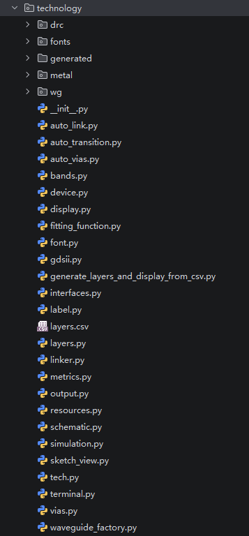
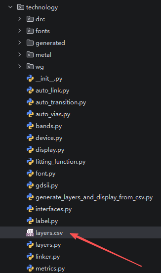
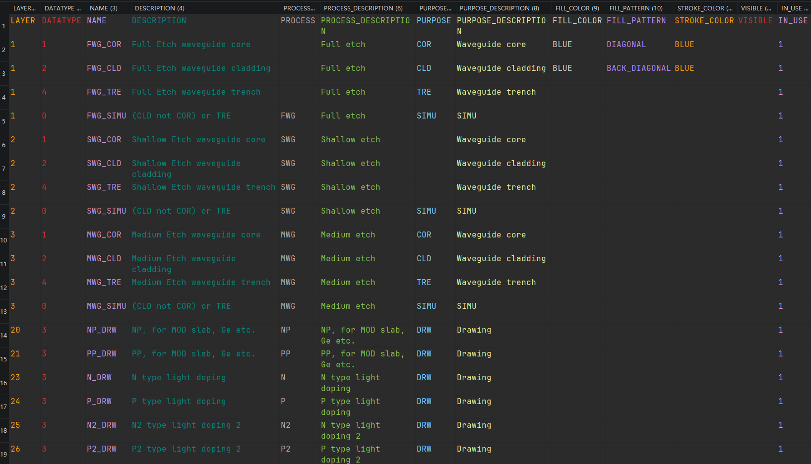
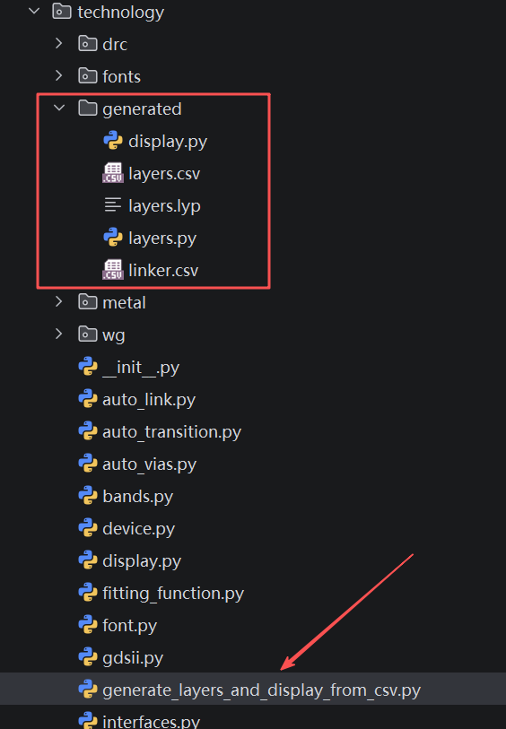
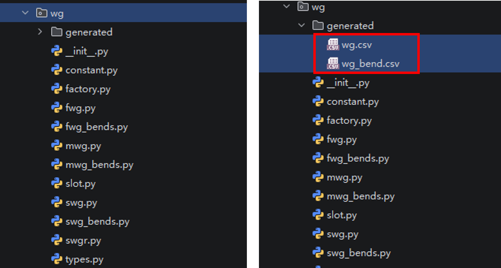
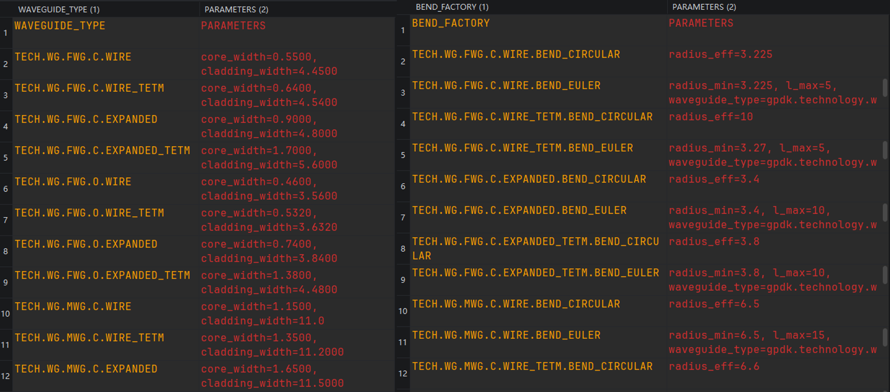
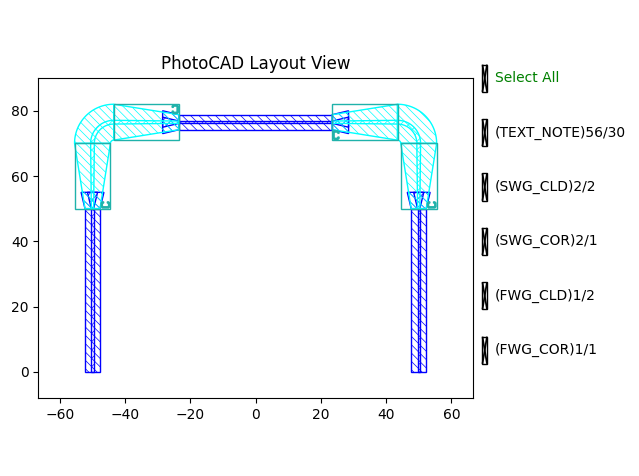

**Technology**: gpdk-related process setting
============================================================

Default process
------------------------------------------

File technology mainly stores some scripts related to the underlying layer. The following is an introduction through all parts of the ``technology``:

* ``layers.csv``, ``layers.py``, ``display.py``: Process layers definitions (:ref:`technology-layers`)

* ``wg`` folder: Waveguide type definitions (:ref:`technology-wg`)

* ``metal`` folder: Metal type definitions (:ref:`technology-metal`)
   
* ``auto_link.py``: Routing-related settings definition (:ref:`technology-routing`)
   
* ``auto_transition.py``: Automatic waveguide type transition (:ref:`technology-transition`)

* ``auto_via.py``, ``vias.py``: Metal wiring related settings (:ref:`technology-via`)

* ``bands.py``: Define the supported optical bands for the PDK.

* ``device.py``: Define the layers and annotation method used to display the band information of devices.

* ``fitting_function.py``: Define the fitting functions used to generate routing curves from a sequence of waypoints.

* ``font.py``: Define the default font and font types used in the layout.

* ``gdsii.py``: Define the maximum coordinate of the generated GDSII file.

* ``labels.py``:  Define the font size used for layout labels.

* ``linker.py``: Define the preset waveguide and metal line linkers used to connect different devices.

* ``metrics.py``: Define the preset waveguide and metal line linkers used to connect different devices.

* ``output.py``: Define the output folder and file paths for locally generated files.

* ``resources.py``: Define the root directory of the PDK resources.

* ``schematic.py``: Define the backend used for schematic generation and processing.

* ``simulation.py``: Define the simulation backend and simulation parameters for different waveguide types.

* ``sketch_view.py``: Define the default configuration and cache path for the sketch view.

* ``tech.py``: Integrate and register all technology-related configurations into the PDK technology class.

* ``terminal.py``: Define the pin and port parameters, including their length, offset, and associated layers.
   

.. _technology-layers:

Customized process
---------------------------------------------------

In order to be more convenient for users to use and customize the process information, mainly for ``layers.py`` and  ``display.py``, **technology** provides a convenient user-defined file ``layers.csv`` file, users can open ``gpdk`` > ``technology`` > ``layers.csv`` file to customize their relevant processes.
   

   
First double-click on the file to open the table as shown below:
   

   
* ``LAYER`` and ``DATATYPE`` together determine the number of the layer.
   
* ``NAME`` is used to define the name of the layer, it has to be all capitals.
   
* ``DESCRIPTION`` is the description of the layer.
   
* ``PROCESS`` and ``PROCESS_DESCRIPTION`` are used to define and describe the etching process, respectively.
   
* ``PURPOSE`` and ``PURPOSE_DESCRIPTION`` are used to define and describe the processing process respectively.
   
* ``FILL_COLOR`` is used to define the color of the filled layer.
   
* ``FILL_PATTERN`` is used to define the graphics of the filled layer, mainly ``diagonal`` and ``back-diagonal``.
   
* ``STROKE_COLOR`` is used to define the color of the border of the layer.

* ``VISIBLE`` is used to define whether the layer is visible by default in the layout viewer.

* ``IN_USE`` specifies whether a layer is enabled and included in the generated PDK layers and display definitions.

**NOTICE**:
    #. Make sure LAYER & DATATYPE numbers are not duplicated for different ``PROCESS`` and ``PURPOSE``.
    #. You may look up valid entries for colors and fill patterns in ``.venv_XXX`` > ``Lib`` > ``site-packages`` > ``pdk`` > ``fnpcell`` > ``technology`` > ``display.pyi``.
   
All these information are user-defined.
   
Then, after customizing the relevant process information, running ``gpdk`` > ``technology`` > ``generate_layers_display_from_csv.py`` directly will generate new ``display.py``, ``layers.lyp`` and ``layers.py`` files in the generated folder under ``gpdk`` > ``technology``. Move the newly generated ``display.py`` and ``layers.py`` to the technology folder to replace the files with the same names, or modify the paths of these two files in ``tech.py``.
   

   
Finally, we can use the relevant process setup files generated in the file via ``gpdk`` > ``technology`` > ``tech.py`` . Double-click to open the ``tech.py`` file to reveal the following scripts::
   
    import fnpcell.pdk.technology.all as fpt
    from gpdk.technology.auto_link import LINK, LINKING_POLICY
    from gpdk.technology.auto_transition import AUTO_TRANSITION, WAVEGUIDE_ADAPTER
    from gpdk.technology.auto_vias import AUTO_VIAS
    from gpdk.technology.bands import BAND
    from gpdk.technology.device import DEVICE
    from gpdk.technology.display import DISPLAY
    from gpdk.technology.fitting_function import FITTING_FUNCTION
    from gpdk.technology.font import FONT
    from gpdk.technology.gdsii import GDSII
    from gpdk.technology.label import LABEL
    from gpdk.technology.layers import LAYER, PROCESS, PURPOSE
    from gpdk.technology.linker import LINKER
    from gpdk.technology.metal import METAL
    from gpdk.technology.metrics import METRICS
    from gpdk.technology.output import OUTPUT
    from gpdk.technology.schematic import SCHEMATIC
    from gpdk.technology.simulation import SIMULATION
    from gpdk.technology.sketch_view import SKETCH_VIEW
    from gpdk.technology.terminal import PIN, PORT
    from gpdk.technology.vias import VIAS
    from gpdk.technology.wg import WG
    
If you want to modify the file paths, you can replace the original imports in the module import section::
   
    from gpdk.technology.display import DISPLAY
    from gpdk.technology.layers import LAYER, PROCESS, PURPOSE
    
with::
   
    from gpdk.technology.generated.display import DISPLAY
    from gpdk.technology.generated.layers import LAYER, PROCESS, PURPOSE
    
Save the file again to use the customized process information.

.. _technology-wg:

Waveguide information
-----------------------------------------------------

The waveguide settings are defined in the ``wg`` folder. It mainly defines various waveguide types and their corresponding configurations such as width, simulation parameters.

+----------------------------------+----------------------------------------------------------------------------------+
|       file name                  | function                                                                         |
+==================================+==================================================================================+
| :ref:`types.py <wg-types>`       | Define basic waveguide types, and specify how many layers each waveguide type    |
|                                  | contains.                                                                        |
+----------------------------------+----------------------------------------------------------------------------------+
| :ref:`xxx.py <wg-xxx>`           | Define the specific process layers for each waveguide type, including which      |
|                                  | layers serve as the core and cladding.                                           |
+----------------------------------+----------------------------------------------------------------------------------+
|:ref:`xxx_bends.py <bend>`        | Define the bend settings for waveguides in ``xxx.py``.                           |
+----------------------------------+----------------------------------------------------------------------------------+
| :ref:`__init__.py <wg-init>`     | Define the default width. The width of the waveguide is set here according to    |
|                                  | the parameters in the ``constant.py`` file.                                      |
+----------------------------------+----------------------------------------------------------------------------------+
| :ref:`constant.py <wg-constant>` | Define the width of the waveguide. The value is set in each WG class in          |
|                                  | ``wg`` > ``__init__.py``.                                                        |
+----------------------------------+----------------------------------------------------------------------------------+
| :ref:`factory.py <wg-factory>`   | Define the straight and bend waveguide factories for the auto-routing function   |
|                                  | in PhotoCAD.                                                                     |
+----------------------------------+----------------------------------------------------------------------------------+

.. _wg-types:

* ``types.py``: Take the base class for waveguide types as an example. This class defines ``CoreCladdingWaveguideType``, which consists of one core layer and one cladding layer, with no actual values assigned. Multiple different waveguides can share one waveguide type.

.. code-block:: python

    class CoreCladdingWaveguideType(fpt.ProfileWaveguideType):
        """Base class of waveguide type."""

        core_width: float = fp.PositiveFloatParam()
        cladding_width: float = fp.PositiveFloatParam()

        @property
        @abstractmethod
        def core_layer(self) -> fpt.ILayer: ...

        @property
        @abstractmethod
        def cladding_layer(self) -> fpt.ILayer: ...

        @fpt.staticconst
        def core_bias() -> fpt.ICDBias:
            return fpt.CDBiasLinear(0)

        @fpt.staticconst
        def cladding_bias() -> fpt.ICDBias:
            return fpt.CDBiasLinear(0)

        @override
        def port_width(self) -> float:
            return self.core_width

        @cached_property
        def profile(self) -> Sequence[Tuple[fpt.ILayer, Sequence[Tuple[float, Sequence[float]]], Tuple[float, float]]]:
            return [
                (
                    self.core_layer,
                    [
                        (0, [self.core_width]),
                    ],
                    (0, 0),
                ),
                (
                    self.cladding_layer,
                    [
                        (0, [self.cladding_width]),
                    ],
                    (0, 0),
                ),
            ]

.. _wg-xxx:

* ``xxx.py``:  Different types of waveguides are defined in gpdk, including FWG, MWG, and SWG. Taking ``FWG.py`` as an example, the file defines relevant information for this waveguide type, such as critical dimension bias and layer information. Each waveguide type will then create different band type based on the chosen band(C-band, O-band).

.. code-block:: python

    class FWG(CoreCladdingWaveguideType):
        @fpt.staticconst
        def core_bias():
            return fpt.CDBiasLinear(0.1)

        @fpt.staticconst
        def cladding_bias():
            return fpt.CDBiasLinear(0)

        @fpt.staticconst
        def core_layer():
            from gpdk.technology import get_technology

            return get_technology().LAYER.FWG_COR

        @fpt.staticconst
        def cladding_layer():
            from gpdk.technology import get_technology

            return get_technology().LAYER.FWG_CLD

        @fpt.staticconst
        def straight_factory():
            return StraightFactory()

    @fpt.concrete_class
    class FWG_C(FWG):
        ...

    @fpt.concrete_class
    class FWG_O(FWG):
        ...

.. _bend:

* ``xxx_bend.py``:  Use the class generated by ``FWG.py`` as a parent class to create bent settings for each specific waveguide. And beyond each band type, 4 other types depends on the waveguide linewidth are generated(``WIRE``, ``WIRE_TETM``, ``EXPANDED``, ``EXPANDED_TETM``).

.. code-block:: python

    class FWG_C_BENDS:
        class FOR_WIRE(FWG_C):
            @fpt.const_property
            def bend_factory(self):  # fallback default bend_factory for FWG.C.WIRE
                return self.BEND_EULER

            @fpt.const_property
            def BEND_CIRCULAR(self):
                return CircularBendFactory(radius_eff=3.225, waveguide_type=self)

            @fpt.const_property
            def BEND_EULER(self):
                return EulerBendFactory(radius_min=3.225, l_max=5, waveguide_type=self)

        class FOR_WIRE_TETM(FWG_C):
            ...

        class FOR_EXPANDED(FWG_C):
            ...

        class FOR_EXPANDED_TETM(FWG_C):
            ...

.. _wg-init:

* ``__init__.py``:  The ``WG`` class defines the waveguide type hierarchy in the gpdk, including different waveguide structures for the C and O bands, their core and cladding widths, and the corresponding bend factories.

.. code-block:: python

    class WG(fpt.TECH.WG):
        @fpt.backed_by()
        class FWG(FWG):
            @fpt.inherited_by
            class C(FWG_C):
                @fpt.staticconst
                @fpt.inherited_by
                class WIRE(FWG_C_BENDS.FOR_WIRE, FWG_C):
                    core_width: float = FWG.core_bias.apply(CONST.FWG_C_WIRE_WIDTH)
                    cladding_width: float = FWG.cladding_bias.apply(CONST.FWG_C_WIRE_WIDTH + CONST.FWG_C_TRENCH_WIDTH * 2)

                @fpt.staticconst
                @fpt.inherited_by
                class WIRE_TETM(FWG_C_BENDS.FOR_WIRE_TETM, FWG_C):
                    core_width: float = FWG.core_bias.apply(CONST.FWG_C_WIRE_WIDTH * CONST.WIRE_TETM_RATIO)
                    cladding_width: float = FWG.cladding_bias.apply(CONST.FWG_C_WIRE_WIDTH * CONST.WIRE_TETM_RATIO + CONST.FWG_C_TRENCH_WIDTH * 2)

                @fpt.staticconst
                @fpt.inherited_by
                class EXPANDED(FWG_C_BENDS.FOR_EXPANDED, FWG_C):
                    core_width: float = FWG.core_bias.apply(CONST.FWG_C_EXPANDED_WIDTH)
                    cladding_width: float = FWG.cladding_bias.apply(CONST.FWG_C_EXPANDED_WIDTH + CONST.FWG_C_TRENCH_WIDTH * 2)

                @fpt.staticconst
                @fpt.inherited_by
                class EXPANDED_TETM(FWG_C_BENDS.FOR_EXPANDED_TETM, FWG_C):
                    core_width: float = FWG.core_bias.apply(CONST.FWG_C_EXPANDED_WIDTH * CONST.EXPANDED_TETM_RATIO)
                    cladding_width: float = FWG.cladding_bias.apply(CONST.FWG_C_EXPANDED_WIDTH * CONST.EXPANDED_TETM_RATIO + CONST.FWG_C_TRENCH_WIDTH * 2)

            @fpt.inherited_by
            class O(FWG_O):
                class WIRE(FWG_O):
                    ...
                class WIRE_TETM(FWG_O):
                    ...
                class EXPANDED(FWG_O):
                    ...
                class EXPANDED_TETM(FWG_O):
                    ...

        @fpt.backed_by()
        class MWG(MWG):
            ...
        @fpt.backed_by()
        class SWG(SWG):
            ...
        @fpt.backed_by()
        class SLOT(SLOT):
            ...
        @fpt.backed_by()
        class SWGR(SWGR):
            ...

.. _wg-constant:

* ``constant.py``:  Define the width parameters that will be passed to the corresponding waveguide class in ``wg`` > ``__init__.py``. O-band can be adjusted by ``O_BAND_RATIO = 0.8``, ``TETM`` and ``EXPANDED`` can also be adjusted by ``WIRE_TETM_RATIO`` and ``EXPANDED_TETM_RATIO``, so that the users don’t need to define every function.

.. code-block:: python

        FWG_C_WIRE_WIDTH = 0.6
        FWG_C_EXPANDED_WIDTH = 0.8
        FWG_C_TRENCH_WIDTH = 2.0

        MWG_C_WIRE_WIDTH = 1
        MWG_C_EXPANDED_WIDTH = 1.5
        MWG_C_TRENCH_WIDTH = 5.0

        SWG_C_WIRE_WIDTH = 1.0
        SWG_C_EXPANDED_WIDTH = 1.5
        SWG_C_TRENCH_WIDTH = 5.0

        WIRE_TETM_RATIO = 1.2
        EXPANDED_TETM_RATIO = 2.0

        O_BAND_RATIO = 0.8

.. _wg-factory:

* ``factory.py``:  Defines the straight and bend waveguide factories used by PhotoCAD to generate straight, circular, and Euler bend waveguides based on the specified waveguide type and geometric parameters.

 #. ``StraightFactory``: Import the straight waveguide to use it for straight connection.
 #. ``CircularBendFactory``: Import ``BendCircular`` from ``bend_circular`` and assigned each component to different situations.
 #. ``EulerBendFactory``: Import ``BendEuler`` from ``bend_euler`` and assigned each component to different situations.

.. code-block:: python

    class StraightFactory(fpt.StraightWaveguideFactory):
        def __call__(self, type: fpt.IWaveguideType, length: float):
            from gpdk.components.straight.straight import Straight

            straight = Straight(length=length, waveguide_type=type)
            return straight, ("op_0", "op_1")

    class CircularBendFactory(fpt.BendWaveguideFactory):
        radius_eff: float
        waveguide_type: fpt.IWaveguideType = fp.WaveguideTypeParam(repr=False)

        def __call__(self, central_angle: float):
            from gpdk.components.bend.bend_circular import BendCircular, BendCircular90_FWG_C_EXPANDED, BendCircular90_FWG_C_WIRE

            from gpdk.technology import get_technology

            TECH = get_technology()

            radius_eff = self.radius_eff

            bend = None
            if fp.is_close(abs(central_angle), math.pi / 2):
                if self.waveguide_type == TECH.WG.FWG.C.WIRE and fp.is_close(self.radius_eff, 3.225):
                    bend = BendCircular90_FWG_C_WIRE()
                elif self.waveguide_type == TECH.WG.FWG.C.EXPANDED and fp.is_close(self.radius_eff, 3.4):
                    bend = BendCircular90_FWG_C_EXPANDED()

                if bend and central_angle < 0:
                    bend = bend.v_mirrored()

            if bend is None:
                bend = BendCircular(degrees=math.degrees(central_angle), radius=radius_eff, waveguide_type=self.waveguide_type)

            return bend, radius_eff, ("op_0", "op_1")

    class EulerBendFactory(fpt.BendWaveguideFactory):
        radius_min: float
        l_max: float
        waveguide_type: fpt.IWaveguideType

        def __call__(self, central_angle: float):
            ...

            return bend, bend.raw_curve.radius_eff, ("op_0", "op_1")

In order to be more convenient for users to view the information of the waveguide process in use, **technology** provides a convenient method to reverse the python source file to generate a csv netlist file, you can open ``gpdk`` > ``technology`` > ``wg`` > ``__init__.py`` and run it, then the ``wg.csv`` and ``wg_bend.csv`` files will be generated in the generate folder, you can open the file to quickly view various information related to waveguide.

.. _technology-metal:

Metal information
-----------------------------------------------------

The metal settings are defined in the ``metal`` folder. It contains the basic metal types, metal definitions, and related factory and utility files.

+----------------------------------+----------------------------------------------------------------------------------+
|       file name                  | function                                                                         |
+==================================+==================================================================================+
| :ref:`types.py <metal-types>`    | Define the basic framework for single layer metal wires, and provide two pattern |
|                                  | generation modes: Cracked and Slotted.                                           |
+----------------------------------+----------------------------------------------------------------------------------+
| :ref:`xx.py <metal-xx>`          | Define the specific metal layers, including M1, M2, MT and PASS_MT.              |
+----------------------------------+----------------------------------------------------------------------------------+
| :ref:`__init__.py <metal-init>`  | Define the available metal types and their standard line widths, which can be    |
|                                  | directly accessed through TECH.METAL.                                            |
+----------------------------------+----------------------------------------------------------------------------------+
| :ref:`common.py <metal-common>`  | Define the general metal layer stack and via connection relationships within     |
|                                  | the PDK.                                                                         |
+----------------------------------+----------------------------------------------------------------------------------+

.. _metal-types:

* ``types.py``: Class ``Cracked`` and ``Slotted`` are used to generate metal wires with cracks and slots respectively. The geometric dimensions are controlled by parameters such as ``max_width``, ``spacing``, ``slot_width`` and ``slot_length``. The generic ``SingleLayerMetalLineType`` base class can be used to select the desired pattern, either Cracked or Slotted, with Cracked as the default.

.. code-block:: python

    @fpt.concrete_class
    class Cracked(SingleLayerCurvePaintFactory):
        """Metal line with crack."""

        max_width: float = 35
        spacing: float = 3
        crack_layer: Optional[fpt.ILayer] = None
        reserved_ends: Tuple[float, float] = (0, 0)
        reserved_corner: float = 0

        @override
        def __call__(self, layer: fp.ILayer, line_width: float) -> fp.ICurvePaint:
            return fp.el.CurvePaint.ContinuousLayer(layer=layer, width=line_width).with_cracks(
                max_width=self.max_width,
                spacing=self.spacing,
                crack_layer=self.crack_layer,
                reserved_ends=self.reserved_ends,
                reserved_corner=self.reserved_corner,
            )

    @fpt.concrete_class
    class Slotted(SingleLayerCurvePaintFactory):
        """Metal line with slot."""

        max_width: float = 35
        slot_width: float = 3
        slot_length: float = 30
        min_slot_length: float = 30
        slot_gap: float = 10
        stagger_offset: float = 15
        slot_layer: Optional[fpt.ILayer] = None
        reserved_ends: Tuple[float, float] = (0, 0)
        reserved_corner: float = 0

        @override
        def __call__(self, layer: fp.ILayer, line_width: float) -> fp.ICurvePaint:
            return fp.el.CurvePaint.ContinuousLayer(layer=layer, width=line_width).with_slots(
                max_width=self.max_width,
                slot_width=self.slot_width,
                slot_length=self.slot_length,
                min_slot_length=self.min_slot_length,
                slot_gap=self.slot_gap,
                stagger_offset=self.stagger_offset,
                slot_layer=self.slot_layer,
                reserved_ends=self.reserved_ends,
                reserved_corner=self.reserved_corner,
            )

    class SingleLayerMetalLineType(fpt.MetalLineType):
        """Metal line with single layer."""

        line_width: float = fp.PositiveFloatParam()
        paint: SingleLayerCurvePaintFactory = fp.Param(type=SingleLayerCurvePaintFactory, default=fp.USE_DEFAULT_FACTORY)

        def _default_paint(self):
            return Cracked()

        ...

.. _metal-xx:

* ``xx.py``: Using ``M1.py`` as an example, it defines that M1 metal wires are physically drawn on the ``M1_DRW`` layer.

.. code-block:: python

    class M1(SingleLayerMetalLineType):
        @fpt.staticconst
        def metal_stack() -> fpt.MetalStack:
            from gpdk.technology import get_technology

            TECH = get_technology()
            return TECH.METAL.METAL_STACK.updated(layers=[TECH.LAYER.M1_DRW])

        @fpt.classconst
        def metal_layer(cls) -> fpt.ILayer:
            return cls.metal_stack.layers[0]

.. _metal-init:

* ``__init__.py``: Define the available callable line widths of the four metal wire types.

.. code-block:: python

    class METAL(COMMON, fpt.TECH.METAL):
        @fpt.backed_by()
        class M1(M1):
            @fpt.classconst
            @classmethod
            def W10(cls):
                return cls(line_width=10)

            @fpt.classconst
            @classmethod
            def W20(cls):
                return cls(line_width=20)

            @fpt.classconst
            @classmethod
            def W40(cls):
                return cls(line_width=40)

            @fpt.classconst
            @classmethod
            def W80(cls):
                return cls(line_width=80)

        @fpt.backed_by()
        class M2(M2):
            ...

        @fpt.backed_by()
        class MT(MT):
            ...

        @fpt.backed_by()
        class PASS_MT(PASS_MT):
            ...

.. _metal-common:

* ``common.py``: Define the common metal stack and connectivity between metal layers, and provide a mapping from individual metal layers to their default metal line types.

.. code-block:: python

    class COMMON:
        @fpt.staticconst
        def METAL_STACK() -> fpt.MetalStack:
            from gpdk.technology import get_technology

            TECH = get_technology()
            return fpt.MetalStack(
                layers=[
                    TECH.LAYER.MT_DRW,
                    TECH.LAYER.M2_DRW,
                    TECH.LAYER.M1_DRW,
                ],
                connectivity={
                    TECH.LAYER.MT_DRW: [TECH.LAYER.VIA2_DRW],
                    TECH.LAYER.M2_DRW: [TECH.LAYER.VIA2_DRW, TECH.LAYER.VIA1_DRW],
                    TECH.LAYER.M1_DRW: [TECH.LAYER.VIA1_DRW],
                },
            )

        @staticmethod
        def from_single_layer(layer: fpt.ILayer) -> fpt.IMetalLineType:
            from gpdk.technology import get_technology

            TECH = get_technology()
            if layer == TECH.LAYER.M1_DRW:
                return TECH.METAL.M1.W20
            elif layer == TECH.LAYER.M2_DRW:
                return TECH.METAL.M2.W20
            elif layer == TECH.LAYER.MT_DRW:
                return TECH.METAL.MT.W20
            else:
                raise ValueError(f"MetalLineType for layer [{layer}] not found")

.. _technology-routing:

Auto_link
-----------------------------------------------------

The auto-link function mainly defines the default waveguide type and bend factory used for automatic routing between different waveguide types:

For example:

``(type(WG.FWG.C.WIRE) >> type(WG.FWG.C.WIRE), fpt.StraightPrefer(WG.FWG.C.WIRE), fpt.BendUsing(WG.FWG.C.WIRE.BEND_EULER))``

It means that when the start and end waveguide are both ``WG.FWG.C.WIRE``, the automated waveguide type for routing will be ``WG.FWG.C.WIRE`` and an automated bend ``WG.FWG.C.WIRE.BEND_EULER`` will be added.

There are two default methods, and users can also define their own.

LESS_TRANS
~~~~~~~~~~~~~~~~~~~~~~~~

The first linking method uses the destination waveguide type as the default link waveguide type when connecting two waveguides. The bend factory is generally configured to use an Euler bend to reduce waveguide loss based on experimental results.

If users need to customize the linking policy, they can add the corresponding waveguide types and bend factories to ``LINKING_POLICY``.

.. code-block:: python

    class LINKING_POLICY(fpt.TECH.LINKING_POLICY):
        @fpt.staticconst
        def DEFAULT():
            return LINKING_POLICY.LESS_TRANS

        @fpt.staticconst
        def LESS_TRANS():
            return fpt.LinkingPolicy().updated(
                [
                    # from >> to,  default link_type, default bend_factory
                    # (WG.FWG.C.WIRE >> WG.FWG.C.WIRE, fpt.StraightPrefer(WG.FWG.C.WIRE), fpt.BendUsing(WG.FWG.C.WIRE.BEND_EULER)),cluding non-standard waveguide types)
                    #
                    (type(WG.FWG.C.WIRE) >> type(WG.FWG.C.WIRE), fpt.StraightPrefer(WG.FWG.C.WIRE), fpt.BendUsing(WG.FWG.C.WIRE.BEND_EULER)),
                    (type(WG.MWG.C.WIRE) >> type(WG.MWG.C.WIRE), fpt.StraightPrefer(WG.MWG.C.WIRE), fpt.BendUsing(WG.MWG.C.WIRE.BEND_EULER)),
                    (type(WG.SWG.C.WIRE) >> type(WG.SWG.C.WIRE), fpt.StraightPrefer(WG.SWG.C.WIRE), fpt.BendUsing(WG.SWG.C.WIRE.BEND_EULER)),
                    #
                    (type(WG.FWG.C.WIRE) >> type(WG.MWG.C.WIRE), fpt.StraightPrefer(WG.MWG.C.WIRE), fpt.BendUsing(WG.MWG.C.WIRE.BEND_EULER)),
                    (type(WG.MWG.C.WIRE) >> type(WG.SWG.C.WIRE), fpt.StraightPrefer(WG.SWG.C.WIRE), fpt.BendUsing(WG.SWG.C.WIRE.BEND_EULER)),
                    (type(WG.FWG.C.WIRE) >> type(WG.SWG.C.WIRE), fpt.StraightPrefer(WG.SWG.C.WIRE), fpt.BendUsing(WG.SWG.C.WIRE.BEND_EULER)),
                    #
                    (type(WG.FWG.C.WIRE) >> type(WG.FWG.C.EXPANDED), fpt.StraightPrefer(WG.FWG.C.EXPANDED), fpt.BendUsing(WG.FWG.C.WIRE.BEND_EULER)),
                    (type(WG.MWG.C.WIRE) >> type(WG.MWG.C.EXPANDED), fpt.StraightPrefer(WG.MWG.C.EXPANDED), fpt.BendUsing(WG.MWG.C.WIRE.BEND_EULER)),
                    (type(WG.SWG.C.WIRE) >> type(WG.SWG.C.EXPANDED), fpt.StraightPrefer(WG.SWG.C.EXPANDED), fpt.BendUsing(WG.SWG.C.WIRE.BEND_EULER)),
                    #
                    (type(WG.FWG.C.WIRE) >> type(WG.MWG.C.EXPANDED), fpt.StraightPrefer(WG.MWG.C.EXPANDED), fpt.BendUsing(WG.MWG.C.EXPANDED.BEND_EULER)),
                    (type(WG.MWG.C.WIRE) >> type(WG.SWG.C.EXPANDED), fpt.StraightPrefer(WG.SWG.C.EXPANDED), fpt.BendUsing(WG.SWG.C.EXPANDED.BEND_EULER)),
                    (type(WG.FWG.C.WIRE) >> type(WG.SWG.C.EXPANDED), fpt.StraightPrefer(WG.SWG.C.EXPANDED), fpt.BendUsing(WG.SWG.C.EXPANDED.BEND_EULER)),
                    #
                    (type(WG.FWG.C.EXPANDED) >> type(WG.FWG.C.EXPANDED), fpt.StraightPrefer(WG.FWG.C.EXPANDED), fpt.BendUsing(WG.FWG.C.WIRE.BEND_EULER)),
                    (type(WG.MWG.C.EXPANDED) >> type(WG.MWG.C.EXPANDED), fpt.StraightPrefer(WG.MWG.C.EXPANDED), fpt.BendUsing(WG.MWG.C.WIRE.BEND_EULER)),
                    (type(WG.SWG.C.EXPANDED) >> type(WG.SWG.C.EXPANDED), fpt.StraightPrefer(WG.SWG.C.EXPANDED), fpt.BendUsing(WG.SWG.C.WIRE.BEND_EULER)),
                    #
                    (type(WG.FWG.C.EXPANDED) >> type(WG.MWG.C.EXPANDED), fpt.StraightPrefer(WG.MWG.C.EXPANDED), fpt.BendUsing(WG.MWG.C.EXPANDED.BEND_EULER)),
                    (type(WG.MWG.C.EXPANDED) >> type(WG.SWG.C.EXPANDED), fpt.StraightPrefer(WG.SWG.C.EXPANDED), fpt.BendUsing(WG.SWG.C.EXPANDED.BEND_EULER)),
                    (type(WG.FWG.C.EXPANDED) >> type(WG.SWG.C.EXPANDED), fpt.StraightPrefer(WG.SWG.C.EXPANDED), fpt.BendUsing(WG.SWG.C.EXPANDED.BEND_EULER)),
                    #
                    # non-standard waveguide types
                    (WG.FWG.C >> WG.FWG.C, fpt.StraightPrefer(WG.FWG.C.EXPANDED), fpt.BendUsing(WG.FWG.C.WIRE.BEND_EULER)),
                    (WG.MWG.C >> WG.MWG.C, fpt.StraightPrefer(WG.MWG.C.EXPANDED), fpt.BendUsing(WG.MWG.C.WIRE.BEND_EULER)),
                    (WG.SWG.C >> WG.SWG.C, fpt.StraightPrefer(WG.SWG.C.EXPANDED), fpt.BendUsing(WG.SWG.C.WIRE.BEND_EULER)),
                    #
                    (WG.FWG.C >> WG.MWG.C, fpt.StraightPrefer(WG.MWG.C.EXPANDED), fpt.BendUsing(WG.MWG.C.WIRE.BEND_EULER)),
                    (WG.MWG.C >> WG.SWG.C, fpt.StraightPrefer(WG.SWG.C.EXPANDED), fpt.BendUsing(WG.MWG.C.WIRE.BEND_EULER)),
                    (WG.FWG.C >> WG.SWG.C, fpt.StraightPrefer(WG.SWG.C.EXPANDED), fpt.BendUsing(WG.SWG.C.WIRE.BEND_EULER)),
                ]
            )

MAX_SWG
~~~~~~~~~~~~~~~~

The second link method uses ``SWG.C.EXPANDED`` as the default link waveguide type regardless of the waveguide types being connected. The bend factory is consistently set to ``FWG.C.WIRE.BEND_EULER``.

.. code-block:: python

    @fpt.staticconst
    def MAX_SWG():
        return fpt.LinkingPolicy().updated(
            [
                (type(WG.FWG.C.WIRE) >> type(WG.FWG.C.WIRE), fpt.StraightPrefer(WG.SWG.C.EXPANDED), fpt.BendUsing(WG.FWG.C.WIRE.BEND_EULER)),
                (type(WG.MWG.C.WIRE) >> type(WG.MWG.C.WIRE), fpt.StraightPrefer(WG.SWG.C.EXPANDED), fpt.BendUsing(WG.FWG.C.WIRE.BEND_EULER)),
                (type(WG.SWG.C.WIRE) >> type(WG.SWG.C.WIRE), fpt.StraightPrefer(WG.SWG.C.EXPANDED), fpt.BendUsing(WG.FWG.C.WIRE.BEND_EULER)),
                #
                (type(WG.FWG.C.WIRE) >> type(WG.MWG.C.WIRE), fpt.StraightPrefer(WG.SWG.C.EXPANDED), fpt.BendUsing(WG.FWG.C.WIRE.BEND_EULER)),
                (type(WG.MWG.C.WIRE) >> type(WG.SWG.C.WIRE), fpt.StraightPrefer(WG.SWG.C.EXPANDED), fpt.BendUsing(WG.FWG.C.WIRE.BEND_EULER)),
                (type(WG.FWG.C.WIRE) >> type(WG.SWG.C.WIRE), fpt.StraightPrefer(WG.SWG.C.EXPANDED), fpt.BendUsing(WG.FWG.C.WIRE.BEND_EULER)),
                #
                (type(WG.FWG.C.EXPANDED) >> type(WG.FWG.C.EXPANDED), fpt.StraightPrefer(WG.SWG.C.EXPANDED), fpt.BendUsing(WG.FWG.C.WIRE.BEND_EULER)),
                (type(WG.MWG.C.EXPANDED) >> type(WG.MWG.C.EXPANDED), fpt.StraightPrefer(WG.SWG.C.EXPANDED), fpt.BendUsing(WG.FWG.C.WIRE.BEND_EULER)),
                (type(WG.SWG.C.EXPANDED) >> type(WG.SWG.C.EXPANDED), fpt.StraightPrefer(WG.SWG.C.EXPANDED), fpt.BendUsing(WG.FWG.C.WIRE.BEND_EULER)),
                #
                (type(WG.FWG.C.EXPANDED) >> type(WG.MWG.C.EXPANDED), fpt.StraightPrefer(WG.SWG.C.EXPANDED), fpt.BendUsing(WG.FWG.C.WIRE.BEND_EULER)),
                (type(WG.MWG.C.EXPANDED) >> type(WG.SWG.C.EXPANDED), fpt.StraightPrefer(WG.SWG.C.EXPANDED), fpt.BendUsing(WG.FWG.C.WIRE.BEND_EULER)),
                (type(WG.FWG.C.EXPANDED) >> type(WG.SWG.C.EXPANDED), fpt.StraightPrefer(WG.SWG.C.EXPANDED), fpt.BendUsing(WG.FWG.C.WIRE.BEND_EULER)),
                #
            ]
        )

When setting ``linking_policy = TECH.LINKING_POLICY``, ``straight_type`` and ``bend_factory`` will not be needed to define. However, if ``linking_policy``, ``straight_type`` and ``bend_factory`` are all set at the same time, ``straight_type`` and ``bend_factory`` have higher priority over ``linking_policy``.

#. Linked(linking_policy = TECH.LINKING_POLICY.DEFAULT)
#. LinkBetween(linking_policy = TECH.LINKING_POLICY.DEFAULT)
#. create_links(linking_policy = TECH.LINKING_POLICY.DEFAULT)

.. _technology-transition:

Auto_transition
-----------------------------------------------------

``auto_transition.py`` defines the automatic transition rules between different waveguide types in the ``gpdk``. When two connected ports use different waveguide types, the corresponding transition component can be inserted automatically during routing.  It also provides automatic linear tapers for waveguides of the same type when their core widths are different.

Before this, users have to first create components such as ``FWG2MWGTransition`` to allow auto transition to work, and specified parameters such as transition length, shape will also be defined in the component (Ref: Lib/site-packages/gpdk/components/transition/fwg2mwg_transition.py).

Set up transition settings
~~~~~~~~~~~~~~~~~~~~~~~~~~~~~~~~~~

``WAVEGUIDE_ADAPTER`` defines the automatic adapters used to connect different waveguide types.

.. code-block:: python

    class WAVEGUIDE_ADAPTER(fpt.TECH.WAVEGUIDE_ADAPTER):
        class C:
            class FWG2MWG(fpt.WaveguideAdapterFactory):
                @fpt.staticconst
                def band() -> fpt.IBand:
                    return BAND.C

                def __call__(self, end_types: Tuple[fpt.IWaveguideType, fpt.IWaveguideType]):
                    from gpdk.components.transition.fwg2mwg_transition import FWG2MWG

                    a, b = end_types
                    assert isinstance(a, WG.FWG.C)
                    assert isinstance(b, WG.MWG.C)
                    transition = FWG2MWG(end_types=end_types, slope=SLOPE)

                    return transition, ("op_0", "op_1")

            class FWG2SWG(fpt.WaveguideAdapterFactory):
                ...

            class SWG2MWG(fpt.WaveguideAdapterFactory):
                ...

            class SLOPE_TAPER(fpt.WaveguideAdapterFactory):
                slope: float

                @fpt.staticconst
                def band() -> fpt.IBand:
                    return BAND.C

                def __call__(self, end_types: Tuple[fpt.IWaveguideType, fpt.IWaveguideType]):
                    from gpdk.components.taper.taper_linear import TaperLinear

                    a = cast(CoreCladdingWaveguideType, end_types[0])
                    b = cast(CoreCladdingWaveguideType, end_types[1])
                    k = self.slope
                    length = max(0.01, abs(a.core_width - b.core_width) / k)
                    return TaperLinear(name="auto", length=length, left_type=a, right_type=b), ("op_0", "op_1")

The transition rules are defined through ``WAVEGUIDE_ADAPTER`` and registered in ``AUTO_TRANSITION``.

.. code-block:: python

    class AUTO_TRANSITION(fpt.TECH.AUTO_TRANSITION):
        @fpt.staticconst
        def DEFAULT():
            return AUTO_TRANSITION.STANDARD

        @fpt.staticconst
        def STANDARD():
            return fpt.AutoTransition().updated(
                [
                    (WG.FWG.C >> WG.MWG.C, WAVEGUIDE_ADAPTER.C.FWG2MWG()),
                    (WG.FWG.C >> WG.SWG.C, WAVEGUIDE_ADAPTER.C.FWG2SWG()),
                    (WG.SWG.C >> WG.MWG.C, WAVEGUIDE_ADAPTER.C.SWG2MWG()),
                    #
                    (WG.FWG.C >> WG.FWG.C, WAVEGUIDE_ADAPTER.C.SLOPE_TAPER(slope=SLOPE)),
                    (WG.SWG.C >> WG.SWG.C, WAVEGUIDE_ADAPTER.C.SLOPE_TAPER(slope=SLOPE)),
                    (WG.MWG.C >> WG.MWG.C, WAVEGUIDE_ADAPTER.C.SLOPE_TAPER(slope=SLOPE)),
                ]
            )

We define several transition types which combines every possibilities between our waveguide types. The rules are set in class ``WAVEGUIDE_ADAPTER`` and ``AUTO_TRANSITION``, which we have to import them in ``gpdk/technology/tech.py`` after we defined it.

Example
~~~~~~~~~~~~~~~~~~~~~~~~~~~~~~~~~~

We use waveguide routing method ``LinkBetween`` to demonstrate the auto transition function. You can see from the below figure, the link type of these waveguide ports is ``FWG.C.WIRE`` and the circular bend type is ``SWG.C.WIRE``. Thus, ``FWG2SW`` occurs in the transition between straight waveguide and circular bend:

.. code-block:: python

        link = fp.LinkBetween(
            straight_1["op_1"],straight_2["op_1"],
            straight_type=TECH.WG.FWG.C.WIRE,
            bend_factory=TECH.WG.SWG.C.WIRE.BEND_CIRCULAR)

.. _technology-via:

Via Configuration
-----------------------------------------------------

``auto_vias.py`` takes care of automatic via selection and combination, ``vias.py`` defines the specific process and geometric parameters of vias. Together, they implement path generation and inter‑layer connections for metal routing.

auto_vias
~~~~~~~~~~~~~~~~~~~~~~~~~~~~~~~~~~

``auto_vias.py`` defines the automatic via and metal-width transition rules used during routing. When two connected metal ports belong to different metal layers, the corresponding via factory is automatically selected according to the registered rules.

``vias1()`` and ``vias2()`` invoke the corresponding via configurations respectively.

.. code-block:: python

    def vias1(end_types: Tuple[fpt.IMetalLineType, fpt.IMetalLineType]) -> fpt.IViasFactory:
        ...
        return ViasFactory(
            line_width=min(a.line_width, b.line_width),
            vias_config=TECH.VIAS.VIA1,
        )

    def vias2(end_types: Tuple[fpt.IMetalLineType, fpt.IMetalLineType]) -> fpt.IViasFactory:
        ...
        return ViasFactory(
            line_width=min(a.line_width, b.line_width),
            vias_config=TECH.VIAS.VIA2,
        )

For connections that cross several metal layers, for instance **MT → M1**, ``vias12()`` combines ``VIA2`` and ``VIA1`` via ``_MultiLayerVias``.

.. code-block:: python

    def vias12(end_types: Tuple[fpt.IMetalLineType, fpt.IMetalLineType]) -> fpt.IViasFactory:
        ...
        return _MultiLayerVias(
            factories=(
                ViasFactory(
                    line_width=min(a.line_width, inter_metal_type.line_width),
                    vias_config=TECH.VIAS.VIA2,
                ),
                ViasFactory(
                    line_width=min(inter_metal_type.line_width, b.line_width),
                    vias_config=TECH.VIAS.VIA1,
                ),
            )
        )

In addition to multi‑layer vias, ``taper()`` handles automatic transitions between varying line widths within the same metal layer.

.. code-block:: python

    class _Taper(fpt.ViasFactory):
        initial_type: SingleLayerMetalLineType
        final_type: SingleLayerMetalLineType

        def __call__(self, curve: fpt.ICurve, length: float) -> Tuple[fpt.IElement, Tuple[float, float]]:
            from gpdk.technology import get_technology

            TECH = get_technology()
            d = TECH.METRICS.GRID / 4
            subcurve = curve.subcurve(start=length, end=length + d) if length + d <= curve.curve_length else curve.subcurve(start=length - d, end=length)
            taper = fp.Device(content=[], ports=self.initial_type.ports(subcurve, final_type=self.final_type))
            return taper, (0, 0)  # just fake it

Finally, ``AUTO_VIAS.STANDARD`` registers these functionalities into various metal connection rules:

+------------+----------------+--------------------------------------------------------------------------+
| Connection | Function       | Description                                                              |
+============+================+==========================================================================+
| MT → M2    | ``vias2``      | Automatically inserts ``VIA2``.                                          |
+------------+----------------+--------------------------------------------------------------------------+
| M2 → M1    | ``vias1``      | Automatically inserts ``VIA1``.                                          |
+------------+----------------+--------------------------------------------------------------------------+
| MT → M1    | ``vias12``     | Automatically inserts ``VIA2`` and ``VIA1`` through an intermediate      |
|            |                | metal layer.                                                             |
+------------+----------------+--------------------------------------------------------------------------+
| M2 → M2    | ``taper``      | Automatically adjusts the metal width.                                   |
+------------+----------------+--------------------------------------------------------------------------+
| M1 → M1    | ``taper``      | Automatically adjusts the metal width.                                   |
+------------+----------------+--------------------------------------------------------------------------+

vias
~~~~~~~~~~~~~~~~~~~~~~~~~~~~~~~~~~

``vias.py`` defines the physical and process parameters of VIA1 and VIA2, including the top layer, via layer, bottom layer, via shape, enclosure, spacing, and minimum via array dimensions.

.. code-block:: python

    class VIAS(fpt.VIAS_CONFIGS):
        class VIA2(fpt.ABSTRACT_VIAS):
            @fpt.staticconst
            def TOP_LAYER():
                from gpdk.technology import get_technology

                TECH = get_technology()
                return TECH.LAYER.MT_DRW

            @fpt.staticconst
            def VIA_LAYER():
                from gpdk.technology import get_technology

                TECH = get_technology()
                return TECH.LAYER.VIA2_DRW

            @fpt.staticconst
            def BOTTOM_LAYER():
                from gpdk.technology import get_technology

                TECH = get_technology()
                return TECH.LAYER.M2_DRW

            VIA_SHAPE = 0.5
            TOP_ENCLOSED = 0.2
            BOTTOM_ENCLOSED = 0.3
            SPACING = (0.6, 0.6)
            OVERLAP_COLS = 5
            MIN_ROWS = 5
            MIN_COLS = 3

        class VIA1(fpt.ABSTRACT_VIAS):
            ...

