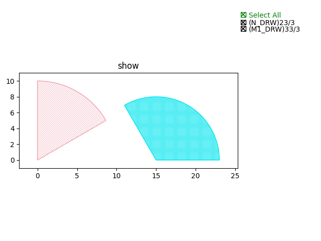

.. _api_elem_circle:

Circle
======

``fp.el.Circle`` creates a circular layout element or a circular sector on a
specified technology layer.

The function definition is available in
``fnpcell`` > ``element`` > ``circle.pyi``.

Parameters
----------

.. list-table::
   :widths: 22 22 46
   :header-rows: 1

   * - Parameter
     - Default
     - Description
   * - ``radius``
     - Required
     - Radius of the circle in layout units.
   * - ``initial_radians``
     - ``None``
     - Initial angle of the circular sector in radians.
   * - ``initial_degrees``
     - ``None``
     - Initial angle of the circular sector in degrees.
   * - ``final_radians``
     - ``None``
     - Final angle of the circular sector in radians.
   * - ``final_degrees``
     - ``None``
     - Final angle of the circular sector in degrees.
   * - ``origin``
     - ``None``
     - Center coordinate of the circle.
   * - ``transform``
     - Identity transform
     - Applies a geometric transform when the element is created.
   * - ``layer``
     - Required
     - Technology layer where the circle is drawn.

When no initial or final angle is specified, the element is a full circle.
The angular limits can be supplied in either radians or degrees.

Basic Usage
-----------

The following examples create two circular sectors with different radii,
origins, and angular ranges.

.. code-block:: python

    fp.el.Circle(
        radius=10,
        origin=(0, 0),
        initial_degrees=30,
        final_degrees=90,
        layer=TECH.LAYER.M1_DRW,
    )

    fp.el.Circle(
        radius=8,
        origin=(15, 0),
        initial_degrees=0,
        final_degrees=120,
        layer=TECH.LAYER.N_DRW,
    )

