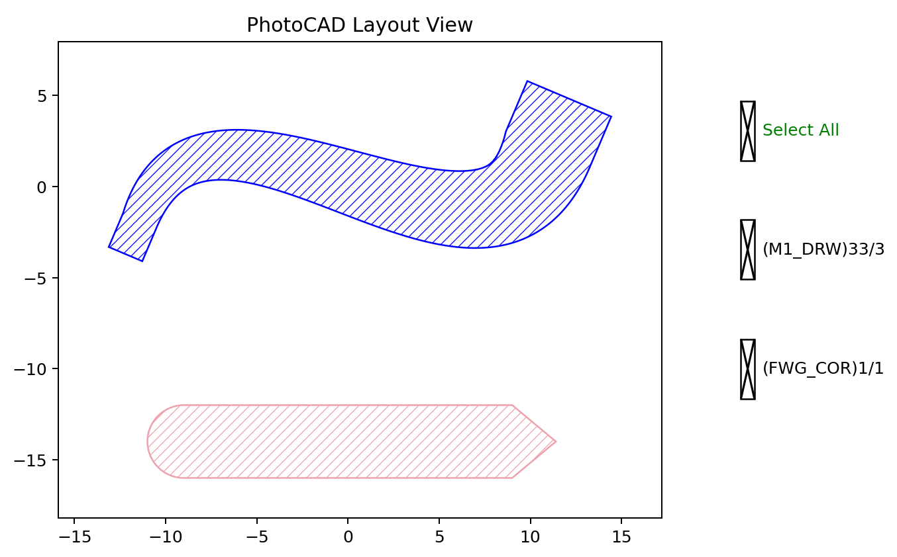

Curve
=====

``fp.el.Curve`` turns an existing geometric curve into a stroked layout
element. The supplied ``raw_curve`` defines the centerline, while the
remaining parameters control width, offset, end treatment, placement, and
layer.

The class definition is in ``fnpcell`` > ``element`` > ``curve.pyi``.

Parameters
----------

.. list-table::
   :header-rows: 1
   :widths: 20 25 25 45

   * - Parameter
     - Type
     - Example
     - Description
   * - ``raw_curve``
     - ``ICurve``
     - ``fp.g.Bezier(...)``
     - Geometric centerline to convert into a layout element.
   * - ``stroke_width``
     - ``float``
     - ``2``
     - Width at the start of the curve.
   * - ``final_stroke_width``
     - ``None`` or ``float``
     - ``5``
     - Width at the end. ``None`` keeps ``stroke_width``.
   * - ``stroke_offset``
     - ``float``
     - ``-0.5``
     - Offset from the centerline at the start.
   * - ``final_stroke_offset``
     - ``None`` or ``float``
     - ``1``
     - Offset from the centerline at the end. ``None`` keeps
       ``stroke_offset``.
   * - ``taper_function``
     - ``ITaperCallable``
     - ``fp.TaperFunction.LINEAR``
     - Controls width and offset interpolation along the curve.
   * - ``miter_limit``
     - ``None`` or ``float``
     - ``4``
     - Limits sharp mitered joins. This parameter is deprecated in PhotoCAD
       1.7.8 and may be removed in a later release.
   * - ``extension``
     - pair of ``float``
     - ``(2, 3)``
     - Straight extension lengths added at the start and end.
   * - ``line_cap``
     - pair of optional ``ILineCap``
     - ``(fp.el.LineCapRound(), fp.el.LineCapTriangle(ratio=0.5))``
     - Optional cap shapes at the start and end.
   * - ``origin``
     - ``None`` or point
     - ``(0, 0)``
     - Coordinate offset applied to the geometric curve.
   * - ``transform``
     - ``Affine2D``
     - ``fp.rotate(degrees=8)``
     - Geometric transform applied when the element is created.
   * - ``layer``
     - ``ILayer``
     - ``TECH.LAYER.FWG_COR``
     - Technology layer where the stroked curve is drawn.

Basic Usage
-----------

Create a geometric centerline first, then pass it to ``fp.el.Curve``. The
Bezier example covers the taper and transform parameters. ``cap_curve`` uses a
straight centerline without a transform so the two ``line_cap`` shapes can be
compared directly.

.. code-block:: python

   import fnpcell.all as fp
   from gpdk.technology import get_technology

   TECH = get_technology()

   raw_curve = fp.g.Bezier(
       start=(-12, 0),
       controls=[(-6, 10), (6, -10)],
       end=(12, 0),
   )

   curve = fp.el.Curve(
       raw_curve,
       stroke_width=2,
       final_stroke_width=5,
       stroke_offset=-0.5,
       final_stroke_offset=1,
       taper_function=fp.TaperFunction.LINEAR,
       miter_limit=4,
       extension=(2, 3),
       line_cap=(None, None),
       origin=(0, 0),
       transform=fp.rotate(degrees=8),
       layer=TECH.LAYER.FWG_COR,
   )

   cap_curve = fp.el.Curve(
       fp.g.Line(
           length=18,
           anchor=fp.Anchor.CENTER,
           origin=(0, -14),
       ),
       stroke_width=4,
       line_cap=(
           fp.el.LineCapRound(),
           fp.el.LineCapTriangle(ratio=0.6),
       ),
       layer=TECH.LAYER.M1_DRW,
   )

   examples = fp.Device(
       name="curve_examples",
       content=[curve, cap_curve],
   )
   fp.plot(examples)

