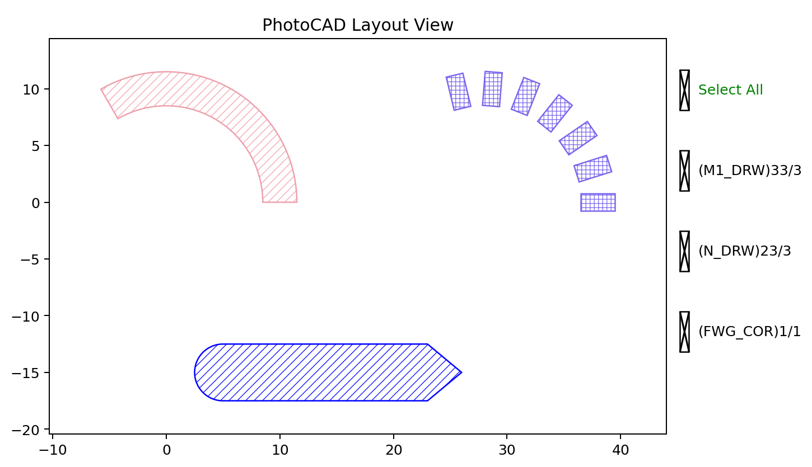

.. _api_elem_curve_paint:

CurvePaint
==========

``fp.el.CurvePaint`` provides factory methods that define how layout
elements are generated along a geometric curve. A curve paint can create a
continuous layer, place repeated patterns, use a custom sampler, combine
multiple paints, or build paints from a layer profile.

The function definitions are available in
``fnpcell`` > ``element`` > ``curve_paint.pyi``.

Factory Methods
---------------

``ContinuousLayer``
^^^^^^^^^^^^^^^^^^^^^^^

Creates a continuous stroked layer along a curve. The width and offset can
taper from their initial values to their final values.

.. code-block:: text

    ContinuousLayer(
        *,
        layer,
        width,
        offset=0,
        extension=(0, 0),
        final_offset=None,
        final_width=None,
        taper_function=TaperLinear(),
        line_cap=(None, None),
    )

``layer`` and ``width`` are required. ``offset`` positions the painted
layer relative to the curve, while ``final_offset`` and ``final_width``
define optional end values. ``extension`` adds straight lengths at the two
ends. ``taper_function`` controls the transition, and ``line_cap`` defines
the start and end cap shapes.

``PeriodicSampling``
^^^^^^^^^^^^^^^^^^^^^^^^

Places a repeated element or pattern factory along a curve at a specified
period. By default, each pattern is rotated to follow the curve direction.

.. code-block:: text

    PeriodicSampling(
        *,
        pattern=None,
        pattern_factory=None,
        period,
        reserved_ends=(0, 0),
        offset=0,
        final_offset=None,
        taper_function=TaperLinear(),
        rotate=True,
    )

``period`` is required. Supply either ``pattern`` or ``pattern_factory``
to define the repeated element. ``reserved_ends`` leaves unpainted lengths at
the start and end. ``offset``, ``final_offset``, and ``taper_function``
control the placement offset along the curve. ``rotate`` controls whether
each pattern follows the local curve direction.

``Sampling``
^^^^^^^^^^^^^^^^

Uses a custom curve sampler to determine the positions and elements placed
along a curve.

.. code-block:: text

    Sampling(
        *,
        sampler,
        offset=0,
        final_offset=None,
        taper_function=TaperLinear(),
        rotate=True,
    )

``sampler`` is required and provides the sampled positions and elements.
``offset``, ``final_offset``, and ``taper_function`` control the
placement offset, while ``rotate`` controls alignment with the curve.

``Composite``
^^^^^^^^^^^^^^^^^

Combines multiple curve paints so that they can be applied to the same curve
together.

.. code-block:: text

    Composite(paints)

``paints`` is an iterable containing the curve paints to combine.

``from_profile``
^^^^^^^^^^^^^^^^^^^^

Creates a composite curve paint from layer, offset, width, and extension
profiles. An optional final profile can define a taper along the curve.

.. code-block:: text

    from_profile(
        profile,
        *,
        taper_function=TaperLinear(),
        final_profile=None,
    )

``profile`` is a sequence containing a layer, its offset and width entries,
and its two end extensions. ``final_profile`` optionally defines the values
at the end of the curve, and ``taper_function`` controls the transition
between the two profiles.

Basic Usage
-----------

The first example paints a continuous ``M1_DRW`` strip along an arc. The
second example places rectangular ``N_DRW`` patterns periodically along
another arc. The final example isolates ``line_cap`` on a straight curve
without a transform so the rounded start and triangular end are easy to
compare.

.. code-block:: python

    continuous_curve = fp.g.Arc(
        radius=10,
        initial_degrees=0,
        final_degrees=120,
        origin=(0, 0),
    )
    continuous_paint = fp.el.CurvePaint.ContinuousLayer(
        layer=TECH.LAYER.M1_DRW,
        width=3,
    )
    continuous = continuous_paint(continuous_curve)

    pattern = fp.el.Rect(
        width=1.5,
        height=3,
        center=(0, 0),
        layer=TECH.LAYER.N_DRW,
    )
    periodic_curve = fp.g.Arc(
        radius=10,
        initial_degrees=0,
        final_degrees=120,
        origin=(28, 0),
    )
    periodic_paint = fp.el.CurvePaint.PeriodicSampling(
        pattern=pattern,
        period=3,
    )
    periodic = periodic_paint(periodic_curve)

    cap_curve = fp.g.Line(
        length=18,
        anchor=fp.Anchor.CENTER,
        origin=(14, -15),
    )
    cap_paint = fp.el.CurvePaint.ContinuousLayer(
        layer=TECH.LAYER.FWG_COR,
        width=5,
        line_cap=(
            fp.el.LineCapRound(),
            fp.el.LineCapTriangle(ratio=0.6),
        ),
    )
    capped = cap_paint(cap_curve)

