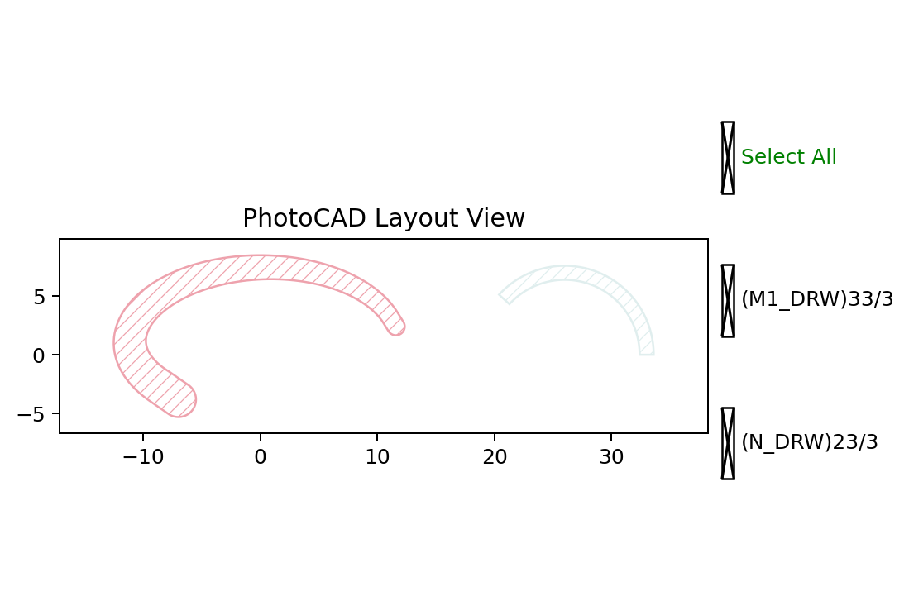

.. _api_elem_elliptical_arc:

EllipticalArc
=============

``fp.el.EllipticalArc`` creates a stroked elliptical arc on a specified
technology layer. Its horizontal and vertical radii can be set independently,
and the stroke can remain constant or taper along the arc.

The function definition is available in
``fnpcell`` > ``element`` > ``elliptical_arc.pyi``.

Parameters
----------

.. list-table::
   :widths: 18 24 27 41
   :header-rows: 1

   * - Parameter
     - Type
     - Example
     - Description
   * - ``radius``
     - ``Union[float, Sequence[float]]``
     - ``(12, 7)``
     - Horizontal and vertical centerline radii. A single value creates a circular arc.
   * - ``initial_radians``
     - ``Optional[float]``
     - ``0``
     - Initial angle in radians.
   * - ``initial_degrees``
     - ``Optional[float]``
     - ``20``
     - Initial angle in degrees.
   * - ``final_radians``
     - ``Optional[float]``
     - ``2.4``
     - Final angle in radians.
   * - ``final_degrees``
     - ``Optional[float]``
     - ``220``
     - Final angle in degrees.
   * - ``angle_step``
     - ``Optional[float]``
     - ``0.04``
     - Angular sampling step in radians.
   * - ``stroke_width``
     - ``float``
     - ``1.5``
     - Width at the start of the arc.
   * - ``final_stroke_width``
     - ``Optional[float]``
     - ``3``
     - Width at the end of the arc.
   * - ``stroke_offset``
     - ``float``
     - ``0.25``
     - Offset from the elliptical centerline at the start of the arc.
   * - ``final_stroke_offset``
     - ``Optional[float]``
     - ``1``
     - Offset from the elliptical centerline at the end of the arc.
   * - ``taper_function``
     - ``ITaperCallable``
     - ``fp.TaperFunction.LINEAR``
     - Controls how the width and offset change from start to end.
   * - ``extension``
     - ``Tuple[float, float]``
     - ``(1, 2)``
     - Straight extension lengths at the start and end of the arc.
   * - ``line_cap``
     - ``Tuple[Optional[ILineCap], Optional[ILineCap]]``
     - ``(fp.el.LineCapRound(), fp.el.LineCapRound())``
     - Optional cap shapes at the start and end of the arc.
   * - ``origin``
     - ``Optional[Point2D]``
     - ``(0, 0)``
     - Center coordinate of the ellipse.
   * - ``transform``
     - ``Affine2D``
     - ``fp.translate(0, 1)``
     - Applies a geometric transform when the element is created.
   * - ``layer``
     - ``ILayer``
     - ``TECH.LAYER.M1_DRW``
     - Technology layer where the arc is drawn.

For a two-value ``radius``, the first value is parallel to the x-axis and the
second is parallel to the y-axis. When no initial or final angle is specified,
the element follows a full ``360``-degree elliptical path.

Basic Usage
-----------

The following examples cover every parameter listed above. The first arc uses
two radii, degree angles, tapered width and offset, extensions, line caps, and a
transform. The second arc demonstrates a single radius and radian angle inputs.

.. code-block:: python

    elliptical_degrees = fp.el.EllipticalArc(
        radius=(12, 7),
        initial_degrees=20,
        final_degrees=220,
        angle_step=0.04,
        stroke_width=1.5,
        final_stroke_width=3,
        stroke_offset=0.25,
        final_stroke_offset=1,
        taper_function=fp.TaperFunction.LINEAR,
        extension=(1, 2),
        line_cap=(fp.el.LineCapRound(), fp.el.LineCapRound()),
        origin=(0, 0),
        transform=fp.translate(0, 1),
        layer=TECH.LAYER.M1_DRW,
    )

    elliptical_radians = fp.el.EllipticalArc(
        radius=7,
        initial_radians=0,
        final_radians=2.4,
        stroke_width=1.2,
        origin=(26, 0),
        layer=TECH.LAYER.N_DRW,
    )

