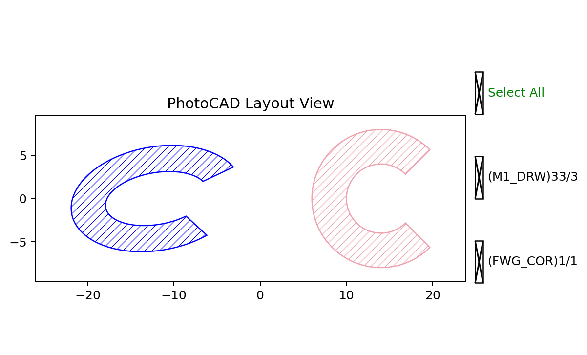

EllipticalRing
==============

``fp.el.EllipticalRing`` creates a filled elliptical ring or an elliptical
sector. The outer and inner radii may be specified independently along the
x- and y-axes.

The function definition is in ``fnpcell`` > ``element`` >
``elliptical_ring.pyi``.

Parameters
----------

.. list-table::
   :header-rows: 1
   :widths: 20 25 25 45

   * - Parameter
     - Type
     - Example
     - Description
   * - ``outer_radius``
     - ``float`` or sequence of ``float``
     - ``(10, 6)``
     - Outer radii along the x- and y-axes. A single value creates a circular
       outer boundary.
   * - ``inner_radius``
     - ``float`` or sequence of ``float``
     - ``(6, 3)``
     - Inner radii along the x- and y-axes. Use zero to create a filled
       elliptical sector.
   * - ``initial_radians``
     - ``None``, ``float``, or sequence of ``float``
     - ``math.pi / 4``
     - Initial angle in radians.
   * - ``initial_degrees``
     - ``None``, ``float``, or sequence of ``float``
     - ``20``
     - Initial angle in degrees. Do not use it together with
       ``initial_radians`` in the same instance.
   * - ``final_radians``
     - ``None``, ``float``, or sequence of ``float``
     - ``7 * math.pi / 4``
     - Final angle in radians.
   * - ``final_degrees``
     - ``None``, ``float``, or sequence of ``float``
     - ``300``
     - Final angle in degrees. Do not use it together with ``final_radians``
       in the same instance.
   * - ``angle_step``
     - ``None`` or ``float``
     - ``math.radians(2)``
     - Angular sampling step in radians. ``None`` selects an automatic value.
   * - ``origin``
     - ``None`` or point
     - ``(-12, 0)``
     - Center coordinate of the elliptical ring.
   * - ``transform``
     - ``Affine2D``
     - ``fp.rotate(degrees=10)``
     - Geometric transform applied when the element is created.
   * - ``layer``
     - ``ILayer``
     - ``TECH.LAYER.FWG_COR``
     - Technology layer where the element is drawn.

Basic Usage
-----------

The first instance uses degrees and different x- and y-radii. The second
instance uses radians and equal radii.

.. code-block:: python

   import math

   import fnpcell.all as fp
   from gpdk.technology import get_technology

   TECH = get_technology()

   ring_degrees = fp.el.EllipticalRing(
       outer_radius=(10, 6),
       inner_radius=(6, 3),
       initial_degrees=20,
       final_degrees=300,
       angle_step=math.radians(2),
       origin=(-12, 0),
       transform=fp.rotate(degrees=10),
       layer=TECH.LAYER.FWG_COR,
   )

   ring_radians = fp.el.EllipticalRing(
       outer_radius=8,
       inner_radius=4,
       initial_radians=math.pi / 4,
       final_radians=7 * math.pi / 4,
       origin=(14, 0),
       layer=TECH.LAYER.M1_DRW,
   )

   examples = fp.Device(
       name="elliptical_ring_examples",
       content=[ring_degrees, ring_radians],
   )
   fp.plot(examples)

