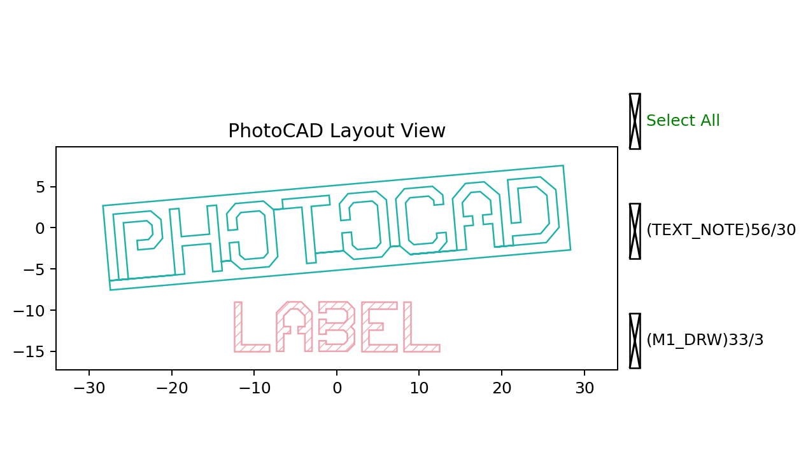

Label
=====

``fp.el.Label`` converts a text string into font-based layout geometry. It is
useful when lettering must be represented by polygons on a technology layer.

The class definition is in ``fnpcell`` > ``element`` > ``label.pyi``.

Parameters
----------

.. list-table::
   :header-rows: 1
   :widths: 20 25 25 45

   * - Parameter
     - Type
     - Example
     - Description
   * - ``content``
     - ``str``
     - ``"PHOTOCAD"``
     - Text to convert into label geometry.
   * - ``highlight``
     - ``bool``
     - ``True``
     - Selects the font's highlighted rendering when supported.
   * - ``anchor``
     - ``Anchor`` or ``Alignment``
     - ``fp.Alignment.MIDDLE_CENTER``
     - Alignment point used to place the generated label.
   * - ``at``
     - ``None``, point, ``IPositioned``, or ``IRay``
     - ``(0, 0)``
     - Target position for the selected anchor.
   * - ``font``
     - ``None`` or ``IFont``
     - ``FONT``
     - Font used to construct the label geometry.
   * - ``font_size``
     - ``None`` or ``float``
     - ``8``
     - Font size in layout units.
   * - ``transform``
     - ``Affine2D``
     - ``fp.rotate(degrees=5)``
     - Geometric transform applied when the element is created.
   * - ``layer``
     - ``ILayer``
     - ``TECH.LAYER.TEXT_NOTE``
     - Technology layer where the label geometry is drawn.

Basic Usage
-----------

The font object is imported from the GPDK technology. ``at`` and ``anchor``
together determine the label placement.

.. code-block:: python

   import fnpcell.all as fp
   from gpdk.technology import get_technology
   from gpdk.technology.fonts.font_std_vented import FONT

   TECH = get_technology()

   label = fp.el.Label(
       content="PHOTOCAD",
       highlight=True,
       anchor=fp.Alignment.MIDDLE_CENTER,
       at=(0, 0),
       font=FONT,
       font_size=8,
       transform=fp.rotate(degrees=5),
       layer=TECH.LAYER.TEXT_NOTE,
   )

   secondary = fp.el.Label(
       content="LABEL",
       highlight=False,
       anchor=fp.Alignment.MIDDLE_CENTER,
       at=(0, -12),
       font=FONT,
       font_size=6,
       layer=TECH.LAYER.M1_DRW,
   )

   examples = fp.Device(
       name="label_examples",
       content=[label, secondary],
   )
   fp.plot(examples)

