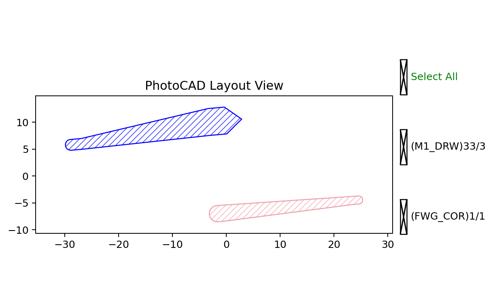

Line and LineBetween
====================

``fp.el.Line`` creates a straight stroked element from a length and an
anchor. ``fp.el.LineBetween`` creates the same type of element directly
between two coordinates.

Both function definitions are in ``fnpcell`` > ``element`` > ``line.pyi``.

Line Parameters
---------------

.. list-table::
   :header-rows: 1
   :widths: 20 25 25 45

   * - Parameter
     - Type
     - Example
     - Description
   * - ``length``
     - ``float``
     - ``24``
     - Length of the straight centerline.
   * - ``step``
     - ``None`` or ``float``
     - ``1``
     - Sampling distance along the centerline. ``None`` selects an automatic
       value.
   * - ``anchor``
     - ``Anchor``
     - ``fp.Anchor.CENTER``
     - Places the start, center, or end of the line at ``origin``.
   * - ``stroke_width``
     - ``float``
     - ``2``
     - Width at the start of the line.
   * - ``final_stroke_width``
     - ``None`` or ``float``
     - ``5``
     - Width at the end of the line. ``None`` keeps ``stroke_width``.
   * - ``stroke_offset``
     - ``float``
     - ``-1``
     - Offset from the centerline at the start.
   * - ``final_stroke_offset``
     - ``None`` or ``float``
     - ``1``
     - Offset from the centerline at the end. ``None`` keeps
       ``stroke_offset``.
   * - ``taper_function``
     - ``ITaperCallable``
     - ``fp.TaperFunction.LINEAR``
     - Controls the width and offset interpolation from start to end.
   * - ``extension``
     - pair of ``float``
     - ``(2, 3)``
     - Straight extension lengths added at the start and end.
   * - ``line_cap``
     - pair of optional ``ILineCap``
     - ``(fp.el.LineCapRound(), fp.el.LineCapTriangle(ratio=0.6))``
     - Optional cap shapes at the start and end.
   * - ``origin``
     - ``None`` or point
     - ``(-15, 8)``
     - Placement coordinate interpreted according to ``anchor``.
   * - ``transform``
     - ``Affine2D``
     - ``fp.rotate(degrees=5)``
     - Geometric transform applied when the element is created.
   * - ``layer``
     - ``ILayer``
     - ``TECH.LAYER.FWG_COR``
     - Technology layer where the line is drawn.

LineBetween Parameters
----------------------

.. list-table::
   :header-rows: 1
   :widths: 20 25 25 45

   * - Parameter
     - Type
     - Example
     - Description
   * - ``start``
     - point
     - ``(-12, -8)``
     - Start coordinate of the centerline.
   * - ``end``
     - point
     - ``(12, -4)``
     - End coordinate of the centerline.
   * - ``step``
     - ``None`` or ``float``
     - ``1``
     - Sampling distance along the centerline. ``None`` selects an automatic
       value.
   * - ``stroke_width``
     - ``float``
     - ``3``
     - Width at the start of the line.
   * - ``final_stroke_width``
     - ``None`` or ``float``
     - ``1.5``
     - Width at the end of the line. ``None`` keeps ``stroke_width``.
   * - ``stroke_offset``
     - ``float``
     - ``0``
     - Offset from the centerline at the start.
   * - ``final_stroke_offset``
     - ``None`` or ``float``
     - ``0.5``
     - Offset from the centerline at the end. ``None`` keeps
       ``stroke_offset``.
   * - ``taper_function``
     - ``ITaperCallable``
     - ``fp.TaperFunction.LINEAR``
     - Controls the width and offset interpolation from start to end.
   * - ``extension``
     - pair of ``float``
     - ``(1, 1)``
     - Straight extension lengths added at the start and end.
   * - ``line_cap``
     - pair of optional ``ILineCap``
     - ``(fp.el.LineCapRound(), fp.el.LineCapRound())``
     - Optional cap shapes at the start and end.
   * - ``origin``
     - ``None`` or point
     - ``(12, 0)``
     - Coordinate offset applied to both ``start`` and ``end``.
   * - ``transform``
     - ``Affine2D``
     - ``fp.rotate(degrees=-5)``
     - Geometric transform applied when the element is created.
   * - ``layer``
     - ``ILayer``
     - ``TECH.LAYER.M1_DRW``
     - Technology layer where the line is drawn.

Basic Usage
-----------

The examples show a tapered ``Line`` and a ``LineBetween`` constructed from
two explicit coordinates.

.. code-block:: python

   import fnpcell.all as fp
   from gpdk.technology import get_technology

   TECH = get_technology()

   tapered_line = fp.el.Line(
       length=24,
       step=1,
       anchor=fp.Anchor.CENTER,
       stroke_width=2,
       final_stroke_width=5,
       stroke_offset=-1,
       final_stroke_offset=1,
       taper_function=fp.TaperFunction.LINEAR,
       extension=(2, 3),
       line_cap=(
           fp.el.LineCapRound(),
           fp.el.LineCapTriangle(ratio=0.6),
       ),
       origin=(-15, 8),
       transform=fp.rotate(degrees=5),
       layer=TECH.LAYER.FWG_COR,
   )

   connected_line = fp.el.LineBetween(
       start=(-12, -8),
       end=(12, -4),
       step=1,
       stroke_width=3,
       final_stroke_width=1.5,
       stroke_offset=0,
       final_stroke_offset=0.5,
       taper_function=fp.TaperFunction.LINEAR,
       extension=(1, 1),
       line_cap=(fp.el.LineCapRound(), fp.el.LineCapRound()),
       origin=(12, 0),
       transform=fp.rotate(degrees=-5),
       layer=TECH.LAYER.M1_DRW,
   )

   examples = fp.Device(
       name="line_examples",
       content=[tapered_line, connected_line],
   )
   fp.plot(examples)

