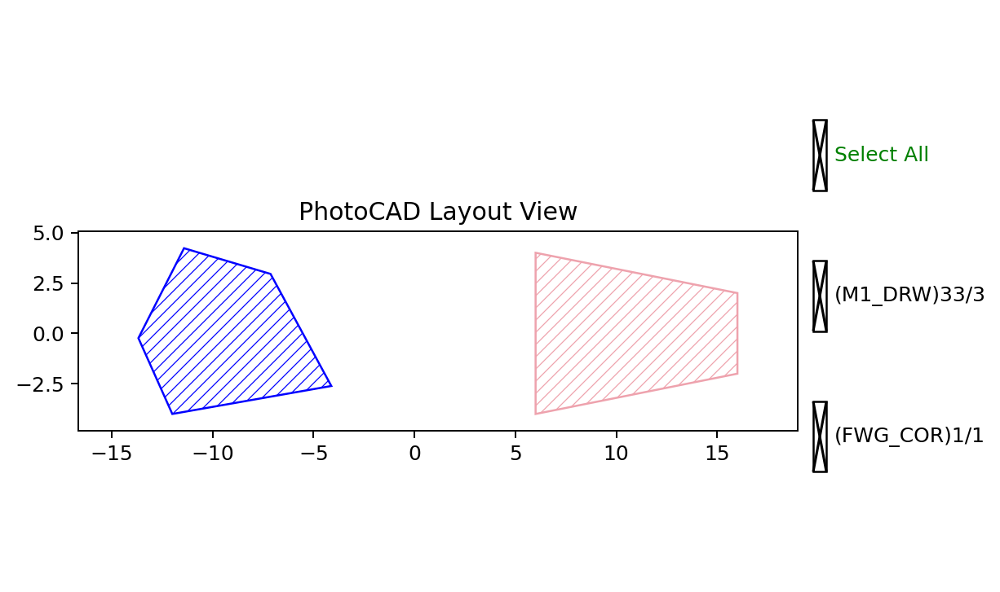

Polygon
========

``fp.el.Polygon`` creates a filled polygon from a point sequence or an
existing geometric shape. The points are connected in order and the last
point is joined back to the first.

The class definition is in ``fnpcell`` > ``element`` > ``polygon.pyi``.

Parameters
----------

.. list-table::
   :header-rows: 1
   :widths: 20 25 25 45

   * - Parameter
     - Type
     - Example
     - Description
   * - ``raw_shape``
     - ``IShape`` or sequence of points
     - ``[(0, 0), (8, 0), (6, 6), (2, 8)]``
     - Boundary geometry used to create the polygon.
   * - ``origin``
     - ``None`` or point
     - ``(-12, -4)``
     - Coordinate offset applied to the supplied shape.
   * - ``transform``
     - ``Affine2D``
     - ``fp.rotate(degrees=10)``
     - Geometric transform applied when the element is created.
   * - ``layer``
     - ``ILayer``
     - ``TECH.LAYER.FWG_COR``
     - Technology layer where the polygon is drawn.

Basic Usage
-----------

The point sequence can describe any non-self-intersecting boundary required
by a layout.

.. code-block:: python

   import fnpcell.all as fp
   from gpdk.technology import get_technology

   TECH = get_technology()

   polygon = fp.el.Polygon(
       raw_shape=[(0, 0), (8, 0), (6, 6), (2, 8), (-1, 4)],
       origin=(-12, -4),
       transform=fp.rotate(degrees=10),
       layer=TECH.LAYER.FWG_COR,
   )

   trapezoid = fp.el.Polygon(
       raw_shape=[(0, -4), (10, -2), (10, 2), (0, 4)],
       origin=(6, 0),
       layer=TECH.LAYER.M1_DRW,
   )

   examples = fp.Device(
       name="polygon_examples",
       content=[polygon, trapezoid],
   )
   fp.plot(examples)

