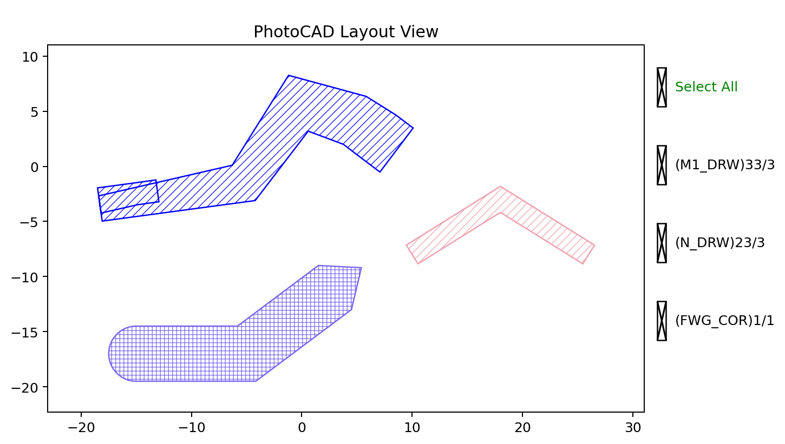

Polyline
========

``fp.el.Polyline`` creates a stroked path through a sequence of points. Its
width and offset may vary from the first point to the last, and optional end
orientations and cap shapes can control both ends.

The class definition is in ``fnpcell`` > ``element`` > ``polyline.pyi``.

Parameters
----------

.. list-table::
   :header-rows: 1
   :widths: 20 25 25 45

   * - Parameter
     - Type
     - Example
     - Description
   * - ``raw_polyline_points``
     - sequence of points
     - ``[(0, 0), (10, 0), (16, 6)]``
     - Ordered centerline vertices.
   * - ``stroke_width``
     - ``float``
     - ``2``
     - Width at the start of the polyline.
   * - ``final_stroke_width``
     - ``None`` or ``float``
     - ``5``
     - Width at the end. ``None`` keeps ``stroke_width``.
   * - ``stroke_offset``
     - ``float``
     - ``-0.5``
     - Offset from the centerline at the start.
   * - ``final_stroke_offset``
     - ``None`` or ``float``
     - ``0.8``
     - Offset from the centerline at the end. ``None`` keeps
       ``stroke_offset``.
   * - ``taper_function``
     - ``ITaperCallable``
     - ``fp.TaperFunction.LINEAR``
     - Controls width and offset interpolation along the path.
   * - ``raw_end_orientations``
     - ``None`` or pair of ``float``
     - ``(0, -math.pi / 4)``
     - Optional start and end tangent orientations in radians.
   * - ``miter_limit``
     - ``None`` or ``float``
     - ``4``
     - Limits the length of sharp mitered corners. This parameter is
       deprecated in PhotoCAD 1.7.8.
   * - ``extension``
     - pair of ``float``
     - ``(2, 2)``
     - Straight extension lengths added at the start and end.
   * - ``line_cap``
     - pair of optional ``ILineCap``
     - ``(fp.el.LineCapRound(), fp.el.LineCapTriangle(ratio=0.5))``
     - Optional cap shapes at the start and end.
   * - ``origin``
     - ``None`` or point
     - ``(-15, -3)``
     - Coordinate offset applied to the point sequence.
   * - ``transform``
     - ``Affine2D``
     - ``fp.rotate(degrees=8)``
     - Geometric transform applied when the element is created.
   * - ``layer``
     - ``ILayer``
     - ``TECH.LAYER.FWG_COR``
     - Technology layer where the polyline is drawn.

Basic Usage
-----------

The first example exercises width, offset, tangent, corner, extension, and
transform controls. The second shows a constant-width polyline.
``cap_polyline`` uses simple raw coordinates without a transform so its rounded
start and triangular end can be inspected directly.

.. code-block:: python

   import math

   import fnpcell.all as fp
   from gpdk.technology import get_technology

   TECH = get_technology()

   tapered_polyline = fp.el.Polyline(
       raw_polyline_points=[(0, 0), (10, 0), (16, 6), (22, 2)],
       stroke_width=2,
       final_stroke_width=5,
       stroke_offset=-0.5,
       final_stroke_offset=0.8,
       taper_function=fp.TaperFunction.LINEAR,
       raw_end_orientations=(0, -math.pi / 4),
       miter_limit=4,
       extension=(2, 2),
       line_cap=(None, None),
       origin=(-15, -3),
       transform=fp.rotate(degrees=8),
       layer=TECH.LAYER.FWG_COR,
   )

   constant_polyline = fp.el.Polyline(
       raw_polyline_points=[(-8, -8), (0, -3), (8, -8)],
       stroke_width=2,
       origin=(18, 0),
       layer=TECH.LAYER.M1_DRW,
   )

   cap_polyline = fp.el.Polyline(
       raw_polyline_points=[(-15, -17), (-5, -17), (3, -11)],
       stroke_width=5,
       line_cap=(
           fp.el.LineCapRound(),
           fp.el.LineCapTriangle(ratio=0.6),
       ),
       layer=TECH.LAYER.N_DRW,
   )

   examples = fp.Device(
       name="polyline_examples",
       content=[tapered_polyline, constant_polyline, cap_polyline],
   )
   fp.plot(examples)

