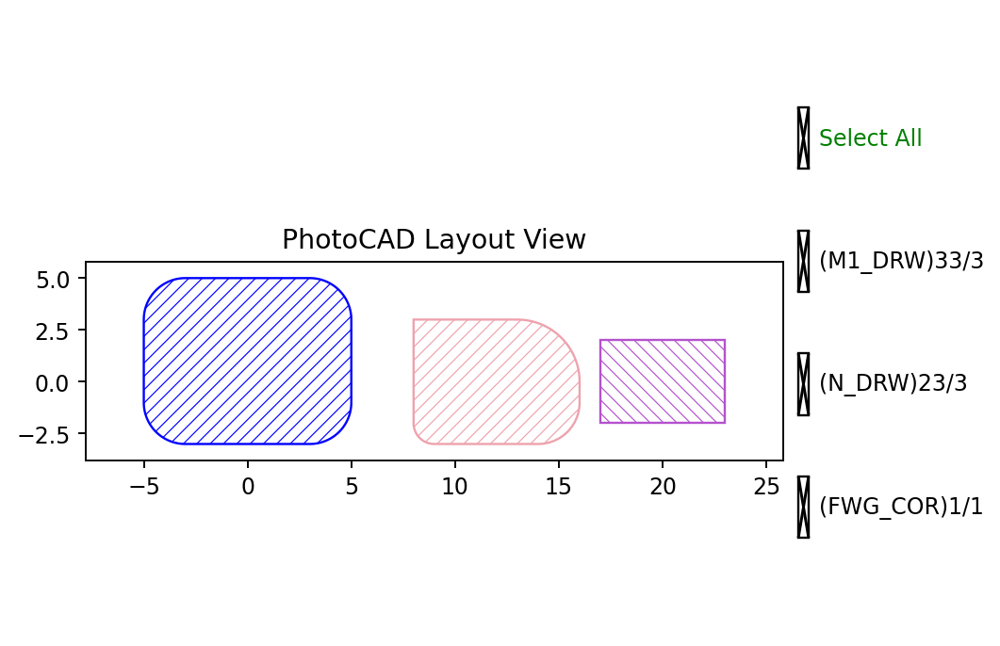

.. _api_elem_rect:

Rect
====

``fp.el.Rect`` creates a rectangular layout element on a specified technology
layer. It is a primitive element API under ``fp.el`` and is used when a layout
needs a simple rectangular shape.

The function definition can be checked in
``fnpcell`` > ``element`` > ``rect.pyi``. Through ``fnpcell.all``, the
lower-level ``rect`` factory is exposed as ``fp.el.Rect``.

Parameters
----------

.. list-table::
   :widths: 22 22 46
   :header-rows: 1

   * - Parameter
     - Default
     - Description
   * - ``width``
     - Required
     - Rectangle width in layout units.
   * - ``height``
     - Required
     - Rectangle height in layout units.
   * - ``corner_radius``
     - ``0``
     - Radius of the rectangle corner. A single number rounds all corners.
       A sequence can be used to control different corners.
   * - ``bottom_left``
     - ``None``
     - Places the rectangle by its bottom-left coordinate.
   * - ``origin``
     - ``None``
     - Alternative placement coordinate supported by the factory function.
   * - ``center``
     - ``None``
     - Places the rectangle by its center coordinate.
   * - ``transform``
     - Identity transform
     - Applies a geometric transform when the element is created.
   * - ``layer``
     - Required
     - Technology layer where the rectangle is drawn.

Basic Usage
-----------

The common usage is to provide the rectangle size, position, and layer.
``center`` places the rectangle by its center point, while ``bottom_left``
places it by its lower-left corner.

.. code-block:: python

    import fnpcell.all as fp
    from gpdk.technology import get_technology

    TECH = get_technology()

    rect_core = fp.el.Rect(
        width=10,
        height=10,
        center=(0, 0),
        layer=TECH.LAYER.FWG_COR,
    )

    rect_metal = fp.el.Rect(
        width=8,
        height=8,
        center=(10, 0),
        corner_radius=2,
        layer=TECH.LAYER.M1_DRW,
    )

    rect_examples = fp.Device(name="rect_examples", content=[rect_core, rect_metal])
    fp.plot(rect_examples)

``rect_core`` creates a normal rectangle on ``TECH.LAYER.FWG_COR``.
``rect_metal`` creates a rounded rectangle on ``TECH.LAYER.M1_DRW`` by setting
``corner_radius``.

Placement
---------

Use ``center`` when the rectangle should be placed around a central point. Use
``bottom_left`` when the rectangle should start from a known lower-left
coordinate.

.. code-block:: python

    centered_rect = fp.el.Rect(
        width=10,
        height=5,
        center=(0, 0),
        layer=TECH.LAYER.M1_DRW,
    )

    bottom_left_rect = fp.el.Rect(
        width=10,
        height=5,
        bottom_left=(0, 0),
        layer=TECH.LAYER.M1_DRW,
    )

If neither ``center`` nor ``bottom_left`` is provided, the position can become
ambiguous, so it is better to write one of them explicitly.

The element can also be reused after creation. For example, a rectangle can be
moved with ``translated``:

.. code-block:: python

    moved_rect = centered_rect.translated(15, 0)
