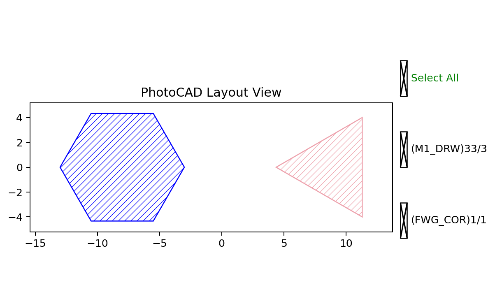

RegularPolygon
==============

``fp.el.RegularPolygon`` creates a polygon whose sides have equal lengths and
whose vertices are equally spaced around its center.

The function definition is in ``fnpcell`` > ``element`` >
``regular_polygon.pyi``.

Parameters
----------

.. list-table::
   :header-rows: 1
   :widths: 20 25 25 45

   * - Parameter
     - Type
     - Example
     - Description
   * - ``sides``
     - ``int``
     - ``6``
     - Number of polygon sides.
   * - ``side_length``
     - ``float``
     - ``5``
     - Length of every side in layout units.
   * - ``origin``
     - ``None`` or point
     - ``(-8, 0)``
     - Center coordinate of the polygon.
   * - ``transform``
     - ``Affine2D``
     - ``fp.rotate(degrees=30)``
     - Geometric transform applied when the element is created.
   * - ``layer``
     - ``ILayer``
     - ``TECH.LAYER.FWG_COR``
     - Technology layer where the polygon is drawn.

Basic Usage
-----------

Changing ``sides`` changes the polygon family while ``side_length`` controls
its scale.

.. code-block:: python

   import fnpcell.all as fp
   from gpdk.technology import get_technology

   TECH = get_technology()

   hexagon = fp.el.RegularPolygon(
       sides=6,
       side_length=5,
       origin=(-8, 0),
       transform=fp.rotate(degrees=30),
       layer=TECH.LAYER.FWG_COR,
   )

   triangle = fp.el.RegularPolygon(
       sides=3,
       side_length=8,
       origin=(9, 0),
       layer=TECH.LAYER.M1_DRW,
   )

   examples = fp.Device(
       name="regular_polygon_examples",
       content=[hexagon, triangle],
   )
   fp.plot(examples)

