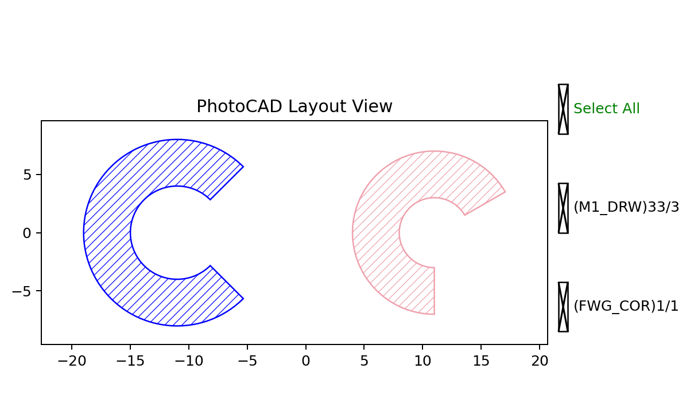

Ring
====

``fp.el.Ring`` creates a filled circular ring or annular sector. The outer
radius defines the outside boundary and the inner radius defines the opening.

The function definition is in ``fnpcell`` > ``element`` > ``ring.pyi``.

Parameters
----------

.. list-table::
   :header-rows: 1
   :widths: 20 25 25 45

   * - Parameter
     - Type
     - Example
     - Description
   * - ``outer_radius``
     - ``float``
     - ``8``
     - Radius of the outer circular boundary.
   * - ``inner_radius``
     - ``float``
     - ``4``
     - Radius of the inner circular boundary. Use zero for a filled sector.
   * - ``initial_radians``
     - ``None``, ``float``, or sequence of ``float``
     - ``math.pi / 6``
     - Initial angle in radians.
   * - ``initial_degrees``
     - ``None``, ``float``, or sequence of ``float``
     - ``30``
     - Initial angle in degrees. Do not use it together with
       ``initial_radians`` in the same instance.
   * - ``final_radians``
     - ``None``, ``float``, or sequence of ``float``
     - ``3 * math.pi / 2``
     - Final angle in radians.
   * - ``final_degrees``
     - ``None``, ``float``, or sequence of ``float``
     - ``300``
     - Final angle in degrees. Do not use it together with ``final_radians``
       in the same instance.
   * - ``angle_step``
     - ``None`` or ``float``
     - ``math.radians(2)``
     - Angular sampling step in radians. ``None`` selects an automatic value.
   * - ``origin``
     - ``None`` or point
     - ``(-11, 0)``
     - Center coordinate of the ring.
   * - ``transform``
     - ``Affine2D``
     - ``fp.rotate(degrees=15)``
     - Geometric transform applied when the element is created.
   * - ``layer``
     - ``ILayer``
     - ``TECH.LAYER.FWG_COR``
     - Technology layer where the element is drawn.

Basic Usage
-----------

Use either degrees or radians to delimit an annular sector. A complete ring
can be created by omitting all four angle parameters.

.. code-block:: python

   import math

   import fnpcell.all as fp
   from gpdk.technology import get_technology

   TECH = get_technology()

   ring_degrees = fp.el.Ring(
       outer_radius=8,
       inner_radius=4,
       initial_degrees=30,
       final_degrees=300,
       angle_step=math.radians(2),
       origin=(-11, 0),
       transform=fp.rotate(degrees=15),
       layer=TECH.LAYER.FWG_COR,
   )

   ring_radians = fp.el.Ring(
       outer_radius=7,
       inner_radius=3,
       initial_radians=math.pi / 6,
       final_radians=3 * math.pi / 2,
       origin=(11, 0),
       layer=TECH.LAYER.M1_DRW,
   )

   examples = fp.Device(
       name="ring_examples",
       content=[ring_degrees, ring_radians],
   )
   fp.plot(examples)

