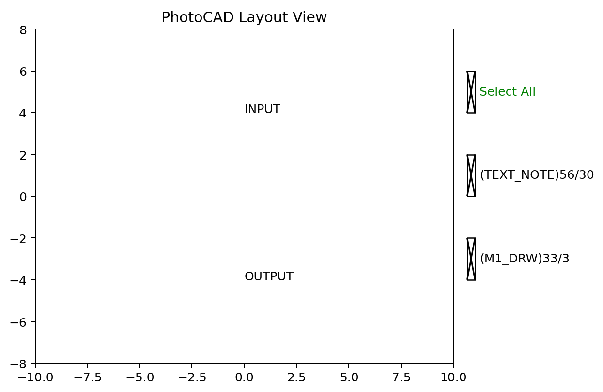

Text
====

``fp.el.Text`` creates a non-polygon text annotation on a technology layer.
It stores the string as text rather than converting the characters into font
outlines.

The class definition is in ``fnpcell`` > ``element`` > ``text.pyi``.

Parameters
----------

.. list-table::
   :header-rows: 1
   :widths: 20 25 25 45

   * - Parameter
     - Type
     - Example
     - Description
   * - ``content``
     - ``str``
     - ``"INPUT"``
     - Text string stored by the element.
   * - ``anchor``
     - ``Alignment``
     - ``fp.Alignment.MIDDLE_CENTER``
     - Alignment point used to place the text.
   * - ``at``
     - ``None``, point, ``IPositioned``, or ``IRay``
     - ``(0, 4)``
     - Target position for the selected anchor.
   * - ``transform``
     - ``Affine2D``
     - ``fp.rotate(degrees=10)``
     - Geometric transform applied when the element is created.
   * - ``layer``
     - ``ILayer``
     - ``TECH.LAYER.TEXT_NOTE``
     - Technology layer assigned to the text element.

Basic Usage
-----------

Use ``anchor`` and ``at`` to place text relative to a known point.

.. code-block:: python

   import fnpcell.all as fp
   import matplotlib.pyplot as plt
   from gpdk.technology import get_technology

   TECH = get_technology()

   input_text = fp.el.Text(
       content="INPUT",
       anchor=fp.Alignment.MIDDLE_CENTER,
       at=(0, 4),
       transform=fp.rotate(degrees=10),
       layer=TECH.LAYER.TEXT_NOTE,
   )

   output_text = fp.el.Text(
       content="OUTPUT",
       anchor=fp.Alignment.MIDDLE_CENTER,
       at=(0, -4),
       layer=TECH.LAYER.M1_DRW,
   )

   examples = fp.Device(
       name="text_examples",
       content=[input_text, output_text],
   )
   fp.plot(examples)
   plt.xlim(-10, 10)
   plt.ylim(-8, 8)

``Text`` does not create filled polygon geometry and therefore does not
contribute to automatic polygon bounds. The explicit axis limits keep the
text visible in the preview. Use ``fp.el.Label`` when the characters must be
converted into polygon lettering.

