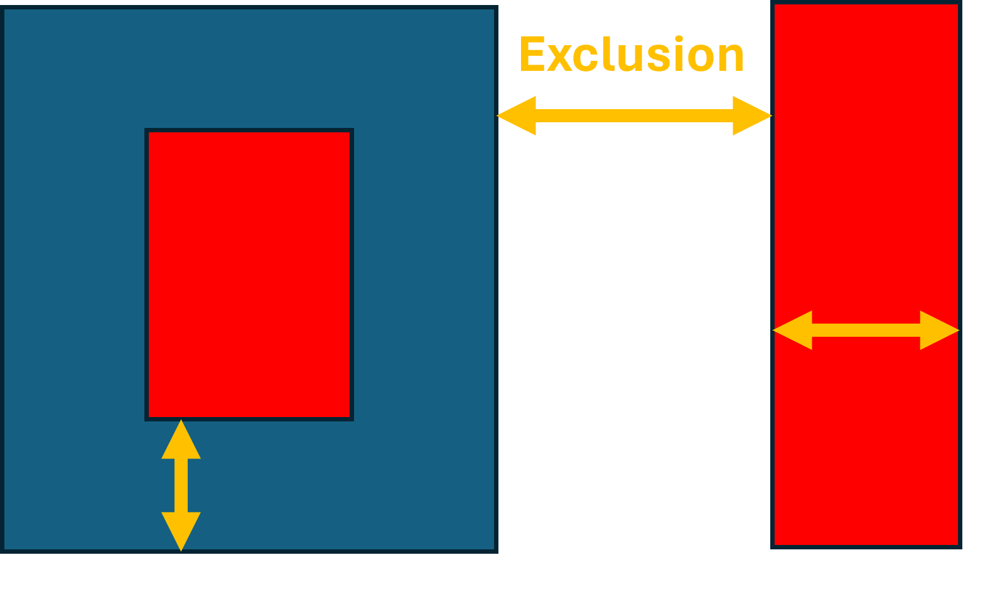
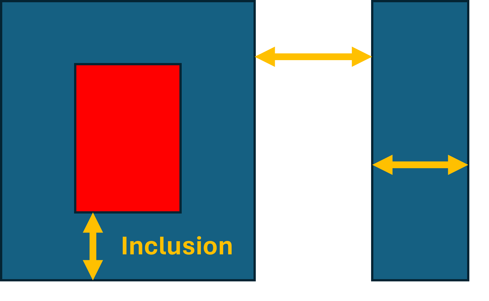
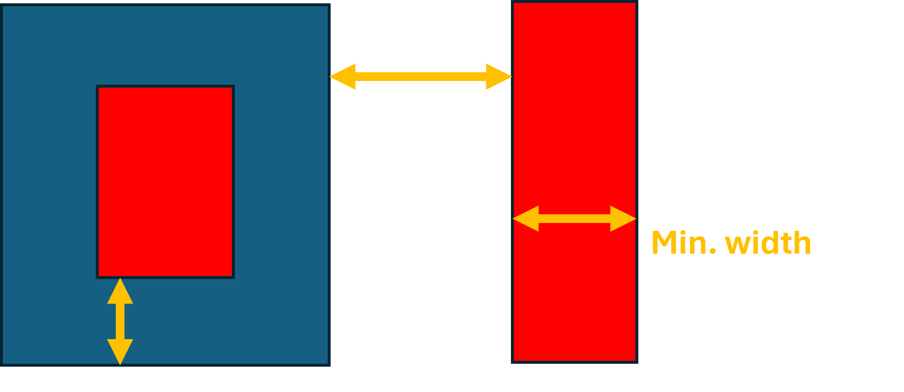
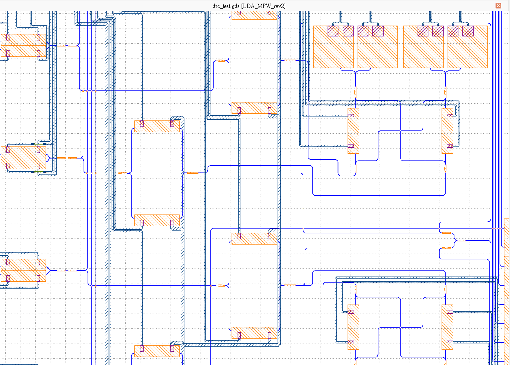
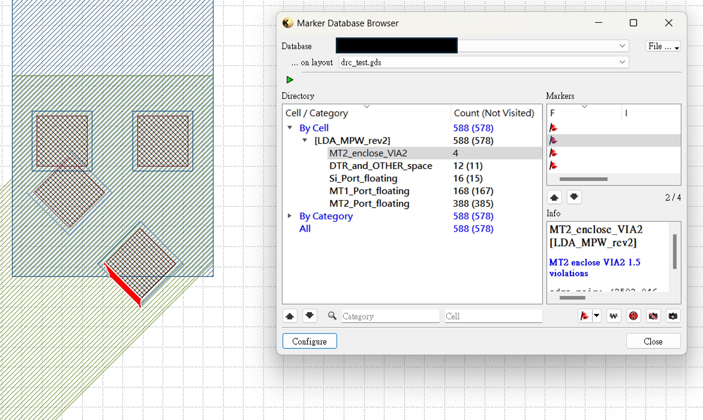

Design rule check(DRC)
==============================

What is DRC?
--------------------
Design Rule Check (DRC) is a crucial step in the photonics/electronic design automation (EDA) process for photonics integrated circuits (PICs). It is a verification process that ensures the compliance of a photonics layout or design with a set of predefined rules and constraints. The primary goal of DRC is to identify and rectify potential issues or violations in the layout that could lead to manufacturing defects, reliability issues, or functional failures in the final product.

DRC is an integral part of the PICs design flow, typically performed after the completion of the physical layout but before the fabrication process begins. It helps ensure that the design adheres to the specifications provided by the foundry or fabrication facility.

Most common type of design rules are:

1. Exclusion_
2. Inclusion_
3. Minimum_width_
4. Other rules provided by specific foundries

Exclusion
^^^^^^^^^^^^^^^^^

Specifies the minimum allowable distance between adjacent features (such as waveguides, metal layers) to prevent optical crosstalk or electrical interference

Inclusion
^^^^^^^^^^^^^^

Specifies the minimum distance between the edge of a feature and the nearest edge of an adjacent feature, ensuring proper isolation.

Minimum_width
^^^^^^^^^^^^^^^^^^

Defines the minimum allowable width for waveguides or other features to ensure proper functionality and manufacturability.

DRC check in KLayout
---------------------------

View designs in KLayout
^^^^^^^^^^^^^^^^^^^^^^^^^
After designing your chip in **PhotoCAD**, a GDS file will be generated and you can view your designs in a license-free software KLayout. For example, here we show a complicated circuit with complex waveguide and metal routing.

Import DRC file to KLayout
^^^^^^^^^^^^^^^^^^^^^^^^^^^^^^^^
Next, select the "DRC" from "Tools" and import the DRC file (.lydrc) of the specific foundry. It can be easily done by dragging the file into KLayout. DRC file contains a set of instructions and parameters that define the design rules and constraints to be verified during the DRC process. This file serves as input to KLayout, guiding the verification process and enabling the tool to check the physical layout against the specified criteria.

View design rule errors
^^^^^^^^^^^^^^^^^^^^^^^^^^^^^^^^
After the DRC process is done, a DRC result file will be exported and you can those errors in the "Marker Browser" from "Tools".

All errors from the same rule will be collected together and will be marked red in the layout.

Make adjustments or waive the error
^^^^^^^^^^^^^^^^^^^^^^^^^^^^^^^^^^^^^
Then, it is time to make necessary adjustments to the layout to correct the identified violations. This may involve modifying the placement, dimensions, or other characteristics of the components to ensure compliance with the design rules.

Design rule check often need to be done several times until the layout is error-free and meets all design rule requirements. Sometimes it is possible to waive the errors and it must be done after discussion with the foundry.

