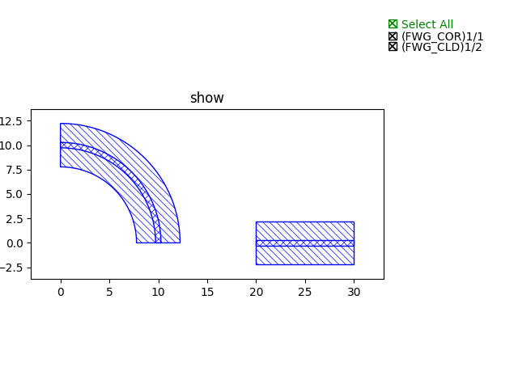

Common used transformation
===================================

Transformation functions are useful when one needs to move or mirror the instance(PCells) to other places. These functions can be used for the PCells multiple times and combine them together.

1. place_
2. translated_
3. scaled_
4. rotated_
5. mirrored_

place
^^^^^^^^

* This function is often used when one needs to place an instance(PCell) to a place where refers to another instance's position. Let's say there are two devices(``device_A(bend)``, ``device_B(straight)``) and we wish to move the ``device_A`` to a specific place where related to the position of ``device_B``.

* ``new_device_A = fp.place(device_A, “port_A”, at=device_B[”port_B”])``

     In this method, the two ports will be connected.

     .. image:: ../images/fpPlaceEx1.png

* ``new_device_A = fp.place(device_A, “port_A”, at=device_B[”port_B”].position)``

     In this method, ``port_A`` will be placing at the position of ``port_B`` but remaining the port orientation.

     .. image:: ../images/fpPlaceEx2.png
* ``new_device_A = fp.place(device_A, “port_A”, at=device_B[”port_B”]).translated(x, y)``

     In this method, ``port_A`` will first be aligned to ``port_B`` and move to ``(x, y)`` related to ``port_B``.

     .. image:: ../images/fpPlaceEx3.png
* ``new_device_A = fp.place(device_A, “port_A”, at=device_B[”port_B”].rotated(degrees=-90))``

     In this method, ``port_A`` will be connected to  ``port_B`` with an angle difference of 90 degrees.

     .. image:: ../images/fpPlaceEx4.png
translated
^^^^^^^^^^^^^^^^^^

* Usage: insts.translated()
* parameters: tx, ty
* ``DirectionalCouplerBend().translated(10, 10)``: origin of the cell is translated to (10, 10).
* The origin of the cell can be defined in the PCell

scaled
^^^^^^^^^

* Usage: insts.scaled()
* parameters: sx, sy
* ``DirectionalCouplerBend().scaled(3)``: the cell is magnify both x and y coordinate to three times larger than origin.
* ``DirectionalCouplerBend().scaled(3, 2)``: the cell is magnify three time larger on the x-axis and two times larger on the y-axis than origin.

rotated
^^^^^^^^

* Usage: insts.rotated()
* parameters: degrees, radians, origin
* ``DirectionalCouplerBend().rotated(degrees=90)``: the cell rotated 90 degree based on the origin of the cell.

mirrored
^^^^^^^^^^^^^^^

* Usage: insts.*_mirrored()

* c_mirrored(): mirroring the cell with regard to the origin (0, 0).

* v_mirrored(): mirroring the cell with regard to the y-axis.

* h_mirrored(): mirroring the cell with regard to the x-axis.

