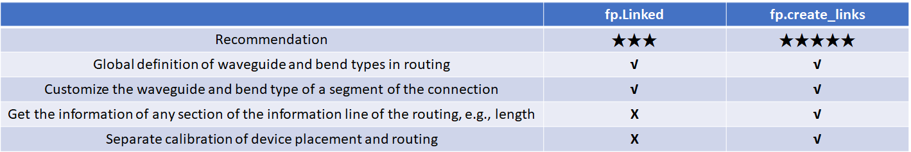
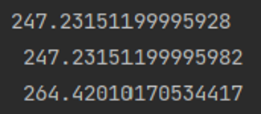
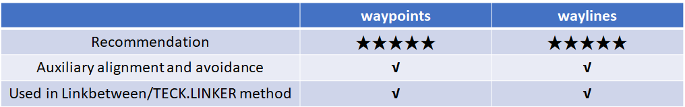
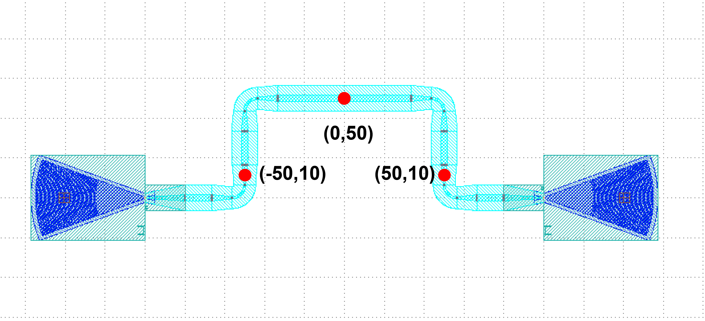
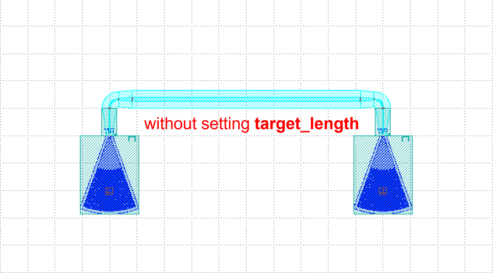

Waveguide Routing
=======================

Single-port to Single-port
-------------------------------

There are a total of three types of connections from single port to single port:

1. ``fp.LinkBetween``
2. ``TECH.LINKER``
3. ``>>``

Here's a comparison of the three options

Among them, ``LinkBetween`` is relatively flexible and ``LINKER`` is relatively short and neat.

Examples
^^^^^^^^^^^^^
::

    # Interconnecting device ports by calling fp.create_links
    device = fp.create_links(
        link_type=TECH.WG.FWG.C.EXPANDED, # Define the type of straight waveguide in automatic routing
        bend_factory=TECH.WG.FWG.C.WIRE.BEND_CIRCULAR, # Define the type of bend during automatic routing
        # Define the connection relationship between device ports in specs
        specs=[
            gc1["op_0"] >> fp.Waypoint(-50, -50, 0) >> gc4["op_0"],  # Use >> to define connection relationships
            # Use LINKER to define the interconnection of the specified device port
            TECH.LINKER.SWG_WIRE_FWG_EULER(
                start=gc2["op_0"],
                end=gc5["op_0"],
                waypoints=[fp.Waypoint(0, 50, 0)]
            ),
            # Use LinkBetween to define a separate segment of the connection, and you can modify the type of the straight waveguide and bend with parameters.
            fp.LinkBetween(
                start=gc3["op_0"],
                end=gc6["op_0"],
                link_type=TECH.WG.SWG.C.EXPANDED,
                bend_factory=TECH.WG.SWG.C.WIRE.BEND_CIRCULAR,
                waypoints=[fp.Waypoint(50, 150, 0)]
            ),
        ],
    )

    insts += device  # Add the devices returned by Linked to insts

The differences between the two methods are:

1. ``LinkBetween`` requires setting the ``waveguide_type`` and ``bendfactory`` to define the waveguide and bend in the routing.

2. ``LINKER`` is already configured in the ``technology`` file, no need to define ``waveguide_type`` and ``bendfactory`` again.

Multi-port to Multi-port
----------------------------

There are two types of connections from multi-port to multi-port.

1. ``fp.Linked``
2. ``fp.create_links``

Here's a comparison of the two options

``fp.Linked`` example ( Recommendation★★★ )
^^^^^^^^^^^^^^^^^^^^^^^^^^^^^^^^^^^^^^^^^^^^^^
::

    # Call the device
    GC = pdk.GratingCoupler(waveguide_type=TECH.WG.FWG.C.WIRE,teeth=25)

    # Place the device in different locations
    gc1 = GC.h_mirrored().translated(-100, -100)
    gc2 = GC.h_mirrored().translated(-100, 0)
    gc3 = GC.h_mirrored().translated(-100, 100)
    gc4 = GC.translated(100, -50)
    gc5 = GC.translated(100, 50)
    gc6 = GC.translated(100, 150)

    # Interconnecting device ports by calling the Linked method
    device = fp.Linked(
        link_type=TECH.WG.FWG.C.EXPANDED,  # Define the type of straight waveguide in automatic routing
        bend_factory=TECH.WG.FWG.C.WIRE.BEND_CIRCULAR,  # Define the type of bend in automatic routing
        # Define the connection between device ports in links
        links=[
            gc1["op_0"] >> fp.Waypoint(-50, -50, 0) >> gc4["op_0"],  # Use >> to define connections between two ports
            gc2["op_0"] >> fp.Waypoint(0, 50, 0) >> gc5["op_0"],  # Use fp.Waypoint(x,y) to define the path point
            # Use LinkBetween to define a separate segment of the connection,
            # and you can modify the type of the straight waveguide and bend with parameters
            fp.LinkBetween(
                start=gc3["op_0"],
                end=gc6["op_0"],
                link_type=TECH.WG.SWG.C.EXPANDED,
                bend_factory=TECH.WG.SWG.C.WIRE.BEND_CIRCULAR,
                waypoints=[fp.Waypoint(50, 150, 0)]
            )
        ],
        ports=[],
    )

    insts += device  # Add the device returned by Linked to insts

``fp.create_links`` example ( Recommendation★★★★★ )
^^^^^^^^^^^^^^^^^^^^^^^^^^^^^^^^^^^^^^^^^^^^^^^^^^^^^^^^

::

    # Call the device
    GC = pdk.GratingCoupler(waveguide_type=TECH.WG.FWG.C.WIRE)

    # Place the device in different locations and add them to insts
    gc1 = GC.h_mirrored().translated(-100, -100)
    insts += gc1
    gc2 = GC.h_mirrored().translated(-100, 0)
    insts += gc2
    gc3 = GC.h_mirrored().translated(-100, 100)
    insts += gc3
    gc4 = GC.translated(100, -50)
    insts += gc4
    gc5 = GC.translated(100, 50)
    insts += gc5
    gc6 = GC.translated(100, 150)
    insts += gc6

    # Interconnecting device ports by calling the create_links method
    device = fp.create_links(
        link_type=TECH.WG.FWG.C.EXPANDED,  # Define the type of straight waveguide in automatic routing
        bend_factory=TECH.WG.FWG.C.WIRE.BEND_CIRCULAR,  # Define the type of bend in automatic routing
        # Define the connection between device ports in specs
        specs=[
            gc1["op_0"] >> fp.Waypoint(-50, -50, 0) >> gc4["op_0"],  # Use >> to define connections between two ports
            gc2["op_0"] >> fp.Waypoint(0, 50, 0) >> gc5["op_0"],  # Use fp.Waypoint(x,y) to define the path point
            # Use LinkBetween to define a separate segment of the connection,
            # and you can modify the type of the straight waveguide and bend with parameters
            fp.LinkBetween(
                start=gc3["op_0"],
                end=gc6["op_0"],
                link_type=TECH.WG.SWG.C.EXPANDED,
                bend_factory=TECH.WG.SWG.C.WIRE.BEND_CIRCULAR,
                waypoints=[fp.Waypoint(50, 150, 0)]
            )
        ],
    )
    # Get and print the length of the three connected links
    length_1 = device[0].curve_length
    length_2 = device[1].curve_length
    length_3 = device[2].curve_length
    print(f"{length_1} \n {length_2} \n {length_3}")

    insts += device  # Add the device returned by create_links to insts

The message box shows that the lengths of each of the three connected links are printed.

Routing Path Selection
------------------------------

There are two ways to choose a path.

1. ``waypoints``
2. ``waylines``

``waypoints`` and ``waylines`` are used as parameters in the routing method to aid in waveguide alignment and avoidance, however, they cannot be used at the same time；

``waypoints`` can set the turning angle. If you have determined that the waveguide needs to pass through some points, you can use ``waypoints``, ``waylines`` can be more concise to do 90 degrees of turning.

Here's a comparison of the two options

``waylines``
^^^^^^^^^^^^^^^^^

Absolute control points provided
""""""""""""""""""""""""""""""""""
::

    device = fp.LinkBetween(
        start=gc1["op_0"],
        end=gc2["op_0"],
        link_type=TECH.WG.SWG.C.EXPANDED,
        bend_factory=TECH.WG.SWG.C.WIRE.BEND_CIRCULAR,
        # By setting waylines so that the waveguide passes through the x=-50, y=50 and x=50 lines in turn
        waylines=[fp.until_x(-50), fp.until_y(50), fp.until_x(50)]
    )

.. image:: ../images/routingpath.1.png

By setting ``waylines`` , we can control the waveguide first passes through the line ``x=-50`` and then through the lines ``y=50``, ``x=50``.

Relative control points provided
""""""""""""""""""""""""""""""""""""
::

    device = fp.LinkBetween(
        start=gc1["op_0"],
        end=gc2["op_0"],
        link_type=TECH.WG.FWG.C.WIRE,
        bend_factory=TECH.WG.FWG.C.WIRE.BEND_CIRCULAR,
        waylines=[
            fp.until_x(x=-100),  # Pass through the line x = -100
            fp.until_y(y=fp.START+100),  # Take the vertical coordinate Y of the starting port, where Y=0, and pass through the line y=Y+100
            fp.until_x(x=fp.PREV+100),  # Take the horizontal coordinate X of the last turn, here X = -100, and pass through the line x = X + 100
            fp.until_y(y=fp.END+50),  # Take the vertical coordinate Y of the termination port, where Y=0, and pass through the line y=Y+50
            fp.until_x(x=fp.PREV+100)  # Take the horizontal coordinate X of the last turn, where X=0, and pass through the line x=X+100
                  ]
    )

Here ``fp.END`` is used to get the position of the ending port, and similarly ``fp.START`` can be used to get the position of the starting port. Use ``fp.PREV`` to get the position of the previous turning point, which allows the user to design based on the previous turning point.

``waypoints``
^^^^^^^^^^^^^^^^^^^
::

    device = fp.LinkBetween(
        start=gc1["op_0"],
        end=gc2["op_0"],
        link_type=TECH.WG.SWG.C.EXPANDED,
        bend_factory=TECH.WG.SWG.C.WIRE.BEND_CIRCULAR,
        # Set waypoints to guide the waveguide through the path points, the three values in the fp.Waypoints brackets represent x,y,angle respectively.
        waypoints=[
           fp.Waypoint(-50, 10, 90),
           fp.Waypoint(0, 50, 0),
           fp.Waypoint(50, 10, -90)]
    )

    insts += device

Set ``waypoints`` to guide the waveguide through the control points. The three values in the ``fp.Waypoint`` brackets represent ``x``,``y``,``angle`` respectively.

For the case where the two ports are connected in U-shape, the length can be defined by setting the ``target_length`` parameter in ``LinkBetween`` and ``LINKER``, and the waveguide will automatically extend the straight waveguide to the corresponding length, where ``target_length`` is the total length of the entire wiring waveguide.

``target_length``
^^^^^^^^^^^^^^^^^^^^^^^^
::

    device = fp.LinkBetween(
        start=gc1["op_0"],
        end=gc2["op_0"],
        link_type=TECH.WG.SWG.C.EXPANDED,
        bend_factory=TECH.WG.SWG.C.WIRE.BEND_CIRCULAR,
        # set target_length
        target_length=500
    )

    insts += device

.. image:: ../images/routingpath.5.png
