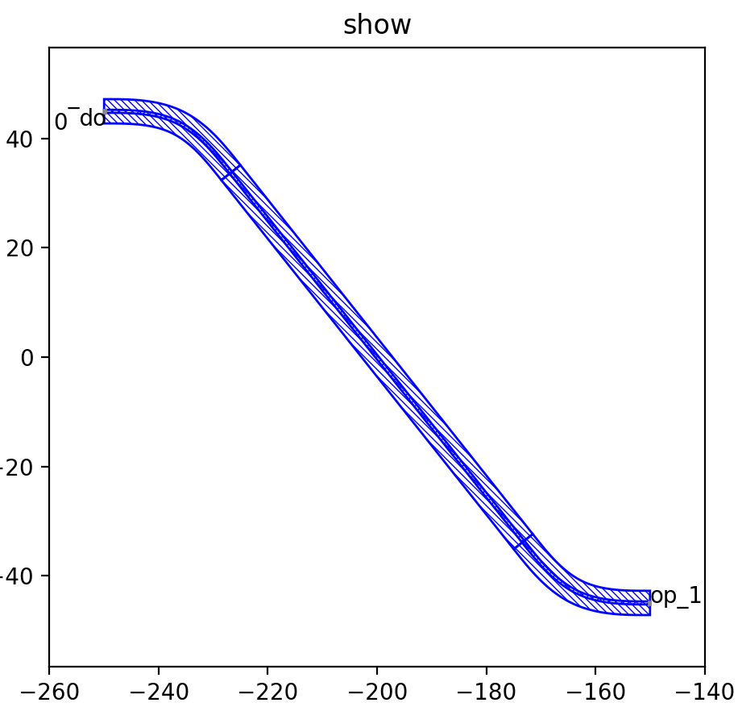

LinkBetween
^^^^^^^^^^^^^^^^^^^^^^^^^^^^^^^^^^^^^^^^^^^

Import function module
-----------------------------------
This time, we will mainly involve the material and shape of the waveguide connection between the ports, so the ``waveguide_factory`` in ``gpdk.technology`` will be called.

::

  from fnpcell import all as fp
  from gpdk import all as pdk
  from gpdk.technology import get_technology
  from gpdk.technology.waveguide_factory import EulerBendFactory

Main function
---------------------------------------
The main functions are built similarly and can be considered as templates that can be changed on top of the base according to the user's needs.  

::

  if __name__ == "__main__":
      from pathlib import Path
      import gpdk.components.all
    # Get the gds file name and path of this export file
      gds_file = Path(__file__).parent / "local" / Path(__file__).with_suffix(".gds").name

      library = fp.Library()    # Instantiating Library()
      library += LinkBetweenInLinked()	# Add the devices defined by the function to the library

      fp.export_gds(library, file=gds_file)	# Export the entire library as a gds file
      fp.export_pls(library, file=gds_file.with_suffix(".pls"), components=gpdk.components.all)	# Export the entire library as a pls file
      fp.plot(library)	# Plot the entire library in Pycharm for viewing
      
 
Define function
------------------------------------
First, use the modifier to modify the pcell (in the subsequent design of the program, it can be added as a template)

::

    @fp.pcell_class()

    
Then, the ``class`` function is defined. Users can consider the following four lines of code as a fixed template and just change the ``class`` name.   

::

    class LinkBetweenInLinked(fp.PCell):
    def build(self):
        insts, elems, ports = super().build() 
        TECH = get_technology() # Instantiate get_technology
        
The following first created several waveguide structures, including 1 bending waveguide and 4 straight waveguides.        

::

  bend_factory_15_35 = EulerBendFactory(radius_min=15, l_max=35, waveguide_type=TECH.WG.FWG.C.WIRE)
	sbend = pdk.SBend(distance=100, height=-90, waveguide_type=TECH.WG.FWG.C.WIRE, bend_factory=bend_factory_15_35)
  
In the ``pdk.SBend()`` function, ``distance`` represents the horizontal distance between the left end of the ``sbend`` and the right end, and ``height`` represents the vertical distance between the middle of the right end of the sbend and the middle of the left end.  A positive ``height`` value means that the right end is on top and the left end is on the bottom; A negative value means that the right end is on the bottom and the left end is on the top.  

Then we define the four straight waveguides, ``length`` defines the straight waveguide length, ``waveguide_type`` defines the type of waveguide.

::

    straight_fw = pdk.Straight(length=5, waveguide_type=TECH.WG.FWG.C.WIRE)
    straight_fe = pdk.Straight(length=5, waveguide_type=TECH.WG.FWG.C.EXPANDED)
    straight_mw = pdk.Straight(length=5, waveguide_type=TECH.WG.MWG.C.WIRE)
    straight_sw = pdk.Straight(length=5, waveguide_type=TECH.WG.SWG.C.WIRE)
    
Then we use the ``rotated()`` and ``translated()`` functions to test the ``LinkBetween`` function by placing their positions in different parts of the layout.    

::

    sb10 = sbend.translated(-200, 0) #Place sbend at the (-200,0) point
    s10 = straight_fw
    s15 = straight_fe.translated(100, 0)
    s20 = straight_sw.translated(200, 0)
    s30 = straight_mw.rotated(degrees=30).translated(400, 200) # Rotate straight 30 degrees and place it at (400,200)
    s40 = straight_fw.rotated(degrees=30).translated(50, 100)
    
After defining the 5 waveguide devices, this time we mainly test the ``LinkBetween`` function. In this example, we need to use two ``bend_factory`` and define two ``EulerBendFactory`` below.    

::

  bend_factory_15_5 = EulerBendFactory(radius_min=15, l_max=5, waveguide_type=TECH.WG.SWG.C.WIRE)
  bend_factory_50_5 = EulerBendFactory(radius_min=50, l_max=5, waveguide_type=TECH.WG.MWG.C.WIRE)
  
Connect all components as a device

::

  device = fp.Linked(
              link_type=TECH.WG.SWG.C.EXPANDED,
              bend_factory=bend_factory_15_5,
              links=[
                  # The connection symbol ">>" here is different from "<=" in V1.3.；
                  sb10["op_1"] >> s10["op_0"],	# This line of code means to connect the "op_1" port of sb10 to the "op_0" port of s10 port, the direction is opposite to V1.3, attention must be paid!
                  s10["op_1"] >> s15["op_0"],
                  s15["op_1"] >> s20["op_0"],
          # The LinkBetween function is used to connect s20 and s30. Of course, the linked function above can be used for automatic connection, but in the layout, if there are special requirements for the connection between the two devices, the LinkBetween function can be defined separately.
                  fp.LinkBetween(start=s20["op_1"], end=s30["op_0"], bend_factory=bend_factory_50_5),	# The bend_factory is connected from the start port to the end port, and the bend_factory connected in between is parameterized according to the custom bend_factory function.
                  # Connects between s30 and S40 specifying the bend used for the connection and controlling the path points through which the connection needs to pass.
                  # To maintain the integrity of the code, the complete code is given here, and the four functions in the waypoint will be analyzed later in the article!
                  TECH.LINK_BETWEEN.SWG_EXPANDED_MWG_EULER(
                      start=s30["op_1"],
                      end=s40["op_0"],
                      waypoints=[
                          fp.Offset(-50, 90),      
                          fp.Offset.until_x(-100),
                          fp.Offset.until_y(150),
                          fp.Offset.until_x(150),
                      ],
                  ),
              ],
              ports=[],
          )
          
Test for ``waypoints`` in ``LinkBetween``
---------------------------------------------------
First, with no other code changes, we set the four lines of code in ``waypoints`` to empty (note: the code below is for educational testing only, so the format is simplified, do not copy directly, if you need to use, please refer to the above and .py file)

Start by setting ``waypoints`` to an empty list.

::

  waypoints=[] 
  
In the figure below, the connection method between ``s30`` and ``s40`` is not specified, and the software automatically connects them both. All five waveguide positions are unchanged, and later on, we will adjust the ``waypoints`` to get a feel for how the connection is controlled by the ``waypoints``.

This time, only one position correction ``fp.Offset(-50, 90)`` is added.  

::

  waypoints=[fp.Offset(-50, 90)] 
  
  
In the figure below, the red circle shows the coordinates of the exit end of ``s30``, corrected by ``fp.Offset(-50, 90)``. Suppose the coordinates of the exit end of ``s30`` are (a, b), then the ``waypoint`` is (a-50, b-90) after correction.

For comparison with the above diagram, the waveguide is automatically processed by the software at the exit of ``s30``, and then connected to the ``op_1`` port of ``s40`` in a reasonable way.

Then, we add the ``fp.Offset.until_x(-100)`` command on top of that.

::

  waypoints=[
    fp.Offset(-50, 90),      
    fp.Offset.until_x(-100)]
    
In the figure below, you can see that the top horizontal waveguide connection is much longer than the previous one, and it passes through the point (-100, b+90), so the ``until_x`` command keeps the y value and changes the x value to the value specified by ``until_x()``, based on the last specified path point. In this example, the last specified ``waypoint`` is (a-50, b-90), and after the ``until_x`` command, another ``waypoint`` (-100, b+90) is obtained. (Note: If the ``Offset()`` command is not used, the path point will be the exit end of the waveguide)

On top of the previous code, we are adding the ``fp.Offset.until_y(150)`` and ``fp.Offset.until_x(150)`` commands. Inspired by the usage of the ``until_x`` command above, we can calculate the first new path point as ``(-100, 150)`` and the second path point as ``(150, 150)`` this time. Finally, the software automatically connected to the ``s40`` waveguide.    
  
  
  
  
  
  
  
  
  
  
  
  
  
  
