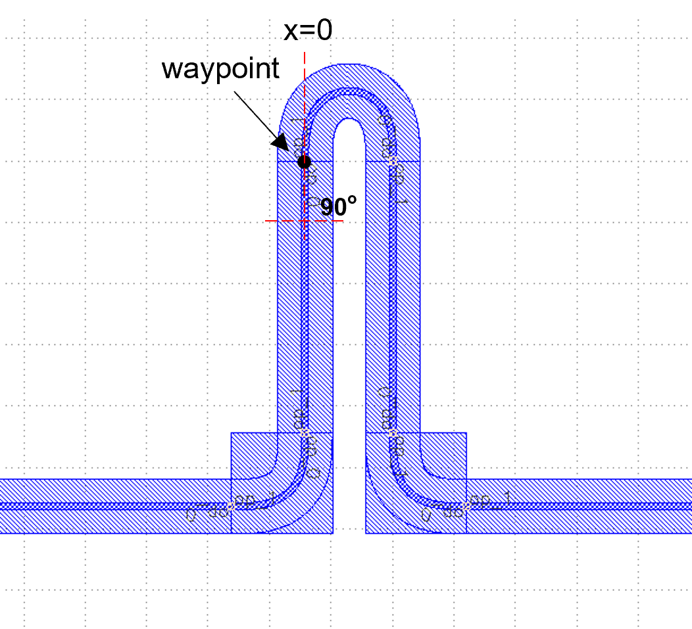

Link Electrical Pad
^^^^^^^^^^^^^^^^^^^^^^^^^^^^^^^^^^^^^^^^^^^^^^^^^^^^^^

Full script
-------------------------------------------

::

    from fnpcell import all as fp
    from gpdk import all as pdk
    from gpdk.technology import get_technology

    @fp.pcell_class()

    class LinkedElec(fp.PCell):
        def build(self):
            insts, elems, ports = super().build()
            TECH = get_technology()

            rm1 = pdk.RingFilter(waveguide_type=TECH.WG.FWG.C.WIRE)
            rm2 = pdk.RingFilter(waveguide_type=TECH.WG.FWG.C.WIRE)

            rm1 = rm1.translated(-200, 100)
            rm2 = rm2.translated(200, 100)

            MT_2 = TECH.METAL.MT.W10.updated(line_width=2)
            MT_4 = TECH.METAL.MT.W10.updated(line_width=4)
            M2_4 = TECH.METAL.M2.W10.updated(line_width=4)
            to = fp.Waypoint
            device = fp.Linked(
                metal_line_type=MT_2,
                metal_min_distance=20,
                links=[
                    rm1["op_3"] >> to(0, 150, -90) >> rm2["op_0"],
                    rm1["ep_1"].with_orientation(degrees=-90) >> to(0, -10, -90) >> rm2["ep_0"].with_orientation(degrees=-90),
                    fp.LinkBetween(
                        rm1["ep_0"].with_orientation(degrees=-90),
                        rm2["ep_1"].with_orientation(degrees=-90),
                        start_distance=40,
                        # waypoints=[to(-50, -100, -90)],
                        # waypoints=[fp.Offset.until_y(-50), fp.Offset.until_x(-20), fp.Offset.until_y(-30)],
                        waypoints=[fp.Offset.until_y(50), fp.Offset.until_x(-20), fp.Offset.until_y(-30)],
                        metal_line_type=[(0, MT_4), (10, M2_4), (-30, MT_4)],
                    ),
                ],
                ports=[],  # [sb10["op_0"], s40["op_1"]],
            )
            insts += device
            return insts, elems, ports
    if __name__ == "__main__":
        from pathlib import Path
        gds_file = Path(__file__).parent / "local" / Path(__file__).with_suffix(".gds").name
        library = fp.Library()
        TECH = get_technology()
        # =============================================================
        # fmt: off
        library += LinkedElec()
        # fmt: on
        # =============================================================
        fp.export_gds(library, file=gds_file)
        fp.plot(library)
        

Run the complete script once and generate the following GDS layout.

Parameters and testing descriptions
------------------------------------------------------
Call ``pdk.RingFilter`` to generate a ``RingFilter`` with two default structure parameters, specifying the waveguide type as ``TECH.WG.FWG.C.WIRE``; then use ``.translated`` command to place the two devices at (-200,100) and (200,100).

::

        rm1 = pdk.RingFilter(waveguide_type=TECH.WG.FWG.C.WIRE)
        rm2 = pdk.RingFilter(waveguide_type=TECH.WG.FWG.C.WIRE)

        rm1 = rm1.translated(-200, 100)
        rm2 = rm2.translated(200, 100)
        
We change ``rm1 = rm1.translated(-200, 100)`` to ``rm1 = rm1.translated(-100, 0)`` and run it to get the following layout. As you can see from the figure below, despite the change in the position of the left device, PhotoCAD is still able to connect the wiring automatically due to its powerful auto-routing feature.   

Connections
---------------------------------------------------

The lower code section is responsible for how the devices are connected to each other.

::

  to = fp.Waypoint
          device = fp.Linked(
              metal_line_type=MT_2,
              metal_min_distance=20,
              links=[
                  rm1["op_3"] >> to(0, 150, -90) >> rm2["op_0"],
                  rm1["ep_1"].with_orientation(degrees=-90) >> to(0, -10, -90) >> rm2["ep_0"].with_orientation(degrees=-90),
                  fp.LinkBetween(
                      rm1["ep_0"].with_orientation(degrees=-90),
                      rm2["ep_1"].with_orientation(degrees=-90),
                      start_distance=40,
                      # waypoints=[to(-50, -100, -90)],
                      # waypoints=[fp.Offset.until_y(-50), fp.Offset.until_x(-20), fp.Offset.until_y(-30)],
                      waypoints=[fp.Offset.until_y(50), fp.Offset.until_x(-20), fp.Offset.until_y(-30)],
                      metal_line_type=[(0, MT_4), (10, M2_4), (-30, MT_4)],
                  ),
              ],
              ports=[],  # [sb10["op_0"], s40["op_1"]],
          )
          
Top connection
""""""""""""""""""""""""""""""""""
``rm1["op_3"] >> to(0, 150, -90) >> rm2["op_0"]``means that the ``op_3`` port of ``rm1`` is connected to the ``op_0`` port of ``rm2``, and the connection path needs to pass through the point (0,150), where ``-90`` means the direction of the waveguide port at the path point, we change ``-90`` to ``0`` and run the program once to get the following figure :

We then compare with the original ``-90°`` and ``90°`` angle:

``90°``：

``-90°``：

        
        
From the above comparison, it can be analyzed that the specified angle is the angle between the line passing in front of the waypoint and the horizontal direction, and the degree is exactly from bottom to top, which means the degree is negative from top to bottom.        
        
        
Middle connection
""""""""""""""""""""""""""""""""""       
We modify the degrees in ``rm1["ep_1"].with_orientation(degrees=-90)`` to ``0`` degrees to get the figure on the right below, which shows that degrees is the direction when changing the connection of ``op_1`` (0° with 360° facing right, 90° with -270° facing up, 180° with -180° facing left, and 270° with -90° facing down; similar to the usual angles in the four quadrants of the X-Y coordinate system).

Let's continue to test the angle of the path point, starting with the initial ``-90°`` and running it to get the following figure, which shows that the line is coming down from above the waypoint.

        
        
Bottom connection
""""""""""""""""""""""""""""""""""            
The code below controls the direction of the routing. ``until_x`` and ``until_y`` are commonly understood to mean that the direction of the line is not changed (i.e., horizontal or vertical coordinates), and the horizontal (vertical) coordinates are the turning points of the set values.

::

		waypoints=[fp.Offset.until_y(50), fp.Offset.until_x(-20), fp.Offset.until_y(-30)]
    
Take the following figure as an example to illustrate. Firstly, the line is extended downward from the point (A, B), and the horizontal coordinates on the line do not change during the extension, while the first command is ``until_y(50)``, so the position of the turning point is (A, 50); then, the second command is ``until_x(-20)``, and the line is extended to the right, i.e. the vertical coordinates remain unchanged, to reach the turning point (-20, 50); finally, the ``until_y(-30)`` command makes the line extend downward to (-20, -30), and then the line is automatically connected to the right end.   

During the connection, we change the type of metal wire with the following command.

::

		metal_line_type=[(0, MT_4), (10, M2_4), (-30, MT_4)]
    
Starting from the starting point, ``MT_4`` type metal wire specified by 10 μm is used, then ``M2_4`` type metal wire is used between the end of the first section of ``MT_4`` and the position 30 μm below the right-hand port, and the ``MT_4`` type metal wire is used for the wire within 30 μm of the right-hand port.       

First of all, the connection is from the left end to the right end, and in that direction is positive, the opposite direction is negative. The parameter ``0`` in the first bracket in the code refers to the first ``MT_4`` line starting from the position of ``0`` from the port,``10`` represents the total length of the first ``MT_4``; and ``-30`` refers to the position of 30μm in the reverse direction of the right port (i.e. 30μm below the right end), then the last section of the connecting line is the ``MT_4`` set; the rest of the line is of type ``M2_4``.
        

        
        
        
        
        
        
        
        
        
        
        
        
        
        
        
        
        
        
        
        
        
        
        
        
        
        
        
        
        
        
        
        
        
        
        
        
        
        
        
        
        
        
