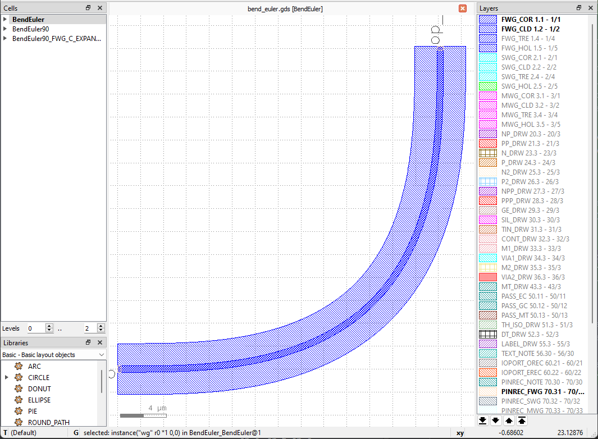
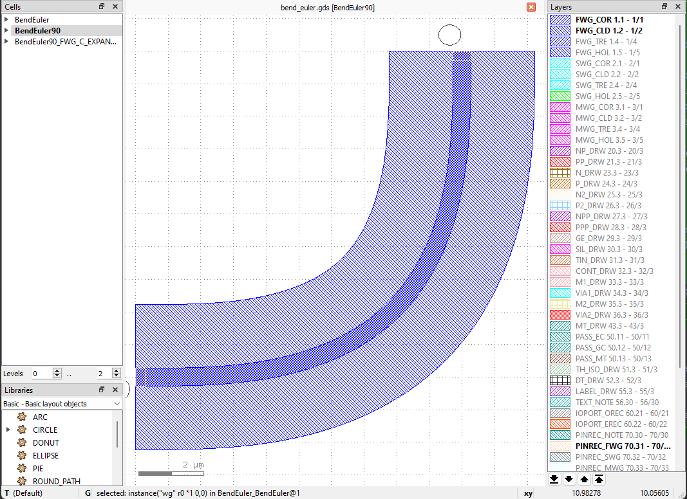
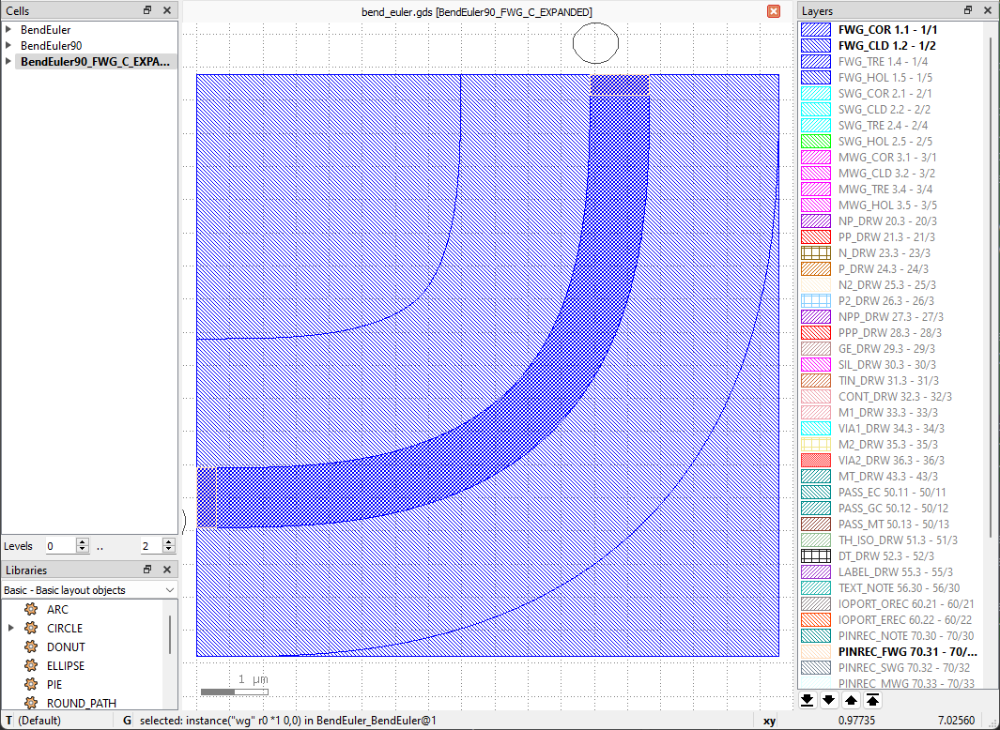

BendEuler
^^^^^^^^^^^^^^^^^

This section will introduce customizing the basic components in ``gpdk`` from the beginning, using ``BendEuler`` as an example. The full script can be found in ``gpdk`` > ``components`` > ``bend`` > ``bend_euler.py``.

Full script
======================
::

    from dataclasses import dataclass
    from functools import cached_property
    from pathlib import Path
    from typing import Optional, Tuple

    from fnpcell import all as fp
    from gpdk.technology import get_technology
    from gpdk.technology.interfaces import CoreCladdingWaveguideType

    @dataclass(eq=False)
    class BendEuler(fp.IWaveguideLike, fp.PCell):

        degrees: float = fp.DegreeParam(default=90, min=-180, max=180, doc="Bend angle in degrees")
        radius_eff: float = fp.PositiveFloatParam(required=False, doc="Bend radius_eff")
        radius_min: float = fp.PositiveFloatParam(required=False, doc="Bend radius_min")
        p: Optional[float] = fp.PositiveFloatParam(required=False, max=1, doc="Bend parameter")
        l_max: Optional[float] = fp.PositiveFloatParam(required=False, doc="Bend Lmax")
        waveguide_type: fp.IWaveguideType = fp.WaveguideTypeParam(doc="Waveguide parameters")
        port_names: fp.IPortOptions = fp.PortOptionsParam(count=2, default=["op_0", "op_1"])

        def _default_radius_eff(self):
            if self.radius_min is None:
                return 10

        def _default_waveguide_type(self):
            return get_technology().WG.FWG.C.WIRE

        def __post_pcell_init__(self):
            assert self.radius_eff is not None or self.radius_min is not None, "either radius_eff or radius_min must be provided"

        @cached_property
        def raw_curve(self):
            radius_min = self.radius_min
            if radius_min is None:
                radius_min = self.radius_eff
            curve = fp.g.EulerBend(radius_min=radius_min, degrees=self.degrees, p=self.p, l_max=self.l_max)
            if self.radius_min is None and not fp.is_close(curve.radius_eff, self.radius_eff):
                curve = curve.scaled(self.radius_eff / curve.radius_eff)
            return curve

        def build(self) -> Tuple[fp.InstanceSet, fp.ElementSet, fp.PortSet]:
            insts, elems, ports = super().build()
            wg = self.waveguide_type(curve=self.raw_curve).with_ports(self.port_names)
            insts += wg
            ports += wg.ports
            return insts, elems, ports

    @dataclass(eq=False)
    class BendEuler90(BendEuler):

        degrees: float = fp.DegreeParam(default=90, min=90, max=90, locked=True, doc="Bend angle in degrees")
        waveguide_type: CoreCladdingWaveguideType = fp.WaveguideTypeParam(type=CoreCladdingWaveguideType, doc="Waveguide parameters")
        slab_square: bool = fp.BooleanParam(required=False, default=False, doc="whether draw a square clad")

        def build(self) -> Tuple[fp.InstanceSet, fp.ElementSet, fp.PortSet]:
            insts, elems, ports = super().build()
            waveguide_type = self.waveguide_type

            if self.slab_square:
                r = self.raw_curve.radius_eff
                w = r + waveguide_type.cladding_width / 2
                x = w / 2
                y = (r - waveguide_type.cladding_width / 2) / 2
                elems += fp.el.Rect(width=w, height=w, center=(x, y), layer=waveguide_type.cladding_layer)

            return insts, elems, ports

    @dataclass(eq=False)
    class BendEuler90_FWG_C_WIRE(BendEuler90, locked=True):
        l_max: Optional[float] = fp.PositiveFloatParam(default=5, doc="Bend Lmax")
        radius_min: float = fp.PositiveFloatParam(default=3.225, doc="Bend radius_min")
        waveguide_type: CoreCladdingWaveguideType = fp.WaveguideTypeParam(type=CoreCladdingWaveguideType, doc="Waveguide parameters")
        slab_square: bool = fp.BooleanParam(required=False, default=True, doc="whether draw a square clad")

        def _default_waveguide_type(self):
            return get_technology().WG.FWG.C.WIRE

        @fp.cache()
        def sim_model(self, env: fp.ISimEnv):
            return fp.sim.ExternalFileModel(Path("BendCircular90_radius=10").with_suffix(".dat"))

    @dataclass(eq=False)
    class BendEuler90_FWG_C_EXPANDED(BendEuler90, locked=True):
        l_max: Optional[float] = fp.PositiveFloatParam(default=10, doc="Bend Lmax")
        radius_min: float = fp.PositiveFloatParam(default=3.4, doc="Bend radius_min")
        waveguide_type: CoreCladdingWaveguideType = fp.WaveguideTypeParam(type=CoreCladdingWaveguideType, doc="Waveguide parameters")
        slab_square: bool = fp.BooleanParam(required=False, default=True, doc="whether draw a square clad")

        def _default_waveguide_type(self):
            return get_technology().WG.FWG.C.EXPANDED

        @fp.cache()
        def sim_model(self, env: fp.ISimEnv):
            return fp.sim.ExternalFileModel(Path("BendCircular90_radius=10").with_suffix(".dat"))

    if __name__ == "__main__":
        from gpdk.util.path import local_output_file

        gds_file = local_output_file(__file__).with_suffix(".gds")
        library = fp.Library()

        TECH = get_technology()
        # =======================================================================
        # fmt: off

        library += BendEuler(radius_min=15)
        library += BendEuler90()
        library += BendEuler90_FWG_C_EXPANDED()

        # fmt: on
        # =============================================================
        fp.export_gds(library, file=gds_file)
        # fp.plot(library)
Section Script Description
=============================

#. Import function packages:

   To customize the basic components(straight waveguide/bends) in gpdk, several packages needs to be imported. ``dataclass``, ``cached_property``, ``Path``, ``Optional``, ``Tuple`` are for data processing. ``fnpcell``, ``get_technology``, ``CoreCladdingWaveguideType`` are for process information, data format , etc::

        from dataclasses import dataclass
        from functools import cached_property
        from pathlib import Path
        from typing import Optional, Tuple

        from fnpcell import all as fp
        from gpdk.technology import get_technology
        from gpdk.technology.interfaces import CoreCladdingWaveguideType

#. Define a new PCell, and a custom class (here will be ``BendEuler``):

   Inherit the new PCell via ``fp.PCell`` & ``fp.IWaveguideLike`` in fnpcell, which is a new basic component in gpdk. ``fp.IWaveguideLike`` is the parent class of all basic components in ``fnpcell``, and it includes the base setting of the components. Then the new ``BendEuler`` class needs to be decorated by ``@dataclass(eq=False)``::

        @dataclass(eq=False)
        class BendEuler(fp.IWaveguideLike, fp.PCell):

#. Define the properties and methods in the ``BendEuler`` class

   #. Define user-definable parameters::

            degrees: float = fp.DegreeParam(default=90, min=-180, max=180, doc="Bend angle in degrees")
            radius_eff: float = fp.PositiveFloatParam(required=False, doc="Bend radius_eff")
            radius_min: float = fp.PositiveFloatParam(required=False, doc="Bend radius_min")
            p: Optional[float] = fp.PositiveFloatParam(required=False, max=1, doc="Bend parameter")
            l_max: Optional[float] = fp.PositiveFloatParam(required=False, doc="Bend Lmax")
            waveguide_type: fp.IWaveguideType = fp.WaveguideTypeParam(doc="Waveguide parameters")
            port_names: fp.IPortOptions = fp.PortOptionsParam(count=2, default=["op_0", "op_1"])

      * ``degrees: float = fp.DegreeParam()`` defines the bend angle of the Euler bend, default is set to 90 when ``degrees`` is not set by the user, the range is set from -180 to 180.

      * ``radius_eff`` and ``radius_min`` defines the bend radius of the Euler bend.

      * ``p`` and ``l_max`` are parameters often used to define the Euler Bend in equation, the range can be set by the user if needed.

      * ``waveguide_type: fp.IWaveguideType = fp.WaveguideTypeParam()`` is used to define the type of the waveguide.

      * ``port_names: fp.IPortOptions = fp.PortOptionsParam()`` is used to define the number of ports of the component, since it is a bend, so there will be one port on the left and another on the right, the total number is ``count=2`` . Secondly, the ports are named, and the default is ``default=("op_0", "op_1")``, the user can set it by himself.

   #. Define self methods to get the default setting of ``BendEuler``

      * To get the default radius of the bend::

          def _default_radius_eff(self):
                if self.radius_min is None:
                    return 10

      * To get the default waveguide type of the bend::

          def _default_waveguide_type(self):
                return get_technology().WG.FWG.C.WIRE

      * Assert error message before running the full code when ``radius_eff`` or ``radius_min`` is not provided  ::

            def __post_pcell_init__(self):
                assert self.radius_eff is not None or self.radius_min is not None, "either radius_eff or radius_min must be provided"

      * Create the Euler bend by generating the Euler curve via ``fp.g.EulerBend``, where the user-defined parameters are used in the curve. ``@cached_property`` is a decorator that converts a class method into a property whose value is calculated only once and then cached like a regular attribute ::

                @cached_property
                def raw_curve(self):
                    radius_min = self.radius_min
                    if radius_min is None:
                        radius_min = self.radius_eff
                    curve = fp.g.EulerBend(radius_min=radius_min, degrees=self.degrees, p=self.p, l_max=self.l_max)
                    if self.radius_min is None and not fp.is_close(curve.radius_eff, self.radius_eff):
                        curve = curve.scaled(self.radius_eff / curve.radius_eff)
                    return curve

   #. Define the build method to build ``BendEuler``

      * Instances, elements and ports are usually used in device cells, i.e. calls to other cell instances, graphics in this cell and device ports.

        The three elements in the device are implemented in the PCell definition by calling the build function module in the parent class PCell
      ::

            def build(self) -> Tuple[fp.InstanceSet, fp.ElementSet, fp.PortSet]:
                insts, elems, ports = super().build()

      * Define the type of waveguide used in the bend, as well as the curve and add the ports generated from the above script
      ::

                   wg = self.waveguide_type(curve=self.raw_curve).with_ports(self.port_names)

      * Initiate wg and ports and return the instances, elements, and ports in the component cell.
      ::

            insts += wg
            ports += wg.ports
            return insts, elems, ports

   #. Use the ``EulerBend`` class to create component cells and output the layout

      * Import the package to generate output layout file under the same file of the ``EulerBend``
      ::

                from gpdk.util.path import local_output_file

      * Refer to the path where the top generated gds file is saved. Then obtain all device process information.
      ::

               gds_file = local_output_file(__file__).with_suffix(".gds")
               library = fp.Library()
               TECH = get_technology()

      * Create a ``EulerBend`` component defined with default parameters
      ::

               library += BendEuler()

      * Export GDS files
      ::

                   fp.export_gds(library, file=gds_file)

Extend PCells from ``BendEuler``
==================================

Once we have built the class ``BendEuler``, it is convenient to generate more child class that inherits from ``BendEuler``. In ``bend_euler.py`` example, ``BendEuler90`` is created based on parent class ``BendEuler``, and ``BendEuler90_FWG_C_WIRE``, ``BendEuler90_FWG_C_EXPANDED`` are then generated based on parent class ``BendEuler90``.

#. BendEuler90::

            @dataclass(eq=False)
            class BendEuler90(BendEuler):

                degrees: float = fp.DegreeParam(default=90, min=90, max=90, locked=True, doc="Bend angle in degrees")
                waveguide_type: CoreCladdingWaveguideType = fp.WaveguideTypeParam(type=CoreCladdingWaveguideType, doc="Waveguide parameters")
                slab_square: bool = fp.BooleanParam(required=False, default=False, doc="whether draw a square clad")

                def build(self) -> Tuple[fp.InstanceSet, fp.ElementSet, fp.PortSet]:
                    insts, elems, ports = super().build()
                    waveguide_type = self.waveguide_type

                    if self.slab_square:
                        r = self.raw_curve.radius_eff
                        w = r + waveguide_type.cladding_width / 2
                        x = w / 2
                        y = (r - waveguide_type.cladding_width / 2) / 2
                        elems += fp.el.Rect(width=w, height=w, center=(x, y), layer=waveguide_type.cladding_layer)

                    return insts, elems, ports

   * In the above script we can see that ``degrees`` is set to be 90 rather than a number of range, so the bend will be set to be 90 degree.

     ::

        degrees: float = fp.DegreeParam(default=90, min=90, max=90, locked=True, doc="Bend angle in degrees")

   *  A slab square surrounding the bend waveguide is built in class ``EulerBend90``, users can set ``slab_square=True`` to decide if needed.

     ::

         slab_square: bool = fp.BooleanParam(required=False, default=False, doc="whether draw a square clad")

     ::

         if self.slab_square:
             r = self.raw_curve.radius_eff
             w = r + waveguide_type.cladding_width / 2
             x = w / 2
             y = (r - waveguide_type.cladding_width / 2) / 2
             elems += fp.el.Rect(width=w, height=w, center=(x, y), layer=waveguide_type.cladding_layer)

#. BendEuler90_FWG_C_WIRE::

        @dataclass(eq=False)
        class BendEuler90_FWG_C_WIRE(BendEuler90, locked=True):
            l_max: Optional[float] = fp.PositiveFloatParam(default=5, doc="Bend Lmax")
            radius_min: float = fp.PositiveFloatParam(default=3.225, doc="Bend radius_min")
            waveguide_type: CoreCladdingWaveguideType = fp.WaveguideTypeParam(type=CoreCladdingWaveguideType, doc="Waveguide parameters")
            slab_square: bool = fp.BooleanParam(required=False, default=True, doc="whether draw a square clad")

            def _default_waveguide_type(self):
                return get_technology().WG.FWG.C.WIRE

            @fp.cache()
            def sim_model(self, env: fp.ISimEnv):
                return fp.sim.ExternalFileModel(Path("BendCircular90_radius=10").with_suffix(".dat"))

   *  ``BendEuler90_FWG_C_WIRE`` is built to create automatically waveguide routing for circuit design. By setting ``l_max`` and ``radius_min`` to a specific value, ``BendEuler90_FWG_C_WIRE`` can be defined in several routing selections to simplify the work for users.

   *  Default waveguide type can be adjusted by setting ``_default_waveguide_type(self)`` to another type, such as ``FWG.C.EXPANDED``.

   *  Simulation model is also define here by the below script, for more details, please refer to ``Tutorials`` / ``Simulation``

Export GDS Layout
=======================================

Run ``bend_euler.py`` and use layout tool e.g. KLayout to view the generated GDS file, which should be saved under ``gpdk`` > ``components`` > ``bend`` > ``local``.

In the table you can see the three generated instances, ``BendEuler``, ``BendEuler90`` and ``BendEuler90_FWG_C_EXPANDED``.

* ``BendEuler``: bend radius is set to be 15, otherwise the layout will be the same as ``BendEuler90`` and will cause **PhotoCAD** thought of it has the same meaning then only generate the latest cell.

* ``BendEuler90``:

* ``BendEuler90_FWG_C_EXPANDED``: A square was added because default for ``slab_square`` in  ``BendEuler90_FWG_C_EXPANDED`` is ``True``.

