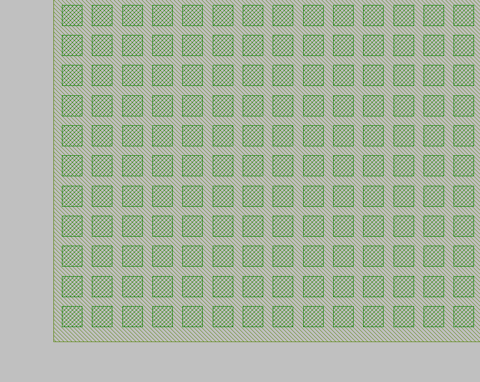

Generate array of cells
^^^^^^^^^^^^^^^^^^^^^^^^^^^^^^^^^^^^
In this section, we will demonstrate how to generate array of cells from an instance using ``.new_array`` method.

Let's say we need a rectangle with a width of 100 um and height of 120um filling with an array of square cell with 0.3um * 0.3um and a pitch of 0.45um.

new_array
+++++++++++++++
::

    @abstractmethod
    def new_array(self, *, cols: int = ..., col_width: float = ..., rows: int = ..., row_height: float = ..., transform: Affine2D = ...) -> ICellArray:

Full script
====================
::

    import math
    from dataclasses import dataclass
    from fnpcell import all as fp
    from gpdk.technology import get_technology
    from functools import cached_property

    @dataclass(eq=False)
    class CellinRect(fp.PCell):

        length: float = fp.FloatParam(default=100)
        height: float = fp.FloatParam(default=120)
        cell_width: float = fp.FloatParam(default=0.3)
        pitch: float = fp.FloatParam(default=0.45)

        def build(self):
            insts, elems, ports = super().build()
            TECH = get_technology()

            rect = fp.el.Rect(width=self.length, height=self.height, center=(0, 0), layer=TECH.LAYER.M1_DRW)

            cell = fp.Device(
                name="cell",
                content=[
                    fp.el.Rect(width=self.cell_width, height=self.cell_width, bottom_left=(0, 0), layer=TECH.LAYER.CONT_DRW, )
                ],
                ports=[],
            )
            rows = int(self.height / self.pitch)
            cols = int(self.length / self.pitch)
            print(rows,cols)
            cell_array = cell.new_array(cols=cols, rows=rows, col_width=self.pitch, row_height=self.pitch).translated(-self.length / 2 + self.pitch / 2, -self.height / 2 + self.pitch / 2)

            elems += rect
            insts += cell_array

            return insts, elems, ports

    if __name__ == "__main__":
        # fixed template start
        from gpdk.util.path import local_output_file

        gds_file = local_output_file(__file__).with_suffix(".gds")
        library = fp.Library()

        TECH = get_technology()

        # =============================================================
        # fixed template end
        library += CellinRect()
        # custom region start
        # fixed template start
        # =============================================================
        fp.export_gds(library, file=gds_file)
        # fp.plot(library)
        # fixed template end

Section Script Description
==================================

#. Import function packages:

    ::

        import math
        from dataclasses import dataclass
        from fnpcell import all as fp
        from gpdk.technology import get_technology
        from functools import cached_property

#. Define a new PCell, and a custom class (here will be ``CellinRect``):

   Inherit the new PCell via ``fp.PCell`` in fnpcell, which is a new basic component in gpdk. Then the new ``BendEuler`` class needs to be decorated by ``@dataclass(eq=False)``::

        @dataclass(eq=False)
        class CellinRect(fp.PCell):

#. Define the properties and methods in the ``CellinRect`` class

   #. Define user-definable parameters::

            length: float = fp.FloatParam(default=100)
            height: float = fp.FloatParam(default=120)
            cell_width: float = fp.FloatParam(default=0.3)
            pitch: float = fp.FloatParam(default=0.45)

   #. Define the build method to build ``CellinRect``

      * Instances, elements and ports are usually used in device cells, i.e. calls to other cell instances, graphics in this cell and device ports.

        The three elements in the device are implemented in the PCell definition by calling the build function module in the parent class PCell

      ::

            def build(self):
                insts, elems, ports = super().build()

      * Define the geometry of the larger rectangle and the small cell.

      ::

            rect = fp.el.Rect(width=self.length, height=self.height, center=(0, 0), layer=TECH.LAYER.M1_DRW)

            cell = fp.Device(
                        name="cell",
                        content=[
                                fp.el.Rect(width=self.cell_width, height=self.cell_width, bottom_left=(0, 0), layer=TECH.LAYER.CONT_DRW, )
                                ],
                        ports=[],
                    )

      * Calculate the columns and rows of the array that will be filled in the larger rectangle.

      ::

            rows = int(self.height / self.pitch)
            cols = int(self.length / self.pitch)

      * Create the cell array by ``new_array`` method.

            To use ``.new_array`` function, the cell has to be an instance. Users can import other existing components or generate a new instance by defining content in ``fp.Device`` method showing in this example.

            The origin of the array creating by this ``.new_array`` function will be at the bottom-left cell of this array and depending on the definition when you build this cell (either setting ``center=() or bottom_left=()``

            Here we translate the whole array after generating the array to the bottom left of the larger rectangle.

      ::

            cell_array = cell.new_array(cols=cols, rows=rows, col_width=self.pitch, row_height=self.pitch).translated(-self.length / 2 + self.pitch / 2, -self.height / 2 + self.pitch / 2)

      * Initiate instance and elements

      ::

               elems += rect
               insts += cell_array

Export GDS Layout
==================================
