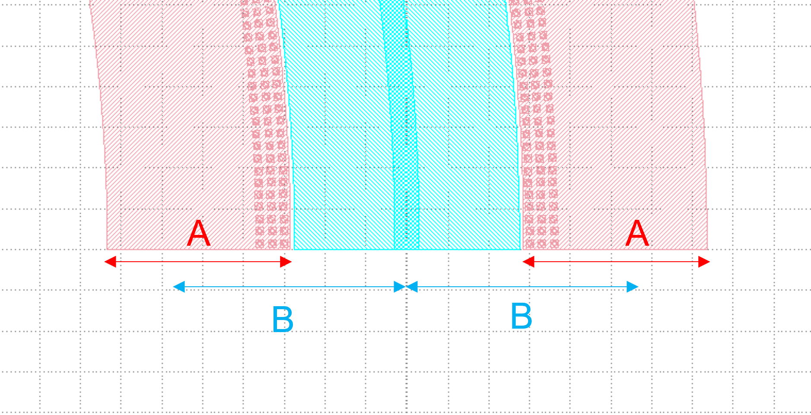

Phase Shifter
^^^^^^^^^^^^^^^^^^^^^^^^^^^^^^^^^^^^^^^^^^^^^^^^^^^^

Full script
-----------------------------------

::

  from dataclasses import dataclass
  from functools import cached_property
  from fnpcell import all as fp
  from gpdk.technology import get_technology
  from gpdk.technology.interfaces.wg import CoreCladdingWaveguideType

  class PnPhaseShifterTemplate:
      waveguide_type: CoreCladdingWaveguideType = fp.WaveguideTypeParam(type=CoreCladdingWaveguideType).as_field()
      @cached_property
      def curve_paint(self):
          x_gap = 0.25
          y_gap = 0.2
          cont_w = 0.6
          cont_h = 0.6
          # m1_pin_w = 15
          # m1_pin_h = 1.15
          half_m1_h = 9.0
          cladding_width = self.waveguide_type.cladding_width
          y_offset = cladding_width / 2 + y_gap + 3 * cont_h / 2
          array_h = cont_h * 3
          p1_n1_h = array_h + y_gap + cladding_width / 2 + y_gap / 2
          cont = fp.Device(
              name="cont",
              content=[
                  fp.el.Circle(radius=0.123, layer=TECH.LAYER.CONT_DRW),
                  fp.el.Rect(width=0.35, height=0.35, layer=TECH.LAYER.M1_DRW),
              ],
              ports=[],
          )   
          cont_array = (
              cont.translated(cont_w / 2, cont_h / 2).new_array(cols=1, rows=3, col_width=cont_w, row_height=cont_h).translated(-1 * cont_w / 2, -3 * cont_h / 2)
          )
          print(cladding_width / 2 + y_gap + half_m1_h / 2)
          return fp.el.CurvePaint.from_profile(
              [
                  *self.waveguide_type.profile,   
                  (
                      TECH.LAYER.M1_DRW,
                      [
                          (cladding_width / 2 + y_gap + half_m1_h / 2, [half_m1_h]), 

                          (-cladding_width / 2 - y_gap - half_m1_h / 2, [half_m1_h]),
                      ],
                      (0, 0),  
                  ),

                  (
                      TECH.LAYER.P_DRW,
                      [
                          (p1_n1_h / 2 + 0.525 / 2, [p1_n1_h - 0.525]),
                      ],
                      (0, 0),
                  ),
                  (
                      TECH.LAYER.P2_DRW,
                      [
                          (p1_n1_h / 2, [p1_n1_h]),
                      ],
                      (0, 0),
                  ),
                  (
                      TECH.LAYER.PP_DRW,
                      [
                          (y_offset, [array_h + y_gap * 2]),
                      ],
                      (x_gap, x_gap),
                  ),
                  (
                      TECH.LAYER.SIL_DRW,
                      [
                          (y_offset, [array_h]),
                          (-y_offset, [array_h]),
                      ],
                      (0, 0),
                  ),
                  (
                      TECH.LAYER.NP_DRW,
                      [
                          (-y_offset, [array_h + y_gap * 2]),
                      ],
                      (x_gap, x_gap),
                  ),
                  (
                      TECH.LAYER.N2_DRW,
                      [
                          (-p1_n1_h / 2, [p1_n1_h]),
                      ],
                      (0, 0),
                  ),
                  (
                      TECH.LAYER.N_DRW,
                      [
                          (-p1_n1_h / 2 - 0.525 / 2, [p1_n1_h - 0.525]),
                      ],
                      (0, 0),
                  ),
              ]
          ) + fp.el.CurvePaint.Composite(
              [
                  fp.el.CurvePaint.PeriodicSampling(pattern=cont_array, period=cont_w, reserved_ends=(cont_w / 2, cont_w / 2), offset=y_offset),
                  fp.el.CurvePaint.PeriodicSampling(pattern=cont_array, period=cont_w, reserved_ends=(cont_w / 2, cont_w / 2), offset=-y_offset),
              ]
          )

      def __call__(self, curve: fp.ICurve):   
          return (
              self.curve_paint(curve, offset=0, final_offset=0)   
              .with_ports(*self.waveguide_type.ports(curve, offset=0, final_offset=0))     
              .new_ref()  
              .with_name("pn_phase_shifter")  
          )

  if __name__ == "__main__":
      from pathlib import Path

      gds_file = Path(__file__).parent / "local" / Path(__file__).with_suffix(".gds").name
      library = fp.Library()

      TECH = get_technology()
      # =============================================================
      template = PnPhaseShifterTemplate(waveguide_type=TECH.WG.SWG.C.WIRE)
      ps = template(fp.g.Arc(radius=100, final_degrees=180))  
      library += ps
      fp.export_gds(library, file=gds_file)
      fp.plot(library)
      
The following figure shows the GDS layout obtained after running the complete example script.  

.. image:: ../example_image/3.1.png

Segment Description
-------------------------------------
1. Import function module
""""""""""""""""""""""""""""""""""""

::

  from dataclasses import dataclass
  from functools import cached_property
  from fnpcell import all as fp
  from gpdk.technology import get_technology
  from gpdk.technology.interfaces.wg import CoreCladdingWaveguideType
  
2. Main function
""""""""""""""""""""""""""""""""""""""""""""

::
  
  if __name__ == "__main__":
    from pathlib import Path
    gds_file = Path(__file__).parent / "local" / Path(__file__).with_suffix(".gds").name
    library = fp.Library()
    TECH = get_technology()
    
    template = PnPhaseShifterTemplate(waveguide_type=TECH.WG.SWG.C.WIRE)	# Instantiate the defined class function
    ps = template(fp.g.Arc(radius=100, final_degrees=180))  # Define a circle curve with specified radius and angle and pass it to the class function and output the device
    library += ps	# Add the device to the library
    fp.export_gds(library, file=gds_file)	# Exporting GDS files
    fp.plot(library)	# Plot in PyCharm
    
3. Define function    
"""""""""""""""""""""""""""""""""""""
First, some parameters of the device are defined

::

  class PnPhaseShifterTemplate:
      waveguide_type: CoreCladdingWaveguideType = fp.WaveguideTypeParam(type=CoreCladdingWaveguideType).as_field()
      @cached_property
      def curve_paint(self):
          x_gap = 0.25
          y_gap = 0.2
          cont_w = 0.6
          cont_h = 0.6
          # m1_pin_w = 15
          # m1_pin_h = 1.15
          half_m1_h = 9.0
          cladding_width = self.waveguide_type.cladding_width
          y_offset = cladding_width / 2 + y_gap + 3 * cont_h / 2
          array_h = cont_h * 3
          p1_n1_h = array_h + y_gap + cladding_width / 2 + y_gap / 2
          
          
The below script is used to create individual base components.      

::

        cont = fp.Device(
            name="cont",
            content=[
                fp.el.Circle(radius=0.123, layer=TECH.LAYER.CONT_DRW),	# Creates a circle of the specified radius on the corresponding layer
                fp.el.Rect(width=0.35, height=0.35, layer=TECH.LAYER.M1_DRW), # Create a rectangle with specified width and height values on the corresponding layer
            ],
            ports=[],	# No ports in this component
        )
        
After having a single component, now create a set of array using the following procedure. In the script, the first translated function is to adjust the position of a single component, and then use the ``new_array`` function to create an array. ``col`` represents the number of rows; ``rows`` represents the number of columns; ``col_width`` represents the spacing between rows, and here is 1 row, so the value will not have a substantial impact; ``row_height`` is the column spacing, here is 3, adjusting the column spacing will change the horizontal distance between the center points of the array. 

Finally, then use the ``translated`` function to position the entire array.     

::

   cont_array = (cont.translated(cont_w / 2, cont_h / 2).new_array(cols=1, rows=3, col_width=cont_w, row_height=cont_h).translated(-1 * cont_w / 2, -3 * cont_h / 2))
   
   

The following is the return part of the function, the original script defines a number of layer structure. However, for the convenience of explanation, here only the first layer acts as an example to explain the use of the function and parameters.

``fp.el.CurvePaint.from_profile(profile, (layer, [A, B]))`` function is mainly based on the specified  of a graphic profile to generate other graphic layer structures based on such profiles.        

::

      return fp.el.CurvePaint.from_profile(
        [
            *self.waveguide_type.profile,   # Import the shape contour of the waveguide defined in the main function, and use it as a reference for all the graphs drawn later
            (
                TECH.LAYER.M1_DRW,
                [
                    (cladding_width / 2 + y_gap + half_m1_h / 2, [half_m1_h]), # The value of t in [t] represents the total width of the layer; the value on the left represents the distance of the center of the layer from the center of the core layer; if positive, the radius decreases and negative increases

                    (-cladding_width / 2 - y_gap - half_m1_h / 2, [half_m1_h]),
                ],
                (0, 0),  # This value is used for both ends of the extension, in front of the first port and at the end of the second port
            )
        ]
    )
    
In the following figure, ``cladding_width / 2 + y_gap + half_m1_h / 2`` is considered as value A and ``half_m1_h`` is considered as B. A is the ``M1_DRW`` layer width and B is the distance from the center of the layer to the center of the core layer.

The following is a demonstration of the parameters to control the extension of the two ends. In the script for ``(0, 0)``, we first adjust the first ``0`` to ``50``, become ``(50, 0)`` and then run the script. From the figure below, you can see that the value on the left side of the brackets is used to control the extension of the starting end, and the extended section is a straight line not a circular arc.

After changing ``(50,0)`` to ``(0,50)`` and running the script, you can see from the figure below that the right value controls the end extension, which also extends the line.

Now let's change ``(0,50)`` to ``(0, -100)`` and run the script. As you can see from the graph, the end starts to recede and ``100`` indicates the length of the receding curve, which in this case is the arc length.

Then, we reset the above parameters and adjust the following part of the script, where the ``fp.el.CurvePaint.Composite()`` function is used to generate combined shapes; ``fp.el.CurvePaint.PeriodicSampling()`` is used to generate periodic shapes by sampling the shape of the curve for the period, where ``fp.el.CurvePaint. pattern`` is the original graph; ``period`` is the period of the shape, i.e., the spacing between the center points; ``reserved_ends=(a, b)``, ``a`` is the distance between the center point of the first array graph and the initial end, ``b`` is the distance between the center point of the last array graph and the end; ``offset`` is used to move the array graph according to the shape of the waveguide, similar to the increase and decrease of the radius of the circle, and its initial position is the center of the waveguide, negative means increasing the radius, positive means decreasing the radius.

::

              fp.el.CurvePaint.Composite(
                [
                    fp.el.CurvePaint.PeriodicSampling(pattern=cont_array, period=cont_w, reserved_ends=(cont_w / 2, cont_w / 2), offset=y_offset),
                    fp.el.CurvePaint.PeriodicSampling(pattern=cont_array, period=cont_w, reserved_ends=(cont_w / 2, cont_w / 2), offset=-y_offset),
                ]
            )
            

First we adjust the ``period`` parameter, run the original script, and get the following left figure array; then replace the value of ``10`` to run the script and get the following right figure, you can see that the spacing increased significantly.

Then we adjust the ``reserved_ends`` parameter value, first after running the original script, we get the left graph below; change ``reseved_ends`` to (0, cont_w/2), we get the right graph below. After comparing the graphs, we can conclude that as the value increases, the curve where the center of each graph column is located will shorten by the corresponding value. While the value to the right of the ``reserved_ends`` bracket is responsible for controlling the end, the value to the left is responsible for controlling the initial end.

The following is a test of the ``offset``. First, change the value of ``offset`` to ``0`` and run the script to get the left figure below; then reset the value of ``offset`` to ``y_offset`` and run the script to get the right figure below. From the figure below, we can compare that when the ``offset`` value represents the distance between the curve where the array is located and the waveguide curve, if it is positive, it moves to the left, if it is negative, it moves to the right.

The following part of the script explains the code through comments:

::

  def __call__(self, curve: fp.ICurve):   # __call__ method is used for calling the simplified function "curve_paint"; blurs the distinction between object and function calls (improves code compatibility)
    return (
        self.curve_paint(curve, offset=0, final_offset=0)   # positive offset is to shift the op_0 port position to the negative direction of the x-axis; negative offset is to move to the x-positive direction; positive final_offset is to move the op_1 port to the x-positive direction.
        .with_ports(*self.waveguide_type.ports(curve, offset=0, final_offset=0))     # The position of the ports does not automatically follow the position of the waveguide, so the value of the correction has to be consistent with the waveguide.
        .new_ref()  # After testing, the new_ref() here has no real effect
        .with_name("pn_phase_shifter")  # Modify name
    )
    
    
The following is a test of the ``offset`` and ``final_offset`` in the ``self.curve_paint`` function, setting their values to ``25,50`` respectively, and as you can see from the figure below, the end moves ``50`` in the positive direction of x and the initial end moves ``25`` in the negative direction of x.

In the above figure, although the waveguide has moved its position, the two port positions are still at the initial position. Now set the value of ``offset`` and ``final_offset`` in ``with_ports(*self.waveguide_type.ports(curve, offset=0, final_offset=0))`` to ``25,50`` to match the corresponding position. As shown in the figure below, both ``op_1`` and ``op_2`` ports are already in the correct position, so the ``offset`` of ports needs to match with the ``offset`` value in ``curve_paint``.

