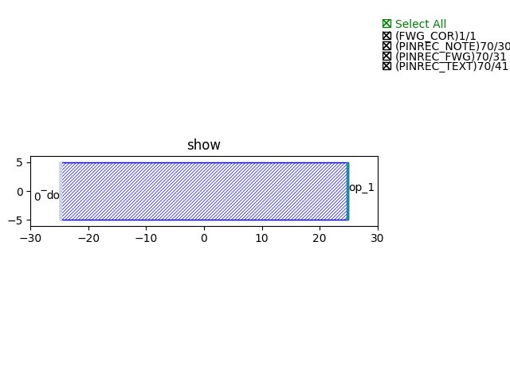

Alternative ways of Ports/Pins
^^^^^^^^^^^^^^^^^^^^^^^^^^^^^^^^^^^^^^

When creating Pcells, ports/pins are essential units not only to recognize and define where the input/output of the Pcells are but also to offer the connecting information for the powerful auto-routing function in **PhotoCAD**.

Instead of initiating ports/pins from the existing ports of a Pcell(see examples ``Splitter``, ``Mzm``), we can also create ports/pins from ``fp.Port`` or ``fp.Pin``, and this allows users to generate ports individually at any places without the restriction of only on the existing Pcells.

This section is a guide to show you how to add ports/pins from ``fp.Port`` or ``fp.Pin`` function, and we will create a rectangular where one side of the shape is ``port`` and another is ``pin``.

Full Script
================
::

    import math
    from dataclasses import dataclass
    from typing import Tuple
    from gpdk.technology import get_technology, WG
    from fnpcell import all as fp

    @dataclass(eq=False)
    class fpPinPort(fp.PCell):

        height: float = fp.PositiveFloatParam(default=10)
        width: float = fp.PositiveFloatParam(default=50)
        waveguide_type: WG.FWG.C = fp.WaveguideTypeParam(type=WG.FWG.C)
        port_names: fp.IPortOptions = fp.PortOptionsParam(count=2, default=("op_0", "ep_0"))

        def _default_waveguide_type(self):
            return get_technology().WG.FWG.C.WIRE

        def build(self):
            insts, elems, ports = super().build()
            TECH = get_technology()

            rec = fp.el.Rect(height=self.height, width=self.width, center=(0, 0), layer=TECH.LAYER.FWG_CLD)
            elems += rec

            ports += fp.Port(name=self.port_names[0], position=(-self.width/2, 0),
                             waveguide_type=self.waveguide_type.updated(core_layout_width=self.height), orientation=-math.pi)
            ports += fp.Pin(name=self.port_names[1], position=(self.width/2, 0), metal_line_type=TECH.METAL.M1.W10, orientation=0)

            return insts, elems, ports

    if __name__ == "__main__":
        from gpdk.util.path import local_output_file

        gds_file = local_output_file(__file__).with_suffix(".gds")
        library = fp.Library()

        TECH = get_technology()
        # =============================================================
        # fmt: off

        library += fpPinPort()

        # fmt: on
        # =============================================================
        fp.export_gds(library, file=gds_file)
        fp.plot(library)

Section Script Description
===========================

#. Importing necessary function packages

   To customize the components in gpdk, ``fnpcell`` , ``dataclass``, ``typing`` and ``math`` need to be imported because modules such as data format, graphics generation, data processing need to be used. Moreover, graphics in the component layout need to be generated on different process layers, so process information(``technology``, ``WG``) in gpdk needs to be imported::

        import math
        from dataclasses import dataclass
        from typing import Tuple
        from gpdk.technology import get_technology, WG
        from fnpcell import all as fp

#. Define the properties and methods in the ``Mzm`` class

   #. Define user-definable parameters::

        height: float = fp.PositiveFloatParam(default=10)
        width: float = fp.PositiveFloatParam(default=50)
        port_names: fp.IPortOptions = fp.PortOptionsParam(count=2, default=("op_0", "ep_0"))

    * ``height`` and ``width`` are the dimension of the rectangular.

    * ``port_names`` is used to define the number of ports of the component. Secondly, the ports are named, and the default is ``default=("op_0", "op_1")``, the user can set it by himself.

   #. Define the build method.

      * Instances, elements and ports are usually used in device cells, i.e. calls to other cell instances, graphics in this cell and device ports.

        The three elements in the device are implemented in the PCell definition by calling the build function module in the parent class PCell::

            def build(self):
            insts, elems, ports = super().build()

      * Generate the rectangular geometry as a element by ``fp.el.Rect`` and initiate to the ElementSet(elems).::

            rec = fp.el.Rect(height=self.height, width=self.width, center=(0, 0), layer=TECH.LAYER.FWG_COR)
            elems += rec

      * Generate the ports/pins by ``fp.Port/Pin``. Note here the name of the ports/pins can be named by the users (type should be ``str``).
        ``position`` can also be adjust by ``at``, e.g. ``at=component["op_0]``,  to assign a new port to the existing port
        ::

            ports += fp.Port(name=self.port_names[0], position=(-self.width/2, 0),
                             waveguide_type=TECH.WG.FWG.C.WIRE.updated(core_layout_width=self.height), orientation=-math.pi)
            ports += fp.Pin(name=self.port_names[1], position=(self.width/2, 0), metal_line_type=TECH.METAL.M1.W10, orientation=0)

      * Return the instances, elements, and ports in the component cell.

      ::

              return insts, elems, ports

View the layout
=======================================

We can see from the above figure that we have created a rectangular with ``height=10``, ``width=50``. The left port named ``op_0`` is an optical port with a width = 10, and the right port named ``ep_0`` is then an electrical port with also a width = 10. The two ports which we defined individually are able to recognize by the auto-routing function.

