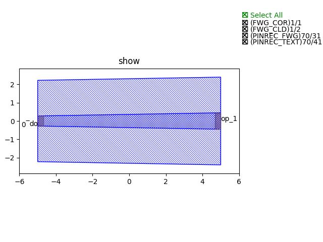

Taper
^^^^^^^^^^^^^^^^^^^^^^^^^^^^^^^^^^^^^^^^^^^^^
This section will introduce customizing the basic components in ``gpdk`` from the beginning, using ``TaperLinear`` as an example. The full script can be found in ``gpdk`` > ``components`` > ``taper`` > ``taper_linear.py``.

Full script
========================
::

        from dataclasses import dataclass
        from functools import cached_property
        from typing import Tuple

        from fnpcell import all as fp
        from gpdk.technology import get_technology
        from gpdk.technology.interfaces import CoreCladdingWaveguideType
        from gpdk.routing.extended.extended import Extended


        @dataclass(eq=False)
        class TaperLinear(fp.IWaveguideLike, fp.PCell):
            """
            Attributes:
                length: length of straight
                left_type: type of waveguide of start
                right_type: type of waveguide of end
                anchor: defaults to `Anchor.START`, origin of the straight(START at origin, CENTER at origin or End at origin)
                port_names: defaults to ["op_0", "op_1", "op_2"]

            Examples:
            ```python
            TECH = get_technology()
                swg = TECH.WG.SWG.C.WIRE.updated(core_design_width=3.8, cladding_design_width=9.6)
            taper = TaperLinear(name="a", length=20, left_type=swg, right_type=TECH.WG.SWG.C.WIRE)
            fp.plot(taper)
            ```
            
            """

            length: float = fp.PositiveFloatParam(default=10)
            left_type: CoreCladdingWaveguideType = fp.WaveguideTypeParam(type=CoreCladdingWaveguideType)
            right_type: CoreCladdingWaveguideType = fp.WaveguideTypeParam(type=CoreCladdingWaveguideType)
            anchor: fp.Anchor = fp.AnchorParam(default=fp.Anchor.CENTER)
            port_names: fp.IPortOptions = fp.PortOptionsParam(count=2, default=["op_0", "op_1"])

            def _default_left_type(self):
                return get_technology().WG.FWG.C.WIRE

            def _default_right_type(self):
                return get_technology().WG.FWG.C.EXPANDED

            @cached_property
            def raw_curve(self):
                return fp.g.Line(
                    length=self.length,
                    anchor=self.anchor,
                )

            def build(self) -> Tuple[fp.InstanceSet, fp.ElementSet, fp.PortSet]:
                insts, elems, ports = super().build()
                assert self.left_type.is_isomorphic_to(self.right_type), "left_type must be isomorphic to right_type"

                wgt = self.left_type.tapered(taper_function=fp.TaperFunction.LINEAR, final_type=self.right_type)
                wg = wgt(curve=self.raw_curve).with_ports(self.port_names)


                insts += wg
                ports += wg.ports
                return insts, elems, ports


            # # GPDK PCell default to load TaperLinear.dat, here we override the method to use the TaperModel
            @fp.cache()
            def sim_model(self, env: fp.ISimEnv):
                left_model = self.left_type.theoretical_parameters
                right_model = self.right_type.theoretical_parameters
                return fp.sim.TaperLinearModel([left_model, right_model], length=self.length)


        if __name__ == "__main__":
            from gpdk.util.path import local_output_file

            gds_file = local_output_file(__file__).with_suffix(".gds")
            library = fp.Library()

            TECH = get_technology()
            # =============================================================
            # fmt: off

            library += TaperLinear()

            # fmt: on
            # =============================================================
            fp.export_gds(library, file=gds_file)
            fp.plot(library)


Run the complete script once, generating the following GDS layout.




Section Script Description
=============================

#. Import function packages:

   To customize the basic components(straight waveguide/bends) in gpdk, several packages needs to be imported. ``dataclass``, ``cached_property``, ``Tuple`` are for data processing. ``fnpcell``, ``get_technology``, ``CoreCladdingWaveguideType``, ``Extended`` are for process information, data format , routing function, etc::

        from dataclasses import dataclass
        from functools import cached_property
        from pathlib import Path
        from typing import Optional, Tuple

        from fnpcell import all as fp
        from gpdk.technology import get_technology
        from gpdk.technology.interfaces import CoreCladdingWaveguideType

#. Define a new PCell, and a custom class (here will be ``TaperLinear``):

   Inherit the new PCell via ``fp.PCell`` & ``fp.IWaveguideLike`` in fnpcell, which is a new basic component in gpdk. ``fp.IWaveguideLike`` is the parent class of all basic components in ``fnpcell``, and it includes the base setting of the components. Then the new ``TaperLinear`` class needs to be decorated by ``@dataclass(eq=False)``::

        @dataclass(eq=False)
        class TaperLinear(fp.IWaveguideLike, fp.PCell):

#. Define the properties and methods in the ``TaperLinear`` class

   #. Define user-definable parameters::


            length: float = fp.PositiveFloatParam(default=10)
            left_type: CoreCladdingWaveguideType = fp.WaveguideTypeParam(type=CoreCladdingWaveguideType)
            right_type: CoreCladdingWaveguideType = fp.WaveguideTypeParam(type=CoreCladdingWaveguideType)
            anchor: fp.Anchor = fp.AnchorParam(default=fp.Anchor.CENTER)
            port_names: fp.IPortOptions = fp.PortOptionsParam(count=2, default=["op_0", "op_1"])

      * ``length: float = fp.PositiveFloatParam(default=10)`` defines the length of the linear taper, and here we ser default length to 10.

      * ``left_type`` and ``right_type`` define the waveguide types of the waveguide that the taper will be connected.

      * ``anchor`` is used to set the placement of the PCell, ``fp.Anchor.CENTER`` means that the center of the PCell will located in (0, 0).

      * ``port_names: fp.IPortOptions = fp.PortOptionsParam()`` is used to define the number of ports of the component, since it is a bend, so there will be one port on the left and another on the right, the total number is ``count=2`` . Secondly, the ports are named, and the default is ``default=("op_0", "op_1")``, the user can set it by himself.

   #. Create the ``TaperLinear``

      * Create the taper by generating the line via ``fp.g.Line``, where the user-defined parameters are used in the curve. ``@cached_property`` is a decorator that converts a class method into a property whose value is calculated only once and then cached like a regular attribute ::

            @cached_property
            def raw_curve(self):
                return fp.g.Line(
                    length=self.length,
                    anchor=self.anchor,
                )


   #. Define the build method to build ``TaperLinear``

      * Instances, elements and ports are usually used in device cells, i.e. calls to other cell instances, graphics in this cell and device ports.

        The three elements in the device are implemented in the PCell definition by calling the build function module in the parent class PCell.

      ::

            def build(self) -> Tuple[fp.InstanceSet, fp.ElementSet, fp.PortSet]:
                insts, elems, ports = super().build()


      * Check the waveguide type of ``left_type`` and ``right_type`` has to be isomorphic before building the PCell.


      ::

                assert self.left_type.is_isomorphic_to(self.right_type), "left_type must be isomorphic to right_type"

      * Create the taper geometry by ``tapered``. ``waveguide_type.tapered`` is a function to generate taper of the waveguide type.

      ::

                wgt = self.left_type.tapered(taper_function=fp.TaperFunction.LINEAR, final_type=self.right_type)

      * Define the type of waveguide used in the taper, as well as the curve and add the ports generated from the above script.

      ::

                wg = wgt(curve=self.raw_curve).with_ports(self.port_names)


      * Initiate wg and ports and return the instances, elements, and ports in the component cell.


      ::

            insts += wg
            ports += wg.ports
            return insts, elems, ports


   #. Use the ``TaperLinear`` class to create component cells and output the layout

      * Import the package to generate output layout file under the same file of the ``TaperLinear``

      ::

                from gpdk.util.path import local_output_file


      * Refer to the path where the top generated gds file is saved. Then obtain all device process information.

      ::

               gds_file = local_output_file(__file__).with_suffix(".gds")
               library = fp.Library()
               TECH = get_technology()

      * Create a ``TaperLinear`` component defined with default parameters

      ::

               library += TaperLinear()

      * Export GDS files

      ::

                   fp.export_gds(library, file=gds_file)


Extension of the taper ports
============================================

In some cases the ports would have to be extended for several nanometers, here we provide an option for the users to extend their ports without many changes of the script.

#. Extended function.

   Users can find the definition of ``Extended`` function in ``gpdk >> routing >> extended.py``. Simply to say, it allow designers automatically add extension (rectangles) next to the ports of the PCell(device).

   The below scripts shows if user need extra 500 nm extension to each ports in this ``TaperLinear`` case.

   ::

        wgt = self.left_type.tapered(taper_function=fp.TaperFunction.LINEAR, final_type=self.right_type)
        wg = wgt(curve=self.raw_curve).with_ports(self.port_names)
        wg_extended = Extended(device=wg,lengths={"*":0.5})
        insts += wg_extended
        ports += wg_extended.ports

   Length of each extended ports can be defined themselves e.g. ``lengths={"op_0":1, "op_1":2, "*":0.5}``. ``"*"`` means all of the undefined ports.

    .. image:: ../images/taper2.png

    .. note::
        For auto-routing applications e.g. ``straight``, ``bend``, ``taper``, ``transition``, they must define a ``raw_curve`` in advance to allow PhotoCAD calculate the length of the PCell and use it into auto-route function. In this case, designers has to first define a ``raw_curve`` to generate the waveguide, then overlay the ``raw_curve`` to the extended taper.::

                @property
                def raw_curve(self):
                    IN, OUT = self.cell.ports
                return fp.g.LineBetween(IN.position, OUT.position)


