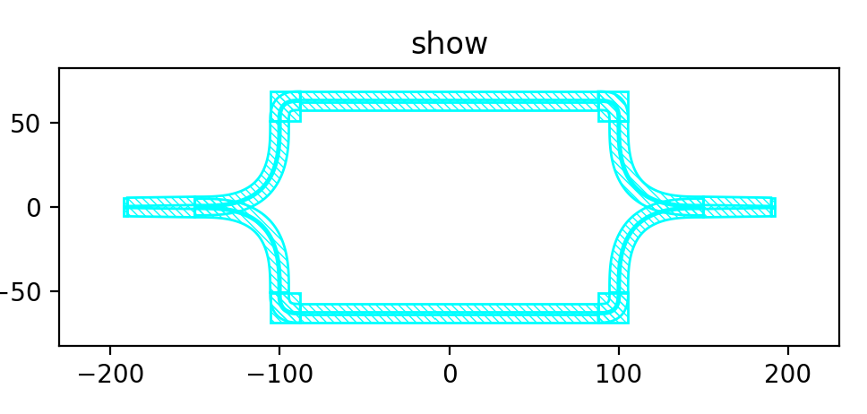
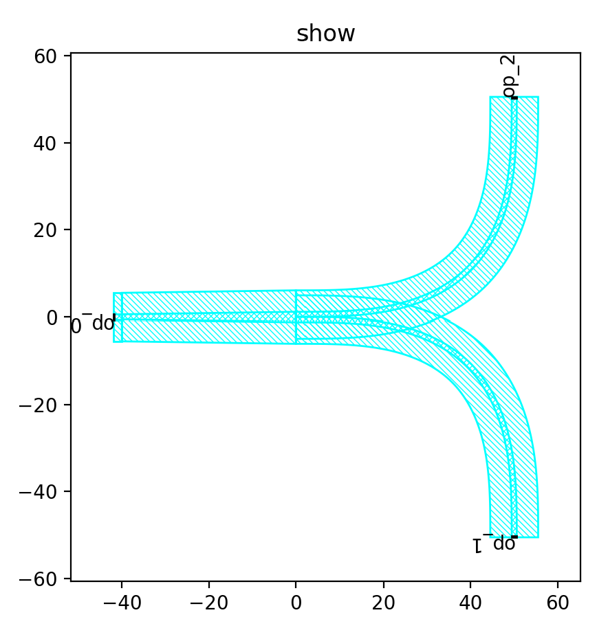
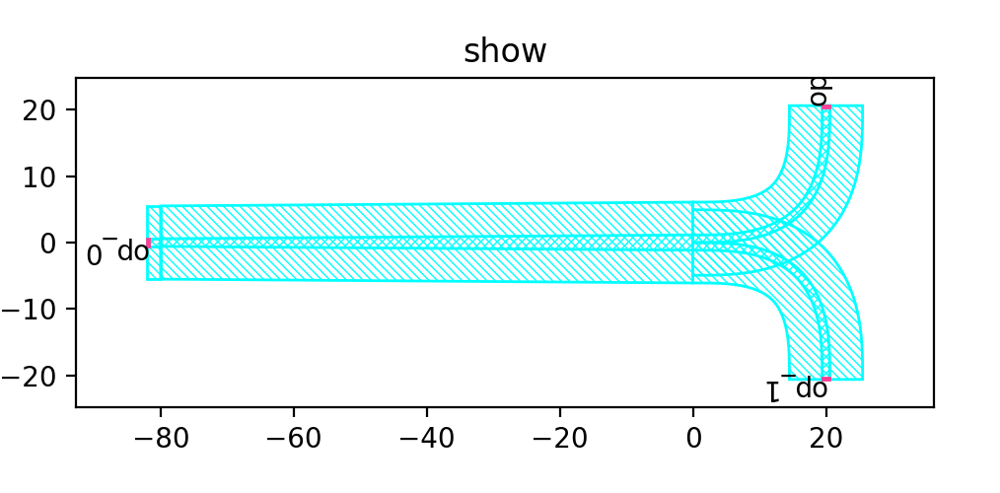
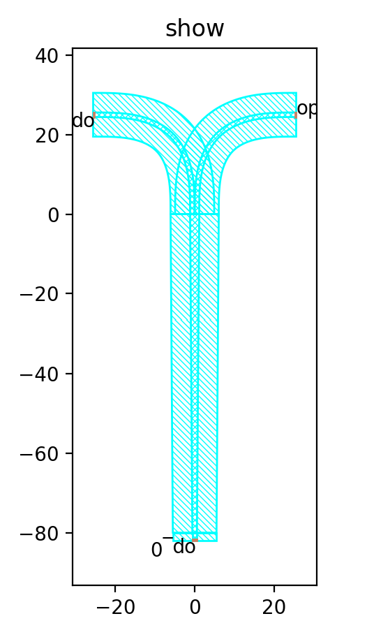

LinkedSplitter
^^^^^^^^^^^^^^^^^^^^^^^^^^^^^^^^^^^^^^^^^^^^^^^^^^^^^

Full script
--------------------------------
::

  from dataclasses import dataclass
  from fnpcell import all as fp
  from gpdk import all as pdk
  from gpdk.technology import get_technology

  @fp.pcell_class()
  @dataclass(eq=False)
  class LinkedSplitter(fp.PCell):
      def build(self):
          insts, elems, ports = super().build()
          # fmt: off
          TECH = get_technology()

          Y1 = pdk.YSplitter(waveguide_type=TECH.WG.SWG.C.WIRE, taper_length=40, bend_radius=50)
          Y2 = pdk.YSplitter(waveguide_type=TECH.WG.SWG.C.WIRE, taper_length=40, bend_radius=50, transform=fp.rotate(degrees=180))

          YSplitter1 = Y1.translated(-150, 0)
          YSplitter2 = Y2.translated(150, 0)

          # #  fp.plot(fp.Library(sb10,s10,s15,s20,s30,s40))

          device = fp.Linked(
              link_type=TECH.WG.SWG.C.WIRE,
              bend_factory=TECH.WG.SWG.C.WIRE.BEND_EULER,
              links=[
                  YSplitter1["op_1"] >> YSplitter2["op_2"],
                  YSplitter1["op_2"] >> YSplitter2["op_1"],
              ],
              ports=[],
          )

          insts += device

          # fmt: on
          return insts, elems, ports

  if __name__ == "__main__":
      from pathlib import Path

      gds_file = Path(__file__).parent / "local" / Path(__file__).with_suffix(".gds").name
      library = fp.Library()

      TECH = get_technology()
      # =============================================================
      # fmt: off

      library += LinkedSplitter()

      # fmt: on
      # =============================================================
      fp.export_gds(library, file=gds_file)
      fp.plot(library).
      
      

      
The class function ``YSplitter()`` in gpdk is called below to specify the waveguide processing type, taper length and waveguide bend radius.  

::

    Y1 = pdk.YSplitter(waveguide_type=TECH.WG.SWG.C.WIRE, taper_length=40, bend_radius=50)
    Y2 = pdk.YSplitter(waveguide_type=TECH.WG.SWG.C.WIRE, taper_length=40, bend_radius=50, transform=fp.rotate(degrees=180))
      
      
In the following we test the ``YSplitter`` parameters.

First, comment out the ``Y2`` waveguide program and observe only the ``Y1`` waveguide. 

As seen in the figure above, the taper length is 40, the radius of the waveguide bend is 50, and its bifurcation point is located at the origin (this parameter can be modified from the corresponding source file in gpdk, if there are no special requirements, it is not recommended to change the source file; if there are special requirements, you can copy the source file and modify its function naming, which is conducive to the management of device generation files).

Second, we change the ``taper_length`` to 80 and the ``bend_radius`` to 20, and run the following script.

::

	Y1 = pdk.YSplitter(waveguide_type=TECH.WG.SWG.C.WIRE, taper_length=80, bend_radius=25)
	
	

As seen in the above figure, the ``taper_length`` increases significantly and the ``bend_radius`` of the waveguide bend decreases significantly.  

Then the ``Ysplitter`` is transformed by 90°.

::

  Y1 = pdk.YSplitter(waveguide_type=TECH.WG.SWG.C.WIRE, taper_length=80, bend_radius=25, transform=fp.rotate(degrees=90))
  
  

As you can see from the figure above, the device is rotated 90° counterclockwise.      
      
      
      
      
      
      
      
      
      
      
      
      
      
      
      
      
      
      
      
      
      
      
      
      
      
      
      
      
      
