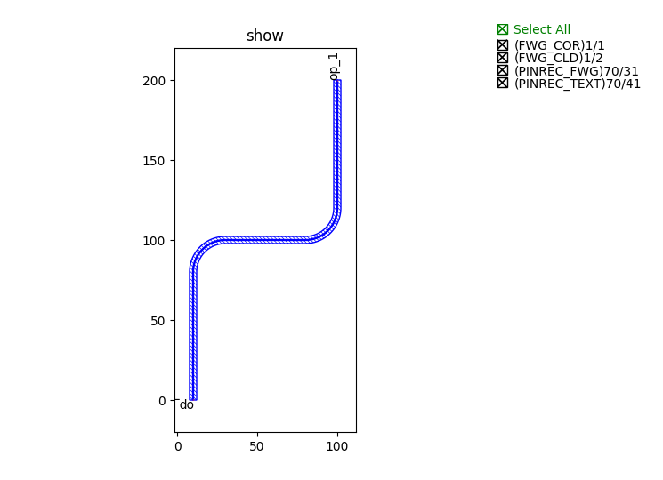

Smooth curve for routing using ``bend_factory``
^^^^^^^^^^^^^^^^^^^^^^^^^^^^^^^^^^^^^^^^^^^^^^^^^^^^^^^^^^

In ``Guides >> Waveguide Routing``, we have introduced three powerful functions which allow users to connect single ports from one to another by defining the two ports and the routing parameters between them.

Among those functions, we can manually set ``waypoints`` and define a smooth curve (``fp.g.Path.smooth``) to connect those waypoints, thus providing users another possibility to create a curve with specific points.

We must first define the bend type for the smooth curve to recognize. In the example below, we define ``bend_factory`` as a circular bend with a radius of 20. However, the ``bend_factory`` here should not misinterpret as the one used in ``wg.py`` or ``waveguide_factory``.

However, we would not recommend users create a curve or line through ``fp.g.Path.smooth``. It would be a problem when doing post-simulation because the curve is generated to be a whole unit in this function. There are no nodes at the turning point between straight and bend waveguides. Furthermore, the straight waveguide's S-parameters differ from the bends and should be carefully considered when designing the circuits.

::

        from fnpcell import all as fp
        from gpdk.technology import get_technology
        TECH = get_technology()

        def bend_factory(central_angle: float):
            bend = fp.g.CircularBend(radius=20, radians=central_angle)
            return bend, 20

        waypoints = [(10, 0), (10, 100), (100, 100), (100, 200)]
        curve = fp.g.Path.smooth(waypoints=waypoints, bend_factory=bend_factory)
        wg = TECH.WG.FWG.C.WIRE(curve=curve)
        fp.plot(wg)

The results is shown in below figure.

