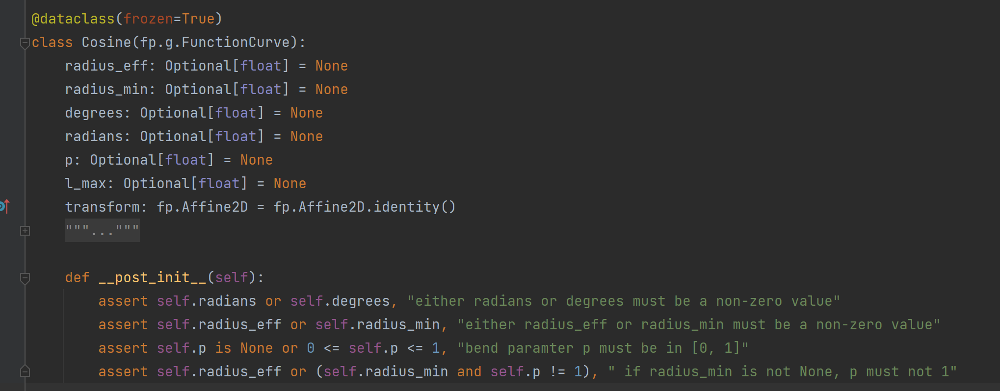
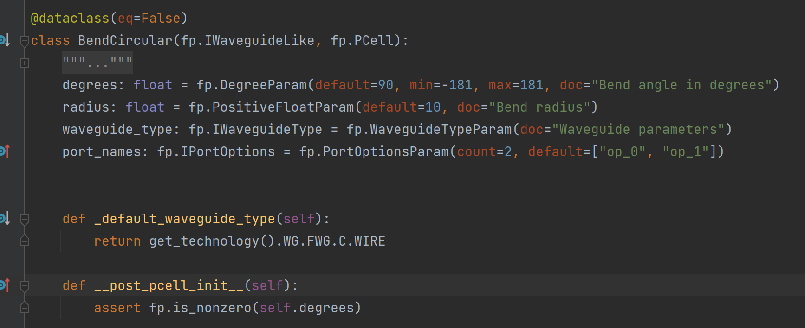

Differences between ``__post_pcell_init__`` & ``__post_init__``
^^^^^^^^^^^^^^^^^^^^^^^^^^^^^^^^^^^^^^^^^^^^^^^^^^^^^^^^^^^^^^^^^^^

Both methods are commonly used in PhotoCAD to perform data validation on the class after initializing it. For example, in ``gpdk >> examples >> examples_cosine_bend.py``, we use ``__post_init__`` method to check if the parameters are well-set when we initialize the class.

Another example of ``__post_pcell_init__`` is in ``gpdk >> components >> bend >> bend_circular.py`` when we want to check if the degree of the circular bend is a non-zero value.

The major difference between the two initializations is the time that runs the action. ``__post_init__`` runs directly after the class was generated (to be more specific, after setting the parameters of the PCell)  but before the ``_default_factory`` was created. On the other hand, ``__post_pcell_init__`` will run after setting the parameters of the PCell and the ``_default_factory``. It allows users more convenience to set the values of the components by ``_default_factory`` function and check those afterward.

