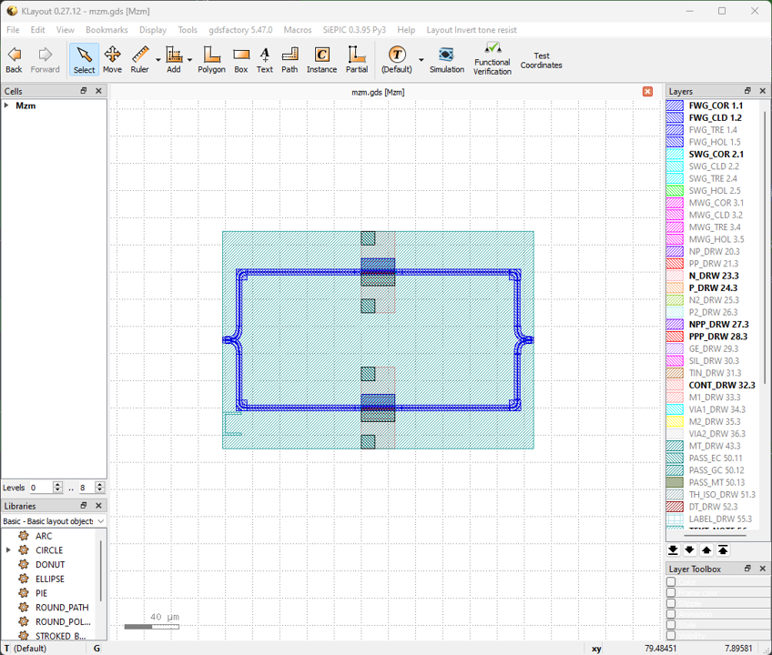

Mach-Zehnder modulator
^^^^^^^^^^^^^^^^^^^^^^^^^^^^^^^

This section will introduce customizing the components in ``gpdk`` from the beginning, using Mach-Zehnder modulator as an example. The full script can be found in ``gpdk`` > ``components`` > ``mzm`` > ``mzm.py``.

Full Script
================
::

        from dataclasses import dataclass
        from typing import Tuple

        from fnpcell import all as fp
        from gpdk.components.combiner.y_combiner import YCombiner
        from gpdk.components.pn_phase_shifter.pn_phase_shifter import PnPhaseShifter
        from gpdk.components.splitter.y_splitter import YSplitter
        from gpdk.technology import WG, get_technology

        @dataclass(eq=False)
        class Mzm(fp.PCell, band="C"):

            p_width: float = fp.PositiveFloatParam(default=1)
            n_width: float = fp.PositiveFloatParam(default=1)
            np_offset: float = fp.FloatParam(default=0)
            wg_length: float = fp.PositiveFloatParam(default=25)
            phase_shifter_spacing: float = fp.PositiveFloatParam(default=100)
            splitter_wg_length: float = fp.FloatParam(default=100)
            waveguide_type: WG.FWG.C = fp.WaveguideTypeParam(type=WG.FWG.C)
            pn_phase_shifter_0: fp.IDevice = fp.DeviceParam(type=PnPhaseShifter, port_count=2, pin_count=2, required=False)
            pn_phase_shifter_1: fp.IDevice = fp.DeviceParam(type=PnPhaseShifter, port_count=2, pin_count=2, required=False)
            y_splitter: fp.IDevice = fp.DeviceParam(type=YSplitter, port_count=3, required=False)
            y_combiner: fp.IDevice = fp.DeviceParam(type=YCombiner, port_count=3, required=False)
            port_names: fp.IPortOptions = fp.PortOptionsParam(count=2, default=["op_0", "op_1"])

            def _default_waveguide_type(self):
                return get_technology().WG.FWG.C.WIRE

            def _default_pn_phase_shifter_0(self):
                return PnPhaseShifter(
                    name="p1", p_width=self.p_width, n_width=self.n_width, np_offset=self.np_offset, wg_length=self.wg_length, waveguide_type=self.waveguide_type
                )

            def _default_pn_phase_shifter_1(self):
                return PnPhaseShifter(
                    name="p2",
                    p_width=self.p_width,
                    n_width=self.n_width,
                    np_offset=self.np_offset,
                    wg_length=self.wg_length,
                    waveguide_type=self.waveguide_type,
                    transform=fp.translate(0, -self.phase_shifter_spacing),
                )

            def _default_y_splitter(self):
                return YSplitter(
                    name="s", bend_radius=10, waveguide_type=self.waveguide_type, transform=fp.translate(-self.splitter_wg_length, -self.phase_shifter_spacing / 2)
                )

            def _default_y_combiner(self):
                return YCombiner(
                    name="d",
                    bend_radius=10,
                    waveguide_type=self.waveguide_type,
                    transform=fp.translate(self.wg_length + self.splitter_wg_length, -self.phase_shifter_spacing / 2),
                )

            def build(self):
                insts, elems, ports = super().build()
                # fmt: off

                waveguide_type = self.waveguide_type
                pn_phase_shifter_0 = self.pn_phase_shifter_0
                pn_phase_shifter_1 = self.pn_phase_shifter_1
                ysplitter = self.y_splitter
                ycombiner = self.y_combiner
                port_names = self.port_names

                phase_shifter_top = pn_phase_shifter_0
                phase_shifter_bottom = pn_phase_shifter_1
                splitter = ysplitter
                ports += splitter["op_0"].with_name(port_names[0])
                ycombiner = ycombiner
                ports += ycombiner["op_2"].with_name(port_names[1])

                insts += fp.Linked(
                    link_type=waveguide_type,
                    links=[
                        splitter["op_2"] >> phase_shifter_top["op_0"],
                        splitter["op_1"] >> phase_shifter_bottom["op_0"],
                        phase_shifter_top["op_1"] >> ycombiner["op_0"],
                        phase_shifter_bottom["op_1"] >> ycombiner["op_1"],
                    ],
                    ports=[],
                )

                # fmt: on
                return insts, elems, ports

        if __name__ == "__main__":
            from gpdk.util.path import local_output_file

            gds_file = local_output_file(__file__).with_suffix(".gds")
            library = fp.Library()

            TECH = get_technology()
            # =============================================================
            # fmt: off

            library += Mzm()

            # fmt: on
            # =============================================================
            fp.export_gds(library, file=gds_file)
            fp.plot(library)

Section Script Description
===========================
#. Importing necessary function packages

   To customize the components in gpdk, ``fnpcell`` , ``dataclass``, ``typing`` need to be imported because modules such as data format, graphics generation, data processing need to be used. ``YCombiner``, ``PnPhaseShifter``, ``YSplitter`` are the PCells already generated in the previous section and we will use it as a cell to build up the mzm in this example. Moreover, graphics in the component layout need to be generated on different process layers, so process information(``technology``) in gpdk needs to be imported::

        from dataclasses import dataclass
        from typing import Tuple

        from fnpcell import all as fp
        from gpdk.components.combiner.y_combiner import YCombiner
        from gpdk.components.pn_phase_shifter.pn_phase_shifter import PnPhaseShifter
        from gpdk.components.splitter.y_splitter import YSplitter
        from gpdk.technology import WG, get_technology

#. Define a new PCell, and a custom Mzm class:

   Define the new parameterized cell via ``fp.PCell`` in fnpcell, which is a new component in gpdk. ``band=C`` creates a ``C`` marker on the layout for users to recognize the band using in this component and is restricted to only use ``C-band`` waveguides in this example.  Then, the new ``mzm`` class needs to be decorated by ``@dataclass(eq=False)``::

        @dataclass(eq=False)
        class Mzm(fp.PCell, band="C"):

#. Define the properties and methods in the ``Mzm`` class

   #. Define user-definable parameters::

        p_width: float = fp.PositiveFloatParam(default=1)
        n_width: float = fp.PositiveFloatParam(default=1)
        np_offset: float = fp.FloatParam(default=0)
        wg_length: float = fp.PositiveFloatParam(default=25)
        phase_shifter_spacing: float = fp.PositiveFloatParam(default=100)
        splitter_wg_length: float = fp.FloatParam(default=100)
        waveguide_type: WG.FWG.C = fp.WaveguideTypeParam(type=WG.FWG.C)
        pn_phase_shifter_0: fp.IDevice = fp.DeviceParam(type=PnPhaseShifter, port_count=2, pin_count=2, required=False)
        pn_phase_shifter_1: fp.IDevice = fp.DeviceParam(type=PnPhaseShifter, port_count=2, pin_count=2, required=False)
        y_splitter: fp.IDevice = fp.DeviceParam(type=YSplitter, port_count=3, required=False)
        y_combiner: fp.IDevice = fp.DeviceParam(type=YCombiner, port_count=3, required=False)
        port_names: fp.IPortOptions = fp.PortOptionsParam(count=2, default=["op_0", "op_1"])

    * ``p_width``, ``n_width``, and ``np_offset`` are parameters which can be set in ``PnPhaseShifter``.

    * ``wg_length``, ``phase_shifter_spacing`` , and ``splitter_wg_length`` define the geometry of the mzm, which is shown in the below figure.

        .. image:: ../images/mzm1.png

    * ``waveguide_type`` is used to define the type of waveguide used in the mzm. In this example the waveguide type is limited to ``WG.FWG.C`` because the mzm is operating in C-band wavelength.

    * ``pn_phase_shifter_0``. ``pn_phase_shifter_1``, ``y_splitter``, and ``y_combiner`` are used to build up the mzm component.

    * ``port_names`` is used to define the number of ports of the component. Secondly, the ports are named, and the default is ``default=("op_0", "op_1")``, the user can set it by himself.

   #. Define a self method to get the default waveguide type and default basic components(``pn_phase_shifter``, ``y_splitter``, ``y_combiner``)::

        def _default_waveguide_type(self):
            return get_technology().WG.FWG.C.WIRE

        def _default_pn_phase_shifter_0(self):
            return PnPhaseShifter(
                name="p1",
                p_width=self.p_width,
                n_width=self.n_width,
                np_offset=self.np_offset,
                wg_length=self.wg_length,
                waveguide_type=self.waveguide_type
            )

        def _default_pn_phase_shifter_1(self):
            return PnPhaseShifter(
                name="p2",
                p_width=self.p_width,
                n_width=self.n_width,
                np_offset=self.np_offset,
                wg_length=self.wg_length,
                waveguide_type=self.waveguide_type,
                transform=fp.translate(0, -self.phase_shifter_spacing),
            )

        def _default_y_splitter(self):
            return YSplitter(
                name="s", bend_radius=10, waveguide_type=self.waveguide_type, transform=fp.translate(-self.splitter_wg_length, -self.phase_shifter_spacing / 2)
            )

        def _default_y_combiner(self):
            return YCombiner(
                name="d",
                bend_radius=10,
                waveguide_type=self.waveguide_type,
                transform=fp.translate(self.wg_length + self.splitter_wg_length, -self.phase_shifter_spacing / 2),
            )

   #. Define the build method to build ``Splitter`` and draw the layout.

      * Instances, elements and ports are usually used in device cells, i.e. calls to other cell instances, graphics in this cell and device ports.

        The three elements in the device are implemented in the PCell definition by calling the build function module in the parent class PCell
      ::

            def build(self):
            insts, elems, ports = super().build()

      * Define the variable parameters and components we set::

            waveguide_type = self.waveguide_type
            pn_phase_shifter_0 = self.pn_phase_shifter_0
            pn_phase_shifter_1 = self.pn_phase_shifter_1
            ysplitter = self.y_splitter
            ycombiner = self.y_combiner
            port_names = self.port_names

      * Add ports for the mzm from ``ysplitter`` and ``ycombiner``

      ::

            phase_shifter_top = pn_phase_shifter_0
            phase_shifter_bottom = pn_phase_shifter_1
            splitter = ysplitter
            ports += splitter["op_0"].with_name(port_names[0])
            ycombiner = ycombiner
            ports += ycombiner["op_2"].with_name(port_names[1])

      * Link all components with defined waveguide type and initiate the linked route

      ::

            insts += fp.Linked(
                link_type=waveguide_type,
                links=[
                    splitter["op_2"] >> phase_shifter_top["op_0"],
                    splitter["op_1"] >> phase_shifter_bottom["op_0"],
                    phase_shifter_top["op_1"] >> ycombiner["op_0"],
                    phase_shifter_bottom["op_1"] >> ycombiner["op_1"],
                ],
                ports=[],
            )

      * Return the instances, elements, and ports in the component cell.

      ::

              return insts, elems, ports

   #. Use the ``Mzm`` class to create component cells and output the layout.

      * Import the package to generate output layout file under the same file of the ``mzm``

      ::

                from gpdk.util.path import local_output_file

      * Refer to the path where the top generated gds file is saved. Then obtain all device process information.

      ::

               gds_file = local_output_file(__file__).with_suffix(".gds")
               library = fp.Library()
               TECH = get_technology()

      * Create a ``Mzm`` component defined with default parameters

      ::

               library += Mzm()

      * Export GDS files

      ::

                   fp.export_gds(library, file=gds_file)

Export GDS Layout
=======================================

Run ``mzm.py`` and use layout tool e.g. KLayout to view the generated GDS file, which should be saved under ``gpdk`` > ``components`` > ``mzm`` > ``local``.

