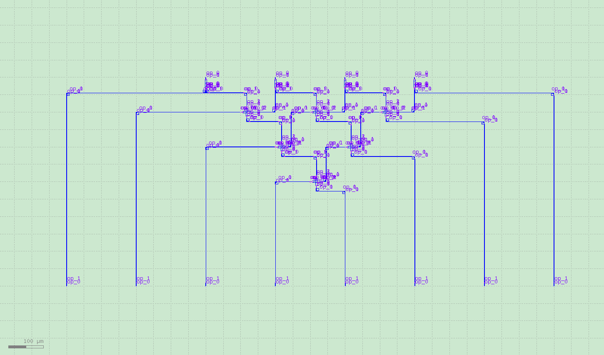
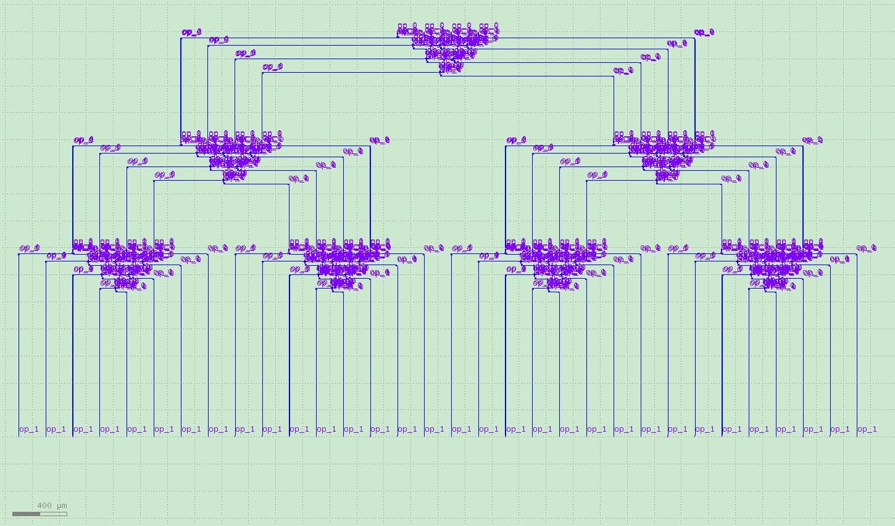

Reconfigurable multi-level cross-circuit
====================

Reconfigurable multi-level cross circuits are a necessary part of designing complex circuits. This section implements the design of reconfigurable multi-level cross circuits using the AMF PDK, which allows users to implement complex designs by simply modifying the script.

The base modules include:

- MMI1×2
- cross waveguide

Part I. Parameter Description
---------------------------

- spacing = 200 : Component spacing setting
- row_number = 8 : Number of units
- basic_comp_y = RingModulator(transform=fp.rotate(degrees=90)) : Basic Component

Part II. Principle Description
---------------------------

Count the number of levels as well as the number of branches by the number of modules::

    def sp_num(order):
        spnum=0
        for i in range(order):
            spnum = spnum+2**i
        return spnum

    def isPower(row_number):
        mmi_tree_order = 0
        while(1):
            if row_number % 2==0:
                mmi_tree_order = mmi_tree_order+1
                row_number =row_number/2
            else:
                return mmi_tree_order

Part III. Test Description
---------------------------
The following shows the design of the layout for different number of layers, respectively, with only simple parameters to be modified:

.. image:: ../images/TIC_16.png

Part IV. Summary
---------------------------

PhotoCAD has tremendous advantages in designing large-scale reconfigurable optoelectronic links. Users are welcome to purchase the software, and custom circuit services are also available.
