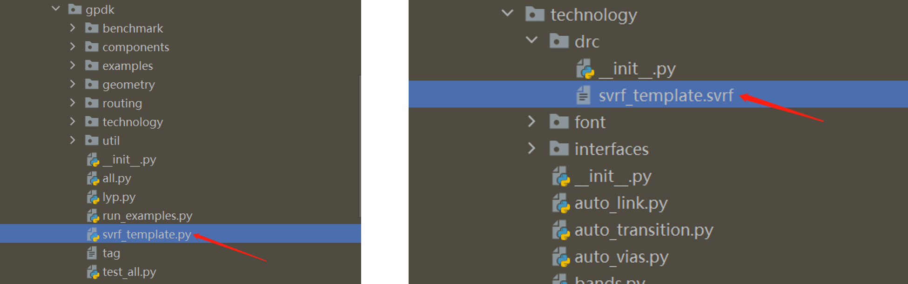
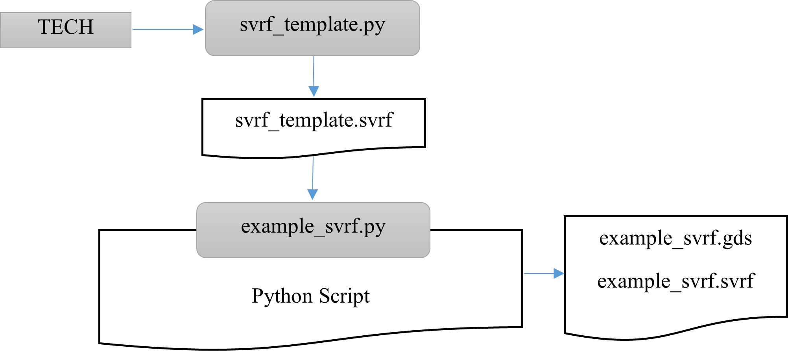

Design Rule Check(DRC)
^^^^^^^^^^^^^^^^^^^^^^^^^^^^^^^^^^^^^^^

After the layout GDS file is designed, it needs to pass the Design Rule Check (DRC) before it can be manufactured in the foundry. DRC is usually provided by the foundry based on production line characteristics. The design rule will agree on the dimensional constraints between layouts on the same or different layers of the layout, such as minimum width, spacing, overlap, wrap, etc.

The **PhotoCAD** tool provides the ability to generate a DRC template file that conforms to the SVRF\ :sup:`TM` format (Standard Verification Rule Format) corresponding to the current GDS file when generating a GDS file of the layout through a script, which allows the user to customize more detailed DRC rule entries. 

PhotoCAD's gpdk package contains the scripts for generating SVRFTM template files, which are stored in ``gpdk``> ``technology`` > ``drc`` .

Generate SVRF\ :sup:`TM` template
---------------------------------------------

The number of layers, GDS Number, etc. varies from process to process. To generate a standard DRC template, first run ``gpdk`` > ``svrf_template.py``. The script will read the current process parameters, such as layer information, and then generate the SVRF\ :sup:`TM` template file corresponding to the current process, which is saved by default as the ``svrf_template.svrf`` file in the path ``gpdk`` > ``technology`` > ``drc``.

``svrf_template.py`` source code::

    from fnpcell import all as fp
    from gpdk.technology import get_technology

    if __name__ == "__main__":
        fp.util.export_svrf_template(get_technology())
        
        
Generate DRC template files using SVRF\ :sup:`TM` templates
-----------------------------------------------------------------------

After generating the ``svrf_template.svrf`` file based on the current process, it is possible to generate the GDS file in the layout design script and generate the DRC template file for the current layout at the same time.

For details, refer to ``gpdk`` > ``examples`` > ``example_svrf.py``.

Full script
===================

::

    from fnpcell import all as fp
    from gpdk.technology import get_technology
    from gpdk import all as pdk

    if __name__ == "__main__":
        from pathlib import Path

        gds_file = Path(__file__).parent / "local" / Path(__file__).with_suffix(".gds").name
        svrf_file = Path(__file__).parent / "local" / Path(__file__).with_suffix(".svrf").name
        library = fp.Library()

        TECH = get_technology()
        # =============================================================
        # fmt: off

        bend_euler = pdk.BendEuler(radius_min=50, degrees=-90, waveguide_type=TECH.WG.FWG.C.WIRE)

        device = fp.Device(name="svrf", content=[bend_euler], ports=[])
        library += device

        # fmt: on
        # =============================================================
        fp.export_gds(library, file=gds_file)
        fp.generate_svrf(top_cell_name="svrf", gds_path=gds_file, file=svrf_file)

Section Script Definition
==================================

#. Import the three function modules that need to be used for the subsequent related functions::

    from fnpcell import all as fp
    from gpdk.technology import get_technology
    from gpdk import all as pdk
    
#. Set the format and save location of the generated GDS and DRC files::

    gds_file = Path(__file__).parent / "local" / Path(__file__).with_suffix(".gds").name
    svrf_file = Path(__file__).parent / "local" / Path(__file__).with_suffix(".svrf").name

#. Use ``get_technology`` to obtain relevant process information::

    TECH = get_technology()
    
#. Use ``BendEuler`` in gpdk to create the Euler-type bend device ``bend_euler``, the parameters of which can be found in details in ``gpdk`` > ``components`` > ``bend`` >``bend_euler.py``::

    bend_euler = pdk.BendEuler(radius_min=50, degrees=-90, waveguide_type=TECH.WG.FWG.C.WIRE)
    
#. Create the object  using `library +=`` based on the reference to the unit generated by the name, content, port, etc::

      device = fp.Device(name="svrf", content=[bend_euler], ports=[])
      library += device
    
    
   ``name`` is used to define the filename of the generated file, which will be automatically prefixed with ``example_``.

   ``content`` parameter is used to receive the object to generate the reference (here it refers to the device ``bend_euler`` we generated earlier).

   ``ports=[]`` can receive the relevant port parameters.

#. Export GDS and generate SVRF files::

    fp.export_gds(library, file=gds_file)
    fp.generate_svrf(top_cell_name="svrf", gds_path=gds_file, file=svrf_file)

Using DRC template files
-------------------------------------

First run ``gpdk`` > ``svrf_template.py`` and generate the corresponding ``svrf_template.svrf`` file in the ``gpdk`` > ``technology`` > ``drc`` folder.

Next run ``gpdk`` > ``examples`` > ``example_svrf.py`` file, this operation will generate two files ``example_svrf.gds`` and ``example_svrf.svrf`` in ``gpdk`` > ``examples`` > ``local``.

Open the example_svrf.svrf file::

    LAYOUT SYSTEM GDSII
    LAYOUT PRIMARY "svrf"

    // Set layout path here
    LAYOUT PATH "D:\Softwareu\photocadu\PhotoCAD\.venv\Lib\site-packages\gpdk\examples\local\example_svrf.gds"

    PRECISION 1000
    RESOLUTION 1
    LAYOUT ERROR ON INPUT NO

    FLAG SKEW YES
    FLAG ACUTE YES
    FLAG OFFGRID YES

    DRC MAXIMUM RESULTS ALL
    // Set output
    RC RESULTS DATABASE "DRC_check_result.rdb" ASCII PSEUDO
    //DRC RESULTS DATABASE result.oas OASIS
    DRC SUMMARY REPORT   summary.log
    DRC MAXIMUM VERTEX 199

    LAYER   FWG_COR   30000   LAYER   MAP 1  DATATYPE    1   30000
    LAYER   FWG_CLD   30001   LAYER   MAP 1  DATATYPE    2   30001
    LAYER   FWG_TRE   30002   LAYER   MAP 1  DATATYPE    4   30002
    LAYER   FWG_HOL   30003   LAYER   MAP 1  DATATYPE    5   30003
    LAYER   SWG_COR   30004   LAYER   MAP 2  DATATYPE    1   30004
    LAYER   SWG_CLD   30005   LAYER   MAP 2  DATATYPE    2   30005
    LAYER   SWG_TRE   30006   LAYER   MAP 2  DATATYPE    4   30006
    LAYER   SWG_HOL   30007   LAYER   MAP 2  DATATYPE    5   30007
    LAYER   MWG_COR   30008   LAYER   MAP 3  DATATYPE    1   30008
    LAYER   MWG_CLD   30009   LAYER   MAP 3  DATATYPE    2   30009
    LAYER   MWG_TRE   30010   LAYER   MAP 3  DATATYPE    4   30010
    LAYER   MWG_HOL   30011   LAYER   MAP 3  DATATYPE    5   30011
    LAYER   NP_DRW   30012   LAYER   MAP 20  DATATYPE    3   30012
    LAYER   PP_DRW   30013   LAYER   MAP 21  DATATYPE    3   30013
    LAYER   N_DRW   30014   LAYER   MAP 23  DATATYPE    3   30014
    LAYER   P_DRW   30015   LAYER   MAP 24  DATATYPE    3   30015
    LAYER   N2_DRW   30016   LAYER   MAP 25  DATATYPE    3   30016
    LAYER   P2_DRW   30017   LAYER   MAP 26  DATATYPE    3   30017
    LAYER   NPP_DRW   30018   LAYER   MAP 27  DATATYPE    3   30018
    LAYER   PPP_DRW   30019   LAYER   MAP 28  DATATYPE    3   30019
    LAYER   GE_DRW   30020   LAYER   MAP 29  DATATYPE    3   30020
    LAYER   SIL_DRW   30021   LAYER   MAP 30  DATATYPE    3   30021
    LAYER   TIN_DRW   30022   LAYER   MAP 31  DATATYPE    3   30022
    LAYER   CONT_DRW   30023   LAYER   MAP 32  DATATYPE    3   30023
    LAYER   M1_DRW   30024   LAYER   MAP 33  DATATYPE    3   30024
    LAYER   VIA1_DRW   30025   LAYER   MAP 34  DATATYPE    3   30025
    LAYER   M2_DRW   30026   LAYER   MAP 35  DATATYPE    3   30026
    LAYER   VIA2_DRW   30027   LAYER   MAP 36  DATATYPE    3   30027
    LAYER   MT_DRW   30028   LAYER   MAP 43  DATATYPE    3   30028
    LAYER   PASS_EC   30029   LAYER   MAP 50  DATATYPE    11   30029
    LAYER   PASS_GC   30030   LAYER   MAP 50  DATATYPE    12   30030
    LAYER   PASS_MT   30031   LAYER   MAP 50  DATATYPE    13   30031
    LAYER   TH_ISO_DRW   30032   LAYER   MAP 51  DATATYPE    3   30032
    LAYER   DT_DRW   30033   LAYER   MAP 52  DATATYPE    3   30033
    LAYER   LABEL_DRW   30034   LAYER   MAP 55  DATATYPE    3   30034
    LAYER   TEXT_NOTE   30035   LAYER   MAP 56  DATATYPE    30   30035
    LAYER   IOPORT_OREC   30036   LAYER   MAP 60  DATATYPE    21   30036
    LAYER   IOPORT_EREC   30037   LAYER   MAP 60  DATATYPE    22   30037
    LAYER   PINREC_NOTE   30038   LAYER   MAP 70  DATATYPE    30   30038
    LAYER   PINREC_FWG   30039   LAYER   MAP 70  DATATYPE    31   30039
    LAYER   PINREC_SWG   30040   LAYER   MAP 70  DATATYPE    32   30040
    LAYER   PINREC_MWG   30041   LAYER   MAP 70  DATATYPE    33   30041
    LAYER   PINREC_TEXT   30042   LAYER   MAP 70  DATATYPE    41   30042
    LAYER   FIBREC_NOTE   30043   LAYER   MAP 71  DATATYPE    30   30043
    LAYER   FIBTGT_NOTE   30044   LAYER   MAP 72  DATATYPE    30   30044
    LAYER   DEVREC_NOTE   30045   LAYER   MAP 80  DATATYPE    30   30045
    LAYER   PAYLOAD_NOTE   30046   LAYER   MAP 90  DATATYPE    30   30046
    LAYER   M1KO_DRW   30047   LAYER   MAP 81  DATATYPE    3   30047
    LAYER   MTKO_DRW   30048   LAYER   MAP 82  DATATYPE    3   30048
    LAYER   SIKO_DRW   30049   LAYER   MAP 83  DATATYPE    3   30049
    LAYER   FLYLINE_MARK   30050   LAYER   MAP 91  DATATYPE    35   30050
    LAYER   ERROR_MARK   30051   LAYER   MAP 92  DATATYPE    35   30051

    //Set rules here
    FWG_01 {
    @ Minimum width of strip waveguide on FWG >= 0.45u
    @ INT FWG_COR < 0.45 REGION

Format instructions
---------------------------------

* LAYOUT SYSTEM GDSII： Define the file format as GDSII, which is also the most common layout data format in the industry.
* LAYOUT PRIMARY "Circuit01_01"： Define the layout cell, usually the top-level layout cell, used for DRC verification in the GDS file.
* // Set layout path here LAYOUT PATH "build_circuit_01.gds"：Define the path and name of the GDS file.
* PRECISION 1000, RESOLUTION 1：Define the graphical accuracy during GDS file checking, 1/1000, i.e. 0.001.
* LAYOUT ERROR ON INPUT NO：Defines that the GDS file read error only prompts a warning and does not generate a fatal error, or a fatal error if set to ``YES``.
* FLAG SKEW YES: Defines whether a warning message is issued when a sloping edge appears in the graph, defined as an edge that is not a multiple of 45 degrees.
* FLAG ACUTE YES：Defines whether a warning is issued when an acute angle appears in the graph.
* FLAG OFFGRID YES：Defines whether a warning is issued when a graph vertex is not at a grid point in the graph.
* DRC MAXIMUM RESULTS ALL：Defines the number of errors reported during DRC checks. ``ALL`` is all reported, if not set then the default value is 1000, the number of ``Results`` should be set to a non-negative integer or ALL.
* DRC RESULTS DATABASE "DRC_check_result.rdb" ASCII PSEUDO：Define the DRC check result saving file and the file type.
* DRC SUMMARY REPORT   summary.log：A script file defining the DRC checksum report.
* DRC MAXIMUM VERTEX 199：Defining the maximum number of vertices for a single drawing during DRC checking, and the Data 199 is set to improve compatibility of layout data to be read by different tools and different machines.
* LAYER  FWG_COR  30000  LAYER  MAP  1  DATATYPE  1  30000： Define the transition between GDS file layers and Calibre\ :sup:`TM` layers, in this case the layer with Layer 1 and datatype 1 in the GDS file is converted to the Calibre\ :sup:`TM` Layer 30,000, that is, ``FWG_COR`` corresponds to the Calibre\ :sup:`TM` Layer 3000 layer.
* FWG_01 { @ Minimum width of strip waveguide on FWG >= 0.45u INT FWG_COR < 0.45 REGION}：Define the rule named ``FWG_01``, this rule agrees that the minimum width of straight waveguide of FWG type is 0.45. ``@ Minimum...`` is a descriptive comment, ``INT FWG_COR < 0.45 REGION`` is a formal agreement that when the polygon width in the ``FWG_COR`` layer is less than 0.45 it is a violation and gives an error indication.

Users can expand the DRC rules file based on the SVRF template file exported from **PhotoCAD**, or refer to the DRC rules file provided by the foundry to check the design rules of the layout data.

