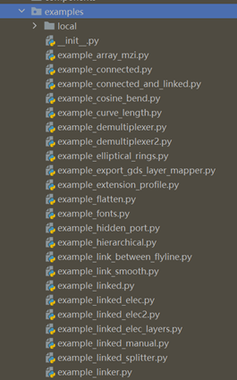

**Examples**: gpdk-based component building
^^^^^^^^^^^^^^^^^^^^^^^^^^^^^^^^^^^^^^^^^^^^^^^^^^^^^^^^^^^^^^

The examples folder in gpdk is used to store examples generated by related components and contains many functional design templates and examples from PhotoCAD. For example (not fully listed):

* Full PCell scripting examples: ``example_pcell_dataclass.py``, ``example_pcell_ dataclass_oversimplified.py``, ``example_pcell_ dataclass _with_final.py``

* Flattening design script example: ``example_flatten.py``

* Hierachical design script example: ``example_hierarchical.py``

* Graphical Boolean example: ``example_merged.py``

* Create netlist example: ``example_ringMod_transceiver.py``

* Layout unit rotation and placement example: ``example_transform.py``

* Automatic routing by calling device and port connection example: ``example_linked.py``

Users can run the python source code and go to the local folder in examples to see its results.

  
