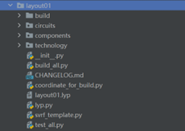

**layout01**: Project Development
^^^^^^^^^^^^^^^^^^^^^^^^^^^^^^^^^^^^^^^^^^^^^^^

**layout01** can be used as a folder for project development and is located in the project root directory. Users can design and save scripts for custom processes, devices, link modules, etc. separately. For example, changes to process layers can be made in ``layout01`` > ``technology`` > ``layers.py``, and the changes in **layout01** will overwrite the relevant settings in gpdk; user-developed devices can be stored in the components subfolder in **layout01**.

