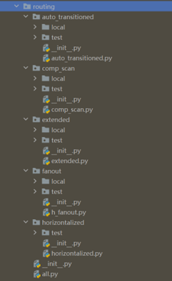

**Link**: gpdk-based circuit-level design
^^^^^^^^^^^^^^^^^^^^^^^^^^^^^^^^^^^^^^^^^^^^^^^^^^^^^^

The routing subfolder in gpdk contains powerful circuit-level design templates, which contain some of the following features:

* Automatic waveguide type transition function: ``auto_transitioned``

* Implement modular layout and routing features by batch processing function: ``comp_scan``

* Automatic port type recognition and extended port length function: ``extended``

* Extend layout space capabilities for downstream components function: ``fanout``

* Port leveling function: ``horizontalized``

Users can run the python source code in the corresponding function's folder and go to its local folder to see its results.

