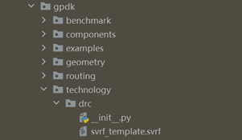
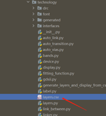
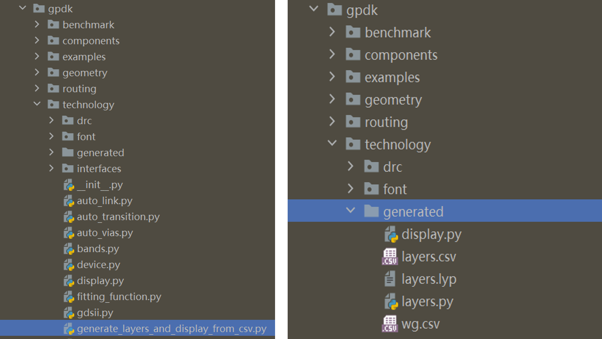

**Technology**: Process related settings in gpdk
^^^^^^^^^^^^^^^^^^^^^^^^^^^^^^^^^^^^^^^^^^^^^^^^^^^^^^^^^^^^^^^^^^^^^

Default process
------------------------------------------

The technology in gpdk holds a number of common configuration files dealing with process and layout display, such as:
   
* Process layers definitions: ``layers.py``
   
* Layers display settings: ``display.py``
   
* Layout pattern accuracy setting: ``metrics.py``
   
* Waveguide type definitions: ``wg.py``
   
* Routing-related settings definition: ``auto_link.py``
   
* Automatic waveguide type transition: ``auto_transition.py``
   
* Waveguide corner customization: ``auto_bend.py``
   
* Metal wiring related settings: ``auto_via.py``, ``fitting_function.py``
   
Note: The drc subfolder of technology contains the design rule check template based on the current process generated layout, the Calibre\ :sup:`TM` DRC rule deck template script.
   

    
Customized process
---------------------------------------------------

In order to be more convenient for users to use and customize the process information, mainly for ``layers.py`` and  ``display.py``, **technology** provides a convenient user-defined file ``layers.csv`` file, users can open ``gpdk`` > ``technology`` > ``layers.csv`` file to customize their relevant processes.
   

   
First double-click on the file to open the table as shown below:
   
.. image:: ../images/technology3.png
   
* ``LAYER`` and ``DATATYPE`` together determine the number of the layer.
   
* ``NAME`` is used to define the name of the layer.
   
* ``DESCRIPTION`` is the description of the layer.
   
* ``PROCESS`` and ``PROCESS_DESCRIPTION`` are used to define and describe the etching process, respectively.
   
* ``PURPOSE`` and ``PURPOSE_DESCRIPTION`` are used to define and describe the processing process respectively.
   
* ``FILL_COLOR`` is used to define the color of the filled layer.
   
* ``FILL_PATTERN`` is used to define the graphics of the filled layer, mainly ``diagonal`` and ``back-diagonal``.
   
* ``STROKE_COLOR`` is used to define the color of the border of the layer. 
   
All these information are user-defined.
   
Then after the user has customized the relevant process information, running ``gpdk`` > ``technology`` > ``generate_layers_display_from_csv.py`` directly will generate the generated folder in ``gpdk`` > ``technology``, which contains the ``display.py``, ``layers.csv``, ``layers.lyp``, ``layers.py``, and ``wg.csv`` files.
   

   
Finally, we can use the relevant process setup files generated in the file via ``gpdk`` > ``technology`` > ``tech.py`` . Double-click to open the ``tech.py`` file to reveal the following scripts::
   
    from .auto_link import LINKING_POLICY
    from .auto_transition import AUTO_TRANSITION
    from .auto_vias import AUTO_VIAS
    from .bands import BAND
    from .device import DEVICE
    from .display import DISPLAY
    from .fitting_function import FITTING_FUNCTION
    from .gdsii import GDSII
    from .label import LABEL
    from .layers import LAYER, PROCESS, PURPOSE
    from .linker import LINKER
    from .metal import METAL
    from .metrics import METRICS
    from .terminal import PIN, PORT
    from .vias import VIAS
    from .wg import WG
    from .resource import RESOURCE
    
In the module import section we replace the original::
   
    from .display import DISPLAY
    from .layers import LAYER, PROCESS, PURPOSE
    
to::
   
    from .gennerated.display import DISPLAY
    from .gennerated.layers import LAYER, PROCESS, PURPOSE
    
Save it again and then you can use the custom process information.

Waveguide information
-----------------------------------------------------

In order to be more convenient for users to view the information of the waveguide process in use, **technology** provides a convenient method to reverse the python source file to generate a csv netlist file, users can open ``gpdk`` > ``technology`` > ``wg.py`` and run it, then the ``wg.csv`` file will be generated in the generate folder, you can open the file to quickly view various information related to waveguide.
   
.. image:: ../images/technology5.png

   
    
    

   

   
