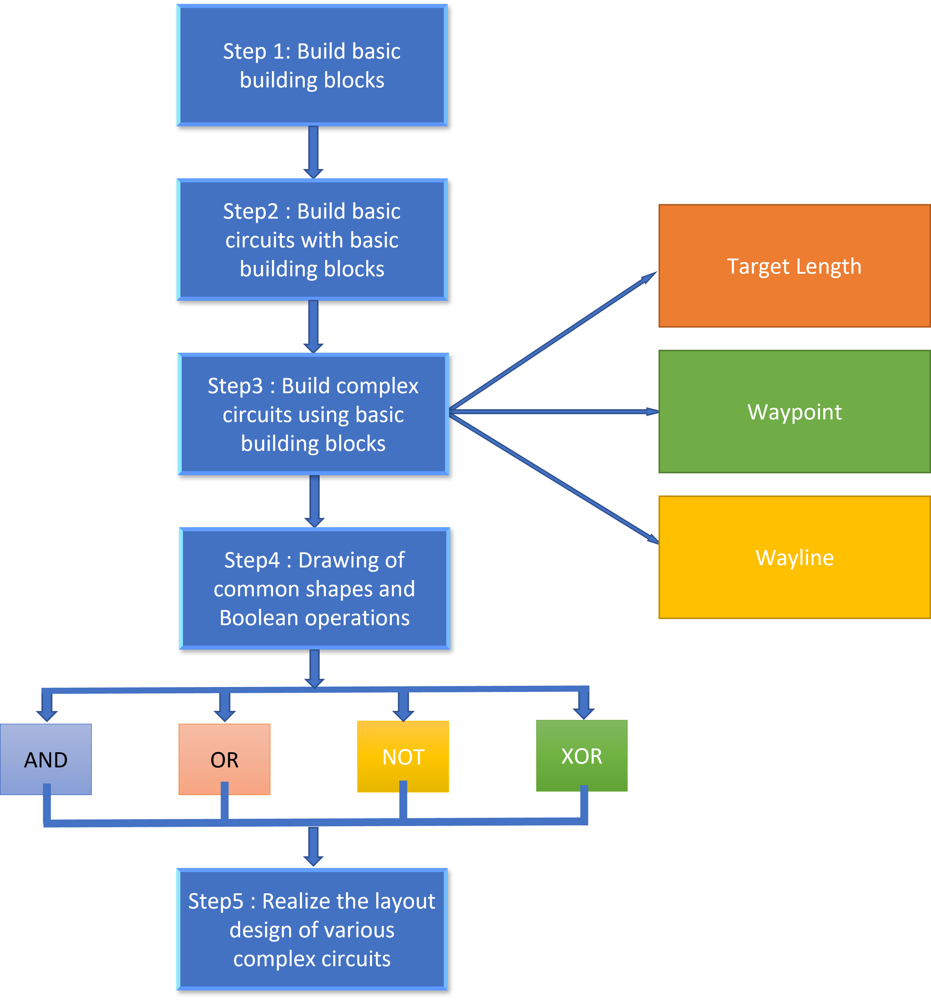

Quick Guide to Creating Circuit
==================================

This section is a quick guide to creating circuits and is designed for users to quickly learn the design of a circuit from the basic components to the complete circuit.

Steps to create a circuit.

.. toctree::

  Step1
  Step2
  Step3
  Step4
  Step5

