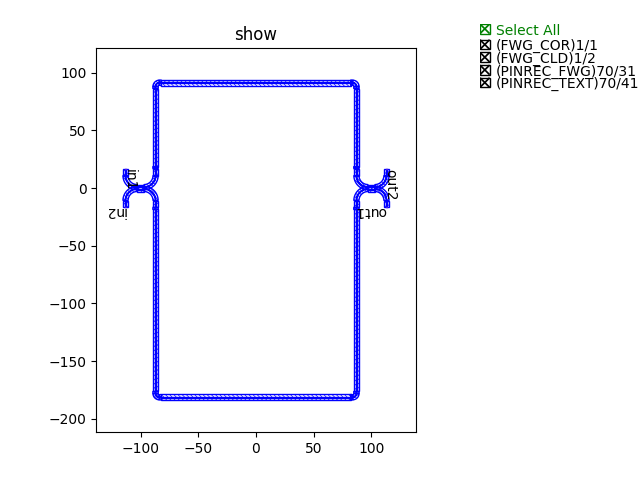
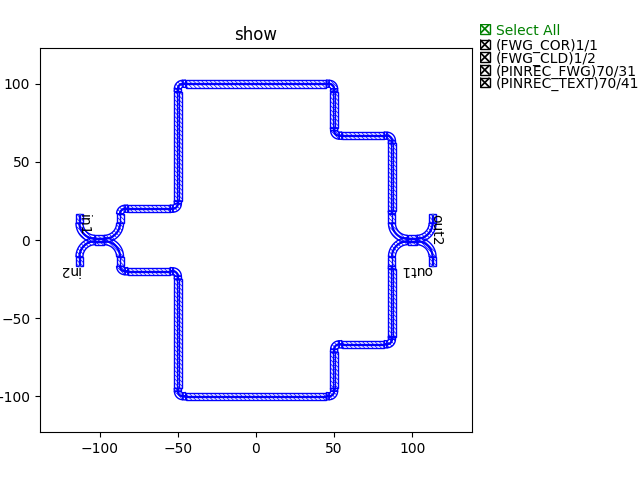
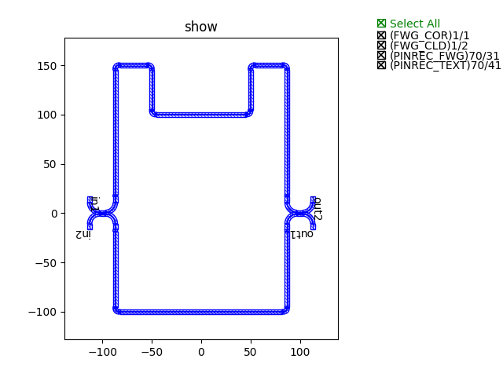

Step3 : Build complex circuits using basic building blocks
^^^^^^^^^^^^^^^^^^^^^^^^^^^^^^^^^^^^^^^^^^^^^^^^

In Step2（:doc:`Step2`）, we have built the basic circuit using the basic building blocks. In this section, we comtinue to build some complex circuits through the connection of these basic circuits to achieve more functionality, such as the MZI circuit. The connections between the basic circuits are provided in three main ways:

- target_length_
- waypoints_
- waylines_

In the following, we will start from these three connection types and use each of them to build a MZI circuit.

target_length
---------------------------

Import the directed coupler created in step 2（:doc:`Step2`）::

    from step.step2.directional_coupler_bend import DirectionalCouplerBend

Define the MZI class to easily call directly later::

    class MZI(fp.PCell):

        def build(self):
            insts, elems, ports = super().build()
            TECH = get_technology()

            dc = DirectionalCouplerBend(
                coupler_spacing=0.5,
                coupler_length=6,
                bend_radius=10,
                straight_after_bend=6,
                waveguide_type=TECH.WG.FWG.C.WIRE
            )
            dc1 = dc.translated(-100, 0)
            insts += dc1
            dc2 = dc.translated(100, 0)
            insts += dc2

            device = fp.create_links(
                link_type=TECH.WG.FWG.C.EXPANDED,
                bend_factory=TECH.WG.FWG.C.WIRE.BEND_CIRCULAR,
                specs=[
                    fp.LinkBetween(
                        dc1["op_2"],
                        dc2["op_1"],
                        target_length=500,
                    ),
                    fp.LinkBetween(
                        dc1["op_3"],
                        dc2["op_0"],
                        target_length=320,
                    ),
                ],
            )
            insts += device

            ports += dc1["op_0"].with_name("in1")
            ports += dc1["op_1"].with_name("in2")
            ports += dc2["op_2"].with_name("out1")
            ports += dc2["op_3"].with_name("out2")

            # fmt: on
            return insts, elems, ports

which::

        device = fp.create_links(
            link_type=TECH.WG.FWG.C.EXPANDED,
            bend_factory=TECH.WG.FWG.C.WIRE.BEND_CIRCULAR,
            specs=[
                fp.LinkBetween(
                    dc1["op_2"],
                    dc2["op_1"],
                    target_length=500,
                ),
                fp.LinkBetween(
                    dc1["op_3"],
                    dc2["op_0"],
                    target_length=320,
                ),
            ],
        )

The U-shaped fixed-length connection is achieved by "target_length=320".

Finally, generate the layout and plot by calling the class implementation::

    device += MZI()
    fp.export_gds(device, file=gds_file)
    fp.plot(device)

Example of the MZI circuit connected by the U-shaped target length method

waypoints
---------------------------

Import the directed coupler created in step 2（:doc:`Step2`）::

    from step.step2.directional_coupler_bend import DirectionalCouplerBend

Define the MZI class to easily call directly later::

    class MZI(fp.PCell):
        def build(self):
            insts, elems, ports = super().build()
            TECH = get_technology()

            dc = DirectionalCouplerBend(
                coupler_spacing=0.5,
                coupler_length=6,
                bend_radius=10,
                straight_after_bend=6,
                waveguide_type=TECH.WG.FWG.C.WIRE
            )
            dc1 = dc.translated(-100, 0)
            insts += dc1
            dc2 = dc.translated(100, 0)
            insts += dc2

            device = fp.create_links(
                link_type=TECH.WG.FWG.C.EXPANDED,
                bend_factory=TECH.WG.FWG.C.WIRE.BEND_CIRCULAR,
                specs=[
                    fp.LinkBetween(
                        dc1["op_2"],
                        dc2["op_1"],
                        waypoints=[
                            fp.Waypoint(-50, -70, -90),
                            fp.Waypoint(0, -100, 0),
                            fp.Waypoint(50, -70, 90),
                        ]
                    ),
                    fp.LinkBetween(
                        dc1["op_3"],
                        dc2["op_0"],
                        waypoints=[
                            fp.Waypoint(-50, 70, 90),
                            fp.Waypoint(0, 100, 0),
                            fp.Waypoint(50, 70, -90),
                        ]
                    ),
                ],
            )
            insts += device

            ports += dc1["op_0"].with_name("in1")
            ports += dc1["op_1"].with_name("in2")
            ports += dc2["op_2"].with_name("out1")
            ports += dc2["op_3"].with_name("out2")

            # fmt: on
            return insts, elems, ports

which::

        device = fp.create_links(
            link_type=TECH.WG.FWG.C.EXPANDED,
            bend_factory=TECH.WG.FWG.C.WIRE.BEND_CIRCULAR,
            specs=[
                fp.LinkBetween(
                    dc1["op_2"],
                    dc2["op_1"],
                    waypoints=[
                        fp.Waypoint(-50, -70, -90),
                        fp.Waypoint(0, -100, 0),
                        fp.Waypoint(50, -70, 90),
                    ]
                ),
                fp.LinkBetween(
                    dc1["op_3"],
                    dc2["op_0"],
                    waypoints=[
                        fp.Waypoint(-50, 70, 90),
                        fp.Waypoint(0, 100, 0),
                        fp.Waypoint(50, 70, -90),
                    ]
                ),
            ],
        )

The route points are connected by "waypoints", i.e. the route is connected through all set points.

Finally, generate the layout and plot by calling the class implementation::

    device += MZI()
    fp.export_gds(device, file=gds_file)
    fp.plot(device)

Example of the MZI circuit connected by the waypoint method

waylines
---------------------------

Import the directed coupler created in step 2（:doc:`Step2`）::

    from step.step2.directional_coupler_bend import DirectionalCouplerBend

Define the MZI class to easily call directly later::

    class MZI(fp.PCell):
        def build(self):
            insts, elems, ports = super().build()
            TECH = get_technology()

            dc = DirectionalCouplerBend(
                coupler_spacing=0.5,
                coupler_length=6,
                bend_radius=10,
                straight_after_bend=6,
                waveguide_type=TECH.WG.FWG.C.WIRE
            )
            dc1 = dc.translated(-100, 0)
            insts += dc1
            dc2 = dc.translated(100, 0)
            insts += dc2

            device = fp.create_links(
                link_type=TECH.WG.FWG.C.EXPANDED,
                bend_factory=TECH.WG.FWG.C.WIRE.BEND_CIRCULAR,
                specs=[
                    fp.LinkBetween(
                        dc1["op_2"],
                        dc2["op_1"],
                        waylines=[fp.until_y(-100)]
                    ),
                    fp.LinkBetween(
                        dc1["op_3"],
                        dc2["op_0"],
                        waylines=[fp.until_y(150),
                                  fp.until_x(-50),
                                  fp.until_y(100),
                                  fp.until_x(50),
                                  fp.until_y(150)]
                    ),
                ],
            )
            insts += device

            ports += dc1["op_0"].with_name("in1")
            ports += dc1["op_1"].with_name("in2")
            ports += dc2["op_2"].with_name("out1")
            ports += dc2["op_3"].with_name("out2")

            # fmt: on
            return insts, elems, ports

which::

        device = fp.create_links(
            link_type=TECH.WG.FWG.C.EXPANDED,
            bend_factory=TECH.WG.FWG.C.WIRE.BEND_CIRCULAR,
            specs=[
                fp.LinkBetween(
                    dc1["op_2"],
                    dc2["op_1"],
                    waylines=[fp.until_y(-100)]
                ),
                fp.LinkBetween(
                    dc1["op_3"],
                    dc2["op_0"],
                    waylines=[fp.until_y(150),
                              fp.until_x(-50),
                              fp.until_y(100),
                              fp.until_x(50),
                              fp.until_y(150)]
                ),
            ],
        )

The pathlines are connected by "waylines".

Finally, generate the layout and plot by calling the class implementation::

    device += MZI()
    fp.export_gds(device, file=gds_file)
    fp.plot(device)

Example of the MZI circuit connected by the wayline method

