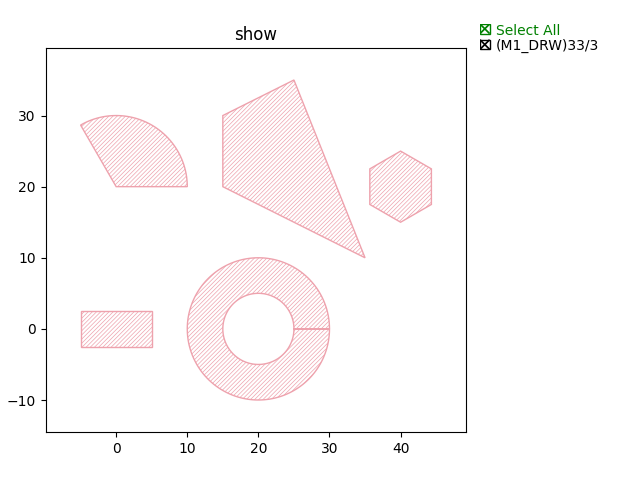
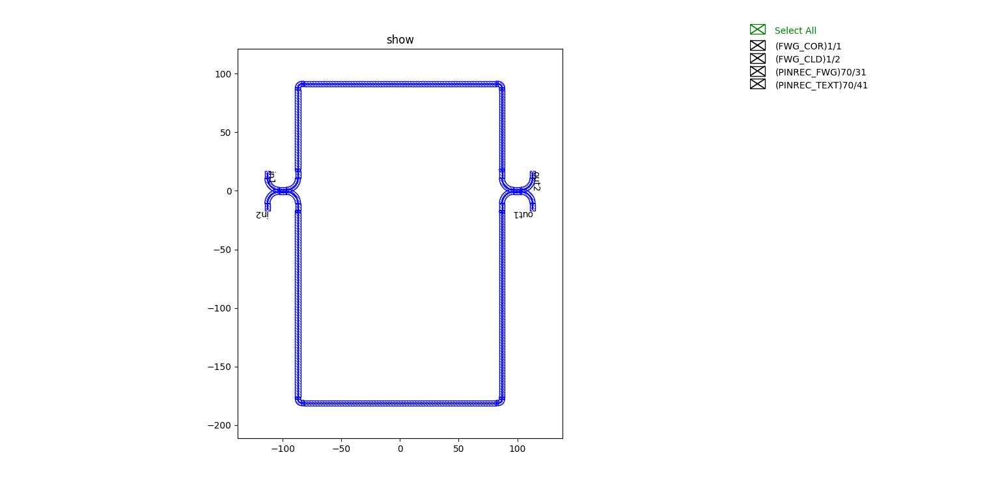
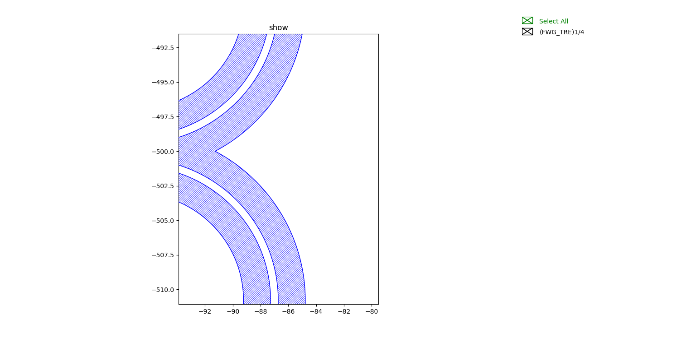

.. _Boolean :

Step 4: Drawing of common shapes and layout design by Boolean operations
^^^^^^^^^^^^^^^^^^^^^^^^^^^^^^^^^^^^^^^^^^^^^^^^^^^^^^^^^^^^^^^^^^^^^^^^^^^^^^^^^^^^^^^^^^^^^^^^

This case shows the drawing of common graphics and the layout design of complex structures by Boolean operations.

The main contents of this section include:

- Commonly_used_shape_
- Boolean_operation_
- Examples_

First, the drawing of some commonly used shapes:

- Rectangle_
- Circle_
- Polygon_
- Ring_
- Regular_Polygon_

Boolean operations are an important design tool for layout design, especially for complex structures. Common inter-graph Boolean operations mainly include:

- OR_
- AND_
- NOT_
- XOR_

Commonly_used_shape_
---------------------------

Rectangle
>>>>>>>>>>>>>>>>>>>>>>>>>>>
::

    rect = fp.el.Rect(width=10, height=5, center=(0,0), layer=TECH.LAYER.M1_DRW)

Circle
>>>>>>>>>>>>>>>>>>>>>>>>>>>

::

    circ = fp.el.Circle(radius=10, initial_degrees=0, final_degrees=120, layer=TECH.LAYER.M1_DRW)

Polygon
>>>>>>>>>>>>>>>>>>>>>>>>>>>

::

    poly = fp.el.Polygon(raw_shape=[(-5, 0), (-5, 10), (5, 15), (15, -10)], layer=TECH.LAYER.M1_DRW)

Ring
>>>>>>>>>>>>>>>>>>>>>>>>>>>

::

    ring = fp.el.Ring(inner_radius=5, outer_radius=10, layer=TECH.LAYER.M1_DRW)

Regular_Polygon
>>>>>>>>>>>>>>>>>>>>>>>>>>>

::

        rpoly = fp.el.RegularPolygon(sides=6, side_length=5, layer=TECH.LAYER.M1_DRW)

The above examples are shown below：

Boolean_operation_
---------------------------

OR
>>>>>>>>>>>>>>>>>>>>>>>>>>>

::

        bool = rect | circ

AND
>>>>>>>>>>>>>>>>>>>>>>>>>>>

::

    bool = rect & circ
    
NOT
>>>>>>>>>>>>>>>>>>>>>>>>>>>

::

    bool = rect - circ

XOR
>>>>>>>>>>>>>>>>>>>>>>>>>>>

::

    bool = rect ^ circ

The above examples are shown below：

Full script::

    from dataclasses import dataclass
    from typing import Tuple

    from fnpcell import all as fp
    from gpdk.technology import get_technology

    class Boolean(fp.IWaveguideLike, fp.PCell):
        def build(self) -> Tuple[fp.InstanceSet, fp.ElementSet, fp.PortSet]:
            insts, elems, ports = super().build()
            TECH = get_technology()

            rect = fp.el.Rect(width=10, height=5, center=(0,0), layer=TECH.LAYER.M1_DRW)
            elems += rect.translated(0, 0)
            circ = fp.el.Circle(radius=8, initial_degrees=0, final_degrees=180, layer=TECH.LAYER.M1_DRW)
            elems += circ.translated(0, 0)
            bool = rect - circ
            elems += bool.translated(20, 0)
            bool = rect & circ
            elems += bool.translated(-20, 0)
            bool = rect | circ
            elems += bool.translated(0, 20)
            bool = rect ^ circ
            elems += bool.translated(0, -20)

            return insts, elems, ports

    if __name__ == "__main__":
        from pathlib import Path

        gds_file = Path(__file__).parent / "local" / Path(__file__).with_suffix(".gds").name
        library = fp.Library()

        TECH = get_technology()
        # =============================================================
        # fmt: off

        library += Boolean()

        # fmt: on
        # =============================================================
        fp.export_gds(library, file=gds_file)
        fp.plot(library)

Examples
>>>>>>>>>>>>>>>>>>>>>>>>>>>

Import step 3 (:doc:`Step1`) U-shaped target length MZI structure and plot::

    class CircuitBool(fp.IWaveguideLike, fp.PCell):
        def build(self) -> Tuple[fp.InstanceSet, fp.ElementSet, fp.PortSet]:
            insts, elems, ports = super().build()
            TECH = get_technology()

            device = MZI()
            ports += device.ports
            insts += device
            cor = device.polygon_set(layer=TECH.LAYER.FWG_COR)
            # elems += cor
            cld = device.polygon_set(layer=TECH.LAYER.FWG_CLD)
            tre = fp.el.PolygonSet.boolean_sub(cld, cor, layer=TECH.LAYER.FWG_TRE)
            elems += tre.translated(0, -500)

            return insts, elems, ports

The above code implements two types of MZI circuits by Boolean operations, one containing all layer information and one for etched layer trenching, as shown in the figure:

Layout with all layer information：

Partial display is as follows：

Etched layer trenching type circuit partial display：

