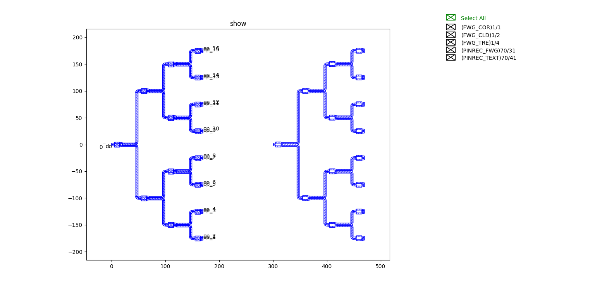
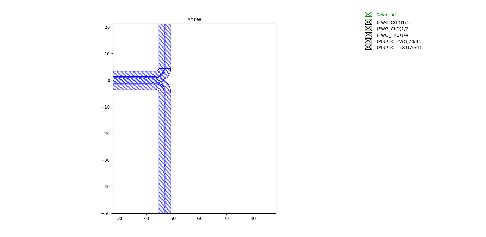
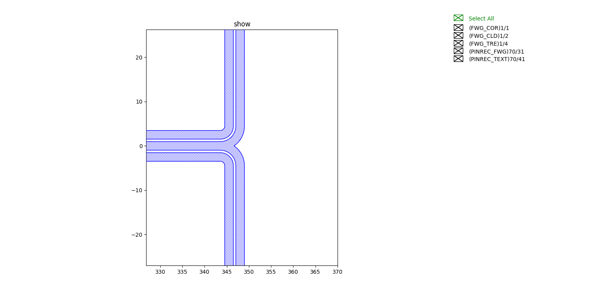

Step 5: Example(MMI Tree)
^^^^^^^^^^^^^^^^^^^^^^^^^^^^^^^^^^^^^^^^^^^^^^^^

This case uses the MMI circuit in Step 2 (:doc:`Step2`) to implement a cascade MMI tree and realize the layout drawing.

Import the MMI circuit created in Step 2 (:doc:`Step2`)::

    from step.step2.mmi1x2 import MMI1x2

Define the cascade MMI tree to easily call it directly later::

    class MMITree(fp.PCell):
        def build(self):
            insts, elems, ports = super().build()
            TECH = get_technology()

            x_spacing = 50
            end_y_spacing = 50
            order = 2
            mmi = MMI1x2()
            num_per_col = []
            v_spacing = []

            for i in range(order):
                num_per_col.append(2**i)
                v_spacing.append(end_y_spacing*(2**(order - i - 1)))

            for i in range(order):
                for j in range(num_per_col[i]):
                    x = i * x_spacing
                    y = (-(num_per_col[i] - 1) * v_spacing[i]/2) + j * v_spacing[i]
                    mmi = mmi["op_0"].repositioned(at=(x,y)).owner
                    insts += mmi, f"{i},{j}"

            mmi_tree = cast(Mapping[str, fp.ICellRef], insts)
            for i in range(order):
                for j in range(num_per_col[i]):
                    if i < order-1:
                        link1 = fp.LinkBetween(start=mmi_tree[f"{i},{j}"]["op_1"],
                                               end=mmi_tree[f"{i+1},{2*j}"]["op_0"],
                                               bend_factory=TECH.WG.FWG.C.WIRE.BEND_CIRCULAR)
                        insts += link1
                        link2 = fp.LinkBetween(start=mmi_tree[f"{i},{j}"]["op_2"],
                                               end=mmi_tree[f"{i+1},{2*j+1}"]["op_0"],
                                               bend_factory=TECH.WG.FWG.C.WIRE.BEND_CIRCULAR)
                        insts += link2

            ports += mmi_tree["0,0"]["op_0"].with_name("op_0")
            for i in range(num_per_col[-1]):
                ports += mmi_tree[f"{order - 1},{i}"]["op_1"].with_name(f"op_{2*i+1}")
                ports += mmi_tree[f"{order - 1},{i}"]["op_2"].with_name(f"op_{2*i+2}")

            # fmt: on
            return insts, elems, ports

Here the parameter "order"::

    order = 2
    
This parameter indicates the level of the cascade, which in this case we take to be 4.

Call class and implement the layout by Boolean operations::

    library += MMITree()
    device = MMITree()
    cor = device.polygon_set(layer=TECH.LAYER.FWG_COR)
    cld = device.polygon_set(layer=TECH.LAYER.FWG_CLD)
    tre = fp.el.PolygonSet.boolean_sub(cld, cor, layer=TECH.LAYER.FWG_TRE)
    library += fp.Device(content=[tre.translated(300, 0)], ports=[])
    fp.export_gds(library, file=gds_file)
    fp.plot(library)
    
MMI tree cascade circuit plot

The left-hand side is the layout containing all the layer information, partially enlarged as follows

The right-hand side is obtained by Boolean operations

