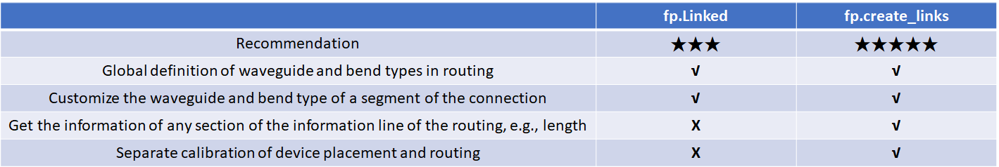
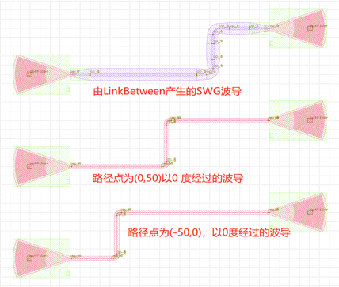
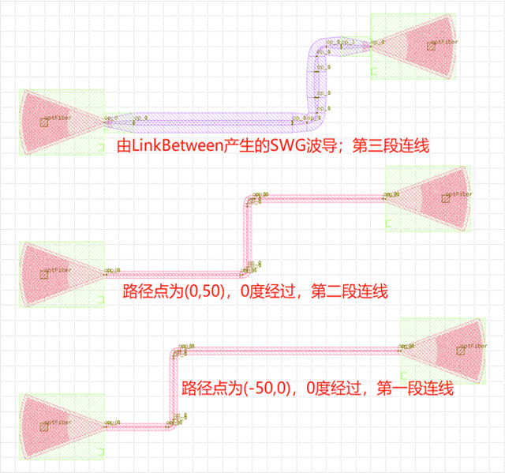
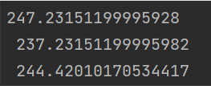

Multi-port to multi-port
====================

There are two types of connections from multi-port to multi-port.

- fp.Linked
- fp.creat_links

Here's a comparison of the two options

fp.Linked example (Recommendation★★★)::

    # Interconnecting device ports by calling the Linked method
    device = fp.Linked(
        # Define the type of straight waveguide in automatic routing
        link_type=TECH.WG.FWG.C.EXPANDED,
        # Define the type of bend in automatic routing
        bend_factory=TECH.WG.FWG.C.WIRE.BEND_CIRCULAR,

        # Define the connection between device ports in links
        links=[
            # Use >> to define connections between two ports
            gc1["op_0"] >> fp.Waypoint(-50, -50, 0) >> gc4["op_0"],
            # Use fp.Waypoint(x,y) to define the path point
            gc2["op_0"] >> fp.Waypoint(0, 50, 0) >> gc5["op_0"],
            # Use LinkBetween to define a separate segment of the connection, and you can modify the type of the straight waveguide and bend with parameters
            fp.LinkBetween(
                start=gc3["op_0"],
                end=gc6["op_0"],
                link_type=TECH.WG.SWG.C.EXPANDED,
                bend_factory=TECH.WG.SWG.C.WIRE.BEND_CIRCULAR,
                waypoints=[fp.Waypoint(50, 150, 0)]
            )
        ],
        ports=[],
    )

    # Add the device returned by Linked to insts
    insts += device

fp.create_links example (Recommendation★★★★★)::

    # Interconnecting device ports by calling the create_links method
    device = fp.create_links(
        # Define the type of straight waveguide in automatic routing
        link_type=TECH.WG.FWG.C.EXPANDED,
        # Define the type of bend in automatic routing
        bend_factory=TECH.WG.FWG.C.WIRE.BEND_CIRCULAR,
        # Define the connection between device ports in specs
        specs=[
            # Use >> to define connections between two ports
            gc1["op_0"] >> fp.Waypoint(-50, -50, 0) >> gc4["op_0"],
            # Use fp.Waypoint(x,y) to define the path point
            gc2["op_0"] >> fp.Waypoint(0, 50, 0) >> gc5["op_0"],
            # Use LinkBetween to define a separate segment of the connection, and you can modify the type of the straight waveguide and bend with parameters
            fp.LinkBetween(
                start=gc3["op_0"],
                end=gc6["op_0"],
                link_type=TECH.WG.SWG.C.EXPANDED,
                bend_factory=TECH.WG.SWG.C.WIRE.BEND_CIRCULAR,
                waypoints=[fp.Waypoint(50, 150, 0)]
            )
        ],
    )
    # Get and print the length of the three connected links
    length_1 = device[0].curve_length
    length_2 = device[1].curve_length
    length_3 = device[2].curve_length
    print(f"{length_1} \n {length_2} \n {length_3}")
    # Add the device returned by create_links to insts
    insts += device

The message box shows that the lengths of each of the three connected links are printed.

See the comments section in the code for details.
